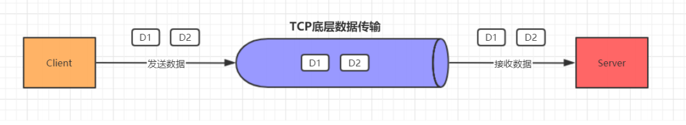
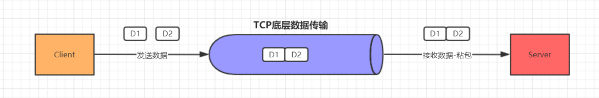
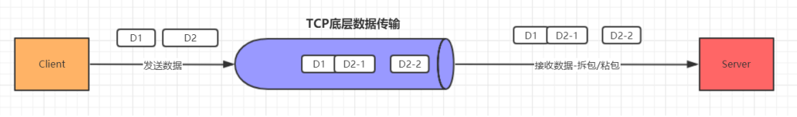
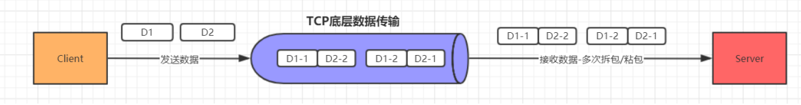
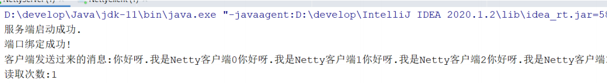
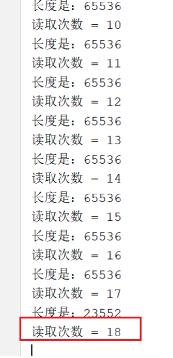

[toc]

## Netty中粘包和拆包的解决方案

### 一、粘包和拆包简介

粘包和拆包是TCP网络编程中不可避免的，无论是服务端还是客户端，当我们读取或者发送消息的时候，都需要考虑TCP底层的粘包/拆包机制。

TCP是个“流”协议，所谓流，就是没有界限的一串数据。TCP底层并不了解上层业务数据的具体含义，它会根据TCP缓冲区的实际情况进行包的划分，所以在业务上认为，一个完整的包可能会被TCP拆分成多个包进行发送，也有可能把多个小的包封装成一个大的数据包发送，这就是所谓的TCP粘包和拆包问题。

假设客户端分别发送了两个数据包D1和D2给服务端，由于服务端一次读取到的字节数是不确定的，故可能存在以下4种情况。

- 服务端分两次读取到了两个独立的数据包，分别是D1和D2，没有粘包和拆包；



- 服务端一次接收到了两个数据包，D1和D2粘合在一起，被称为**TCP粘包**；



- 如果D2的数据包比较大, 服务端分两次读取到了两个数据包，第一次读取到了完整的D1包和D2包的部分内容，第二次读取到了D2包的剩余内容，这被称为**TCP拆包**



- 如果D1, D2的数据包都很大, 服务端分多次才能将D1和D2包接收完全，期间发生多次拆包




### 二、TCP粘包和拆包产生的原因

数据从发送方到接收方需要经过操作系统的缓冲区，而造成粘包和拆包的主要原因就在这个缓冲区上。粘包可以理解为缓冲区数据堆积，导致多个请求数据粘在一起，而拆包可以理解为发送的数据大于缓冲区，进行拆分处理。


### 三、粘包和拆包代码演示

#### 1. 粘包

##### 客户端handler

```java
/**
 * 客户端处理类
 */
public class NettyClientHandler implements ChannelInboundHandler {

    /**
     * 通道就绪事件
     *
     * @param ctx
     * @throws Exception
     */
    @Override
    public void channelActive(ChannelHandlerContext ctx) throws Exception {
        for (int i = 0; i < 10; i++) {
            ctx.writeAndFlush(Unpooled.copiedBuffer("你好呀.我是Netty客户端"+i+"$",
                    CharsetUtil.UTF_8));
        }
    }
    
    ...
}
```

##### 服务端handler

```java
/**
 * 自定义处理Handler
 */
public class NettyServerHandler implements ChannelInboundHandler {
    public int count = 0;

    /**
     * 通道读取事件
     *
     * @param ctx
     * @param msg
     * @throws Exception
     */
    @Override
    public void channelRead(ChannelHandlerContext ctx, Object msg) throws Exception {
        ByteBuf byteBuf = (ByteBuf) msg;
        System.out.println("客户端发送过来的消息:" + byteBuf.toString(CharsetUtil.UTF_8));
        System.out.println("读取次数:"+(++count));
    }
    
    ...
}
```

##### 运行结果




#### 2. 拆包

##### 客户端

```java
/**
 * 客户端处理类
 */
public class NettyClientHandler implements ChannelInboundHandler {

    /**
     * 通道就绪事件
     *
     * @param ctx
     * @throws Exception
     */
    @Override
    public void channelActive(ChannelHandlerContext ctx) throws Exception {
        //一次发送102400
        char[] chars = new char[102400];
        Arrays.fill(chars, 0, 102398, 'a');
        chars[102399] = '\n';
        for (int i = 0; i < 10; i++) {
            ctx.writeAndFlush(Unpooled.copiedBuffer(chars, CharsetUtil.UTF_8));
        }
    }
    
    ...
}
```

##### 服务端

```java
/**
 * 自定义处理Handler
 */
public class NettyServerHandler implements ChannelInboundHandler {
    public int count = 0;

    /**
     * 通道读取事件
     *
     * @param ctx
     * @param msg
     * @throws Exception
     */
    @Override
    public void channelRead(ChannelHandlerContext ctx, Object msg) throws Exception {
        ByteBuf byteBuf = (ByteBuf) msg;
        System.out.println("长度是：" + byteBuf.readableBytes());
        System.out.println("读取次数 = " + (++count));
    }
    
    ...
}
```

##### 运行结果



### 四、粘包和拆包的解决方法

#### 1. 业内解决方案

由于底层的TCP无法理解上层的业务数据，所以在底层是无法保证数据包不被拆分和重组的，这个问题只能通过上层的应用协议栈设计来解决，根据业界的主流协议的解决方案，可以归纳如下。

- 消息长度固定，累计读取到长度和为定长LEN的报文后，就认为读取到了一个完整的信息

- **将换行符作为消息结束符**

- **将特殊的分隔符作为消息的结束标志，回车换行符就是一种特殊的结束分隔符**

- 通过在消息头中定义长度字段来标识消息的总长度

#### 2. Netty中的粘包和拆包解决方案

Netty提供了4种解码器来解决，分别如下：

- 固定长度的拆包器 FixedLengthFrameDecoder，每个应用层数据包的都拆分成都是固定长度的大小

- **行拆包器 LineBasedFrameDecoder，每个应用层数据包，都以换行符作为分隔符，进行分割拆分**

- **分隔符拆包器 DelimiterBasedFrameDecoder，每个应用层数据包，都通过自定义的分隔符，进行分割拆分**

- 基于数据包长度的拆包器 LengthFieldBasedFrameDecoder，将应用层数据包的长度，作为接收端应用层数据包的拆分依据。按照应用层数据包的大小，拆包。这个拆包器，有一个要求，就是应用层协议中包含数据包的长度

#### 3. 代码实现

##### LineBasedFrameDecoder解码器

pipeline中添加行解码器

```java
ch.pipeline().addLast(new LineBasedFrameDecoder(2048)); 
```

业务handle中输出数据添加 `/n`换行符

```java
ctx.writeAndFlush(Unpooled.copiedBuffer("你好呀,我是Netty客户端"+i+"\n", CharsetUtil.UTF_8));
```


##### DelimiterBasedFrameDecoder解码器

pipeline中添加自定义解码器

```java
ByteBuf byteBuf = Unpooled.copiedBuffer("$".getBytes(StandardCharsets.UTF_8)); ch.pipeline().addLast(new 
ch.pipeline().addLast(new DelimiterBasedFrameDecoder(2048, byteBuf));
```

业务handle中输出数据添加 `$` 自定义符号

```java
ctx.writeAndFlush(Unpooled.copiedBuffer("你好呀,我是Netty客户端"+i+"$", CharsetUtil.UTF_8));
```

