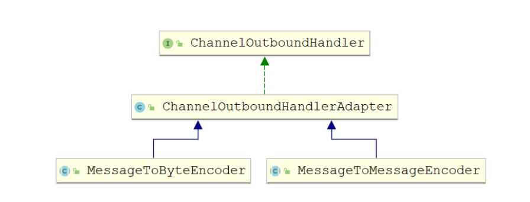

[toc]

## 一、编解码

#### 1. 编码（Encode）称为序列化

 它将对象序列化为**字节数组**，用于**网络传输、数据持久化**或者其它用途。

#### 2. 解码（Decode）称为反序列化

它把**从网络、磁盘等读取的字节数组**还原成原始对象（通常是**原始对象的拷贝**），以方便后续的业务逻辑操作。


## 二、 JDK的编解码

java序列化对象只需要实现**java.io.Serializable**接口并生成序列化ID，这个类就能够通过**java.io.ObjectInput和java.io.ObjectOutput**序列化和反序列化。

Java序列化仅仅是Java编解码技术的一种，由于它的种种缺陷，衍生出了多种编解码技术和框架，这些编解码框架实现消息的高效序列化。

**Java序列化缺点：**

1. 无法跨语言。

2. 序列化后码流太大

3. 序列化性能太低


## 三、Netty的编解码

网络通信中数据都是通过字节数组的形式进行传输，数据输出端对自定义消息对象编码输出，接收端通过对字节数组解码转换成消息对象。

Netty中提供了多种比较通用的**编码器**和**解码器**的实现，**如：String、HttpObject等**。省去了每次读写时繁琐的编码及解码操作，**编码器对应出站handler，解码器对应入站handler**


Netty 的编（解）码器实现了 **ChannelHandlerAdapter**，**是特殊的 ChannelHandler，所以依赖于 ChannelPipeline**，将多个编（解）码器链接在一起，以实现复杂的转换逻辑，**编（解）码器放在pipeline考前地方，在其他handler执行之前进行编解码**。对应的channerHandler如下：

- **编码器**：负责**出站OutboundHandler**数据
- **解码器**：负责处理**入站InboundHandler**数据


#### 1. 编码器(Encoder)

编码器负责 编码”出站”数据从一种格式到另一种格式，编码器处理出站数据是抽象**ChannelOutboundHandler**的实现。需要**将编码器放在ChannelPipeline中**。对于编码器，Netty中主要提供了**抽象基类MessageToMessageEncoder和MessageToByteEncoder**



- MessageToByteEncoder: 将消息转化成字节

- MessageToMessageEncoder: 用于从一种消息编码为另外一种消息（例如POJO到POJO）


##### 代码实现：

##### 编写解码器MessageEncoder（一种ChannerHandler）（此例自定义消息类型为String类型）

```java
import io.netty.buffer.Unpooled;
import io.netty.channel.ChannelHandlerContext;
import io.netty.handler.codec.MessageToMessageEncoder;
import io.netty.util.CharsetUtil;

import java.util.List;

/**
 * 消息的编码器
 */
public class MessageEncoder extends MessageToMessageEncoder {
    @Override
    protected void encode(ChannelHandlerContext ctx, Object msg, List out) throws Exception {
        System.out.println("消息正在进行编码....");
        String str = (String) msg;
        out.add(Unpooled.copiedBuffer(str, CharsetUtil.UTF_8));
    }
}
```

##### ChannelHandler中可直接使用自定义消息出站，后续会经过编码器处理

```java
/**
  * 通道就绪事件
  *
  * @param ctx
  * @throws Exception
  */
@Override
public void channelActive(ChannelHandlerContext ctx) throws Exception {
    ChannelFuture future = ctx.writeAndFlush("你好呀.我是Netty客户端");
    future.addListener(new ChannelFutureListener() {
        @Override
        public void operationComplete(ChannelFuture future) throws Exception {
            if (future.isSuccess()) {
                System.out.println("数据发送成功!");
            } else {
                System.out.println("数据发送失败!");
            }
        }
    });
}
```

##### Server和Client启动助手均需要向pipeline中添加编码器

```java
@Override
protected void initChannel(SocketChannel ch) throws Exception {
    //添加编码器
    ch.pipeline().addLast(new MessageEncoder());
    //8. 向pipeline中添加自定义业务处理handler
    ch.pipeline().addLast(new NettyServerHandler());
}
```


#### 2. 解码器(Decoder)

解码器负责 解码”入站”数据从一种格式到另一种格式，解码器处理入站数据是抽象**ChannelInboundHandler**的实现。需要**将解码器放在ChannelPipeline中**。对于解码器，Netty中主要提供了**抽象基类MessageToMessageDecoder和ByteToMessageDecoder**


- ByteToMessageDecoder：用于将字节转为消息，需要检查缓冲区是否有足够的字节

- MessageToMessageDecoder：用于从一种消息解码为另外一种消息（例如POJO到POJO）


##### 代码实现：

##### 编写解码器MessageDecoder（一种ChannerHandler）（此例自定义消息类型为String类型）

```java
import io.netty.buffer.ByteBuf;
import io.netty.channel.ChannelHandlerContext;
import io.netty.handler.codec.MessageToMessageDecoder;
import io.netty.util.CharsetUtil;

import java.util.List;

/**
 * 消息解码-可以将字符串消息进行在进行解码. 只有消息入站时才会进行解码
 */
public class MessageDecoder extends MessageToMessageDecoder {
    @Override
    protected void decode(ChannelHandlerContext ctx, Object msg, List out) throws Exception {
        System.out.println("正在进行消息解码....");
        ByteBuf byteBuf = (ByteBuf) msg;
        out.add(byteBuf.toString(CharsetUtil.UTF_8));//传递到下一个handler
    }
}
```

##### ChannelHandler中可直接使用自定义消息入站，因为已经经过解码器处理

```java
/**
  * 通道读就绪事件
  *
  * @param ctx
  * @param msg
  * @throws Exception
  */
@Override
public void channelRead(ChannelHandlerContext ctx, Object msg) throws Exception {
    System.out.println("服务端发送的消息:" + msg);
}
```

##### Server和Client启动助手均需要向pipeline中添加解码器

```java
@Override
protected void initChannel(SocketChannel ch) throws Exception {
    // 添加编码器
    ch.pipeline().addLast(new MessageEncoder())
    //添加解码器
    ch.pipeline().addLast(new MessageDecoder());
    //8. 向pipeline中添加自定义业务处理handler
    ch.pipeline().addLast(new NettyServerHandler());
}
```


#### 3.编解码器(Codec)

编码解码器: **同时具有编码与解码功能**，特点同时实现了**ChannelInboundHandler和ChannelOutboundHandler**接口，因此在数据输入和输出时都能进行处理。


Netty提供提供了一个**ChannelDuplexHandler**适配器类,编码解码器的抽象基类**ByteToMessageCodec ,MessageToMessageCodec**都继承与此类


##### 代码实现

##### 编写编解码器MessageCodec（一种ChannerHandler）（此例自定义消息类型为String类型）

```java
import io.netty.buffer.ByteBuf;
import io.netty.buffer.Unpooled;
import io.netty.channel.ChannelHandlerContext;
import io.netty.handler.codec.MessageToMessageCodec;
import io.netty.util.CharsetUtil;

import java.util.List;

/**
 * 消息编解码器
 */
public class MessageCodec extends MessageToMessageCodec {
    /**
     * 编码
     *
     * @param ctx
     * @param msg
     * @param out
     * @throws Exception
     */
    @Override
    protected void encode(ChannelHandlerContext ctx, Object msg, List out) throws Exception {
        System.out.println("消息正在进行编码....");
        String str = (String) msg;
        out.add(Unpooled.copiedBuffer(str, CharsetUtil.UTF_8));
    }

    /**
     * 解码
     *
     * @param ctx
     * @param msg
     * @param out
     * @throws Exception
     */
    @Override
    protected void decode(ChannelHandlerContext ctx, Object msg, List out) throws Exception {
        System.out.println("正在进行消息解码....");
        ByteBuf byteBuf = (ByteBuf) msg;
        out.add(byteBuf.toString(CharsetUtil.UTF_8));//传递到下一个handler
    }
}
```

##### ChannelHandler中可直接使用自定义消息入站和出站，原理同编码器和解码器


##### ChannelHandler中可直接使用自定义消息入站，因为已经经过解码器处理

```java
@Override
protected void initChannel(SocketChannel ch) throws Exception {
    //添加编解码器
    ch.pipeline().addLast(new MessageCodec());
    //8. 向pipeline中添加自定义业务处理handler
    ch.pipeline().addLast(new NettyServerHandler());
}
```
