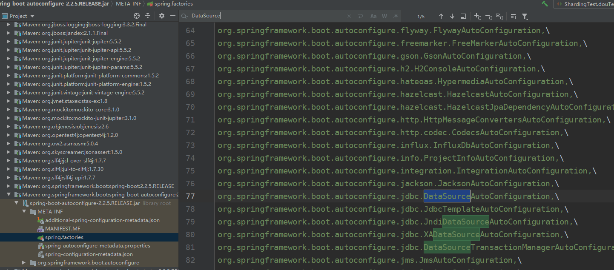
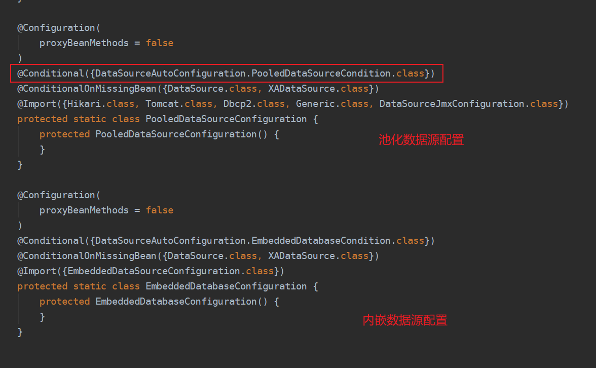
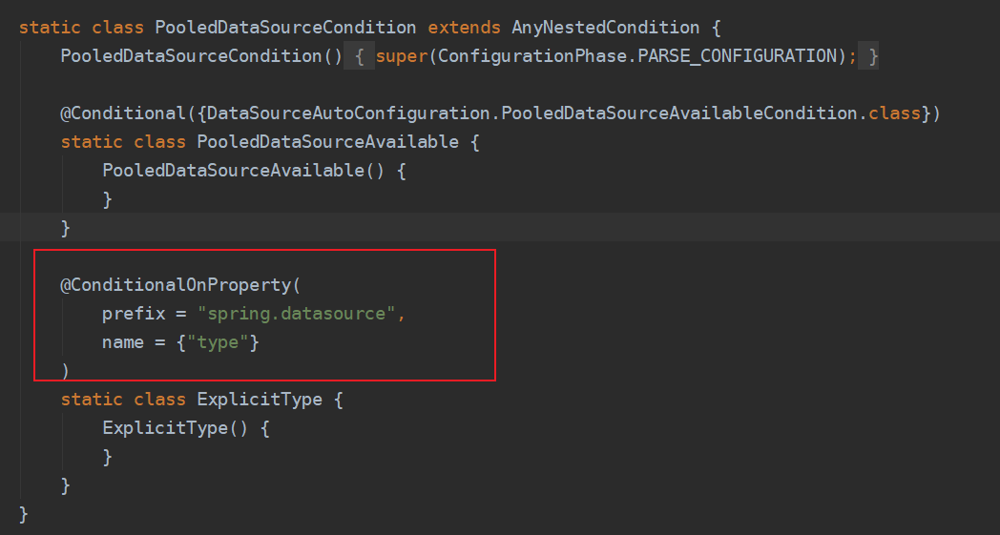
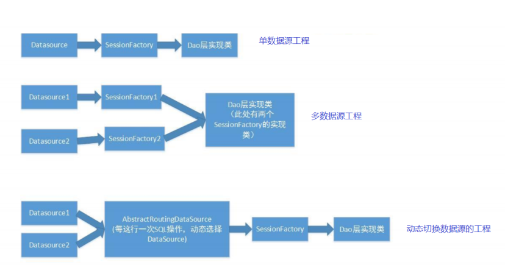
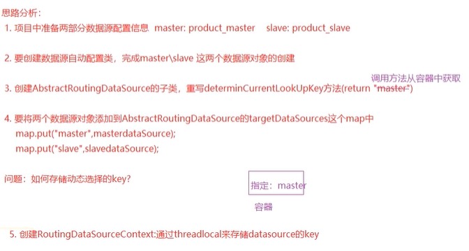

[toc]

## 1.springboot连接池

spring-boot-starter-jdbc支持`HikariCP`、`Commons DBCP2`和`Tomcat JDBC Connection Pool`，其中2.0以上，默认使用`HikariCP`

#### 引入spring-boot-starter-jdbc依赖

```xml
<dependency> 
    <groupId>mysql</groupId> 
    <artifactId>mysql-connector-java</artifactId> 
</dependency>
<dependency> 
    <groupId>org.springframework.boot</groupId> 
    <artifactId>spring-boot-starter-jdbc</artifactId> 
</dependency>
```

#### 配置文件

```properties
spring.datasource.driver-class-name=com.mysql.cj.jdbc.Driver 
spring.datasource.url=jdbc:mysql:///springboot_h?useUnicode=true&characterEncoding=utf-8&useSSL=true&serverTimezone=UTC 
spring.datasource.username=root 
spring.datasource.password=root
```

#### 测试

```java
package com.tangdi;

import org.junit.Test;
import org.junit.runner.RunWith;
import org.springframework.beans.factory.annotation.Autowired;
import org.springframework.boot.test.context.SpringBootTest;
import org.springframework.test.context.junit4.SpringRunner;

import javax.sql.DataSource;
import java.sql.Connection;
import java.sql.SQLException;


/**
 * @program: shardingjdbc-example
 * @description:
 * @author: Wangwt
 * @create: 0:36 2021/12/1
 */
@RunWith(SpringRunner.class)
@SpringBootTest(classes = ShardingApplication.class)
public class ShardingTest {

    @Autowired
    private DataSource dataSource;


    @Test
    public void douTest() throws SQLException {
        Connection connection = dataSource.getConnection();
        System.out.println(connection);
    }
}

```


## 2.配置连接池

### 2.1 整合spring-boot提供的连接池

SpringBoot提供了三种数据库连接池：

- HikariCP（spring boot2.x版本默认使用HikariCP）

  直接引入`spring-boot-starter-jdbc` 即可

  ```xml
  <dependency> 
      <groupId>org.springframework.boot</groupId> 
      <artifactId>spring-boot-starter-jdbc</artifactId> 
  </dependency>
  ```

- Commons DBCP2

  ```xml
  <dependency> 
      <groupId>org.apache.commons</groupId> 
      <artifactId>commons-dbcp2</artifactId> 
  </dependency>
  <dependency> 
      <groupId>org.springframework.boot</groupId> 
      <artifactId>spring-boot-starter-jdbc</artifactId> 
      <exclusions> 
          <exclusion> 
              <groupId>com.zaxxer</groupId> 
              <artifactId>HikariCP</artifactId> 
          </exclusion> 
      </exclusions> 
  </dependency>
  ```

- Tomcat JDBC Connection Pool

  ```xml
  <dependency> 
      <groupId>org.apache.tomcat</groupId> 
      <artifactId>tomcat-jdbc</artifactId> 
  </dependency> 
  <dependency> 
      <groupId>org.springframework.boot</groupId> 
      <artifactId>spring-boot-starter-jdbc</artifactId> 
      <exclusions> 
          <exclusion> 
              <groupId>com.zaxxer</groupId> 
              <artifactId>HikariCP</artifactId> 
          </exclusion> 
      </exclusions> 
  </dependency>
  ```

### 2.2 整合Druid

##### 引入依赖

```xml
<dependency>
    <groupId>com.alibaba</groupId>
    <artifactId>druid-spring-boot-starter</artifactId>
    <version>1.1.10</version>
</dependency>
```

##### 在application.yml中引入druid的相关配置

```yaml
spring:
  datasource:
    username: root
    password: root
    url: jdbc:mysql:///localhost:3306/wfi77?useUnicode=true&characterEncoding=utf-8&useSSL=false&serverTimezone=GMT
    driverClassName: com.mysql.cj.jdbc.Driver
    initialization-mode: always
    # 使用druid数据源
    type: com.alibaba.druid.pool.DruidDataSource
    # 数据源其他配置
    initialSize: 5
    minIdle: 5
    maxActive: 20
    maxWait: 60000
    timeBetweenEvictionRunsMillis: 60000
    minEvictableIdleTimeMillis: 300000
    validationQuery: SELECT 1 FROM DUAL
    testWhileIdle: true
    testOnBorrow: false
    testOnReturn: false
    poolPreparedStatements: true
    # 配置监控统计拦截的filters，去掉后监控界面sql无法统计，'wall'用于防火墙
    filters: stat,wall,log4j
    maxPoolPreparedStatementPerConnectionSize: 20
    useGlobalDataSourceStat: true
    connectionProperties: druid.stat.mergeSql=true;druid.stat.slowSqlMillis=500
```

##### 编写整合druid的配置类DruidConfig

这是因为：如果单纯在yml文件中编写如上的配置，SpringBoot肯定是读取不到druid的相关配置的。因为它并不像我们原生的jdbc，系统默认就使用DataSourceProperties与其属性进行了绑定。所以我们应该编写一个类与其属性进行绑定

```java
import com.alibaba.druid.pool.DruidDataSource;
import org.springframework.boot.context.properties.ConfigurationProperties;
import org.springframework.context.annotation.Bean;
import org.springframework.context.annotation.Configuration;

import javax.sql.DataSource;

@Configuration
public class DruidConfig {


	@ConfigurationProperties(prefix = "spring.datasource")
	@Bean
	public DataSource dataSource(){

		return  new DruidDataSource();
	}
}
```

##### 注意

由于配置了`filters: stat,wall,log4j`，并且因为springBoot2.0以后使用的日志框架已经不再使用log4j了。此时应该引入相应的适配器。我们可以在pom.xml文件上加入

```xml
<!--引入适配器--> 
<dependency> 
    <groupId>org.slf4j</groupId> 
    <artifactId>slf4j-log4j12</artifactId> 
</dependency>
```


### 2.3 自动装配连接池原理

spring-boot-autoconfigure自动装配依赖中的spring.factories找到数据源的自动配置类：DataSourceAutoConfiguration





`@Conditional(PooledDataSourceCondition.class)` 根据判断条件，实例化这个类，指定了配置文件中，必须有type这个属性



Springboot 支持 type 类型设置的数据源，DataSourceConfiguration配置文件中没有指定数据源时候 会根据注解判断然后选择相应的实例化数据源对象！


## 3.整合Mybatis

#### 导入mybatis整合springboot的起步器依赖

```xml
<!-- 配置数据库驱动和mybatis dependency -->
<dependency>
   <groupId>org.mybatis.spring.boot</groupId>
   <artifactId>mybatis-spring-boot-starter</artifactId>
   <version>1.3.2</version>
</dependency>
<dependency>
   <groupId>org.projectlombok</groupId>
   <artifactId>lombok</artifactId>
   <optional>true</optional>
</dependency>
```

#### application.yml配置

```yaml
spring:
  datasource:
    username: root
    password: root
    url: jdbc:mysql:///localhost:3306/wfi77?useUnicode=false&characterEncoding=utf-8&useSSL=true&serverTimezone=GMT
    driverClassName: com.mysql.jdbc.Driver
    hikari:
      ## 空闲连接存活最大时间，默认600000（10分钟）
      idle-timeout: 60000
      ## 最小空闲连接数量
      minimum-idle: 1
      ## 连接池最大连接数，默认是10
      maximum-pool-size: 20
      connection-test-query: SELECT 1
      ## 数据库连接超时时间,默认30秒，即30000;超过这个时长还没可用的连接则发生SQLException
      connection-timeout: 60000
      ## 此属性控制池中连接的最长生命周期，值0表示无限生命周期，默认1800000即30分钟
      max-lifetime: 1800000
      ## 此属性控制从池返回的连接的默认自动提交行为,默认值：true
      auto-commit: true
      ## 生效超时
      validation-timeout: 3000
    
# mybatis开启驼峰命名
mybatis:
  configuration.map-undersore-to-camel-case: true
  # 剩余其他mybatis配置...
```

#### 启动配置类加上scan注解

```java
@MapperScan("com.tangdi")
public class MySpringbootApplication()
```

## 4.动态数据源切换

#### 业务背景

电商订单项目分正向和逆向两个部分：其中正向数据库记录了订单的基本信息，包括订单基本信息、订单商品信息、优惠卷信息、发票信息、账期信息、结算信息、订单备注信息、收货人信息等；逆向数据库主要包含了商品的退货信息和维修信息。数据量超过500万行就要考虑分库分表和读写分离，那么我们在正向操作和逆向操作的时候，就需要动态的切换到相应的数据库，进行相关的操作。


#### 解决思路

现在项目的结构设计基本上是基于MVC的，那么数据库的操作集中在dao层完成，主要业务逻辑在service层处理，controller层处理请求。假设在执行dao层代码之前能够将数据源（DataSource）换成我们想要执行操作的数据源，那么这个问题就解决了



Spring内置了一个`AbstractRoutingDataSource`，它可以把多个数据源配置成一个Map，然后，根据不同的key返回不同的数据源。因为`AbstractRoutingDataSource`也是一个`DataSource`接口，因此，应用程序可以先设置好key， 访问数据库的代码就可以从`AbstractRoutingDataSource`拿到对应的一个真实的数据源，从而访问指定的数据库



#### 具体实现

##### 1.配置多数据源

```properties
spring.druid.datasource.slave.password=root
spring.druid.datasource.slave.username=root
spring.druid.datasource.slave.jdbc-url=jdbc:mysql://localhost:3306/product_slave?useUnicode=true&characterEncoding=utf-8&useSSL=true&serverTimezone=UTC
spring.druid.datasource.slave.driver-class-name=com.mysql.cj.jdbc.Driver

spring.druid.datasource.master.password=root
spring.druid.datasource.master.username=root
spring.druid.datasource.master.jdbc-url=jdbc:mysql://localhost:3306/product_master?useUnicode=true&characterEncoding=utf-8&useSSL=true&serverTimezone=UTC
spring.druid.datasource.master.driver-class-name=com.mysql.cj.jdbc.Driver

```

##### 2.创建一个JavaConfig，初始化两个数据源

```java
import org.slf4j.Logger;
import org.slf4j.LoggerFactory;
import org.springframework.beans.factory.annotation.Autowired;
import org.springframework.beans.factory.annotation.Qualifier;
import org.springframework.boot.context.properties.ConfigurationProperties;
import org.springframework.boot.jdbc.DataSourceBuilder;
import org.springframework.context.annotation.Bean;
import org.springframework.context.annotation.Configuration;
import org.springframework.context.annotation.Primary;

import javax.sql.DataSource;
import java.util.HashMap;
import java.util.Map;

@Configuration
public class MyDataSourceConfiguratioin {

    Logger logger = LoggerFactory.getLogger(MyDataSourceConfiguratioin.class);
    /**
     * Master data source.
     */
    @Bean("masterDataSource")
    @ConfigurationProperties(prefix = "spring.druid.datasource.master")
    DataSource masterDataSource() {

        logger.info("create master datasource...");
        return DataSourceBuilder.create().build();
    }

    /**
     * Slave (read only) data source.
     */
    @Bean("slaveDataSource")
    @ConfigurationProperties(prefix = "spring.druid.datasource.slave")
    DataSource slaveDataSource() {
        logger.info("create slave datasource...");
        return DataSourceBuilder.create().build();
    }

    /**
     * 以这data source为主data source.
     */
    @Bean
    @Primary
    DataSource primaryDataSource(
            @Autowired @Qualifier("masterDataSource") DataSource masterDataSource,
            @Autowired @Qualifier("slaveDataSource") DataSource slaveDataSource
    ) {
        logger.info("create routing datasource...");
        Map<Object, Object> map = new HashMap<>();
        map.put("masterDataSource", masterDataSource);
        map.put("slaveDataSource", slaveDataSource);
        // 创建标准数据源
        RoutingDataSource routing = new RoutingDataSource();
        // 存入多数据源
        routing.setTargetDataSources(map);
        // 设置默认数据源
        routing.setDefaultTargetDataSource(masterDataSource);
        return routing;
    }


}
```


##### 3.排除springboot默认数据源自动配置类

```java
@SpringBootApplication(exclude = {DataSourceAutoConfiguration.class})
@MapperScan("com.tangdi")
public class DemoDatasourceApplication {

    public static void main(String[] args) {
        SpringApplication.run(DemoDatasourceApplication.class, args);
    }

}

```


##### 4.继承AbstractRoutingDataSource作为一个标准数据源，重写其中一个原语操作

然后，我们用Spring内置的RoutingDataSource，把两个真实的数据源代理为一个动态数据源

```java
import org.springframework.jdbc.datasource.lookup.AbstractRoutingDataSource;

public class RoutingDataSource extends AbstractRoutingDataSource {

    @Override
    protected Object determineCurrentLookupKey() {
        return RoutingDataSourceContext.getDataSourceRoutingKey();
    }
}

```

##### 5.创建动态存储key处理类

```java
public class RoutingDataSourceContext  {

    // holds data source key in thread local:
    static final ThreadLocal<String> threadLocalDataSourceKey = new ThreadLocal<>();

    public static String getDataSourceRoutingKey() {
        String key = threadLocalDataSourceKey.get();
        return key == null ? "masterDataSource" : key;
    }

    public RoutingDataSourceContext(String key) {
        threadLocalDataSourceKey.set(key);
    }

    public void close() {
        threadLocalDataSourceKey.remove();
    }
}

```

##### 6.使用AOP配合注解动态存储Key

自定义注解

```java
import java.lang.annotation.ElementType;
import java.lang.annotation.Retention;
import java.lang.annotation.RetentionPolicy;
import java.lang.annotation.Target;

@Target(ElementType.METHOD)
@Retention(RetentionPolicy.RUNTIME)
public @interface RoutingWith {

    String value() default "masterDataSource";
}

```

切面

```java
import org.aspectj.lang.ProceedingJoinPoint;
import org.aspectj.lang.annotation.Around;
import org.aspectj.lang.annotation.Aspect;
import org.springframework.stereotype.Component;

@Aspect
@Component
public class RoutingAspect {

    @Around("@annotation(with)")
    public Object routingWithDataSource(ProceedingJoinPoint joinPoint, RoutingWith with) throws Throwable {
        String key = with.value();
        RoutingDataSourceContext ctx = new RoutingDataSourceContext(key);
        return joinPoint.proceed();

    }
}
```

使用

```java
@RoutingWith("slaveDataSource")
@GetMapping("/findAllProductS")
public String findAllProductS() {
    //String key = "slaveDataSource";
    //RoutingDataSourceContext routingDataSourceContext = new RoutingDataSourceContext(key);
    productService.findAllProductS();
    return "slave";
}
```


#### 原理介绍

```java
package org.springframework.jdbc.datasource.lookup;

import java.sql.Connection;
import java.sql.SQLException;
import java.util.Collections;
import java.util.Map;
import javax.sql.DataSource;
import org.springframework.beans.factory.InitializingBean;
import org.springframework.jdbc.datasource.AbstractDataSource;
import org.springframework.lang.Nullable;
import org.springframework.util.Assert;
import org.springframework.util.CollectionUtils;

/**
 * 抽象 {@link javax.sql.DataSource} 路由 {@link #getConnection ()} 的实现
 * 根据查找键调用不同的目标数据之一。后者通常是
 * (但不一定) 通过某些线程绑定事务上下文来确定。
 *
 * @author
 * @since 2.0。1
 * @see #setTargetDataSources
 * @see #setDefaultTargetDataSource
 * @see #determineCurrentLookupKey ()
 */
public abstract class AbstractRoutingDataSource extends AbstractDataSource
        implements InitializingBean {
    
    
   .......

    /**
     * 指定目标数据源的映射，查找键为键。
     * 映射的值可以是相应的{@link javax.sql.DataSource}
     * 实例或数据源名称字符串（要通过
     * {@link #setDataSourceLookup DataSourceLookup}）。
     * 键可以是任意类型的; 这个类实现了
     * 通用查找过程只。 具体的关键表示将
     * 由{@link #resolveSpecifiedLookupKey（Object）}和
     * {@link #determineCurrentLookupKey（）}。
     */
    public void setTargetDataSources(Map<Object, Object> targetDataSources) {
        this.targetDataSources = targetDataSources;
    }
    
   ......


     /**
     * 执行骨架
     */
    protected DataSource determineTargetDataSource() {
        Assert.notNull(this.resolvedDataSources, "DataSource router not initialized");
        Object lookupKey = this.determineCurrentLookupKey();
        DataSource dataSource = (DataSource) this.resolvedDataSources.get(lookupKey);
        if (dataSource == null && (this.lenientFallback || lookupKey == null)) {
            dataSource = this.resolvedDefaultDataSource;
        }

        if (dataSource == null) {
            throw new IllegalStateException("Cannot determine target DataSource for lookup key [" + lookupKey + "]");
        } else {
            return dataSource;
        }
    }

    /**
     * 确定当前的查找键。这通常会
     * 实现以检查线程绑定的事务上下文。
     * <p> 允许任意键。返回的密钥需要
     * 与存储的查找密钥类型匹配, 如
     * {@link #resolveSpecifiedLookupKey} 方法。
     */
    protected abstract Object determineCurrentLookupKey();
}
```

上面源码中还有另外一个核心的方法 `setTargetDataSources(Map<Object, Object>targetDataSources) `，它需要一个Map，在方法注释中我们可以得知，这个Map存储的就是我们配置的多个数据源的键值对。我们整理一下这个类切换数据源的运作方式，这个类在连接数据库之前会执行`determineCurrentLookupKey()`方法，这个方法返回的数据将作为key去`targetDataSources`中查找相应的值，如果查找到相对应的DataSource，那么就使用此DataSource获取数据库连接

这是一个抽象类，继承这个类并且实现它的`determineCurrentLookupKey()` 方法，这个方法介绍上面也进行了说明，就是通过这个方法进行数据源的切换