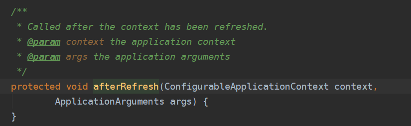
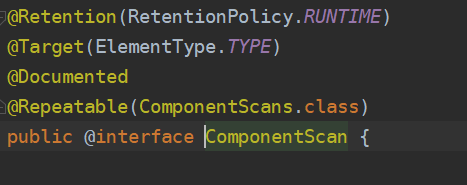

[toc]

## 一、我们带着以下疑问看源码

1. starter是什么？我们如何去使用这些starter？
2. 为什么包扫描只会扫描核心启动类所在的包及其子包
3. 在springBoot启动的过程中，是如何完成自动装配的？
4. 内嵌Tomcat是如何被创建及启动的？
5. 使用了web场景对应的starter，springmvc是如何自动装配？  

## 二、spring-boot-starter

#### 1.Starter是SpringBoot整合三方类库的核心，引入带Starter的依赖，将无需三方类库的xml配置文件和手动注入三方类库bean

#### 2.将三方类库的依赖统一集成进Starter，由Starter统一版本管理，利用依赖传递原理，相当于使用端项目直接依赖了这些三方类库

#### 3.使用Starter的包，会自动配置三方类库的bean到Spring容器中，并提供缺省的默认属性，也可在全局配置中为属性写值。

#### 4.Starter就是一个外部的项目，我们需要使用它的时候就可以在当前springboot项目中引入它。

如因为整合SpringBoot的redis，

```xml
<dependency>
    <groupId>org.springframework.boot</groupId>
    <artifactId>spring-boot-starter-data-redis</artifactId>
</dependency>
```

#### 5.自定义Starter

##### 5.1 自定义starter的命名规则

SpringBoot提供的starter以`spring-boot-starter-xxx `的方式命名的。

官方建议自定义的starter使用 `xxx-spring-boot-starter` 命名规则。以区分SpringBoot生态提供的starter

##### 5.2 创建一个Maven工程zdy-spring-boot-starter，导入SpringBoot自动配置依赖

```xml
<dependencies>
   <dependency>
       <groupId>org.springframework.boot</groupId>
       <artifactId>spring-boot-autoconfigure</artifactId>
       <version>2.2.9.RELEASE</version>
   </dependency>
</dependencies>
```

##### 5.3 编写一个JavaBean（相当于一个第三方类）

```java
@EnableConfigurationProperties(SimpleBean.class)
@ConfigurationProperties(prefix = "simplebean")
public class SimpleBean {
   private int id;
   private String name;
  
    //getter...
    //setter...
}
```

##### 5.4 编写自动配置实现类

```java
@Configuration
public class MyAutoConfiguration {
   static {
       System.out.println("MyAutoConfiguration init....");
   }
    
   @Bean
   public SimpleBean simpleBean(){
       return new SimpleBean();
   }
}
```

##### 5.5 resources下创建/MET A-INF/spring.factories

```xml
org.springframework.boot.autoconfigure.EnableAutoConfiguration=\
com.lagou.config.MyAutoConfiguration
```

#### 6.SpringBoot项目整合自定义Starter

##### 6.1 导入自定义Starter依赖

```xml
<dependency>
  <groupId>com.lagou</groupId>
  <artifactId>zdy-spring-boot-starter</artifactId>
  <version>1.0-SNAPSHOT</version>
</dependency>
```

##### 6.2 在全局配置文件中配置属性值

```properties
simplebean.id=1
simplebean.name=自定义starter
```

##### 6.3 测试

```java
//测试自定义starter
@Autowired
private SimpleBean simpleBean;
@Test
public void zdyStarterTest(){
  System.out.println(simpleBean);
}
```

#### 7. 定义EnableXXX注解实现组件热插拔

##### 7.1 新增标记类ConfigMarker

```java
public class ConfigMarker {
 
}
```

##### 7.2 新增EnableRegisterServer注解

```java
@Target({ElementType.TYPE})
@Retention(RetentionPolicy.RUNTIME)
@Import({ConfigMarker.class})
public @interface EnableRegisterServer {
}
```

##### 7.3 自动配置实现类新增条件注解

```java
@Configuration
@ConditionalOnBean(ConfigMarker.class)
public class MyAutoConfiguration {
   static {
       System.out.println("MyAutoConfiguration init....");
   }
    
   @Bean
   public SimpleBean simpleBean(){
       return new SimpleBean();
   }
}
```

##### 7.4 使用EnableRegisterServer

在启动类上新增@EnableRegisterServer注解，启动zdy工程就会自动装配 `SimpleBean`，反之则不装配。

## 三、SpringBoot启动流程

SpringBoot Servlet容器关系图


#### 1.启动配置类的main方法执行SpringApplication.run(Demo5Application.class, args)

进行初始化SpringApplication并且执行run方法


#### 2.调用SpringApplication构造方法初始化属性

自定义SpringBoot的Banner，比如自定义事件监听器，再比如在容器refresh之前通过自定义ApplicationContextInitializer 修改配置一些配置或者获取指定的bean。都是在SpringApplication对象初始化完成的


##### 2.1调用SpringApplication#deduceWebApplicationType根据classpath是否存在某个类，来判断应用类型


##### 2.2调用SpringApplication#getSpringFactoriesInstances()，读取META-INF/spring.factories获取ApplicationContextInitializer实例

ConfigurableApplicationContext 调用refresh()方法之前，回调这个类的initialize方法

通过ConfigurableApplicationContext 的实例获取容器的环境Environment，从而实现对配置文件的修改完善等工作。


#### 3.调用SpringApplication#run方法


##### 3.1 调用getRunListeners获取并启动监听器

事件机制在Spring是很重要的一部分内容，通过事件机制我们可以监听Spring容器中正在发生的一些事件，同样也可以自定义监听事件。Spring的事件为Bean和Bean之间的消息传递提供支持。当一个对象处理完某种任务后，通知另外的对象进行某些处理，常用的场景有进行某些操作后发送通知，消息、邮件等情况。

调用getSpringFactoriesInstances，通过SpringFactoriesLoader#loadFactoryNames读取MET-INF/spring.factories文件中配置的监听器实现类


##### 3.2 调用prepareEnvironment构造应用上下文环境

调用方法configureEnvironment得到到当前的应用环境（如spring的启动参数中指定了参数：--spring.profiles.active=prod）

调用方法SpringApplicationRunListeners#environmentPrepared得到当前的全局配置文件名


##### 3.3 调用createApplicationContext初始化应用上下文

根据之前初始化得到的应用雷影，创建一个Servlet应用下的Application实现AnnotationConfigServletWebServerApplicationContext


##### 3.4 调用prepareContext刷新应用上下文前的准备阶段

通过load方法将启动配置类封装为beanDefinition注册到beanDefinition注册表中


##### 3.5 刷新应用上下文

详情可查看[Spring容器启动过程](../spring/springIoC/源码解析)

##### 3.6 刷新应用上下文后的扩展接口

扩展接口，设计模式中的模板方法，默认为空实现。如果有自定义需求，可以重写该方法。比如打印一些启动结束log，或者一些其它后置处理。



## 四、SpringBoot自动配置原理

### 1.自动配置触发简介

##### 1.1 被@SpringBootApplication注解标注的类即为启动配置类，是因为该注解组合了以下注解


##### 1.2 @SpringBootConfiguration-标识为配置类


##### 1.3 @EnableAutoConfiguration-开启自动配置


##### 1.4 @ComponentScan-注解扫描路径



### 2.开启自动配置机制的核心—@EnableAutoConfiguration

##### 2.1 由@AutoConfigurationPackage和@Import(AutoConfigurationImportSelector.class)组合成

##### 2.2 @Import(AutoConfigurationImportSelector.class)向容器注册了一个ImportSelector组件


##### 2.3 @AutoConfigurationPackage使用@Import向SpringIoC容器注册了一个basePackage，默认是启动配置类的包路径。


### 3.自动配置底层核心

##### 3.1 @Import

在Spring容器启动过程中，会加载所有@Import注解配置的组件到容器中

[详情查看SpringIoC源码剖析步骤6.4](../Spring/SpringIoC/源码解析)

[自动配置实现ImportSelector具体逻辑](###4.自动配置的核心逻辑在DeferredImportSelectorGrouping#getImports方法中)

##### 3.2 @ConditionXXX

通过ImportSelector得到所有自动配置类后，由该系列注解作为是否过滤的依据

[过滤自动配置具体逻辑](#####4.5 调用AutoConfigurationImportSelector#filter将不符合条件的bean信息过滤)

##### 3.3 @EnableXXX

热插拔注解，加上该系列注解可开启某功能，关闭则不开启

注解内部构造参考[@EnableAutoConfiguration](###2.开启自动配置机制的核心—@EnableAutoConfiguration)

底层使用@Import加载相关类到容器中，然后通过在需被插拔的bean上添加@ConditionOnBean(相关类.class)，就能实现热插拔效果具体查看[自定义Starter第7点](####7. 定义EnableXXX注解实现组件热插拔)

### 4.自动配置的核心逻辑在DeferredImportSelectorGrouping#getImports方法中


##### 4.1 调用AutoConfigurationImportSelector.AutoConfigurationGroup#process，再调用AutoConfigurationImportSelector#selectImports

selectImports方法是ImportSelector组件获取自动配置bean信息的核心方法，得到所有的自动配置bean信息后放入Map中


##### 4.2 调用AutoConfigurationMetadataLoader#loadMetadata(java.lang.ClassLoader)读取相关文件

该方法读取所有jar包下的META-INF/spring-autoconfigure-metadata.properties文件，作为后续bean过滤的条件


##### 4.3 调用AutoConfigurationImportSelector#getCandidateConfigurations，再调用SpringFactoriesLoader#loadFactoryNames

该方法读取所有jar包下的META-INF/spring.factories文件，并读取该文件配置属性”EnableAutoConfiguration“的值，得到需要被自动加载bean的全限定类名。


##### 4.4分别调用AutoConfigurationImportSelector#getExclusions和AutoConfigurationImportSelector#checkExcludedClasses得到需被排除的自动配置类，然后排除这些自动配置类configurations.removeAll(exclusions);

通过getExclusions得到注解属性 **`exclude`**  需要被排除的自动配置类


通过checkExcludedClasses检查这些被排除的是否为自动配置类，否则抛出异常


##### 4.5 调用AutoConfigurationImportSelector#filter将不符合条件的bean信息过滤

根据配置中得到的ConditionOnXXX等过滤条件过滤不符合条件的自动配置bean


### 5.具体的逻辑触发时机以及后续beanDefinition注册请查看[SpringIoC源码剖析步骤6.4](../Spring/SpringIoC/源码解析)

## 五、SpringBoot自动配置并启动内嵌Web容器原理


### 1.Web容器的自动配置类

通过前面的SpringBoot启动流程以及自动配置原理了解到，再启动过程中加载MET-INF/spring.factories文件读取自动配置类注册到beanDefinition

##### 1.1 MET-INF/spring.factories文件配置Web容器的自动配置类

`org.springframework.boot.autoconfigure.web.servlet.ServletWebServerFactoryAutoConfiguration`


##### 1.2 自动配置类内部细节，通过@ConditionOnxxx设置了各种加载条件，读取全局配置Server相关的属性，以及注册各个web容器的实现类


##### 1.3 各个Web容器的实现组件，也通过@ConditionOnxxx设置了各种加载条件


### 2.Web容器加载的时机

SpringIoC容器执行AbstractApplicationContext#refresh进行容器刷新时，其中有一步调用onRefresh方法进行特殊bean的处理


### 3.ServletWebServerApplicationContext#onRefresh负责Servlet容器的创建及启动工作

##### 1.调用createWebServer方法获得嵌入式的Web容器工厂。通过工厂获得Web容器并且启动


##### 2.由于刚启动所以没有servletContext和webServer，先获得工厂，然后创建web服务


##### 3.通过beanFactory获得ServletWebServerFactory的对象


##### 4.执行org.springframework.boot.web.servlet.server.ServletWebServerFactory#getWebServer，根据项目pom的配置默认使用tomcat,执行TomcatServletWebServerFactory#getWebServer实例化tomcat，逻辑如下：

**创建Tomcat实例**

**设置目录、协议等信息**


##### 5.最后一步getTomcatWebServer方法创建一个TomcatWebServer，并进行初始化以及启动Web服务


### 4.SpringIoC容器执行AbstractApplicationContext#refresh进行容器刷新时，最后一步finishRefresh进行Servlet启动以及最终日志打印


##### 1.ServletWebServerApplicationContext#finishRefresh进行内嵌Web容器最终打印及启动需要启动的Servlet


****


##### 2.根据项目pom的配置默认使用tomcat,执行org.springframework.boot.web.embedded.tomcat.TomcatWebServer#start

**启动<load-start-up>大于0的Servlet**

**打印最终日志**


## 六、自动装配SpringMVC

### 1.Web容器对JavaConfig配置Servlect支持

##### 1.1 ServletContainerInitializer

当实现了Servlet3.0规范的容器（比如Tomcat7及以上版本）启动时，会通过SPI扩展机制自动扫描所有jar包里META-INF/services/javax.servlet.ServletContainerInitializer文件中指定的全路径类（该类需实现ServletContainerInitializer接口），并实例化该类，并回调类中的onStartup方法。


Servlet 3.0+容器启动时将自动扫描类路径以查找实现Spring的Webapplicationinitializer接口的所有实现，将其放进一个Set集合中，提供给ServletContainerInitializer中onStartup方法的第一个参数。


##### 1.3 WebApplicationInitializer

Spring官方文档中给出了基于Servlet3.0规范如何使用Java代码实现web.xml配置的example

```java
public class MyWebApplicationInitializer implements WebApplicationInitializer {

   @Override
   public void onStartup(ServletContext servletCxt) {

       // Load Spring web application configuration
       //通过注解的方式初始化Spring的上下文
       AnnotationConfigWebApplicationContext ac = new AnnotationConfigWebApplicationContext();
       //注册spring的配置类（替代传统项目中xml的configuration）
       ac.register(AppConfig.class);
       ac.refresh();

       // Create and register the DispatcherServlet
       //基于java代码的方式初始化DispatcherServlet
       DispatcherServlet servlet = new DispatcherServlet(ac);
       ServletRegistration.Dynamic registration = servletContext.addServlet("app", servlet);
       registration.setLoadOnStartup(1);
       registration.addMapping("/app/*");
   }
}
```

### 2.SpringMVC的自动配置类

通过前面的SpringBoot启动流程以及自动配置原理了解到，再启动过程中加载MET-INF/spring.factories文件读取自动配置类注册到beanDefinition

##### 1.1 MET-INF/spring.factories文件配置DispatchServlet的自动配置类

`org.springframework.boot.autoconfigure.web.servlet.DispatcherServletAutoConfiguration`


##### 1.2 自动配置类内部细节，通过@ConditionOnxxx设置了各种加载条件，读取全局配置的Servlet相关属性，并且在Web容器启动后才能加载


##### 1.3 内部分别有DispatcherServletConfiguration和DispatcherServletRegistrationConfiguration两个内部类

`DispatcherServletConfiguration`是DispatcherServlet的配置类


`DispatcherServletRegistrationConfiguration`是将DispatcherServlet注册到ServletContext中的类


### 3.自动装配时机

##### 1. 在Web容器创建时触发装配详情查看[创建内嵌Web容器](#2.由于刚启动所以没有servletContext和webServer，先获得工厂，然后创建web服务)


##### 2. 调用getSelfInitializer初始化Servlet并注册到ServletContext中


##### 3. 通过ServletWebServerApplicationContext#getServletContextInitializerBeans得到ServletContextInitializer接口的所有具体实现，遍历并执行onStartup


##### 4. 最终调用父类RegistrationBean#onStartup方法

通过getDescription()，获取当前环境到底是一个filter 还是一个servlet 还是一个listener


##### 5. 再调用DynamicRegistrationBean#register，再调用ServletRegistrationBean#addRegistration

得到dispatcherServlet，将其注册到servletContext中


