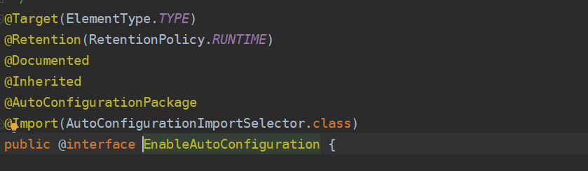

[toc]

# 一、SpringBoot启动流程

# 二、自动配置原理

### 1.@SpringBootApplication注解由以下注解组合而成

##### 1.1@SpringBootConfiguration-标识为配置类

##### 1.2@EnableAutoConfiguration-开启自动配置

##### 1.3@ComponentScan-注解扫描

### 2.@EnableAutoConfiguration是自动配置的核心注解

**由@AutoConfigurationPackage和@Import(AutoConfigurationImportSelector.class)组合成。**

**@AutoConfigurationPackage使用@Import向SpringIoC容器注册了一个basePackage，默认是启动配置类的包路径。**

**@Import(AutoConfigurationImportSelector.class)向容器注册了一个selector组件**，用于加载各个starter（jar包）下META-INF/spring.factories文件，该文件配置了每个包需要被自动加载对象的全限定路径名。被IoC容器加载后，根据类上的注解@ConditionOnXXX判断是否满足需求，然后决定是否注册到beanDefinition注册表中

### 3.自动配置的核心逻辑在DeferredImportSelectorGrouping#getImports方法中

##### **3.1执行org.springframework.boot.autoconfigure.AutoConfigurationImportSelector.AutoConfigurationGroup#process**

# 三、内嵌Web容器原理

### 1.自动配置

通过自动配置注入ServletWebServerFactory的自动配置类，该自动配置类通过@Import注入Tomcat、jetty、undertow组件（根据ConditionOnXXX判断是否注入容器）

### 2.SpringIoC容器执行AbstractApplicationContext#refresh进行容器刷新时，其中有一步调用onRefresh方法进行特殊bean的处理

### 3.org.springframework.boot.web.servlet.context.ServletWebServerApplicationContext#onRefresh负责Servlet容器的创建及启动工作

##### 1.调用createWebServer方法获得嵌入式的Web容器工厂。通过工厂获得Web容器并且启动

##### 2.由于刚启动所有没有servletContext和webServer，先获得工厂，然后创建web服务

##### 3.通过beanFactory获得ServletWebServerFactory的对象

##### 4.执行org.springframework.boot.web.servlet.server.ServletWebServerFactory#getWebServer，根据项目pom的配置默认使用tomcat,执行TomcatServletWebServerFactory#getWebServer实例化tomcat，逻辑如下：

**创建Tomcat实例**

**设置目录、协议等信息**

##### 5.最后一步getTomcatWebServer方法创建一个TomcatWebServer，并进行初始化以及启动Web服务

### 4.SpringIoC容器执行AbstractApplicationContext#refresh进行容器刷新时，最后一步finishRefresh进行Servlet启动以及最终日志打印

##### 1.ServletWebServerApplicationContext#finishRefresh进行内嵌Web容器最终打印及启动需要启动的Servlet

****

##### 2.根据项目pom的配置默认使用tomcat,执行org.springframework.boot.web.embedded.tomcat.TomcatWebServer#start

**启动<load-start-up>大于0的Servlet**

**打印最终日志**

# 四、自动装配SpringMVC

### 1.SpringBoot是如何在不配置web.xml的情况下将DispatchServlet注册到Web容器的ServletContext中的？

### 2.通过自动配置将DispatchServlet注入IoC

### 3.通过自动配置将DispatchServlet添加到ServletContext
