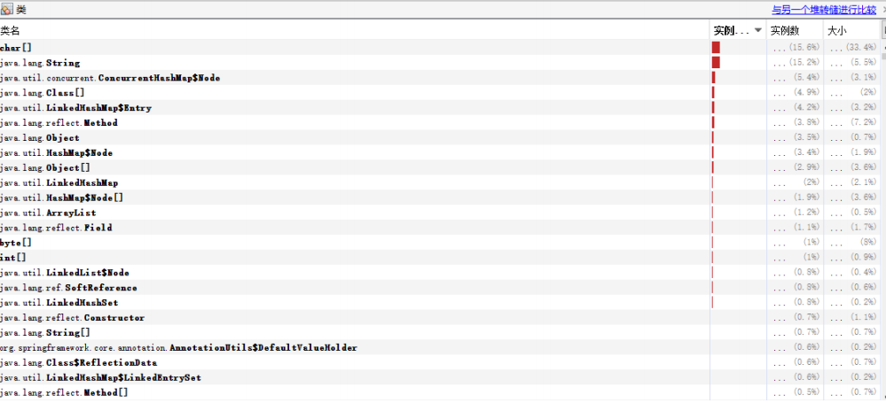
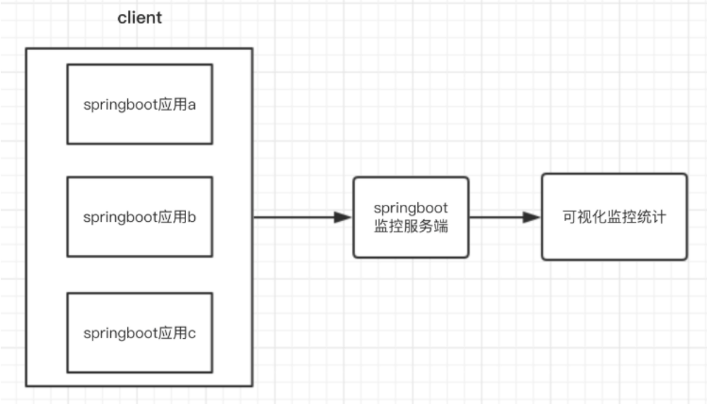

[toc]

## 1. SpringBoot部署

### jar包(官方推荐)

jar包方式启动，也就是使用SpringBoot内置的tomcat运行。服务器上面只要你配置了jdk1.8及以上就ok，不需要外置tomcat。

**pom.xml配置**

```xml
<packaging>war</packaging>
```

**在pom.xml文件中导入Springboot的maven依赖**

```xml
<!--将应用打包成一个可以执行的jar包-->
<plugins>
    <plugin>
        <groupId>org.springframework.boot</groupId>
        <artifactId>spring-boot-maven-plugin</artifactId>
    </plugin>
</plugins>
```

### war

传统的部署方式：将项目打成war包，放入tomcat 的webapps目录下面，启动tomcat，即可访问。

**注意**：application.yml中配置的server.port配置的是springboot内置的tomcat的端口号, 打成war包部署在独立的tomcat上之后, 配置的server.port是不起作用的。一定要注意这一点！

**pom.xml配置**

```xml
<packaging>war</packaging>
```

**pom文件添加如下依赖**

```xml
<!--添加servlet-api的依赖,用来打war包  -->
<dependency>
	<groupId>javax.servlet</groupId>
	<artifactId>javax.servlet-api</artifactId>
	<scope>provided</scope>
</dependency>

<!--最终打成war包，排除内置的tomcat-->
<dependency>
    <groupId>org.springframework.boot</groupId>
    <artifactId>spring-boot-starter-web</artifactId>
    <exclusions>
        <exclusion>
            <groupId>org.springframework.boot</groupId>
            <artifactId>spring-boot-starter-tomcat</artifactId>
        </exclusion>
    </exclusions>
</dependency>

...

<build>
    <plugins>
        <plugin>
            <groupId>org.springframework.boot</groupId>
            <artifactId>spring-boot-maven-plugin</artifactId>
        </plugin>
    </plugins>
</build>
```

**改造启动类**

如果是war包发布，需要增加SpringBootServletInitializer子类，并重写其configure方法，或者将main函数所在的类继承SpringBootServletInitializer，并重写configure方法

当时打包为war时上传到tomcat服务器中访问项目始终报404错就是忽略了这个步骤！！！

```java
@SpringBootApplication
public class SpringBootMytestApplication extends SpringBootServletInitializer {
    
	public static void main(String[] args) {
		SpringApplication.run(SpringBootMytestApplication.class, args);
	}
    
	@Override
	protected SpringApplicationBuilder configure(SpringApplicationBuilder builder) {
	// 注意这里要指向原先用main方法执行的Application启动类
	return builder.sources(SpringBootMytestApplication.class);
}
```


### jar和war对比

1. 启动方式不同，一个直接java -jar xxxx.jar运行，一个需要在tomcat中运行启动
2. 打成什么文件包进行部署与项目业务有关，就像提供 rest 服务的项目需要打包成 jar文件，用命令运行很方便。。。而有大量css、js、html，且需要经常改动的项目，打成 war 包去运行比较方便，因为改动静态资源可以直接覆盖，很快看到改动后的效果，这是 jar 包不能比的

### 多环境部署

##### 1. 使用@Profile("xxx")配合profile激活指定环境

@profile("xxx") 注解的作用是指定类或方法在特定的 Profile 环境生效，任何 @Component 或 @Configuration 注解的类都可以使用 @Profile 注解。在使用DI来依赖注入的时候，能够根据@profile 标明的环境，将注入符合当前运行环境的相应的bean。

`@profile("dev")`可修饰@Component 或 @Configuration 注解的类

**profile激活**

实际使用中，注解中标示了prod、test、qa等多个环境，运行时使用哪个profile由spring.profiles.active控制，以下说明2种方式：配置文件方式、命令行方式

**配置文件方式激活profile**

确定当前使用的是哪个环境，这边环境的值与application-dev.properties中-后面的值对应，在resources/application.properties中添加下面的配置。

```properties
spring.profiles.active=dev
```

**命令行方式激活profile**

在打包后运行的时候，添加参数：

```sh
java -jar spring-boot-config-0.0.1-SNAPSHOT.jar --spring.profiles.active=dev
```


##### 2. 多Profile的资源文件

除了@profile注解的可以标明某些方法和类具体在哪个环境下注入。springboot的环境隔离还可以使用多资源文件的方式，进行一些参数的配置。

**资源配置文件**

Springboot的资源配置文件除了application.properties之外，还可以有对应的资源文件application-{profile}.properties。

假设，一个应用的工作环境有：dev、test、prod，那么应该有以下4 个配置文件：

- applcation.properties - 公共配置

- application-dev.properties - 开发环境配置

- application-test.properties - 测试环境配置

- application-prod.properties - 生产环境配置

不同的properties配置文件也可以在 `applcation.properties`文件中来激活 profile:`spring.profiles.active = test`

**加载顺序**

- 先根据spring.profiles.active加载对应黄静的配置文件

- 再加载公共配置文件 

## 2. SpringBoot监控

微服务的特点决定了功能模块的部署是分布式的，大部分功能模块都是运行在不同的机器上，彼此通过服务调用进行交互，前后台的业务流会经过很多个微服务的处理和传递，出现了异常如何快速定位是哪个环节出现了问题？

在这种情况下，微服务的监控显得尤为重要。springboot作为微服务框架，除了它强大的快速开发功能外，还有就是它提供了actuator模块，引入该模块能够自动为springboot应用提供一系列用于监控的端点

### 2.1 Acturator定义

Actuator是spring boot的一个附加功能,可帮助你在应用程序生产环境时监视和管理应用程序。可以使用HTTP的各种请求来监管,审计,收集应用的运行情况。Spring Boot Actuator提供了对单个Spring Boot的监控，信息包含：应用状态、内存、线程、堆栈等等，比较全面的监控了SpringBoot应用的整个生命周期。特别对于微服务管理十分有意义。

### 2.2 Actuator 的 REST接口

Actuator 监控分成两类：原生端点和用户自定义端点；自定义端点主要是指扩展性，用户可以根据自己的实际应用，定义一些比较关心的指标，在运行期进行监控。

原生端点是在应用程序里提供众多 Web 接口，通过它们了解应用程序运行时的内部状况。原生端点又可以分成三类：

- 应用配置类：可以查看应用在运行期的静态信息：例如自动配置信息、加载的 springbean信息、yml 文件配置信息、环境信息、请求映射信息；

- 度量指标类：主要是运行期的动态信息，例如堆栈、请求链、一些健康指标、metrics 信息等；

- 操作控制类：主要是指 shutdown,用户可以发送一个请求将应用的监控功能关闭。

| HTTP方法 | 路径            | 描述                                                         |
| :------- | :-------------- | :----------------------------------------------------------- |
| GET      | /auditevents    | 显示应用暴露的审计事件 (比如认证进入、订单失败)              |
| GET      | /beans          | 描述应用程序上下文里全部的 Bean，以及它们的关系              |
| GET      | /conditions     | 就是 1.0 的 /autoconfig ，提供一份自动配置生效的条件情况，记录哪些自动配置条件通过了，哪些没通过 |
| GET      | /configprops    | 描述配置属性(包含默认值)如何注入Bean                         |
| GET      | /env            | 获取全部环境属性                                             |
| GET      | /env/{name}     | 根据名称获取特定的环境属性值                                 |
| GET      | /flyway         | 提供一份 Flyway 数据库迁移信息                               |
| GET      | /liquidbase     | 显示Liquibase 数据库迁移的纤细信息                           |
| GET      | /health         | 报告应用程序的健康指标，这些值由 HealthIndicator 的实现类提供 |
| GET      | /heapdump       | dump 一份应用的 JVM 堆信息                                   |
| GET      | /httptrace      | 显示HTTP足迹，最近100个HTTP request/repsponse                |
| GET      | /info           | 获取应用程序的定制信息，这些信息由info打头的属性提供         |
| GET      | /logfile        | 返回log file中的内容(如果 logging.file 或者 logging.path 被设置) |
| GET      | /loggers        | 显示和修改配置的loggers                                      |
| GET      | /metrics        | 报告各种应用程序度量信息，比如内存用量和HTTP请求计数         |
| GET      | /metrics/{name} | 报告指定名称的应用程序度量值                                 |
| GET      | /scheduledtasks | 展示应用中的定时任务信息                                     |
| GET      | /sessions       | 如果我们使用了 Spring Session 展示应用中的 HTTPsessions 信息 |
| POST     | /shutdown       | 关闭应用程序，要求endpoints.shutdown.enabled设置为true       |
| GET      | /mappings       | 描述全部的 URI路径，以及它们和控制器(包含Actuator端 点)的映射关系 |
| GET      | /threaddump     | 获取线程活动的快照                                           |

### 2.3 使用Actuator

##### pom.xml中添加如下依赖

```xml
<dependency> 
    <groupId>org.springframework.boot</groupId> 
    <artifactId>spring-boot-starter-actuator</artifactId> 
</dependency>
```

为了保证 actuator 暴露的监控接口的安全性，需要添加安全控制的依赖 spring-boot-start- security 依赖，访问应用监控端点时，都需要输入验证信息。Security 依赖，可以选择不加，不进行安全管理。

##### 配置文件

```properties
info.app.name=spring-boot-actuator
info.app.version= 1.0.0
info.app.test=test

#默认开启/actuator/health和/actuator/info两个端点，现打开所有的监控点
management.endpoints.web.exposure.include=*

#展示细节，除了always之外还有when-authorized、never，默认值是never
management.endpoint.health.show-details=always
#management.endpoints.web.base-path=/monitor

management.endpoint.shutdown.enabled=true
```

- `management.endpoints.web.base-path=/monitor`代表启用单独的url地址来监控 SpringBoot 应用，为了安全一般都启用独立的端口来访问后端的监控信息，默认是/actuator

- `management.endpoint.shutdown.enabled=true` 启用接口关闭 Spring Boot

##### 属性介绍

**management.endpoints.web.exposure.include**

```properties
#默认开启/actuator/health和/actuator/info两个端点，现打开所有的监控点
management.endpoints.web.exposure.include=*
#选择打开部分
management.endpoints.web.exposure.include=beans,trace
```

**management.endpoints.web.base-path**

Actuator 默认所有的监控点路径都在 /actuator/* ，当然如果有需要这个路径也支持定制。

以下设置完重启后，再次访问地址就会变成 /manage/*

```properties
management.endpoints.web.base-path=/manage
```

##### health

health 主要用来检查应用的运行状态，这是我们使用最高频的一个监控点。通常使用此接口提醒我们应用实例的运行状态，以及应用不”健康“的原因，比如数据库连接、磁盘空间不够等。

默认情况下 health 的状态是开放的，添加依赖后启动项目，访问：http://localhost:8080/actuator/health 即可看到应用的状态。

可以在配置文件中关闭特定的健康检查指标，比如关闭 redis 的健康检查：

```properties
management.health.redise.enabled=false 
```

##### info

info 就是我们自己配置在配置文件中以 info 开头的配置信息，启动示例项目，访问： http://localhost:8080/actuator/info 返回部分信息如下：

```json
{ 
    "app" : { "name": "spring-boot-actuator",
      "version": "1.0.0", 
      "test":"test"
    } 
}
```

##### beans

根据示例就可以看出，展示了 bean 的别名、类型、是否单例、类的地址、依赖等信息。启动示例项目，访问： http://localhost:8080/actuator/beans 

##### conditions

Spring Boot 的自动配置功能非常便利，但有时候也意味着出问题比较难找出具体的原因。使用conditions 可以在应用运行时查看代码了某个配置在什么条件下生效，或者某个自动配置为什么没有生效。启动示例项目，访问： http://localhost:8080/actuator/conditions

##### heapdump

返回一个 GZip 压缩的 JVM 堆 dump

启动示例项目，访问： http://localhost:8080/actuator/heapdump 会自动生成一个 Jvm 的堆文件 heapdump，我们可以使用 JDK 自带的 Jvm 监控工具 VisualVM 打开此文件查看内存快照。类似如下图：



##### mappings

描述全部的 URI 路径，以及它们和控制器的映射关系

启动示例项目，访问： http://localhost:8080/actuator/mappings

##### threaddump

/threaddump 接口会生成当前线程活动的快照。这个功能非常好，方便我们在日常定位问题的时候查看线程的情况。 主要展示了线程名、线程ID、线程的状态、是否等待锁资源等信息。

启动示例项目，访问： http://localhost:8080/actuator/threaddump

```json
[ 
    { "threadName": "http-nio-8088-exec-6", 
     "threadId": 49, 
     "blockedTime": -1, 
     "blockedCount": 0, 
     "waitedTime": -1, 
     "waitedCount": 2, 
     "lockName": "java.util.concurrent.locks.AbstractQueuedSynchronizer$ConditionObject@1630a 501",
     "lockOwnerId": -1, 
     "lockOwnerName": null, 
     "inNative": false, 
     "suspended": false, 
     "threadState": "WAITING", 
     "stackTrace": [ 
         { "methodName": "park", 
          "fileName": "Unsafe.java", 
          "lineNumber": -2, 
          "className": "sun.misc.Unsafe", 
          "nativeMethod": true 
         },
         ... 
         { "methodName": "run", 
          "fileName": "TaskThread.java", 
          "lineNumber": 61, 
          "className": "org.apache.tomcat.util.threads.TaskThread$WrappingRunnable",
          "nativeMethod": false 
         }... 
     ],
     "lockInfo": { "className": "java.util.concurrent.locks.AbstractQueuedSynchronizer$ConditionObject", 
                  "identityHashCode": 372286721 
                 } 
    }
    ... 
]
```

生产出现问题的时候，可以通过应用的线程快照来检测应用正在执行的任务

##### shutdown

开启接口优雅关闭 Spring Boot 应用，要使用这个功能首先需要在配置文件中开启：

```properties
management.endpoint.shutdown.enabled=true
```

配置完成之后，启动示例项目，使用 curl 模拟 post 请求访问 shutdown 接口

**shutdown 接口默认只支持 post 请求。**

```sh
curl -X POST "http://localhost:8080/actuator/shutdown" { "message": "Shutting down, bye..." }
```

此时你会发现应用已经被关闭

### 2.3 Spring Boot Admin

对于spring actuator而言，最大的缺点在于是以json形式来进行展示，为了更好的进行监控显示，我们来介绍一个更加方便的工具：spring boot admin。

Spring Boot Admin：可视化后台管理系统

Spring Boot Admin 是一个针对spring-boot的actuator接口进行UI美化封装的监控工具。他可以返回在列表中浏览所有被监控spring-boot项目的基本信息比如：Spring容器管理的所有的bean、详细的Health信息、内存信息、JVM信息、垃圾回收信息、各种配置信息（比如数据源、缓存列表和命中率）等，Threads 线程管理，Environment 管理等。

利用springbootadmin进行监控的架构图如下：



**springbootadmin**监控通俗点，就是我们如果有n个springboot业务系统需要监控的话，那么需要一个额外的springbootadmin应用来进行监控这些client，client和server之间需要做一点配置即可

#### 搭建server端

**pom.xml**

```xml
<dependency>
    <groupId>org.springframework.boot</groupId> 
    <artifactId>spring-boot-starter-web</artifactId> 
</dependency> 
<dependency> 
    <groupId>org.springframework.boot</groupId> 
    <artifactId>spring-boot-starter-actuator</artifactId> 
</dependency> 
<dependency> 
    <groupId>de.codecentric</groupId> 
    <artifactId>spring-boot-admin-starter-server</artifactId> 
</dependency>
```

**applicaiton.yml**

```yaml
server: 
  port: 8081
```

**@EnableAdminServer**

```java
@EnableAdminServer 
@SpringBootApplication 
public class App { 
    public static void main(String[] args) { 
        SpringApplication.run(App.class, args); 
    }
```

#### 搭建client端

**pom.xml**

```xml
<dependency>
    <groupId>org.springframework.boot</groupId> 
    <artifactId>spring-boot-starter-web</artifactId> 
</dependency> 
<dependency> 
    <groupId>org.springframework.boot</groupId> 
    <artifactId>spring-boot-starter-actuator</artifactId> 
</dependency> 
<dependency> 
    <groupId>de.codecentric</groupId> 
    <artifactId>spring-boot-admin-starter-client</artifactId>
    <version>2.1.0</version> 
</dependency>
```

**application.yml**

```yaml
server: 
  port: 8080 
  #自定义配置信息用于"/actuator/info"读取 
  info: 
    name: 老王 
    age: 100 
    phone: 110 
    #通过下面的配置启用所有的监控端点，默认情况下，这些端点是禁用的； 
  management: 
    endpoints:
      web:
        exposure: 
          include: "*" 
    endpoint: 
      health: 
        show-details: always
        
## 将Client作为服务注册到Server，通过Server来监听项目的运行情况 
spring: 
  boot: 
    admin: 
      client: 
        url: http://localhost:8081 
  ##application实例名 
  application: 
    name : spring-boot-admin-client
```

#### 启动 server和client后，打开server控制台就能看到client信息