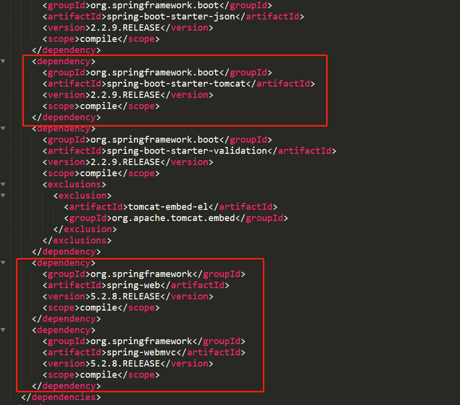

[toc]

## 一、SpringBoot概念

#### **1.什么SpringBoot**

SpringBoot是一个用于快速搭建Spring项目的脚手架，能够尽可能快的跑起来项目并且尽可能的减少配置文件。利用约定优于配置原则省去配置繁杂配置文件、利用依赖启动器简化了pom文件的配置、内嵌Tomcat容器使应用可以直接启动。

#### **2.什么是约定优于配置**

约定优于配置是一种约定编程，是一种软件设计规范，对系统、框架中的一些东西设定一个大众化的缺省值（默认值）。如SpringBoot中遵循约定优于配置原则，整合的大部分组件及框架都提供了缺省值，约定的配置满足开发者自身需求的话，可不做任何配置，大大简化了配置文件的编写

#### **3.SpringBoot有哪些特性（核心），分别具有什么优点**

1. 起步依赖（Spring boot starter）

   起步依赖将某功能常用的依赖与SpringBoot进行整合，合并到一个依赖中，版本由起步依赖统一管理，简化了繁杂的pom配置以及依赖冲突的管理，并且为外部项目所需的配置提供缺省的默认属性，减少了配置文件的配置

2. JavaConfig

   Spring从3.0开始支持JavaConfig，Spring4.0后全面支持JavaConfig，通过Java类的形式进行配置配合注解，大大提供了工作效率

3. 自动配置（详情见源码剖析）

   利用Spring对条件化配置的支持，推测SpringBoot整合的一些框架所需的bean并自动配置他们。通过起步依赖可实现自定义框架bean的自动配置

4. 内嵌Web容器

   SpringBoot内嵌Tomcat、Jetty、undertow三种Web容器，只需一个Java的运行环境，即可直接将SpringBoot项项目跑起来，SpringBoot的项目可打成一个jar包


## 二、通过Starter与SpringBoot整合

#### 1.Starter是SpringBoot整合三方类库的核心，引入带Starter的依赖，将无需三方类库的xml配置文件和手动注入三方类库bean

#### 2.将三方类库的依赖统一集成进Starter，由Starter统一版本管理，利用依赖传递原理，相当于使用端项目直接依赖了这些三方类库

#### 3.使用Starter的包，会自动配置三方类库的bean到Spring容器中，并提供缺省的默认属性，也可在全局配置中为属性写值。

#### 4.Starter就是一个外部的项目，我们需要使用它的时候就可以在当前springboot项目中引入它。

如因为整合SpringBoot的redis，

```xml
<dependency>
    <groupId>org.springframework.boot</groupId>
    <artifactId>spring-boot-starter-data-redis</artifactId>
</dependency>
```

#### 5.自定义Starter

##### 5.1 自定义starter的命名规则

SpringBoot提供的starter以`spring-boot-starter-xxx `的方式命名的。

官方建议自定义的starter使用 `xxx-spring-boot-starter` 命名规则。以区分SpringBoot生态提供的starter

##### 5.2 创建一个Maven工程zdy-spring-boot-starter，导入SpringBoot自动配置依赖

```xml
<dependencies>
   <dependency>
       <groupId>org.springframework.boot</groupId>
       <artifactId>spring-boot-autoconfigure</artifactId>
       <version>2.2.9.RELEASE</version>
   </dependency>
</dependencies>
```

##### 5.3 编写一个JavaBean（相当于一个第三方类）

```java
@EnableConfigurationProperties(SimpleBean.class)
@ConfigurationProperties(prefix = "simplebean")
public class SimpleBean {
   private int id;
   private String name;
  
    //getter...
    //setter...
}
```

##### 5.4 编写自动配置实现类

```java
@Configuration
public class MyAutoConfiguration {
   static {
       System.out.println("MyAutoConfiguration init....");
   }
    
   @Bean
   public SimpleBean simpleBean(){
       return new SimpleBean();
   }
}
```

##### 5.5 resources下创建/MET A-INF/spring.factories

```xml
org.springframework.boot.autoconfigure.EnableAutoConfiguration=\
com.lagou.config.MyAutoConfiguration
```

#### 6.SpringBoot项目整合自定义Starter

##### 6.1 导入自定义Starter依赖

```xml
<dependency>
  <groupId>com.lagou</groupId>
  <artifactId>zdy-spring-boot-starter</artifactId>
  <version>1.0-SNAPSHOT</version>
</dependency>
```

##### 6.2 在全局配置文件中配置属性值

```properties
simplebean.id=1
simplebean.name=自定义starter
```

##### 6.3 测试

```java
//测试自定义starter
@Autowired
private SimpleBean simpleBean;
@Test
public void zdyStarterTest(){
  System.out.println(simpleBean);
}
```

#### 7. 定义EnableXXX注解实现组件热插拔

##### 7.1 新增标记类ConfigMarker

```java
public class ConfigMarker {
 
}
```

##### 7.2 新增EnableRegisterServer注解

```java
@Target({ElementType.TYPE})
@Retention(RetentionPolicy.RUNTIME)
@Import({ConfigMarker.class})
public @interface EnableRegisterServer {
}
```

##### 7.3 自动配置实现类新增条件注解

```java
@Configuration
@ConditionalOnBean(ConfigMarker.class)
public class MyAutoConfiguration {
   static {
       System.out.println("MyAutoConfiguration init....");
   }
    
   @Bean
   public SimpleBean simpleBean(){
       return new SimpleBean();
   }
}
```

##### 7.4 使用EnableRegisterServer

在启动类上新增@EnableImRegisterServer注解，启动zdy工程就会自动装配 `SimpleBean`，反之则不装配。

## 三、Springboot的热部署

#### **1.添加spring-boot-devtools热部署依赖启动器**

```xml
<!-- 引入热部署依赖 -->
<dependency>
    <groupId>org.springframework.boot</groupId>
    <artifactId>spring-boot-devtools</artifactId>
</dependency>
```

#### **2.IDEA设置自动编译**


Ctrl+Alt+Shift+/打开Maintenance  ，选择Registry，找到"compiler.automake.allow.when.app.running"  勾选Value值，允许项目运行时编译


#### **3.排除不触发热部署资源**

```properties
spring.devtools.restart.exclude=static/**,public/**
```


#### **4.SpringBoot热部署原理**

1. SpringBootDevtools自定义了两个类加载器：restartClassLoader和baseclassloader
2. restartClassLoader加载本项目classpath文件
3. baseclassloader则只加载三方类库
4. restartClassLoader监控classpath文件，若重新编译后classpath发生变化，则重新加载classpath
5. 重新加载classpath时，无需再加载三方类库，使项目无需重启便能代码生效

## 四、Springboot全局配置

正如spring项目有applicationContext.xml，springmvc有springmvc.xml一样，SpringBoot也有配置文件：application.properties，这是一个全局配置文件，对项目中所有组件生效。

- **若全局配置中缺省属性值，在自动装配时三方类库bean时，会根据默认值装配。**
- **若是在全局配置中设置了属性值，在自动装配时三方类库bean时，则会覆盖默认值**

#### 1.全局配置文件的类型-bootstrap和application

- **==bootstrap==** 开头的是系统级别的配置文件，在系统启动时优先加载
- **==application==** 开头的是应用级别的配置文件

#### 2.全局配置文件可存放的路径，以及不同路径加载优先级顺序如下

1. **/config**（项目根路径下的config文件夹）

2. **/ **（项目根路径下）

3. **resources/config** （resources目录下的config文件夹）

4. **resources/**（resources目录下）

#### 3.全局配置文件的命名规范及同目录下加载优先级

- application.yml或者application.properties

- springboot-2.4.0之前：properties优先级大于yaml文件；springboot-2.4.0之后：yaml优先级大于properties文件，也可通过配置强制哪个生效

  ```properties
  ## 配置以下属性可优先加载该配置文件
  srping.config.use-legacy-processing=true
  ```

- 若不以application开头命名，则在程序启动时指定全局配置文件，指令如下

  ```sh
  $ java -jar myproject.jar --spring.config.name=myproject
  ```

#### 4.存在多全局配置文件的情况

- 存在多个全局配置文件时，若配置属性冲突，以优先读取的属性为准

- 存在多个全局配置文件时，若配置属性不冲突，则共同生效-形成互补

#### 5.指定外部全局配置文件

```sh
java -jar run-0.0.1-SNAPSHOT.jar --spring.config.location=D:/application.properties
```

#### 6.当使用@ConfigurationProperties自定义配置项时，可通过以下依赖，在配置文件中进行书写提示 

 ```xml
 <dependency>
     <groupId>org.springframework.boot</groupId>
     <artifactId>spring-boot-configuration-processor</artifactId>
     <optional>true</optional>
 </dependency>
 ```

#### 7.properties书写规范

```properties
#数组
person.hobby=吃饭,睡觉

#Map
person.map.k1=v1
person.map.k2=v2

#集合
person.family=爸爸,妈妈

#引用对象
person.pet.type=狗
person.pet.name=旺财
```

#### 8.yaml书写规范

```yaml
#数组
person:
  hobby: [吃饭，睡觉，打豆豆]

#Map
person:
  map: {k1: v1,k2: v2}

person:
  map:
    k1: v1
    k2: v2
#集合
person:
  hobby:
    - play
    - read
    - sleep

person:
  hobby: [play,read,sleep]
#引用对象
person:
  pet: {type: dog,name: 旺财}
```


## 五、属性注入

#### 1.@ConfigurationProperties批量注入

在全局配置文件中配置的属性，可通过可**@ConfigurationProperties**批量注入属性

- **@ConfigurationProperties**配合**@Component**为类批量注入属性

  通过@Component将该类注册为bean

```java
@Component // 将对象存入IoC容器
@ConfigurationProperties(prefix = "mq.upp.callback.rocket", ignoreUnknownFields = false) // 通过setter批量注入属性
public class RocketMqUPPCallBackConfig {
    // field
    
    // getter
    // setter
}
```

- **@ConfigurationProperties**配合**@Configuration和@EnableConfigurationProperties**为类批量注入属性

  通过@EnableConfigurationProperties将@ConfigurationProperties注解的类注册为bean

```java
@Configuration // 标识为配置类
@EnableConfigurationProperties(RocketMqUPPCallBackConfig.class)// 开启批量属性注入
@ConfigurationProperties(prefix = "mq.upp.callback.rocket", ignoreUnknownFields = false) // 通过setter批量注入属性
public class RocketMqUPPCallBackConfig {
     // field
    
    // getter
    // setter
}
```

- **@ConfigurationProperties**配合**@bean**为第三方类注入属性

```java
//@Configuration
public class MyService {
    
   @Bean
   @ConfigurationProperties("another")
   public AnotherComponent anotherComponent(){
       return new AnotherComponent();
   }
}
```

- **若是自定义的属性，可配置以下依赖，就能在全局配置中编写属性值时自动提醒javaConfig的属性**

```xml
<dependency>
    <groupId>org.springframework.boot</groupId>
    <artifactId>spring-boot-configuration-processor</artifactId>
    <optional>true</optional>
</dependency>
```

#### 2.@Value单个属性注入

```java
@Component
public class RocketMqUPPCallBackComponent {
	
	@Value("${mq.upp.callback.rocket}")
    private boolean switchState;
}
```

#### 3.松散绑定

Spring Boot使用一些宽松的规则将环境属性绑定到@ConfigurationProperties bean，因此环境属性名和bean属性名之间不需要完全匹配。

例如：

```java
@Data
@Component
@ConfigurationProperties("acme.my-person.person")
public class OwnerProperties {
   private String firstName;
}
```

```yml
acme:
my-person:
   person:
     first-name: 泰森
```


| 属性文件中配置                    | 说明                                     |
| --------------------------------- | ---------------------------------------- |
| acme.my-project.person.first-name | 羊肉串模式case, 推荐使用                 |
| acme.myProject.person.firstName   | 标准驼峰模式                             |
| acme.my_project.person.first_name | 下划线模式                               |
| ACME_MYPROJECT_PERSON_FIRSTNAME   | 大写下划线，如果使用系统环境时候推荐使用 |

## 六、日志系统

#### 1. 介绍

通常情况下，日志是由一个抽象层+实现层的组合来搭建的。下表是目前市面最常见的日志框架，包含了抽象层和实现层

Spring 框架选择使用了JCL作为默认日志输出

Spring Boot默认选择了SLF4J 结合 logback

| 日志-抽象层                                                  | 日志-实现层                                           |
| ------------------------------------------------------------ | ----------------------------------------------------- |
| JCL（Jakarta Commons Logging）、SLF4J（Simple Logging Facade for Java）、jboss-logging | jul（java.util.logging）、jcl、log4j、logback、log4j2 |

为什么会有抽象层呢？直接使用实现层不是更方便吗？以下以SLF4J为入口讲解

#### 2. SLF4J怎么通配各个日志实现层的？

其实，早在SLF4J抽象层出现前，日志框架五花八门，其API接口命名不尽相同，更换日志框架将带来巨大的工作量。此时，SLF4J日志门面横空出世，定义了一套日志框架的API，由具体的实现层去实现这些规范。

SLF4J 的作者也是log4j的作者，他对log4j框架有所不满，便**重新开发了一套日志框架-logback，顺便定义了SLF4J作为logback的API接口层**。为了方便开发者**无缝切换日志框架**，使用SLF4J抽象层**整合了一系列流行的日志实现层框架（通过编写对应的SLF4J适配器去调用对应的实现层对象）**，从而实现了仅需一个日志门面，就来通配各种日志实现层框架。**适配器如下：**

- slf4j-log412.jar
- slfj-jdk12.jar

下图是SLF4J 结合各种日志框架的官方示例，从图中可以清晰的看出SLF4J API 永远作为日志的门面，直接应用与应用程序中。


**注意：日志的配置文件使用的还是各实现层框架自己的配置文件**

#### 3. 由于maven的依赖传递，各个框架中使用日志实现层不尽相同，怎么统一日志框架的使用呢？

如：A项目（slf4J + logback）-> Spring（commons logging）-> Hibernate（jboss-logging）

[官方方案步骤如下](http://www.slf4j.org/legacy.html)：

1. 排除各个依赖中不同的日志框架依赖。
2. 添加对应的替换包（over），将调用转发至slf4j的API。
3. 导入我们选择的SLF4J 实现。


#### 4.spring-boot-starter-logging的原理

##### 4.1 日志架构为SLF4j + LogBack及默认的配置文件


##### 4.2 排除其他日志框架


##### 4.3 统一框架引入替换包

```xml
<dependencies>
   <dependency>
     <groupId>ch.qos.logback</groupId>
     <artifactId>logback-classic</artifactId>
     <version>1.2.3</version>
     <scope>compile</scope>
   </dependency>
   <dependency>
     <groupId>org.apache.logging.log4j</groupId>
     <artifactId>log4j-to-slf4j</artifactId>
     <version>2.13.3</version>
     <scope>compile</scope>
   </dependency>
   <dependency>
     <groupId>org.slf4j</groupId>
     <artifactId>jul-to-slf4j</artifactId>
     <version>1.7.30</version>
     <scope>compile</scope>
   </dependency>
 </dependencies>
```

##### 4.4 自定义配置

```properties
# 日志配置
# 指定具体包的日志级别
logging.level.com.lagou=debug
# 控制台输出格式
logging.pattern.console=%d{yyyy-MM-dd HH:mm:ss.SSS} [%thread] %-5level %logger{50} - %msg%n
# 日志文件输出格式
logging.pattern.file=%d{yyyy-MM-dd HH:mm:ss.SSS} [%thread] %-5level %logger{50} - %msg%n
# 日志输出路径，
logging.path=/var/log
# 日志文件名，缺省默认为spring.log
logging.file=./log.log
```

##### 4.5 如何替换掉SpringBoot默认的spring-boot-starter-logging

```xml
<dependency>
    <groupId>org.springframework.boot</groupId>
    <artifactId>spring-boot-starter-web</artifactId>
    <exclusions>
        <exclusion>
            <artifactId>spring-boot-starter-logging</artifactId>
            <groupId>org.springframework.boot</groupId>
        </exclusion>
    </exclusions>
</dependency>
<dependency>
    <groupId>org.springframework.boot</groupId>
    <artifactId>spring-boot-starter-log4j2</artifactId>
</dependency>
```


## 七、引入web容器和SpringMVC

##### 1. SpringBoot默认支持Tomcat，Jetty，和Undertow作为底层容器。

而SpringBoot默认使用Tomcat，一旦引入spring-boot-starter-web模块，就默认使用Tomcat容器。

```xml
<dependency>
    <groupId>org.springframework.boot</groupId>
    <artifactId>spring-boot-starter-web</artifactId>
</dependency>
```

spring-boot-starter-web这个starter中又引入了spring-boot-starter-tomcat和SpringMVC



##### 2.切换Web容器

```xml
<dependency>
   <groupId>org.springframework.boot</groupId>
   <artifactId>spring-boot-starter-web</artifactId>
   <exclusions>
       <exclusion>
           <!--移除spring-boot-starter-web中的tomcat-->
           <artifactId>spring-boot-starter-tomcat</artifactId>
           <groupId>org.springframework.boot</groupId>
       </exclusion>
   </exclusions>
</dependency>
<dependency>
   <groupId>org.springframework.boot</groupId>
   <!--引入jetty-->
   <artifactId>spring-boot-starter-jetty</artifactId>
</dependency>
```
