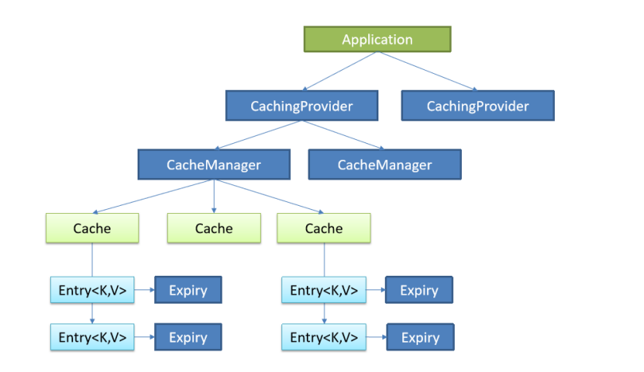
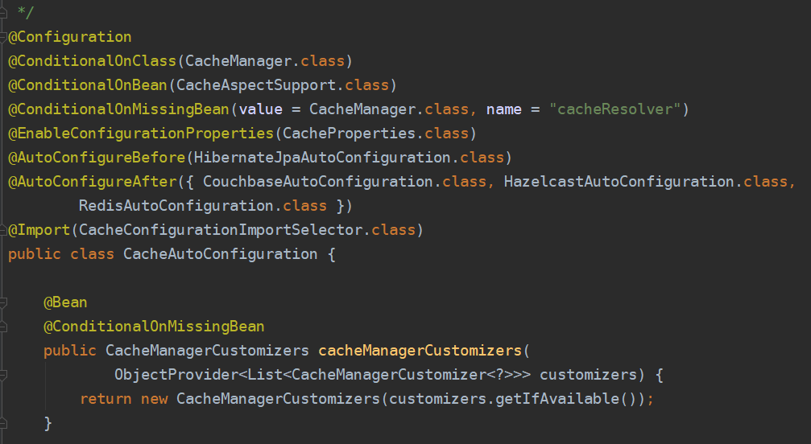
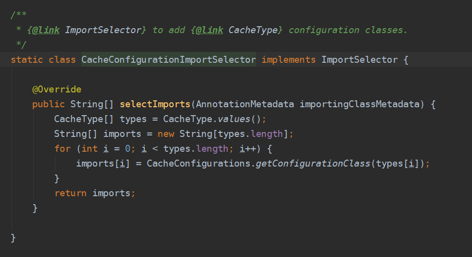
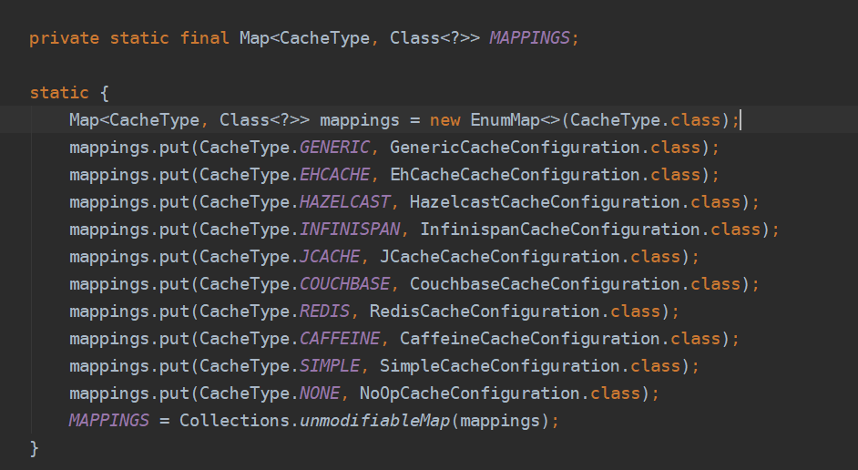
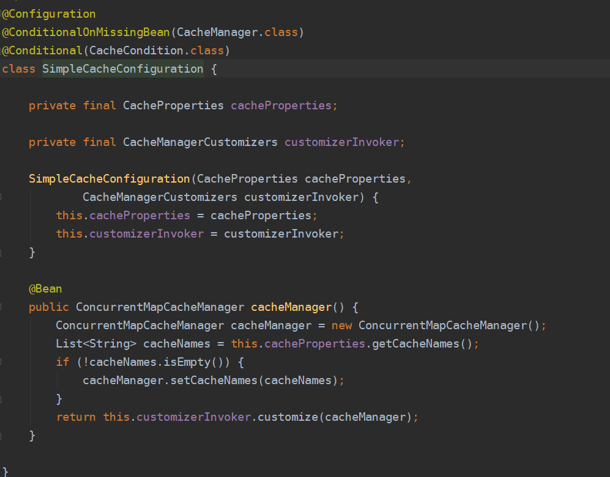

[toc]


## 1.JSR107规范

#### 概念

JSR是Java Specification Requests 的缩写 ，Java规范请求，故名思议提交Java规范，JSR-107呢就是关于如何使用缓存的规范，是java提供的一个接口规范，类似于JDBC规范，没有具体的实现，具体的实现就是reids等这些缓存

#### JSR107核心接口

- CachingProvider（缓存提供者）：创建、配置、获取、管理和控制多个CacheManager

- CacheManager（缓存管理器）：创建、配置、获取、管理和控制多个唯一命名的Cache，一个CacheManager仅对应一个CachingProvider

- Cache（缓存）：是由CacheManager管理的，CacheManager管理Cache的生命周期，Cache存在于CacheManager的上下文中，是一个类似map的数据结构，并临时存储以key为索引的值。一个Cache仅被一个CacheManager所拥有

- Entry（缓存键值对）：是一个存储在Cache中的key-value对

- Expiry（缓存时效）：每一个存储在Cache中的条目都有一个定义的有效期。一旦超过这个时间，条目就自动过期，过期后，条目将不可以访问、更新和删除操作。缓存有效期可以通过ExpiryPolicy设置



一个应用里面可以有多个缓存提供者(CachingProvider)，一个缓存提供者可以获取到多个缓存管理器(CacheManager)，一个缓存管理器管理着不同的缓存(Cache)，缓存中是一个个的缓存键值对(Entry)，每个entry都有一个有效期(Expiry)。缓存管理器和缓存之间的关系有点类似于数据库中连接池和连接的关系。

```xml
<dependency>
   <groupId>javax.cache</groupId>
   <artifactId>cache-api</artifactId>
</dependency>
```


## 2.Spinrg对缓存抽象

#### 定义

Spring从3.1开始定义了`org.springframework.cache.Cache和org.springframework.cache.CacheManager`接口来统一不同的缓存技术；并支持使用`JavaCaching`（JSR-107）注解简化我们进行缓存开发。

Spring Cache 只负责维护抽象层，具体的实现由自己的技术选型来决定。将缓存处理和缓存技术解除耦合。

每次调用需要缓存功能的方法时，Spring会检查指定参数的指定的目标方法是否已经被调用过，如果有就直接从缓存中获取方法调用后的结果，如果没有就调用方法并缓存结果后返回给用户。下次调用直接从缓存中获取。

使用Spring缓存抽象时我们需要关注以下两点：

- 确定那些方法需要被缓存

- 缓存策略

#### Spring中重要接口

**Cache**：缓存抽象的规范接口，缓存实现有：RedisCache、EhCache、

**ConcurrentMapCache**等

**CacheManager**：缓存管理器，管理Cache的生命周期


## 3.Spring对缓存使用

#### Spring提供的重要缓存注解及几个重要概念几个重要概念&缓存注解：

| 概念/注解      | 作用                                                         |
| -------------- | ------------------------------------------------------------ |
| Cache          | 缓存接口，定义缓存操作。实现有：RedisCache、EhCacheCache、ConcurrentMapCache等 |
| CacheManager   | 缓存管理器，管理各种缓存(Cache)组件                          |
| @Cacheable     | 主要针对方法配置，能够根据方法的请求参数对其结果进行缓存     |
| @CacheEvict    | 清空缓存                                                     |
| @CachePut      | 保证方法被调用，又希望结果被缓存                             |
| @EnableCaching | 开启基于注解的缓存                                           |
| keyGenerator   | 缓存数据时key生成策略                                        |
| serialize      | 缓存数据时value序列化策略                                    |

#### 各注解属性介绍

@Cacheable注解的属性

| 属性名           | 描述                                                         |
| ---------------- | ------------------------------------------------------------ |
| cacheNames/value | 指定缓存的名字，缓存使用CacheManager管理多个缓存组件Cache，这些Cache组件就是根据这个名字进行区分的。对缓存的真正CRUD操作在Cache中定义，每个缓存组件Cache都有自己唯一的名字，通过cacheNames或者value属性指定，相当于是将缓存的键值对进行分组，缓存的名字是一个数组，也就是说可以将一个缓存键值对分到多个组里面 |
| key              | 缓存数据时的key的值，默认是使用方法参数的值，可以使用SpEL表达式计算key的值 |
| keyGenerator     | 缓存的生成策略，和key二选一，都是生成键的，keyGenerator可自定义 |
| cacheManager     | 指定缓存管理器(如ConcurrentHashMap、Redis等)                 |
| cacheResolver    | 和cacheManager功能一样，和cacheManager二选一                 |
| condition        | 指定缓存的条件(满足什么条件时才缓存)，可用SpEL表达式(如#id>0，表示当入参id大于0时才缓存) |
| unless           | 否定缓存，即满足unless指定的条件时，方法的结果不进行缓存，使用unless时可以在调用的方法获取到结果之后再进行判断(如#result==null，表示如果结果为null时不缓存) |
| sync             | 是否使用异步模式进行缓存                                     |

- 注意既满足condition又满足unless条件的也不进行缓存

- 使用异步模式进行缓存时(sync=true)：unless条件将不被支持

#### 可用的SpEL表达式见下表：

| 名字         | 位置              | 描述                                                         | 示例                 |
| ------------ | ----------------- | ------------------------------------------------------------ | -------------------- |
| methodName   | rootobject        | 当前被调用的方法名                                           | #root.methodName     |
| method       | rootobject        | 当前被调用的方法                                             | #root.method.name    |
| target       | rootobject        | 当前被调用的目标对象                                         | #root.target         |
| targetClass  | rootobject        | 当前被调用的目标对象类                                       | root.targetClass     |
| args         | rootobject        | 当前被调用的方法的参数列表                                   | #root.args[0]        |
| caches       | rootobject        | 当前方法调用使用的缓存列表(如@Cacheable(value={“ cache1”, “ cache2”}))，则有两个cache | #root.caches[0].name |
| argumentname | evaluationcontext | 方法参数的名字，可以直接 #参数名，也可以使用#p0或#a0的形式，0代表参数的索引 | #iban、#a0、#p0      |
| result       | evaluationcontext | 方法执行后的返回值(仅当方法执行之后的判断有效，如"unless"，" cache put"的表达式，" cache evict"的表达式beforeInvocation=false) | #result              |


#### 说明

@Cacheable标注在方法上，表示该方法的结果需要被缓存起来，缓存的键由keyGenerator的策略决定，缓存的值的形式则由serialize序列化策略决定(序列化还是json格式)；标注上该注解之后，在缓存时效内再次调用该方法时将不会调用方法本身而是直接从缓存获取结果

@CachePut也标注在方法上，和@Cacheable相似也会将方法的返回值缓存起来，不同的是标注@CachePut的方法每次都会被调用，而且每次都会将结果缓存起来，适用于对象的更新

#### 使用案例

##### 1.开启基于注解的缓存功能：主启动类标注@EnableCaching

```java
@SpringBootApplication
@MapperScan(basePackages = "com.lagou.cache.mappers")
@EnableCaching //开启基于注解的缓存
public class SpringbootCacheApplication {
   public static void main(String[] args) {
       SpringApplication.run(SpringbootCacheApplication.class, args);
   }
```

##### 2.标注缓存相关注解：@Cacheable、@CacheEvict、@CachePut、@CacheConfig

**@Cacheable**：将方法运行的结果进行缓存，以后再获取相同的数据时，直接从缓存中获取，不再调用方法

```java
@Cacheable(cacheNames = {"emp"})
public Employee getEmpById(Integer id){
	Employee emp = employeeMapper.getEmpById(id);
	return emp;
}
```

**@CachePut**：既调用方法，又更新缓存数据，一般用于更新操作，在更新缓存时一定要和想更新的缓存有相同的缓存名称和相同的key(可类比同一张表的同一条数据)

- 先调用目标方法
- 将目标方法的结果缓存起来

```java
@CachePut(value = "emp",key = "#employee.id")
public Employee updateEmp(Employee employee){
	employeeMapper.updateEmp(employee);
	return employee;
}
```

**@CacheEvict**：beforeInvocation：在@CacheEvict注解的方法调用之前清除指定缓存，默认为false，即在方法调用之后清除缓存，设置为true时则会在方法调用之前清除缓存(在方法调用之前还是之后清除缓存的区别在于方法调用时是否会出现异常，若不出现异常，这两种设置没有区别，若出现异常，设置为在方法调用之后清除缓存将不起作用，因为方法调用失败了)

```java
@CacheEvict(value = "emp",key = "#id",beforeInvocation = true)
public void delEmp(Integer id){
	employeeMapper.deleteEmpById(id);
}
```

**@CacheConfig**：标注在类上，抽取缓存相关注解的公共配置，可抽取的公共配置有缓存名字、主键生成器等(如注解中的属性所示)

```java
@Service
@CacheConfig(cacheNames = "emp")
public class EmployeeService {
   @Autowired
   EmployeeMapper employeeMapper;
    
    
   @Cacheable
   public Employee getEmpById(Integer id) {
       Employee emp = employeeMapper.getEmpById(id);
       return emp;
   }
    
   @CachePut(key = "#employee.id")
   public Employee updateEmp(Employee employee) {
       employeeMapper.updateEmp(employee);
       return employee;
   }
    
   @CacheEvict(key = "#id", beforeInvocation = true)
   public void delEmp(Integer id) {
       employeeMapper.deleteEmpById(id);
   }
}
```


## 4.原理

基于自动配置原理，Springboot开启缓存由自动配置类CacheAutoConfiguration完成。

#### 自动配置类



#### 注册组件



#### 支持的缓存类型



#### 默认使用的缓存：ConcurrentHashMapCacheManager（底层ConcurrentHashMap）



```java
public class ConcurrentMapCacheManager implements CacheManager, BeanClassLoaderAware {
    private final ConcurrentMap<String, Cache> cacheMap = new ConcurrentHashMap<>(16);
    private boolean dynamic = true;
    
    @Override
	@Nullable
	public Cache getCache(String name) {
		Cache cache = this.cacheMap.get(name);
		if (cache == null && this.dynamic) {
			synchronized (this.cacheMap) {
				cache = this.cacheMap.get(name);
				if (cache == null) {
					cache = createConcurrentMapCache(name);
					this.cacheMap.put(name, cache);
				}
			}
		}
		return cache;
	}
}
```


## 4.基于Redis的缓存实现

#### SpringBoot默认开启的缓存管理器是ConcurrentMapCache，若要换成Reids

**导入redis起步依赖**

```xml
<dependency>
	<groupId>org.springframework.boot</groupId>
	<artifactId>spring-boot-starter-data-redis</artifactId>
</dependency>
```

**配置application.yml**

配置redis：只需要配置redis的主机地址(端口默认即为6379，因此可以不指定)

```properties
spring.redis.host=127.0.0.1
```


#### SpringBoot整合的Redis默认序列化机制

查看springboot整合的Reids配置类RedisCacheConfiguration，得知默认采用的是JDK的对象序列化方式

我们可以切换为使用JSON格式进行对象的序列化操作，这时需要我们自定义序列化规则(当然我们也可以使用Json工具先将对象转化为Json格式之后再保存至redis，这样就无需自定义序列化)

```java
@Configuration
@AutoConfigureAfter(RedisAutoConfiguration.class)
@ConditionalOnBean(RedisConnectionFactory.class)
@ConditionalOnMissingBean(CacheManager.class)
@Conditional(CacheCondition.class)
class RedisCacheConfiguration {
    
    @Bean
	public RedisCacheManager cacheManager(RedisConnectionFactory redisConnectionFactory,
			ResourceLoader resourceLoader) {
		RedisCacheManagerBuilder builder = RedisCacheManager
				.builder(redisConnectionFactory)
				.cacheDefaults(determineConfiguration(resourceLoader.getClassLoader()));
		List<String> cacheNames = this.cacheProperties.getCacheNames();
		if (!cacheNames.isEmpty()) {
			builder.initialCacheNames(new LinkedHashSet<>(cacheNames));
		}
		return this.customizerInvoker.customize(builder.build());
	}
    
    
    private org.springframework.data.redis.cache.RedisCacheConfiguration determineConfiguration(
			ClassLoader classLoader) {
		if (this.redisCacheConfiguration != null) {
			return this.redisCacheConfiguration;
		}
		Redis redisProperties = this.cacheProperties.getRedis();
		org.springframework.data.redis.cache.RedisCacheConfiguration config = org.springframework.data.redis.cache.RedisCacheConfiguration
				.defaultCacheConfig();
		config = config.serializeValuesWith(SerializationPair
				.fromSerializer(new JdkSerializationRedisSerializer(classLoader)));
		
        ......
            
		return config;
	}
}
```


#### 自定义RedisCacheManager

创建Redis的JavaConfig

因为自定义的javaconfig在spring容器初始化时，将会覆盖通过自动配置类注册的bean。原因是，自动配置类注册bean的时机在自定义bean之前。[详情查看springBoot自动配置源码](Springboot源码剖析)

```java
@Configuration
class RedisConfig {
    @Bean
    public RedisCacheManager cacheManager(RedisConnectionFactory redisConnectionFactory) {
        // 分别创建String和JSON格式序列化对象，对缓存数据key和value进行转换
        RedisSerializer<String> strSerializer = new StringRedisSerializer();
        Jackson2JsonRedisSerializer jacksonSeial =
            new Jackson2JsonRedisSerializer(Object.class);
        // 解决查询缓存转换异常的问题
        ObjectMapper om = new ObjectMapper();
        om.setVisibility(PropertyAccessor.ALL, JsonAutoDetect.Visibility.ANY);
        om.enableDefaultTyping(ObjectMapper.DefaultTyping.NON_FINAL);
        jacksonSeial.setObjectMapper(om);
        // 定制缓存数据序列化方式及时效
        RedisCacheConfiguration config = RedisCacheConfiguration.defaultCacheConfig()
            .entryTtl(Duration.ofDays(1))
            .serializeKeysWith(RedisSerializationContext.SerializationPair.fromSerializer(strSerializer))
            .serializeValuesWith(RedisSerializationContext.SerializationPair.fromSerializer(jacksonSeial))
            .disableCachingNullValues();
        RedisCacheManager cacheManager = RedisCacheManager.builder(redisConnectionFactory).cacheDefaults(config).build();
        return cacheManager;
    }
}
```

