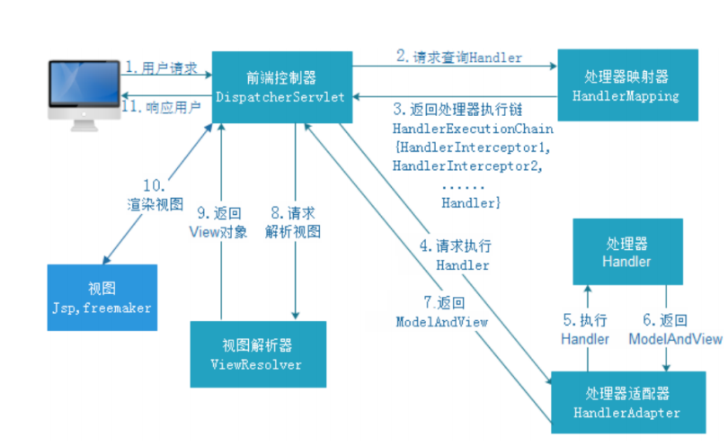

[toc]

## 一、SpringMVC简介

#### 1.三层架构

在JavaEE 开发中，分别有C/S架构和B/S 架构。在B/S 架构中，系统标准的三层架构包括：表现层、业务层、持久层。

- 表现层：即web 层，它负责接收客户端http请求，完成响应http。表现层的设计⼀般都使⽤MVC 模型
- 业务层：即service 层，它负责业务逻辑处理
- 持久层：即dao 层，负责数据持久化，包括数据层即数据库和数据访问层

#### 2.MVC模式

- Model（模型）：业务模型和数据模型，数据模型⽤于封装数据，业务模型⽤于处理业务。
- View（视图）： 通常指的就是我们的jsp 或者html。作⽤⼀般就是展示数据的。通常视图是依据模型数据创建的。
- Controller（控制器）： 应⽤程序中处理⽤户交互的部分。作⽤⼀般就是处理程序逻辑的。MVC提倡：每⼀层只编写⾃⼰的东⻄，不编写任何其他的代码。


#### 3.对比原生servlet

它通过⼀套注解，让⼀个简单的Java 类成为处理请求的控制器，⽽⽆须实现任何接⼝。同时它还⽀持RESTful 编程⻛格的请求。Spring MVC 本质可以认为是对servlet的封装，简化了我们serlvet的开发

1. 提供参数绑定，自动将HTPP请求的String类型入参转换为Hander方法形参类型
2. 通过@Controller、@RequestMapping可使某个方法成为一个Handler
3. SpringMVC中Servlet与Handler分离，且只有一个Servlet


## 二、SpringMVC工作流程



**使用SpringMVC框架开发过程**

1. 配置DispatcherServlet前端控制器
2. 开发处理具体业务逻辑的Handler（@Controller、@RequestMapping）
3. xml配置⽂件配置controller扫描，配置springmvc三⼤件
4. 将xml⽂件路径告诉springmvc（DispatcherServlet）

**流程说明**

1. ⽤户发送请求⾄前端控制器DispatcherServlet
2. DispatcherServlet收到请求调⽤HandlerMapping处理器映射器
3. 处理器映射器根据请求Url找到具体的Handler（后端控制器），⽣成处理器对象及处理器拦截器(如果 有则⽣成)⼀并返回DispatcherServlet
4. DispatcherServlet调⽤HandlerAdapter处理器适配器去调⽤Handler
5. 处理器适配器执⾏Handler
6. Handler执⾏完成给处理器适配器返回ModelAndView
7. 处理器适配器向前端控制器返回ModelAndView，ModelAndView 是SpringMVC 框架的⼀个底层对 象，包括Model 和View
8. 前端控制器请求视图解析器去进⾏视图解析，根据逻辑视图名来解析真正的视图。
9. 视图解析器向前端控制器返回View
10. 前端控制器进⾏视图渲染，就是将模型数据（在ModelAndView 对象中）填充到request 域
11. 前端控制器向⽤户响应结果

## 三、Spring MVC 九⼤组件

- **HandlerMapping（处理器映射器）**
  HandlerMapping 是⽤来查找Handler 的，也就是处理器，具体的表现形式可以是类，也可以是⽅法。⽐如，标注了@RequestMapping的每个⽅法都可以看成是⼀个Handler。Handler负责具体实际的请求处理，在请求到达后，HandlerMapping 的作⽤便是找到请求相应的处理器Handler 和Interceptor
- **HandlerAdapter（处理器适配器）**
  HandlerAdapter 是⼀个适配器。因为Spring MVC 中Handler 可以是任意形式的（可以试类，也可以使方法），把请求交给Servlet 的时候，由于Servlet 的⽅法结构都是doService(HttpServletRequest req,HttpServletResponse resp)形式的，要让固定的Servlet调⽤不同的Handler 来进⾏处理，便是HandlerAdapter 的职责。
- HandlerExceptionResolver
  HandlerExceptionResolver ⽤于处理Handler 产⽣的异常情况。实现HandlerExceptionResolver 接口可捕获异常并处理。它的作⽤是根据异常设置ModelAndView，之后交给渲染⽅法进⾏渲染，渲染⽅法会将ModelAndView 渲染成⻚⾯。也可使用@ExceptionHandler注解对应方法上捕获异常
- **ViewResolver**
  ViewResolver即视图解析器，⽤于将String类型的视图名和Locale解析为View类型的视图，只有⼀个resolveViewName()⽅法。从⽅法的定义可以看出，Controller层返回的String类型视图名viewName 最终会在这⾥被解析成为View。View是⽤来渲染⻚⾯的，也就是说，它会将程序返回的参数和数据填⼊模板中，⽣成html⽂件。ViewResolver 在这个过程主要完成两件事情：ViewResolver 找到渲染所⽤的模板（第⼀件⼤事）和所⽤的技术（第⼆件⼤事，其实也就是找到视图的类型，如JSP）并填⼊参数。默认情况下，Spring MVC会⾃动为我们配置⼀个InternalResourceViewResolver,是针对JSP 类型视图的。
- RequestToViewNameTranslator
  RequestToViewNameTranslator 组件的作⽤是从请求中获取ViewName.因为ViewResolver 根据ViewName 查找View，但有的Handler 处理完成之后,没有设置View，也没有设置ViewName，便要通过这个组件从请求中查找ViewName。
- LocaleResolver
  ViewResolver 组件的resolveViewName ⽅法需要两个参数，⼀个是视图名，⼀个是Locale。LocaleResolver ⽤于从请求中解析出Locale，⽐如中国Locale 是zh-CN，⽤来表示⼀个区域。这个组件也是i18n 的基础。
- ThemeResolver
  ThemeResolver 组件是⽤来解析主题的。
- MultipartResolver
  MultipartResolver ⽤于上传请求，通过将普通的请求包装成MultipartHttpServletRequest 来实现。MultipartHttpServletRequest 可以通过getFile() ⽅法 直接获得⽂件。
- FlashMapManager
  FlashMap ⽤于重定向时的参数传递，⽐如在处理⽤户订单时候，为了避免重复提交，可以处理完post请求之后重定向到⼀个get请求，这个get请求可以⽤来显示订单详情之类的信息。这样做虽然可以规避⽤户重新提交订单的问题，但是在这个⻚⾯上要显示订单的信息，这些数据从哪⾥来获得呢？因为重定向时么有传递参数这⼀功能的，如果不想把参数写进URL（不推荐），那么就可以通过FlashMap来传递。

## 四、对Restful ⻛格请求⽀持

#### 1.什么是RESTful

Restful 是⼀种web 软件架构⻛格，它不是标准也不是协议，它倡导的是⼀个资源定位及资源操作的⻛格。

#### 2.怎么样算RESTful风格的接口

restFul认为互联⽹中的所有东⻄都是资源

有⼀个唯⼀的uri标识它，http://localhost:8080/user/3 代表的是id为3的那个⽤户记录（资源）

然后定义操作类型：get（ 查询，获取资源），post（ 增加，新建资源)，put（ 更新），delete （删除资源）

/account/1 HTTP GET ：得到id = 1 的account
		/account/1 HTTP DELETE：删除id = 1 的account
		/account/1 HTTP PUT：更新id = 1 的account

#### 3.SpringMVC对Restful⻛格请求⽀持

Spring MVC ⽀持RESTful ⻛格请求，具体讲的就是使⽤@PathVariable 注解获取RESTful ⻛格的请求URL中的路径变量。

```java
@RequestMapping(value = "/handle/{id}/{name}",method =
{RequestMethod.PUT})
public ModelAndView handlePut(@PathVariable("id") Integer id,@PathVariable("name") String username) {
    ...
}
```


## 五、参数绑定

**参数绑定**：取出参数值绑定到handler⽅法的形参上

**默认⽀持Servlet API 作为⽅法参数**：HttpServletRequest\HttpServletResponse\HttpSession，直接在Handler⽅法形参中声明使⽤即可

**绑定简单数据类型参数**：直接声明形参即可，类型推荐使用包装类**防止NPE**（形参名需与入参名一致，也可使用**@RequestParam**注解进⾏手动映射）

**绑定POJO类型**：直接声明形参为**POJO**类型即可（形参名无所谓，但get请求入参名需与POJO属性名一致），若为**POST**请求**JSON**格式数据，可使用**@RequestBody**注解接收，并引入jackson相关jar

**SpringMVC默认使用的jackson来序列化对象，包括请求入参JSON->对象，响应对象->JSON都使用jackson来完成**

```xml
<!--json数据交互所需jar， start-->
<dependency>
    <groupId>com.fasterxml.jackson.core</groupId>
    <artifactId>jackson-core</artifactId>
    <version>2.9.0</version>
</dependency>
<dependency>
    <groupId>com.fasterxml.jackson.core</groupId>
    <artifactId>jackson-databind</artifactId>
    <version>2.9.0</version>
</dependency>
<dependency>
    <groupId>com.fasterxml.jackson.core</groupId>
    <artifactId>jackson-annotations</artifactId>
    <version>2.9.0</version>
</dependency>
<!--json数据交互所需jar， end-->
```


## 六、高级特性

### 1.拦截器(Inteceptor)使⽤

#### 1.1 监听器、过滤器和拦截器对⽐

- **过滤器（Filter）**：对Request请求起到过滤的作⽤，作⽤在Servlet之前，如果配置为/*可以对所有的资源访问（servlet、js/css静态资源等）进⾏过滤处理
- **监听器（Listener）**：实现了javax.servlet.ServletContextListener 接⼝的服务器端组件，它随Web应⽤的启动⽽启动，只初始化⼀次，然后会⼀直运⾏监视，随Web应⽤的停⽌⽽销毁
  - **作⽤⼀**：做⼀些初始化⼯作，web应⽤中spring容器启动ContextLoaderListener
  - **作⽤⼆**：监听web中的特定事件，⽐如HttpSession,ServletRequest的创建和销毁；变量的创建、销毁和修改等。可以在某些动作前后增加处理，实现监控，⽐如统计在线⼈数，利⽤HttpSessionLisener等。
- **拦截器（Interceptor）**：是SpringMVC、Struts等表现层框架⾃⼰的，不会拦截jsp/html/css/image的访问等，只会拦截访问的控制器⽅法（Handler）。

**监听器、过滤器和拦截器的作用范围**


#### 1.2 多个拦截器的执⾏流程

多个拦截器（假设有两个拦截器Interceptor1和Interceptor2，并且在配置⽂件中，Interceptor1拦截
器配置在前），在程序中的执⾏流程如下图所示：


从图可以看出，当有多个拦截器同时⼯作时，它们的preHandle()⽅法会按照配置⽂件中拦截器的配置
顺序执⾏，⽽它们的postHandle()⽅法和afterCompletion()⽅法则会按照配置顺序的反序执⾏。

#### 1.3 示例代码

```java
import org.springframework.web.servlet.HandlerInterceptor;
import org.springframework.web.servlet.ModelAndView;
import javax.servlet.http.HttpServletRequest;
import javax.servlet.http.HttpServletResponse;
/**
* ⾃定义springmvc拦截器
*/
public class MyIntercepter01 implements HandlerInterceptor{
    /**
    * 会在handler⽅法业务逻辑执⾏之前执⾏
    注册SpringMVC拦截器
    * 往往在这⾥完成权限校验⼯作
    * @param request
    * @param response
    * @param handler
    * @return 返回值boolean代表是否放⾏，true代表放⾏，false代表中⽌
    * @throws Exception
    */
    @Override
    public boolean preHandle(HttpServletRequest request, HttpServletResponse
        response, Object handler) throws Exception{
        System.out.println("MyIntercepter01 preHandle......");
        return true;
    }
    
    /**
    * 会在handler⽅法业务逻辑执⾏之后尚未跳转⻚⾯时执⾏
    * @param request
    * @param response
    * @param handler
    * @param modelAndView 封装了视图和数据，此时尚未跳转⻚⾯呢，你可以在这⾥针对返回的
    数据和视图信息进⾏修改
    * @throws Exception
    */
    @Override
    public void postHandle(HttpServletRequest request, HttpServletResponse
        response, Object handler, ModelAndView modelAndView) throws Exception{
        System.out.println("MyIntercepter01 postHandle......");
    }
    
    
    /**
    * ⻚⾯已经跳转渲染完毕之后执⾏
    * @param request
    * @param response
    * @param handler
    * @param ex 可以在这⾥捕获异常
    * @throws Exception
    */
    @Override
    public void afterCompletion(HttpServletRequest request,
        HttpServletResponse response, Object handler, Exception ex) throws Exception{
        System.out.println("MyIntercepter01 afterCompletion......");
    }
}
```

```xml
<mvc:interceptors>
    <mvc:interceptor>
        <!--配置当前拦截器的url拦截规则，**代表当前⽬录下及其⼦⽬录下的所有url-->
        <!--拦截所有handler-->
        <mvc:mapping path="/**"/>
        <!--exclude-mapping可以在mapping的基础上排除⼀些url拦截-->
        <!--<mvc:exclude-mapping path="/demo/**"/>-->
        <bean class="com.lagou.edu.interceptor.MyIntercepter01"/>
    </mvc:interceptor>
</mvc:interceptors>
```


### 2.处理multipart形式的数据

原⽣servlet处理上传的⽂件数据的，springmvc⼜是对serlvet的封装

**所需jar包**

```xml
<!--⽂件上传所需jar坐标-->
<dependency>
    <groupId>commons-fileupload</groupId>
    <artifactId>commons-fileupload</artifactId>
    <version>1.3.1</version>
</dependency>
```

**配置⽂件上传解析器**

```xml
<!--配置⽂件上传解析器，id是固定的multipartResolver-->
<bean id="multipartResolver"
    class="org.springframework.web.multipart.commons.CommonsMultipartResolver">
    <!--设置上传⼤⼩，单位字节-->
    <property name="maxUploadSize" value="1000000000"/>
</bean>
```

**后台接收Handler**

```java
@RequestMapping("upload")
public String upload(MultipartFile uploadFile, HttpServletRequest request)
throws IOException{
// ⽂件原名，如xxx.jpg
String originalFilename = uploadFile.getOriginalFilename();
    // 获取⽂件的扩展名,如jpg
    String extendName = originalFilename.substring(originalFilename.lastIndexOf(".") + 1,originalFilename.length());
    String uuid = UUID.randomUUID().toString();
    // 新的⽂件名字
    String newName = uuid + "." + extendName;
    String realPath =
    request.getSession().getServletContext().getRealPath("/uploads");
    // 解决⽂件夹存放⽂件数量限制，按⽇期存放
    String datePath = new SimpleDateFormat("yyyy-MM-dd").format(new Date());
    File floder = new File(realPath + "/" + datePath);
    if(!floder.exists()) {
    	floder.mkdirs();
    }
    uploadFile.transferTo(new File(floder,newName));
    return "success";
}
```


### 3.在控制器中处理异常

```java
import org.springframework.web.bind.annotation.ControllerAdvice;
import org.springframework.web.bind.annotation.ExceptionHandler;
import org.springframework.web.servlet.ModelAndView;
import javax.servlet.http.HttpServletResponse;
import java.io.IOException;

// 可以让我们优雅的捕获所有Controller对象handler⽅法抛出的异常
@ControllerAdvice
public class GlobalExceptionResolver{
    
    @ExceptionHandler(ArithmeticException.class)
    public ModelAndView handleException(ArithmeticException exception, HttpServletResponse response) {
        ModelAndView modelAndView = new ModelAndView();
        modelAndView.addObject("msg",exception.getMessage());
        modelAndView.setViewName("error");
        return modelAndView;
    }
}
```


### 4.基于Flash属性的跨重定向请求数据传递

#### 4.1 重定向区别于转发

**转发**：A 找B借钱400，B没有钱但是悄悄的找到C借了400块钱给A，**url不会变**，**参数也不会丢失**，**⼀个请求**

**重定向**：A 找B借钱400，B说我没有钱，你找别⼈借去，那么A⼜带着400块的借钱需求找到C，**url会变**，**参数会丢失需要重新携带参数**，两个请求

#### 4.2 重定向的问题

重定向时请求参数会丢失，我们往往需要重新携带请求参数，我们可以进⾏⼿动参数拼接如下：

```java
return "redirect:handle01?name=" + name;
```

但是上述拼接参数的⽅法属于get请求，携带参数⻓度有限制，参数安全性也不⾼，此时，我们可以使⽤SpringMVC提供的**flash属性机制**，向上下⽂中添加flash属性，框架会在session中记录该属性值，当跳转到⻚⾯之后框架会⾃动删除flash属性，不需要我们⼿动删除，通过这种⽅式进⾏重定向参数传递，参数⻓度和安全性都得到了保障，如下：

```java

/**
* SpringMVC 重定向时参数传递的问题
*/
@RequestMapping("/handleRedirect")
public String handleRedirect(String name,RedirectAttributes redirectAttributes) {
	//return "redirect:handle01?name=" + name; // 拼接参数安全性、参数⻓度都有局限
    // addFlashAttribute⽅法设置了⼀个flash类型属性，该属性会被暂存到session中，在跳转到⻚⾯之后该属性销毁
    redirectAttributes.addFlashAttribute("name",name);
    return "redirect:handle01";
}
```

## 七、乱码问题解决

#### 1.Post请求乱码， web.xml中加⼊过滤器  

```xml
<!-- 解决post乱码问题 -->
<filter>
    <filter-name>encoding</filter-name>
    <filter-class>org.springframework.web.filter.CharacterEncodingFilter</filter-class>
    <!-- 设置编码参是UTF8 -->
    <init-param>
        <param-name>encoding</param-name>
        <param-value>UTF-8</param-value>
    </init-param>
    <init-param>
        <param-name>forceEncoding</param-name>
    	<param-value>true</param-value>
    </init-param>
</filter>
<filter-mapping>
    <filter-name>encoding</filter-name>
    <url-pattern>/*</url-pattern>
</filter-mapping>
```

#### 2.Get请求乱码（Get请求乱码需要修改tomcat下server.xml的配置）  

```xml
<Connector URIEncoding="utf-8" connectionTimeout="20000" port="8080" protocol="HTTP/1.1" redirectPort="8443"/>
```

## 八、启动配置

**配置web.xml启动SpringMVC的DispatchServlet**

```xml
<!--springmvc启动-->
<servlet>
    <servlet-name>springmvc</servlet-name>
    <servletclass>org.springframework.web.servlet.DispatcherServlet</servletclass>
    <init-param>
        <param-name>contextConfigLocation</param-name>
        <param-value>classpath*:springmvc.xml</param-value>
    </init-param>
    <load-on-startup>1</load-on-startup>
</servlet>
<servlet-mapping>
    <servlet-name>springmvc</servlet-name>
    <url-pattern>/</url-pattern>
</servlet-mapping>
```

