[toc]

# 一、SpringMVC初始化流程

### 1.SpringMVC容器关系图

**SpringMVC容器和Spring容器的关系是子父容器，MVC初始化Conteroller bean，Spring初始化Service和Dao bean**

### 2.SpringMVC容器启动时机

**tomcat启动后第一次请求Servlet时，执行DispatcherServlet的init初始化方法加载springmvc.xml去初始化springmvc容器**

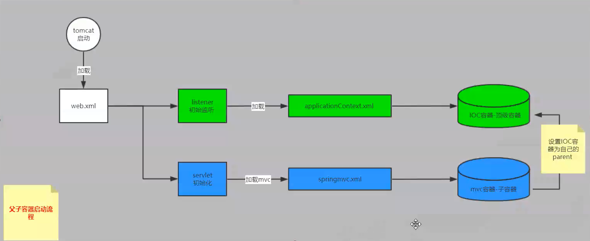

### 3. DispatchServlet随web容器启动执行父类HttpServletBean初始化方法init

**执行父类方法 ——> org.springframework.web.servlet.HttpServletBean#init**

**从ServletContext上下文中获取SpringMVC配置文件路径**

### 4.调用FrameworkServlet的方法initServletBean做具体初始化

**执行父类方法 ——> org.springframework.web.servlet.FrameworkServlet#initServletBean**

**初始化SpringMVC容器WebApplicatiopnContext**

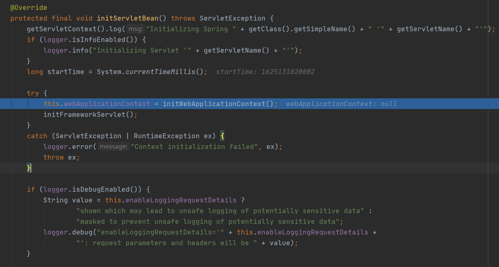

### 5.初始化SpringMVC容器WebApplicatiopnContext

**调用MVC容器初始化org.springframework.web.servlet.FrameworkServlet#initWebApplicationContext**

##### 5.1 WebApplicationContext rootContext = WebApplicationContextUtils.getWebApplicationContext(getServletContext())

从ServletContext上下文获取SpringIoC容器 

由Servlet监听器启动Spring，并将SpringIoC容器存入ServletContext上下文

##### 5.2 若wac不为空(这种情况一般是容器刷新时)，则将SpringIoC容器作为父类传入,并调用configureAndRefreshWebApplicationContext进行容器配置及刷新

##### 5.3 若wac为空(刚启动服务时都为空)，则调用**createWebApplicationContext**创建默认的SpringMVC容器，并将SpringIoC容器作为父类传入

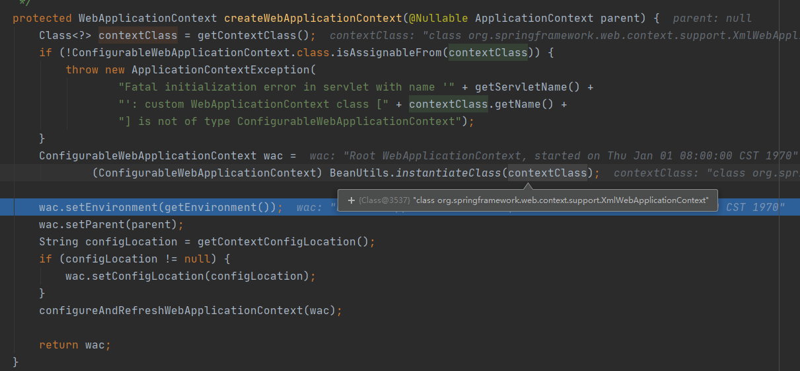

##### 5.4 调用configureAndRefreshWebApplicationContext进行容器配置及刷新

**初始化了SpringMVC容器的一些数据并调用org.springframework.context.support.AbstractApplicationContext#refresh，进入Spring容器启动的流程([详情查看SpringIoC源码解析](../Spring/SpringIoC/源码解析.md) )**

##### 5.5 AbstractApplicationContext#refresh容器刷新，最后一个阶段finishRefresh去发布通知，MVC加载组件

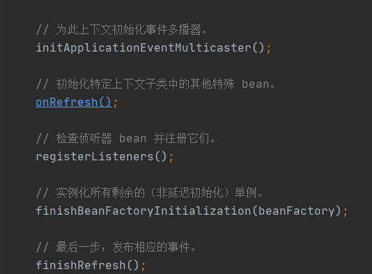

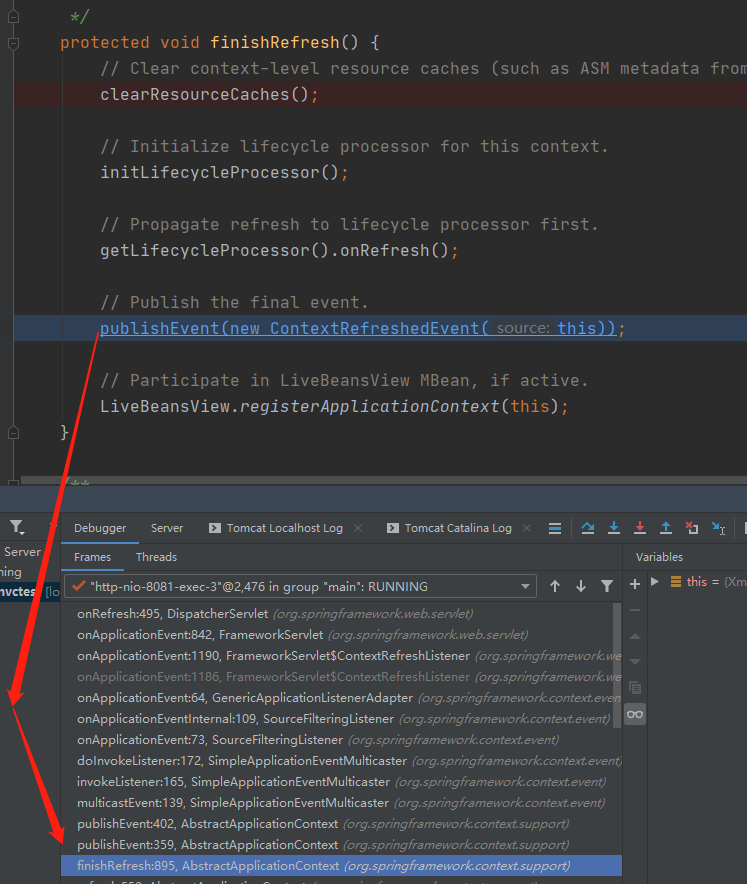

##### 6.5 加载SpringMVC九大组件

**1. org.springframework.web.servlet.DispatcherServlet#onRefresh**

**2. DispatcherServlet重写了父类FrameworkServlet的onRefresh方法**

**3. 进行了SpringMVC九大组件的初始化工作**

# 二、SpringMVC工作原理

### 1.DispatcherServlet接受前端请求执行父类FrameworkServlet的doPost/doGet

**执行父类方法 ——> org.springframework.web.servlet.FrameworkServlet#doGet**

**执行父类方法 ——> org.springframework.web.servlet.FrameworkServlet#doPost**

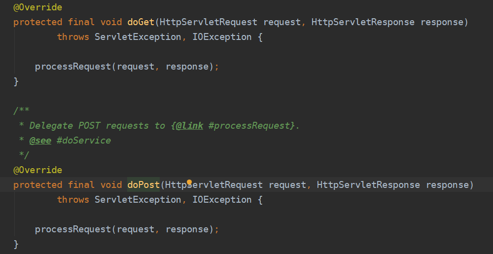

### 2.执行org.springframework.web.servlet.FrameworkServlet#processRequest

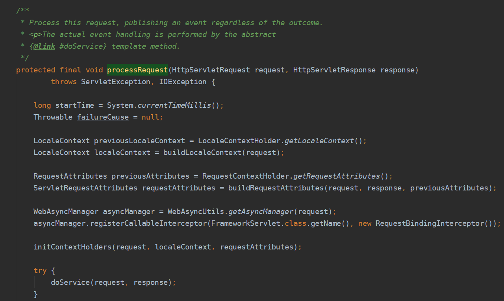

### 3.执行org.springframework.web.servlet.DispatcherServlet#doService

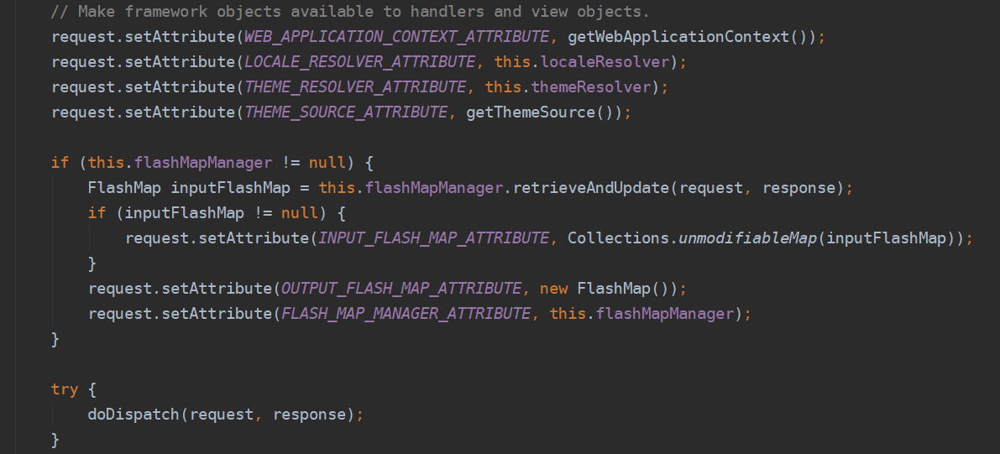

### 4.执行org.springframework.web.servlet.DispatcherServlet#doDispatch

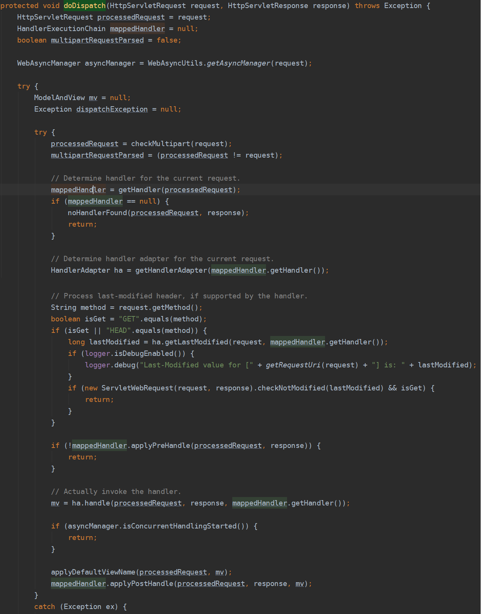

##### 4.1调用getHandler，根据对应handlerMapping获取handler以及对应的执行链（如拦截器）

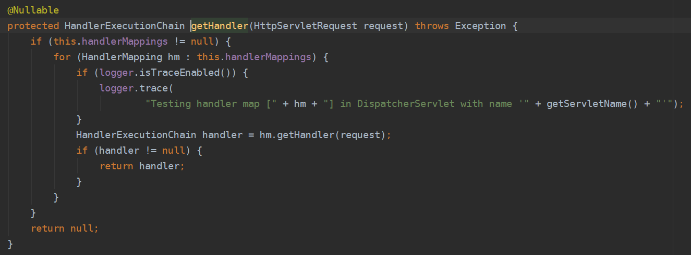

##### 4.2调用getHandlerAdapter，根据supports是否适配，获取对应的handler适配器

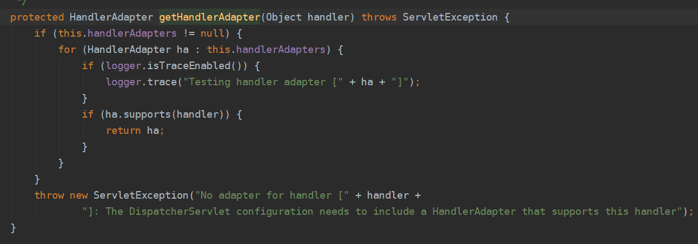

##### 4.3执行拦截器pre方法

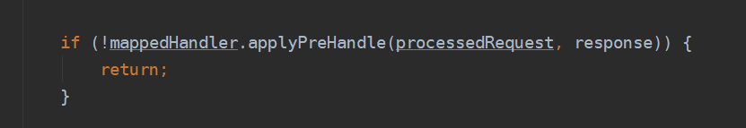

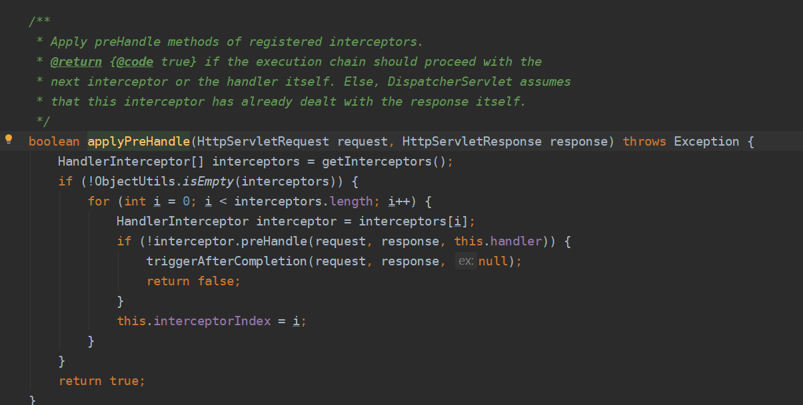

##### 4.4调用org.springframework.web.servlet.mvc.HttpRequestHandlerAdapter#handle执行handler方法

由适配器适配对应的handlerMethod

将Request中的参数最终转换为handler的参数形式，最后通过反射调用handler的方法（method.invoke(args...)）

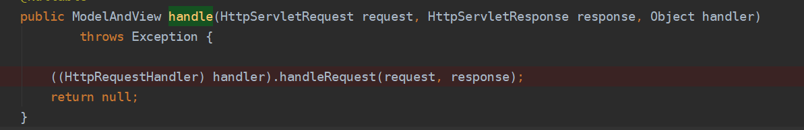

##### 4.5调用applyDefaultViewName设置视图名

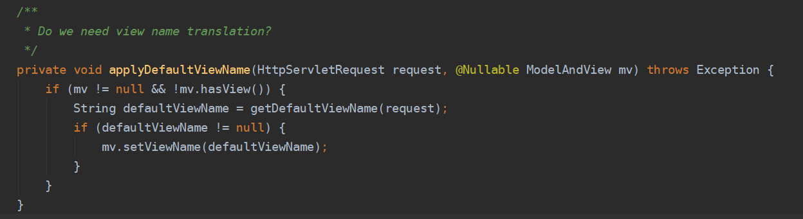

##### 4.6调用拦截器post方法

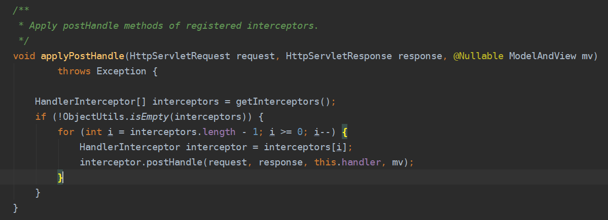

##### 4.7调用org.springframework.web.servlet.DispatcherServlet#processDispatchResult封装返回结果（视图解析及拦截器after）

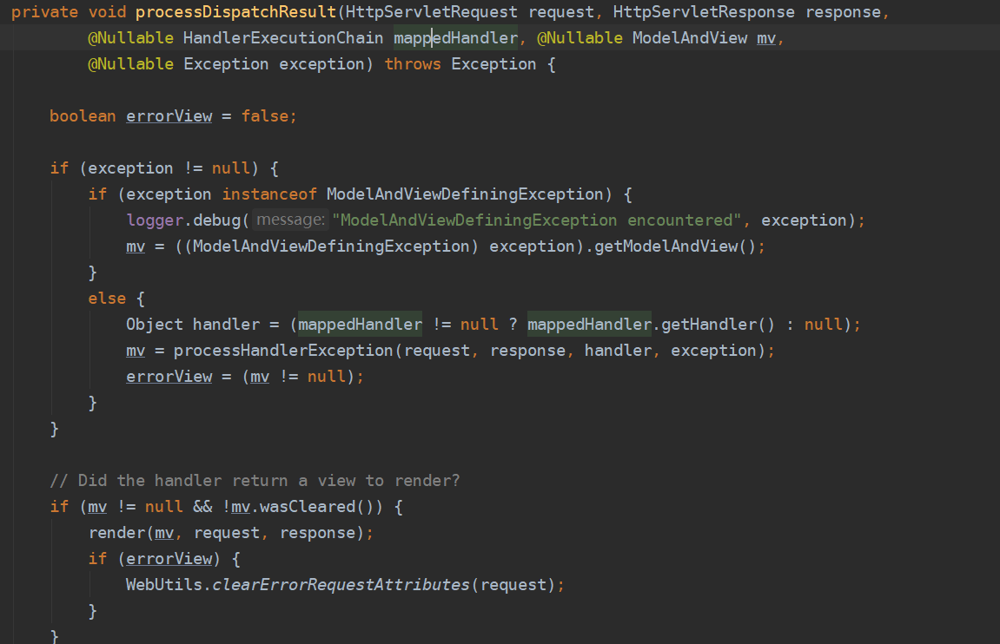

**4.7.1 调用org.springframework.web.servlet.DispatcherServlet#render解析视图已经渲染视图**

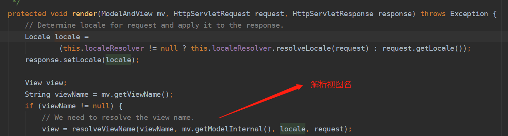

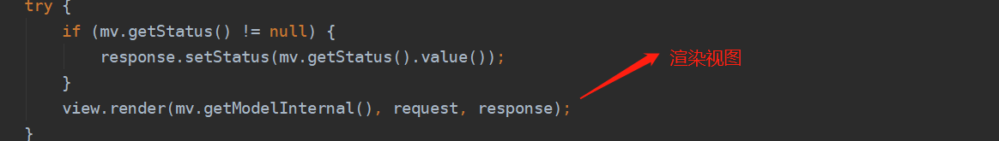

**4.7.2 调用拦截器afterCompletion**

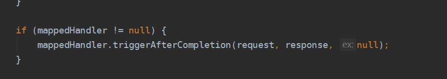

# 三、RequestBody和ResponseBode注解

通过请求URL从mappingHandler中获得对应的Handler对象

通过Handler对象获得MethodParmeter(封装了该Handler的参数信息)

遍历所有MethodParmeterResoler参数解析器，根据MethodParmeter的信息以及否含@RequestBody注解，获取处理@RequestBody注解的参数解析器

参数解析器解析入参，从HttpServletRequest获得字符读取流，通过Jackson转换成对象（MethodParmeter中有参数的类型），最终在执行handler方法时，将得到的对象作为参数传递到invoke方法中

**注意：**Handler的参数顺序，由Handler的属性ParamIndexMapping来维护

## 参数绑定的完整流程：

从**HttpServletRequest**获得**BufferedReader**和**parameterMap**，遍历**Handler**的**MethodParameter(封装了handler的参数信息及顺序)**，按顺序获得MethodParmeter相应参数的值。

若带**@RequestBody**注解，则读取字符输入流，解析并通过Jackson将JSON转换成相应参数类型的对象

若带**@RequestParam**注解，则根据注解的值作为KEY获取parameterMap中对应的值

按照MethodParameter参数的坐标顺序，分别将得到的对象或者基础类型数据，封装到一个数组，传递给invoke执行Handler
