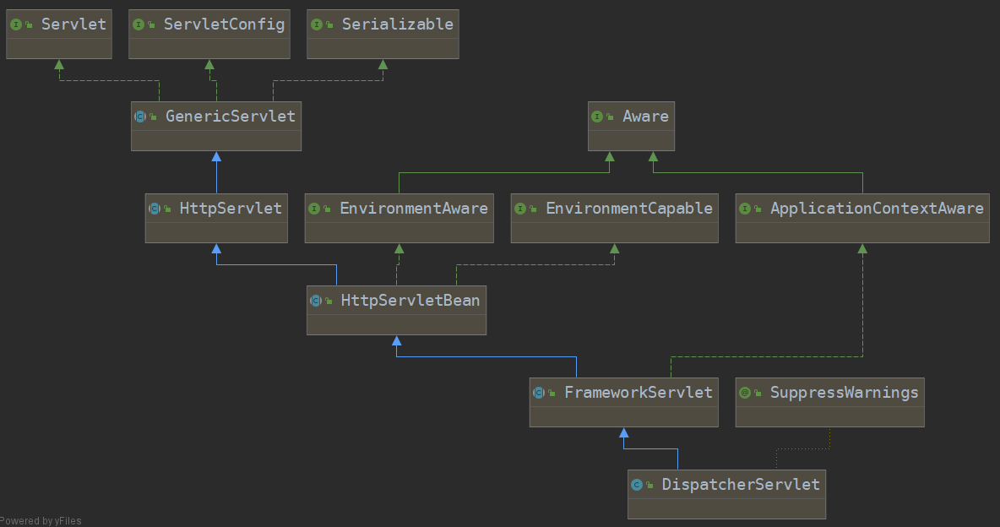
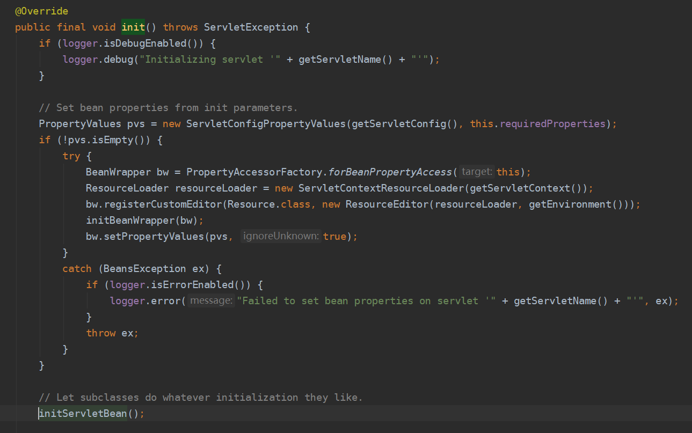
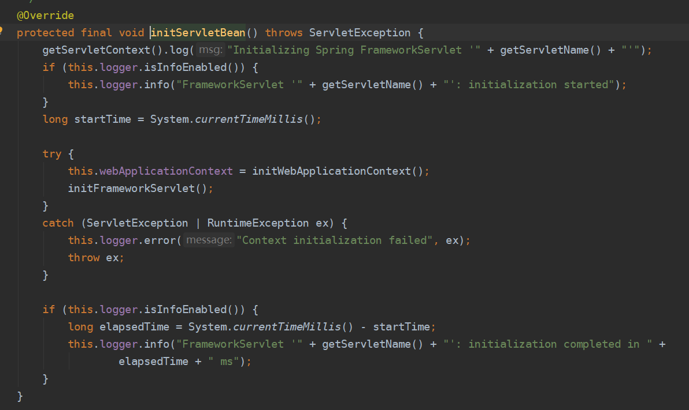
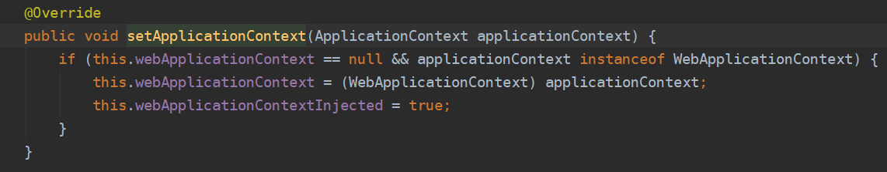
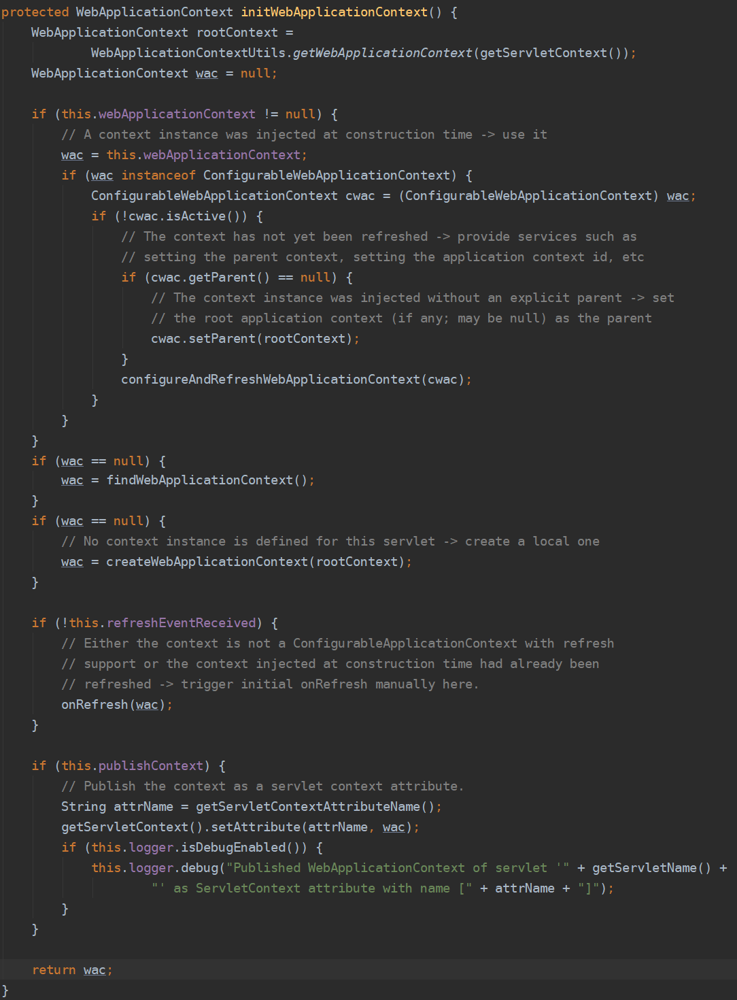
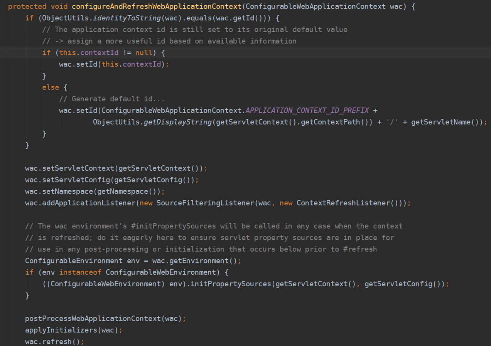
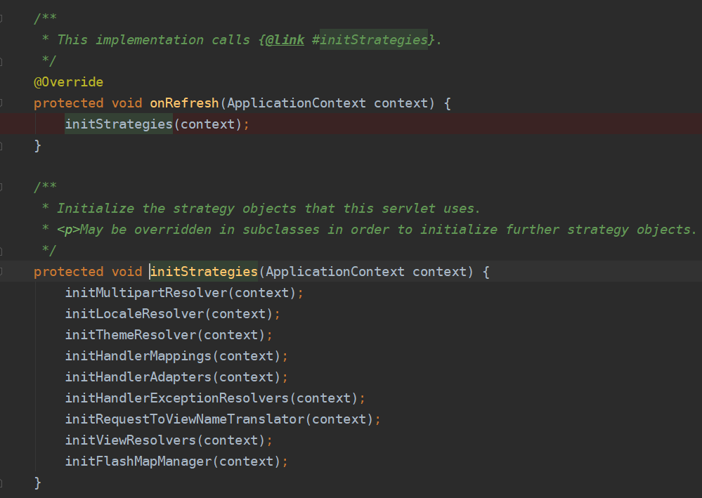

[toc]

# 一、SpringMVC初始化流程

### 1.SpringMVC容器关系图

**SpringMVC容器和Spring容器的关系是子父容器，MVC初始化Conteroller bean，Spring初始化Service和Dao bean**

### 2. DispatchServlet随web容器启动执行初始化方法init

**执行父类方法 ——> org.springframework.web.servlet.HttpServletBean#init**

**从ServletContext上下文中获取SpringMVC配置文件路径**

### 3.调用FrameworkServlet的方法initServletBean做具体初始化

**执行父类方法 ——> org.springframework.web.servlet.FrameworkServlet#initServletBean**

**初始化SpringMVC容器WebApplicatiopnContext**

### 4.FrameworkServlet实现ApplicationContextAware获取ApplicationContext实例

**若已经存在**

**org.springframework.web.servlet.FrameworkServlet#setApplicationContext**

### 5.初始化SpringMVC容器WebApplicatiopnContext

**调用MVC容器初始化org.springframework.web.servlet.FrameworkServlet#initWebApplicationContext**

##### 5.1 WebApplicationContext rootContext = WebApplicationContextUtils.getWebApplicationContext(getServletContext())

从ServletContext上下文获取SpringIoC容器 

由Servlet监听器启动Spring，并将SpringIoC容器存入ServletContext上下文

##### 5.2 cwac.setParent(rootContext);方法将Spring容器作为SpringMVC容器的父容器

##### 5.3 若wac为空，则调用createWebApplicationContext创建默认的SpringMVC容器，并将SpringIoC容器作为父类传入

##### 5.4 调用configureAndRefreshWebApplicationContext进行容器配置及刷新

**初始化了SpringMVC容器的一些数据并调用org.springframework.context.support.AbstractApplicationContext#refresh，进入Spring容器启动的流程([详情查看SpringIoC源码解析](../Spring/SpringIoC/源码解析.md) )**

##### 5.5 加载SpringMVC九大组件

**1. org.springframework.web.servlet.DispatcherServlet#onRefresh**

**2. DispatcherServlet重写了父类FrameworkServlet的onRefresh方法**

**3. 进行了SpringMVC九大组件的初始化工作**

