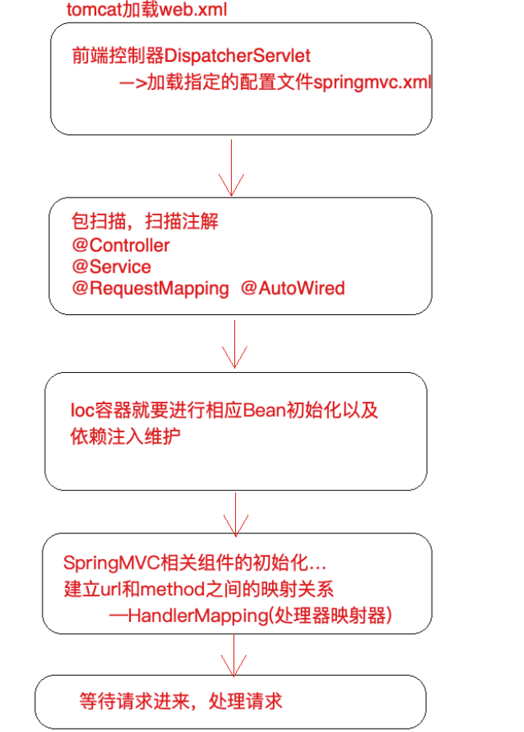

[toc]




### 一、配置POM

```xml
<?xml version="1.0" encoding="UTF-8"?>

<project xmlns="http://maven.apache.org/POM/4.0.0" xmlns:xsi="http://www.w3.org/2001/XMLSchema-instance"
  xsi:schemaLocation="http://maven.apache.org/POM/4.0.0 http://maven.apache.org/xsd/maven-4.0.0.xsd">
  <modelVersion>4.0.0</modelVersion>

  <groupId>com.tangdi</groupId>
  <artifactId>wheel-imvc</artifactId>
  <version>1.0-SNAPSHOT</version>
  <packaging>war</packaging>

  <name>wheel-imvc Maven Webapp</name>
  <!-- FIXME change it to the project's website -->
  <url>http://www.example.com</url>

  <properties>
    <project.build.sourceEncoding>UTF-8</project.build.sourceEncoding>
    <maven.compiler.source>1.8</maven.compiler.source>
    <maven.compiler.target>1.8</maven.compiler.target>
  </properties>

  <dependencies>
    <dependency>
      <groupId>junit</groupId>
      <artifactId>junit</artifactId>
      <version>4.11</version>
      <scope>test</scope>
    </dependency>

    <!--设置作用于已提供范围，解决与tomcat的jar冲突-->
    <dependency>
      <groupId>javax.servlet</groupId>
      <artifactId>javax.servlet-api</artifactId>
      <version>3.1.0</version>
      <scope>provided</scope>
    </dependency>

    <dependency>
      <groupId>org.apache.commons</groupId>
      <artifactId>commons-lang3</artifactId>
      <version>3.9</version>
    </dependency>
  </dependencies>

  <build>


    <plugins>

      <!--编译插件定义编译细节-->
      <plugin>
        <groupId>org.apache.maven.plugins</groupId>
        <artifactId>maven-compiler-plugin</artifactId>
        <version>3.1</version>
        <configuration>
          <source>1.8</source>
          <target>1.8</target>
          <encoding>utf-8</encoding>
          <!--告诉编译器，编译的时候记录下形参的真实名称-->
          <compilerArgs>
            <arg>-parameters</arg>
          </compilerArgs>
        </configuration>
      </plugin>


      <plugin>
        <groupId>org.apache.tomcat.maven</groupId>
        <artifactId>tomcat7-maven-plugin</artifactId>
        <version>2.2</version>
        <configuration>
          <port>8080</port>
          <path>/</path>
        </configuration>
      </plugin>
    </plugins>
  </build>
</project>
```


### 二、创建前端控制器

```java
package com.tangdi.mvcframework.servlet;

import com.tangdi.mvcframework.component.ConfigLoader;
import com.tangdi.mvcframework.component.HandlerMapping;
import com.tangdi.mvcframework.context.WebApplicationContext;
import com.tangdi.mvcframework.interceptor.IhandlerInterceptor;
import com.tangdi.mvcframework.pojo.Handler;
import org.apache.commons.lang3.StringUtils;

import javax.servlet.ServletConfig;
import javax.servlet.ServletException;
import javax.servlet.http.HttpServlet;
import javax.servlet.http.HttpServletRequest;
import javax.servlet.http.HttpServletResponse;
import java.io.IOException;
import java.util.*;
import java.util.regex.Matcher;

/**
 * @program: wheel-imvc
 * @description:
 * @author: Wangwt
 * @create: 09:46 2021/6/28
 */
public class IdispatcherServlet extends HttpServlet {

    private static final String loadConfigLocation = "loadConfigLocation";
    public WebApplicationContext wac;
    public HandlerMapping handlerMapping;

    @Override
    public void init(ServletConfig config) {
        // 加载配置文件
        String contextConfigLocation = config.getInitParameter(loadConfigLocation);
        ConfigLoader configLoader = new ConfigLoader();
        Properties properties = configLoader.doLoadConfig(contextConfigLocation);

        // 初始化ioc容器
        wac = new WebApplicationContext(properties.getProperty("scanPackage"));


        // 5 构造一个HandlerMapping处理器映射器，将配置好的url和Method建立映射关系
        try {
            handlerMapping = new HandlerMapping(wac,properties);
        } catch (Exception e) {
            e.printStackTrace();
        }

        System.out.println("imvc 初始化完成....");
    }


    @Override
    protected void doGet(HttpServletRequest req, HttpServletResponse resp) throws ServletException, IOException {
        doPost(req,resp);
    }


    @Override
    protected void doPost(HttpServletRequest req, HttpServletResponse resp) throws ServletException, IOException {
        req.setCharacterEncoding("UTF-8");
        resp.setCharacterEncoding("UTF-8");
        resp.setContentType("application/json;charset=UTF-8");

        // 根据uri获取到能够处理当前请求的hanlder（从handlermapping中（list））
        Handler handler = getHandler(req);

        if(handler == null) {
            resp.getWriter().write("404 not found");
            return;
        }

        // 参数绑定
        // 获取所有参数类型数组，这个数组的长度就是我们最后要传入的args数组的长度
        Class<?>[] parameterTypes = handler.getMethod().getParameterTypes();


        // 根据上述数组长度创建一个新的数组（参数数组，是要传入反射调用的）
        Object[] paraValues = new Object[parameterTypes.length];

        // 以下就是为了向参数数组中塞值，而且还得保证参数的顺序和方法中形参顺序一致

        Map<String, String[]> parameterMap = req.getParameterMap();

        // 遍历request中所有参数  （填充除了request，response之外的参数）
        for(Map.Entry<String,String[]> param: parameterMap.entrySet()) {
            // name=1&name=2   name [1,2]
            String value = StringUtils.join(param.getValue(), ",");  // 如同 1,2

            // 如果参数和方法中的参数匹配上了，填充数据
            if(!handler.getParamIndexMapping().containsKey(param.getKey())) {continue;}

            // 方法形参确实有该参数，找到它的索引位置，对应的把参数值放入paraValues
            Integer index = handler.getParamIndexMapping().get(param.getKey());//name在第 2 个位置

            paraValues[index] = value;  // 把前台传递过来的参数值填充到对应的位置去

        }


        int requestIndex = handler.getParamIndexMapping().get(HttpServletRequest.class.getSimpleName()); // 0
        paraValues[requestIndex] = req;


        int responseIndex = handler.getParamIndexMapping().get(HttpServletResponse.class.getSimpleName()); // 1
        paraValues[responseIndex] = resp;


        // 最终调用handler的method属性
        try {
            // 调用handler前，执行拦截器preProcess
            boolean preProcess = preProcess(req, resp, handler);

            // 若被拦截则
            if (!preProcess){
                return;
            }

            Object invoke = handler.getMethod().invoke(handler.getController(), paraValues);
            resp.getWriter().write(String.valueOf(invoke));
        } catch (IllegalAccessException e) {
            e.printStackTrace();
        } catch (Exception e) {
            e.printStackTrace();
        }
    }

    private boolean preProcess(HttpServletRequest req, HttpServletResponse resp, Handler handler) throws Exception {
        boolean flag = true;

        List<IhandlerInterceptor> interceptors = handler.getInterceptors();
        for (IhandlerInterceptor i : interceptors) {
            if (!i.preHandle(req,resp,handler)){
                flag = false;
                break;
            }
        }
        return flag;
    }

    private Handler getHandler(HttpServletRequest req) {
        if(handlerMapping.handlerMapping.isEmpty()){return null;}

        String url = req.getRequestURI();

        for(Handler handler: handlerMapping.handlerMapping) {
            Matcher matcher = handler.getPattern().matcher(url);
            if(!matcher.matches()){continue;}
            return handler;
        }

        return null;

    }


}

```

### 三、创建注解

##### 1.ComponentScan

```java
package com.tangdi.mvcframework.annotation;

import java.lang.annotation.*;

/**
 * @program: lagou-transfer
 * @description:
 * @author: Wangwentao
 * @create: 2021-06-17 11:38
 **/
@Target({ElementType.TYPE})
@Retention(RetentionPolicy.RUNTIME)
@Documented
public @interface ComponentScan {

    String[] value() default "";
}
```

##### 2.IAutowired

```java
package com.tangdi.mvcframework.annotation;

import java.lang.annotation.*;

/**
 * @program: wheel-imvc
 * @description:
 * @author: Wangwt
 * @create: 10:06 2021/6/28
 */
@Documented
@Target(ElementType.FIELD)
@Retention(RetentionPolicy.RUNTIME)
public @interface IAutowired {

    String value() default "";
}
```

##### 3.IComponent

```java
package com.tangdi.mvcframework.annotation;

import java.lang.annotation.*;

/**
 * @program: lagou-transfer
 * @description:
 * @author: Wangwentao
 * @create: 2021-06-17 11:34
 **/
@Target({ElementType.TYPE})
@Retention(RetentionPolicy.RUNTIME)
@Documented
public @interface IComponent {


    String value() default "";

}
```

##### 4.IController

```java
package com.tangdi.mvcframework.annotation;

import java.lang.annotation.*;

/**
 * @program: wheel-imvc
 * @description:
 * @author: Wangwt
 * @create: 10:04 2021/6/28
 */
@Documented
@Target(ElementType.TYPE)
@Retention(RetentionPolicy.RUNTIME)
public @interface IController {
    String value() default "";
}
```

##### 5.IRepository

```java
package com.tangdi.mvcframework.annotation;

import java.lang.annotation.*;

/**
 * @program: lagou-transfer
 * @description:
 * @author: Wangwentao
 * @create: 2021-06-17 11:33
 **/
@Target({ElementType.TYPE})
@Retention(RetentionPolicy.RUNTIME)
@Documented
public @interface IRepository {


    String value() default "";

}
```

##### 6.IRequestMapping

```java
package com.tangdi.mvcframework.annotation;

import java.lang.annotation.*;

/**
 * @program: wheel-imvc
 * @description:
 * @author: Wangwt
 * @create: 10:05 2021/6/28
 */
@Documented
@Target({ElementType.METHOD,ElementType.TYPE})
@Retention(RetentionPolicy.RUNTIME)
public @interface IRequestMapping {

    String value() default "";
}
```

##### 7.ISecurity

```java
package com.tangdi.mvcframework.annotation;

import java.lang.annotation.*;

/**
 * @program: wheel-imvc
 * @description:
 * @author: Wangwt
 * @create: 10:06 2021/6/28
 */
@Documented
@Target({ElementType.METHOD,ElementType.TYPE})
@Retention(RetentionPolicy.RUNTIME)
public @interface ISecurity {
    String value() default "";
}
```

##### 8.IService

```java
package com.tangdi.mvcframework.annotation;

import java.lang.annotation.*;

/**
 * @program: wheel-imvc
 * @description:
 * @author: Wangwt
 * @create: 10:04 2021/6/28
 */
@Documented
@Target(ElementType.TYPE)
@Retention(RetentionPolicy.RUNTIME)
public @interface IService {
    String value() default "";
}
```

### 四、创建资源加载组件

```java
package com.tangdi.mvcframework.component;

import java.io.IOException;
import java.io.InputStream;
import java.util.Properties;

/**
 * @program: wheel-imvc
 * @description:
 * @author: Wangwt
 * @create: 10:31 2021/6/28
 */
public class ConfigLoader {

    private Properties properties = new Properties();

    // 加载配置文件
    public Properties doLoadConfig(String loadConfigLocation) {

        InputStream resourceAsStream = Thread.currentThread().getContextClassLoader().getResourceAsStream(loadConfigLocation);

        try {
            properties.load(resourceAsStream);
        } catch (IOException e) {
            e.printStackTrace();
        }
        return properties;
    }
}
```


### 五、创建IoC容器

这里直接复用了前面自定义IoC容器的代码，由于时间比较紧，暂时没做子父容器的关系逻辑。

**整理思路：后期自定义MVC与自定义IoC整合时，编写MVC自己的容器，然后从ServletContext上下文中获取IoC容器，将其作为父类容器传入MVC容器中**

```java
package com.tangdi.mvcframework.context;

import com.tangdi.mvcframework.annotation.*;
import com.tangdi.mvcframework.component.ResourcesScanner;
import org.apache.commons.lang3.StringUtils;

import java.io.IOException;
import java.lang.reflect.Field;
import java.util.*;

/**
 * @program: wheel-imvc
 * @description:
 * @author: Wangwt
 * @create: 10:47 2021/6/28
 */
public class WebApplicationContext {

    /**
     * 缓存扫描到的类的全限定类名
     */
    protected List<String> classNames = new ArrayList<>();

    /**
     * 单例池
     */
    public final Map<String,Object> singletonObjects = new HashMap<>();
    /**
     * 二级缓存
     */
    protected final Map<String,Object> singletonFactories = new HashMap<>();
    protected final Map<String,Class<?>> beanNames = new HashMap<>();


    public WebApplicationContext(String resourcePath) {
        // 2 扫描相关的类，扫描注解
        try {
            loadConfig(resourcePath);

            for (String beanName : beanNames.keySet()) {
                // 通过getbean加载所有bean
                getBean(beanName);
            }
        } catch (Exception e) {
            e.printStackTrace();
        }


    }

    protected void loadConfig(Class<?> clazz) throws IOException, ClassNotFoundException {

        // 扫描ComponentScan注解配置路径下所有class文件
        boolean annotationPresent = clazz.isAnnotationPresent(ComponentScan.class);
        if (annotationPresent){
            ComponentScan annotation = clazz.getAnnotation(ComponentScan.class);
            String[] pathArray = annotation.value();
            for (String path : pathArray) {
                ResourcesScanner.doScanforClass(classNames,path);
            }
        }
        for (String className : classNames ) {
            // 通过反射技术实例化对象
            Class<?> aClass = Class.forName(className);
            String beanName = getBeanName(aClass);


            if (!StringUtils.isEmpty(beanName)){
                beanNames.put(beanName,aClass);
            }
        }
    }

    protected void loadConfig(String resourcePath) throws IOException, ClassNotFoundException {
        ResourcesScanner.doScanforClass(classNames,resourcePath);

        for (String className : classNames ) {
            // 通过反射技术实例化对象
            Class<?> aClass = Class.forName(className);
            String beanName = getBeanName(aClass);


            if (!StringUtils.isEmpty(beanName)){
                beanNames.put(beanName,aClass);
            }
        }
    }

    protected String getBeanName(Class<?> aClass) {
        // 根据@Component、@Service、@Repository定义是否为bean
        String beanName = null;
        boolean annotationComponent = aClass.isAnnotationPresent(IComponent.class);
        boolean annotationController = aClass.isAnnotationPresent(IController.class);
        boolean annotationService = aClass.isAnnotationPresent(IService.class);
        boolean annotationRepository = aClass.isAnnotationPresent(IRepository.class);
        if (annotationComponent){
            IComponent component = aClass.getAnnotation(IComponent.class);
            beanName = convertClassName(aClass, component.value());
        } else if (annotationService){
            IService service = aClass.getAnnotation(IService.class);
            beanName = convertClassName(aClass, service.value());
        } else if (annotationRepository){
            IRepository repository = aClass.getAnnotation(IRepository.class);
            beanName = convertClassName(aClass, repository.value());
        } else if (annotationController){
            IController controller = aClass.getAnnotation(IController.class);
            beanName = convertClassName(aClass, controller.value());
        }
        return beanName;
    }

    public Object getBean(String beanName) {
        try {
            // 从缓存池中取bean
            Object singleton = getSingleton(beanName);
            if (singleton != null){
                return singleton;
            }

            // 根据构造函数实例化对象
            Class<?> aClass = beanNames.get(beanName);
            Object o = aClass.newInstance();

            // 存储到二级缓存
            addSingletonFactories(beanName,o);

            // 装配引用属性
            Field[] fields = aClass.getDeclaredFields();
            for (Field field : fields) {
                String fieldBeanName;
                boolean annotationAutowired = field.isAnnotationPresent(IAutowired.class);
                if (annotationAutowired){
                    field.setAccessible(true);
                    Class<?> fieldDeclaringClass = field.getType();

                    // 属性类型为接口
                    if (fieldDeclaringClass.isInterface()){
                        // 匹配对应接口的实现类
                        fieldBeanName = searchInstance(fieldDeclaringClass);
                    }
                    // 属性类型为实现类
                    else {
                        fieldBeanName = getBeanName(fieldDeclaringClass);
                    }

                    Object bean = getBean(fieldBeanName);

                    field.set(o,bean);
                }
            }

            // 存入单例池
            addSingletonObjects(beanName,o);

            return o;
        } catch (Exception e) {
            e.printStackTrace();
        }
        return null;
    }

    protected void addSingletonObjects(String beanName,Object o){
        singletonObjects.put(beanName,o);
        singletonFactories.remove(beanName);
    }

    protected void addSingletonFactories(String beanName,Object o){
        if (!singletonObjects.containsKey(beanName)){
            singletonFactories.put(beanName,o);
        }
    }

    protected Object getSingleton(String beanName){
        Object o = singletonObjects.get(beanName);
        if (o == null){
            o = singletonFactories.get(beanName);
        }
        return o;
    }

    protected String convertClassName(Class<?> aClass, String value) {
        if (StringUtils.isEmpty(value)) {
            String name = aClass.getSimpleName();
            value = name.substring(0, 1).toLowerCase() + name.substring(1);
        }
        return value;
    }

    protected String searchInstance(Class<?> fieldDeclaringClass) {
        Set<String> keys = beanNames.keySet();
        for (String beanName : keys) {
            Class<?> instance = beanNames.get(beanName);
            if (!instance.isInterface()){
                Class<?>[] interfaces = instance.getInterfaces();
                for (Class<?> i : interfaces) {
                    if (i.getName().equalsIgnoreCase(fieldDeclaringClass.getName())){
                        return beanName;
                    }
                }
            }

        }
        return null;
    }
}
```


### 六、创建扫描组件

```java
package com.tangdi.mvcframework.component;

import java.io.File;
import java.io.IOException;
import java.io.InputStream;
import java.net.URL;
import java.net.URLDecoder;
import java.util.Collections;
import java.util.HashMap;
import java.util.List;
import java.util.Map;
import java.util.regex.Pattern;

/**
 * @program: lagou-transfer
 * @description: 扫描Class包
 * @author: Wangwentao
 * @create: 2021-06-17 11:09
 **/
public class ResourcesScanner {

    public static final String CLASS_SUFFIX = ".class";
    private static final Pattern INNER_PATTERN = Pattern.compile("\\$(\\d+).", Pattern.CASE_INSENSITIVE);

    private static void scan(String name,List<String> list) {
        try {
            String path = name.replace('.', '/');
            if (path.startsWith("/")){
                path = path.substring(path.indexOf("/"));
            }
            ArrayList<URL> urls = Collections.list(Thread.currentThread().getContextClassLoader().getResources(path));
            for (URL url : urls){
                if ("file".equalsIgnoreCase(url.getProtocol())) {
                    File file = new File(URLDecoder.decode(url.getPath(),"UTF-8"));
                    // File file2 = new File(url.toURI());
                    File[] files = file.listFiles();
                    for (File f : files){
                        if (f.isDirectory()){
                            scan(name + "." + f.getName(),list);
                        } else if (f.getName().endsWith(".class")){
                            if (f.getName().contains("$")){
                                continue;
                            }
                            list.add(name + "." + f.getName().replace(".class",""));
                        }
                    }
                }
            }
        } catch (Exception e) {
            e.printStackTrace();
        }
    }

    public static void doScanforClass(List<String> result, String pathName) throws IOException {
        Map<String, String> classMap = new HashMap<>(32);

        String path = pathName.replace('.', '/');
        List<URL> urls = getResources(path);
        for (URL url : urls) {
            InputStream is = null;
            try {
                if ("file".equals(url.getProtocol())){
                    File file = new File(URLDecoder.decode(url.getFile(),"UTF-8"));
                    parseClassFile(file,path,classMap);
                }
            } finally {
                if (is != null) {
                    try {
                        is.close();
                    } catch (Exception e) {
                        // Ignore
                    }
                }
            }
        }
        result.addAll(classMap.values());
    }

    private static List<URL> getResources(String path) throws IOException {
        return Collections.list(Thread.currentThread().getContextClassLoader().getResources(path));
    }

    private static void parseClassFile(File dir, String packageName, Map<String, String> classMap){
        if(dir.isDirectory()){
            File[] files = dir.listFiles();
            for (File file : files) {
                parseClassFile(file, packageName, classMap);
            }
        } else if(dir.getName().endsWith(CLASS_SUFFIX)) {
            String name = dir.getPath();
            name = name.substring(name.indexOf("classes")+8).replace("\\", ".");
            System.out.println("file:"+dir+"\t class:"+name);
            addToClassMap(name, classMap);
        }
    }

    private static boolean addToClassMap(String name, Map<String, String> classMap){

        //过滤掉匿名内部类
        if(INNER_PATTERN.matcher(name).find()){
            System.out.println("anonymous inner class:"+name);
            return false;
        }
        System.out.println("class:"+name);
        //内部类
        if(name.indexOf("$")>0){
            System.out.println("inner class:"+name);
        }
        if(!classMap.containsKey(name)){
            //去掉.class
            classMap.put(name, name.substring(0, name.length()-6));
        }
        return true;
    }


}

```


### 七、创建Handler映射器(自定义MVC重点)

```java
package com.tangdi.mvcframework.component;

import com.tangdi.mvcframework.annotation.IController;
import com.tangdi.mvcframework.annotation.IRequestMapping;
import com.tangdi.mvcframework.context.WebApplicationContext;
import com.tangdi.mvcframework.interceptor.IhandlerInterceptor;
import com.tangdi.mvcframework.pojo.Handler;
import org.apache.commons.lang3.StringUtils;

import javax.servlet.http.HttpServletRequest;
import javax.servlet.http.HttpServletResponse;
import java.lang.reflect.Method;
import java.lang.reflect.Parameter;
import java.util.ArrayList;
import java.util.List;
import java.util.Map;
import java.util.Properties;
import java.util.regex.Pattern;

/**
 * @program: wheel-imvc
 * @description:
 * @author: Wangwt
 * @create: 11:11 2021/6/28
 */
public class HandlerMapping {

    public WebApplicationContext wac;

    private static final String interceptorClass = "imvc.interceptor.class";
    private static final String interceptorMappingPath = "imvc.interceptor.mapping.path";

    // 存储url和Method之间的映射关系
    public List<Handler> handlerMapping = new ArrayList<>();

    public HandlerMapping(WebApplicationContext wac,Properties properties) throws Exception {
        this.wac = wac;
        initHandlerMapping(properties);
    }

    public void initHandlerMapping(Properties properties) throws Exception {
        if(wac.singletonObjects.isEmpty()) {return;}

        for(Map.Entry<String,Object> entry: wac.singletonObjects.entrySet()) {
            // 获取ioc中当前遍历的对象的class类型
            Class<?> aClass = entry.getValue().getClass();


            if(!aClass.isAnnotationPresent(IController.class)) {continue;}


            String baseUrl = "";
            if(aClass.isAnnotationPresent(IRequestMapping.class)) {
                IRequestMapping annotation = aClass.getAnnotation(IRequestMapping.class);
                // controller类上的url路径
                baseUrl = annotation.value();
            }


            // 获取方法
            Method[] methods = aClass.getMethods();
            for (int i = 0; i < methods.length; i++) {
                Method method = methods[i];

                //  方法没有标识LagouRequestMapping，就不处理
                if(!method.isAnnotationPresent(IRequestMapping.class)) {continue;}

                // 如果标识，就处理
                IRequestMapping annotation = method.getAnnotation(IRequestMapping.class);
                String methodUrl = annotation.value();  // /query
                String url = baseUrl + methodUrl;    // 计算出来的url /demo/query

                // 把method所有信息及url封装为一个Handler
                Handler handler = new Handler(entry.getValue(),method, Pattern.compile(url));


                // 计算方法的参数位置信息  // query(HttpServletRequest request, HttpServletResponse response,String name)
                Parameter[] parameters = method.getParameters();
                for (int j = 0; j < parameters.length; j++) {
                    Parameter parameter = parameters[j];

                    if(parameter.getType() == HttpServletRequest.class || parameter.getType() == HttpServletResponse.class) {
                        // 如果是request和response对象，那么参数名称写HttpServletRequest和HttpServletResponse
                        handler.getParamIndexMapping().put(parameter.getType().getSimpleName(),j);
                    }else{
                        handler.getParamIndexMapping().put(parameter.getName(),j);  // <name,2>
                    }

                }

                // 设置拦截器
                setInterceptors(handler,properties);

                // 建立url和method之间的映射关系（map缓存起来）
                handlerMapping.add(handler);

            }


        }

    }

    private void setInterceptors(Handler handler, Properties properties) throws Exception {
        String interceptorClassValue = properties.getProperty(interceptorClass);
        String interceptorMappingPathValue = properties.getProperty(interceptorMappingPath);

        if (StringUtils.isNotBlank(interceptorClassValue)){
            String[] interceptorClassNames = interceptorClassValue.split(",");
            for (String className : interceptorClassNames) {
                Class<?> aClass = Class.forName(className);
                IhandlerInterceptor o = (IhandlerInterceptor) aClass.newInstance();

                if ("/**".equals(interceptorMappingPathValue)){
                    handler.getInterceptors().add(o);
                } else if (handler.getPattern().pattern().contains(interceptorMappingPathValue)) {
                    handler.getInterceptors().add(o);
                }
            }
        }


    }
}
```

### 八、创建Handler实体

```java
package com.tangdi.mvcframework.pojo;

import com.tangdi.mvcframework.interceptor.IhandlerInterceptor;

import java.lang.reflect.Method;
import java.util.ArrayList;
import java.util.HashMap;
import java.util.List;
import java.util.Map;
import java.util.regex.Pattern;


/**
 * 封装handler方法相关的信息
 */
public class Handler {

    private Object controller; // method.invoke(obj,)

    private Method method;

    private Pattern pattern; // spring中url是支持正则的

    private Map<String,Integer> paramIndexMapping; // 参数顺序,是为了进行参数绑定，key是参数名，value代表是第几个参数 <name,2>

    private List<IhandlerInterceptor> interceptors; // 拦截器


    public Handler(Object controller, Method method, Pattern pattern) {
        this.controller = controller;
        this.method = method;
        this.pattern = pattern;
        this.paramIndexMapping = new HashMap<>();
        this.interceptors = new ArrayList<>();
    }

    public Object getController() {
        return controller;
    }

    public void setController(Object controller) {
        this.controller = controller;
    }

    public Method getMethod() {
        return method;
    }

    public void setMethod(Method method) {
        this.method = method;
    }

    public Pattern getPattern() {
        return pattern;
    }

    public void setPattern(Pattern pattern) {
        this.pattern = pattern;
    }

    public Map<String, Integer> getParamIndexMapping() {
        return paramIndexMapping;
    }

    public void setParamIndexMapping(Map<String, Integer> paramIndexMapping) {
        this.paramIndexMapping = paramIndexMapping;
    }

    public List<IhandlerInterceptor> getInterceptors() {
        return interceptors;
    }

    public void setInterceptors(List<IhandlerInterceptor> interceptors) {
        this.interceptors = interceptors;
    }
}
```


### 九、自定义拦截器接口

```java

package com.tangdi.mvcframework.interceptor;

import com.tangdi.mvcframework.pojo.Handler;

import javax.servlet.http.HttpServletRequest;
import javax.servlet.http.HttpServletResponse;

/**
 * @program: wheel-imvc
 * @description:
 * @author: Wangwt
 * @create: 12:14 2021/6/28
 */
public interface IhandlerInterceptor {

    public abstract boolean preHandle(HttpServletRequest request, HttpServletResponse response, Handler handler) throws Exception;
}
```


### 十、配置web.xml以及创建客户端工程

##### 1.创建控制层

**LisiController**

```java
package com.tangdi.client.controller;


import com.tangdi.client.service.IDemoService;
import com.tangdi.mvcframework.annotation.IAutowired;
import com.tangdi.mvcframework.annotation.IController;
import com.tangdi.mvcframework.annotation.IRequestMapping;
import com.tangdi.mvcframework.annotation.ISecurity;

import javax.servlet.http.HttpServletRequest;
import javax.servlet.http.HttpServletResponse;

@IController
@IRequestMapping("/lisi")
@ISecurity("lisi")
public class LisiController {


    @IAutowired
    private IDemoService demoService;


    /**
     * URL: /demo/query?name=lisi
     * @param request
     * @param response
     * @param username
     * @return
     */
    @IRequestMapping("/query")
    public String query(HttpServletRequest request, HttpServletResponse response,String username) {
        return demoService.get(username);
    }
}

```

**ZhangsanController**

```java
package com.tangdi.client.controller;

import com.tangdi.client.service.IDemoService;
import com.tangdi.mvcframework.annotation.IAutowired;
import com.tangdi.mvcframework.annotation.IController;
import com.tangdi.mvcframework.annotation.IRequestMapping;
import com.tangdi.mvcframework.annotation.ISecurity;

import javax.servlet.http.HttpServletRequest;
import javax.servlet.http.HttpServletResponse;

/**
 * @program: wheel-imvc
 * @description:
 * @author: Wangwt
 * @create: 13:09 2021/6/28
 */
@IController
@IRequestMapping("/zhangsan")
@ISecurity("zhangsan")
public class ZhangsanController {

    @IAutowired
    private IDemoService demoService;


    /**
     * URL: /demo/query?name=lisi
     * @param request
     * @param response
     * @param username
     * @return
     */
    @IRequestMapping("/query")
    public String query(HttpServletRequest request, HttpServletResponse response, String username) {
        return demoService.get(username);
    }
}
```


##### 2.创建service层

```java
package com.tangdi.client.service;

public interface IDemoService {

    String get(String name);
}

----------------------------------------------分割线-------------------------------------------------

package com.tangdi.client.service.impl;

import com.tangdi.client.service.IDemoService;
import com.tangdi.mvcframework.annotation.IService;

@IService("demoService")
public class DemoServiceImpl implements IDemoService {
    @Override
    public String get(String name) {
        System.out.println("service 实现类中的name参数：" + name) ;
        return name;
    }
}

```


##### 3.创建拦截器

```java
package com.tangdi.client.interceptor;

import com.tangdi.mvcframework.annotation.ISecurity;
import com.tangdi.mvcframework.interceptor.IhandlerInterceptor;
import com.tangdi.mvcframework.pojo.Handler;

import javax.servlet.http.HttpServletRequest;
import javax.servlet.http.HttpServletResponse;
import java.lang.reflect.Method;

/**
 * @program: wheel-imvc
 * @description:
 * @author: Wangwt
 * @create: 12:25 2021/6/28
 */
public class IntercepterDemo implements IhandlerInterceptor {


    @Override
    public boolean preHandle(HttpServletRequest request, HttpServletResponse response, Handler handler) throws Exception {
        Class<?> aClass = handler.getController().getClass();
        Method method = handler.getMethod();
        String username = request.getParameter("username");

        // username为空直接拦截
        if (username == null){
            return false;
        }

        // 若该handler存在ISecurity注解，则进行权限校验
        if (method.isAnnotationPresent(ISecurity.class)){
            ISecurity security = method.getAnnotation(ISecurity.class);
            // 校验handler的权限
            if (!security.value().equals(username)){
                response.getWriter().write("用户没有访问权限");
                return false;
            }
        }
        // 若handler不存在ISecurity注解，则对该类进行权限校验
        else if (aClass.isAnnotationPresent(ISecurity.class)){
            ISecurity security = aClass.getAnnotation(ISecurity.class);
            // 校验类的权限
            if (!security.value().equals(username)){
                response.getWriter().write("用户没有访问权限");
                return false;
            }
        }
        return true;
    }
}
```


##### 4.配置imvc.properties

```properties
scanPackage=com.tangdi.client

imvc.interceptor.class=com.tangdi.client.interceptor.IntercepterDemo
imvc.interceptor.mapping.path=/**
```

##### 5.配置web.xml

```xml
<!DOCTYPE web-app PUBLIC
 "-//Sun Microsystems, Inc.//DTD Web Application 2.3//EN"
 "http://java.sun.com/dtd/web-app_2_3.dtd" >

<web-app>
  <display-name>Archetype Created Web Application</display-name>

  <servlet>
    <servlet-name>imvc</servlet-name>
    <servlet-class>com.tangdi.mvcframework.servlet.IdispatcherServlet</servlet-class>
    <init-param>
      <param-name>loadConfigLocation</param-name>
      <param-value>imvc.properties</param-value>
    </init-param>
  </servlet>

  <servlet-mapping>
    <servlet-name>imvc</servlet-name>
    <url-pattern>/</url-pattern>
  </servlet-mapping>
</web-app>

```

