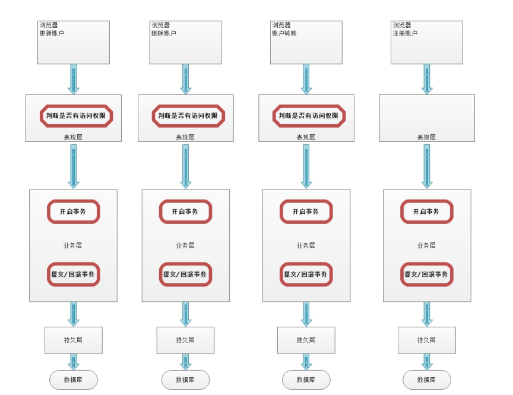
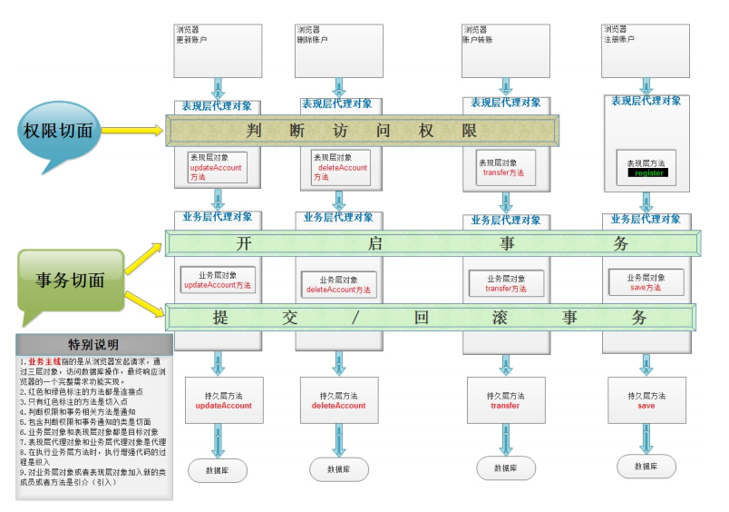

[toc]

# 一、AOP的概念

AOP本质：在不改变原有业务逻辑的情况下增强横切逻辑，横切逻辑代码往往是权限校验代码、⽇志代码、事务控制代码、性能监控代码


**未采用AOP的程序设计如下：**



**采用AOP的程序设计如下：**



最直观的感觉是，未采用AOP的程序存在大量红圈的重复代码，在多个方法的相同位置充斥大量重复代码及有大量的横切逻辑代码。

而采用AOP的程序，将横切逻辑抽取出来，使用动态代理技术在程序运行时，对业务逻辑需要的地方进行功能增强


# 二、SpringAOP的术语

| 名词              |                                                              |
| ----------------- | ------------------------------------------------------------ |
| Joinpoint(连接点) | 它指的是那些可以⽤于把增强代码加⼊到业务主线中的点，那么由上图中我们可以看出，这些点指的就是⽅法。在⽅法执⾏的前后通过动态代理技术加⼊增强的代码。在Spring框架AOP思想的技术实现中，也只⽀持⽅法类型的连接点。 |
| Pointcut(切⼊点)  | 它指的是那些已经把增强代码加⼊到业务主线进来之后的连接点。由上图中，我们看出表现层transfer⽅法就只是连接点，因为判断访问权限的功能并没有对其增强。 |
| Advice(通知/增强) | 它指的是切⾯类中⽤于提供增强功能的⽅法。并且不同的⽅法增强的时机是不⼀样的。⽐如，开启事务肯定要在业务⽅法执⾏之前执⾏；提交事务要在业务⽅法正常执⾏之后执⾏，⽽回滚事务要在业务⽅法执⾏产⽣异常之后执⾏等等。那么这些就是通知的类型。其分类有：前置通知 后置通知 异常通知 最终通知 环绕通知。 |
| Target(⽬标对象)  | 它指的是代理的⽬标对象。即被代理对象。                       |
| Proxy(代理)       | 它指的是⼀个类被AOP织⼊增强后，产⽣的代理类。即代理对象。    |
| Weaving(织⼊)     | 它指的是把增强应⽤到⽬标对象来创建新的代理对象的过程。spring采⽤动态代理织⼊，⽽AspectJ采⽤编译期织⼊和类装载期织⼊。 |
| Aspect(切⾯)      | 它指定是增强的代码所关注的⽅⾯，把这些相关的增强代码定义到⼀个类中，这个类就是切⾯类。例如，事务切⾯，它⾥⾯定义的⽅法就是和事务相关的，像开启事务，提交事务，回滚事务等等，不会定义其他与事务⽆关的⽅法。我们前⾯的案例中TrasnactionManager就是⼀个切⾯。 |

- 连接点

  ​	⽅法开始时、结束时、正常运⾏完毕时、⽅法异常时等这些特殊的时机点，我们称之为连接点，项⽬中每个⽅法都有连接点，连接点是⼀种候选点

- 切⼊点

  ​	指定AOP思想想要影响的具体⽅法是哪些，描述感兴趣的⽅法

- Advice增强

  ​	⽅位点（锁定⽅法中的特殊时机）+ 横切逻辑

- Aspect切⾯

  ​	切⾯概念是对上述概念的⼀个综合，Aspect切⾯ = 切⼊点 + 增强= 切⼊点（锁定⽅法）+ ⽅位点（锁定⽅法中的特殊时机）+ 横切逻辑

  

**总结**：众多的概念，⽬的就是为了锁定要在哪个地⽅插⼊什么横切逻辑代码


# 三、Spring中AOP的代理选择

#### Spring 实现AOP思想使⽤的是动态代理技术，若实现接口则使用JDK动态代理，若没有接口则使用cglib动态代理


# 四、 SpringAOP的使用

在Spring的AOP配置中，也和IoC配置⼀样，⽀持3类配置⽅式。

第⼀类：使⽤XML配置

第⼆类：使⽤XML+注解组合配置

第三类：使⽤纯注解配置

## 4.1 五种通知类型

| 通知类型                    | 执行时机                                                     | 细节                                                         |
| --------------------------- | ------------------------------------------------------------ | ------------------------------------------------------------ |
| 前置通知（before）          | 前置通知永远都会在切⼊点⽅法（业务核⼼⽅法）执⾏之前执⾏     | 前置通知可以获取切⼊点⽅法的参数，并对其进⾏增强             |
| 正常通知（after-returning） | ⽤于配置正常执⾏时通知                                       |                                                              |
| 异常通知（after-throwing）  | 异常通知的执⾏时机是在切⼊点⽅法（业务核⼼⽅法）执⾏产⽣异常之后，异常通知执⾏ | 异常通知不仅可以获取切⼊点⽅法执⾏的参数，也可以获取切⼊点⽅法执⾏产⽣的异常信息 |
| 最终通知（after）           | 最终通知的执⾏时机是在切⼊点⽅法（业务核⼼⽅法）执⾏完成之后，切⼊点⽅法返回之前执⾏。换句话说，⽆论切⼊点⽅法执⾏是否产⽣异常，它都会在返回之前执⾏ | 最终通知执⾏时，可以获取到通知⽅法的参数。同时它可以做⼀些清理操作 |
| 环绕通知（around）          | 它是Spring框架为我们提供的⼀种可以通过编码的⽅式，控制增强代码何时执⾏的通知类型 | 它⾥⾯借助的ProceedingJoinPoint接⼝及其实现类，实现⼿动触发切⼊点⽅法的调⽤ |

## 4.2 切入点的AspectJ表达式

### 全限定⽅法名

```java
// 全匹配⽅式
public void com.lagou.service.impl.TransferServiceImpl.updateAccountByCardNo(com.lagou.pojo.Account)
    
// 访问修饰符可以省略
void com.lagou.service.impl.TransferServiceImpl.updateAccountByCardNo(com.lagou.pojo.Account)
    
// 返回值可以使⽤*，表示任意返回值
* com.lagou.service.impl.TransferServiceImpl.updateAccountByCardNo(com.lagou.pojo.Account)
    
// 包名可以使⽤.表示任意包，但是有⼏级包，必须写⼏个
* ....TransferServiceImpl.updateAccountByCardNo(com.lagou.pojo.Account)

// 包名可以使⽤..表示当前包及其⼦包
* ..TransferServiceImpl.updateAccountByCardNo(com.lagou.pojo.Account)
    
// 类名和⽅法名，都可以使⽤.表示任意类，任意⽅法
* ...(com.lagou.pojo.Account)
    
// 基本类型直接写类型名称 ：int 
// 引⽤类型必须写全限定类名：java.lang.String
// 参数列表可以使⽤*，表示任意参数类型，但是必须有参数
* *..*.*(*)
    
// 参数列表可以使⽤..，表示有⽆参数均可。有参数可以是任意类型
// 全通配⽅式
* *..*.*(..)
```


## 4.3 导入依赖

```xml
<dependency>
    <groupId>org.springframework</groupId>
    <artifactId>spring-aop</artifactId>
    <version>5.1.12.RELEASE</version>
</dependency>
<dependency>
    <groupId>org.aspectj</groupId>
    <artifactId>aspectjweaver</artifactId>
    <version>1.9.4</version>
</dependency>
```


## 4.4 纯注解配置（xml配置太麻烦。。）

**在配置类中使⽤如下注解**

```java
/**
* @author 应癫
*/
@Configuration
@ComponentScan("com.lagou")
@EnableAspectJAutoProxy //开启spring对注解AOP的⽀持
public class SpringConfiguration{
}
```


```java
/**
* 模拟记录⽇志
* @author 应癫
*/
@Component
@Aspect
public class LogUtil{
    /**
	* 我们在xml中已经使⽤了通⽤切⼊点表达式，供多个切⾯使⽤，那么在注解中如何使⽤呢？
	* 第⼀步：编写⼀个⽅法
    * 第⼆步：在⽅法使⽤@Pointcut注解
    * 第三步：给注解的value属性提供切⼊点表达式
    * 细节：
    * 1.在引⽤切⼊点表达式时，必须是⽅法名+()，例如"pointcut()"。
    * 2.在当前切⾯中使⽤，可以直接写⽅法名。在其他切⾯中使⽤必须是全限定⽅法名。
    */
    @Pointcut("execution(* com.lagou.service.impl.*.*(..))")
    public void pointcut(){}
    
    // 前置通知
    @Before("pointcut()")
    public void beforePrintLog(JoinPoint jp){
        Object[] args = jp.getArgs();
        System.out.println("前置通知：beforePrintLog，参数是："+
        Arrays.toString(args));
    }
    
    // 后置通知
    @AfterReturning(value = "pointcut()",returning = "rtValue")
    public void afterReturningPrintLog(Object rtValue){
        System.out.println("后置通知：afterReturningPrintLog，返回值
        是："+rtValue);
    }
    
    // 异常通知
    @AfterThrowing(value = "pointcut()",throwing = "e")
    public void afterThrowingPrintLog(Throwable e){
    	System.out.println("异常通知：afterThrowingPrintLog，异常是："+e);
    }

    // 最终通知
    @After("pointcut()")
    public void afterPrintLog(){
    	System.out.println("最终通知：afterPrintLog");
    }
                           
                           
    /**
    * 环绕通知
    * @param pjp
    * @return
    */
    @Around("pointcut()")
    public Object aroundPrintLog(ProceedingJoinPoint pjp){
        //定义返回值
        Object rtValue = null;
        try{
            //前置通知
            System.out.println("前置通知");
            //1.获取参数
            Object[] args = pjp.getArgs();
            //2.执⾏切⼊点⽅法
            rtValue = pjp.proceed(args);
            //后置通知
            System.out.println("后置通知");
        } catch(Throwable t) {
            //异常通知
            System.out.println("异常通知");
            t.printStackTrace();
        }finally{
            //最终通知
            System.out.println("最终通知");
        }
        return rtValue;
	}
```

