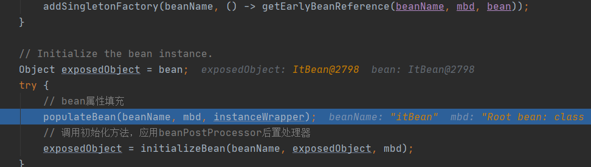

AOP和声明式事务的源码解析

AOP和声明式事务都是通过生成代理对象

都是在容器创建bean的过程中，生成代理对象bean。在bean实例化、装配属性后，进行初始化的时候，在最后一个后置处理器beanPostProcesser的afterInitliaziting的方法中，遍历内置的几个bean后置处理器，Poroxy的后置处理器就是其中之一。然后根据一个类似aopDefinition的对象（开启AOP的注解时应该会扫描所有@Aspect注解的类，注册所有增强类以及方法，以及切入点的信息），判断该bean是否在AOP的切点中，若是则根据该类是否实现接口，通过proxyFactory创建jdk动态代理对象或者cglib动态代理对象。将代理对象bean返回覆盖原来的bean

代理对象的增强逻辑实现：遍历该bean所有的adviser（通知），执行顺序是：前置通知、异常通知、正常通知、最终通知、环绕通知

调用栈：

1. org.springframework.beans.factory.support.AbstractAutowireCapableBeanFactory#i
   nitializeBean

2. org.springframework.beans.factory.support.AbstractAutowireCapableBeanFactory#a
   pplyBeanPostProcessorsAfterInitialization
3. org.springframework.aop.framework.autoproxy.AbstractAutoProxyCreator#postProce
   ssAfterInitialization（后置处理器AbstractAutoProxyCreator完成bean代理对象创建）
4. org.springframework.aop.framework.autoproxy.AbstractAutoProxyCreator#wrapIfNec
   essary
5. org.springframework.aop.framework.autoproxy.AbstractAutoProxyCreator#createPro
   xy （在这⼀步把委托对象的aop增强和通⽤拦截进⾏合并，最终给代理对象）
6. org.springframework.aop.framework.DefaultAopProxyFactory#createAopProxy
7. org.springframework.aop.framework.CglibAopProxy#getProxy(java.lang.ClassLoader)

总结：AOP和声明式事务，底层都是在后置处理器中执行后置逻辑处理，生成一个代理对象