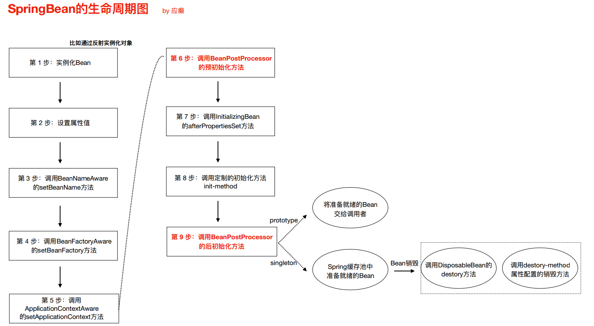

Bean ⽣命周期的整个执⾏过程描述：

1.  bean工厂实例化后通过后置处理器，对BeanDefinition的内容进行修改
2. 根据配置情况调⽤Bean 构造⽅法或FactoryBean⽅法实例化Bean。
3.  利⽤依赖注⼊完成Bean 中所有属性值的配置注⼊。
4.  如果Bean 实现了BeanNameAware 接⼝，则Spring 调⽤Bean 的setBeanName() ⽅法传⼊当前Bean 的id 值。
5.  如果Bean 实现了BeanFactoryAware 接⼝，则Spring 调⽤setBeanFactory() ⽅法传⼊当前⼯⼚实例的引⽤。
6.  如果Bean 实现了ApplicationContextAware 接⼝，则Spring 调⽤setApplicationContext() ⽅法传⼊当前ApplicationContext 实例的引⽤。
7.  如果BeanPostProcessor 和Bean 关联，则Spring 将调⽤该接⼝的预初始化⽅法postProcessBeforeInitialzation() 对Bean 进⾏加⼯操作，此处⾮常重要，Spring 的AOP 就是利⽤它实现的。
8.  如果Bean 实现了InitializingBean 接⼝，则Spring 将调⽤afterPropertiesSet() ⽅法。
9.  如果在配置⽂件中通过init-method 属性指定了初始化⽅法，则调⽤该初始化⽅法。
10.  如果BeanPostProcessor 和Bean 关联，则Spring 将调⽤该接⼝的初始化⽅法postProcessAfterInitialization()。此时，Bean 已经可以被应⽤系统使⽤了。
11.  如果在<bean> 中指定了该Bean 的作⽤范围为scope="singleton"，则将该Bean 放⼊Spring IoC 的缓存池中，将触发Spring 对该Bean 的⽣命周期管理；如果在<bean> 中指定了该Bean 的作⽤范围为scope="prototype"，则将该Bean 交给调⽤者
12.  如果Bean 实现了DisposableBean 接⼝，则Spring 会调⽤destory() ⽅法将Spring 中的Bean 销毁；如果在配置⽂件中通过destory-method 属性指定了Bean 的销毁⽅法，则Spring 将调⽤该⽅法对Bean 进⾏销毁。

**注意**：Spring 为Bean 提供了细致全⾯的⽣命周期过程，通过实现特定的接⼝或<bean> 的属性设置，都可以对Bean 的⽣命周期过程产⽣影响，虽然可以随意配置<bean> 的属性，但是建议不要过多地使⽤Bean 实现接⼝，因为这样会导致代码和Spring 的聚合过于紧密
