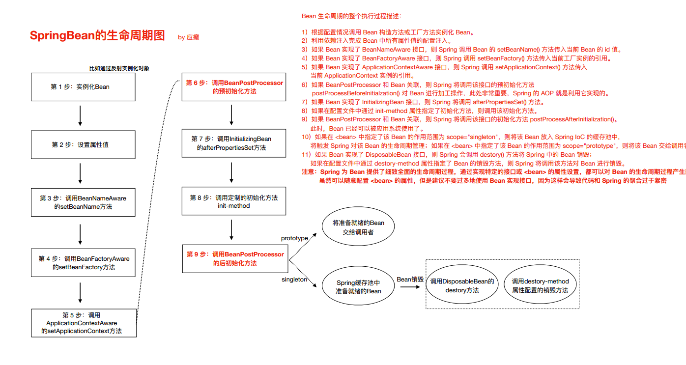

[toc]

## 一、BeanFactory与ApplicationContext区别


BeanFactory是Spring框架中IoC容器的顶层接⼝,它只是⽤来定义⼀些基础功能,定义⼀些基础规范，而ApplicationContext是它的⼀个⼦接⼝，所以ApplicationContext是具备BeanFactory提供的全部功能的。


通常，我们称BeanFactory为SpringIOC的基础容器，ApplicationContext是容器的⾼级接⼝，⽐BeanFactory要拥有更多的功能，⽐如说国际化⽀持和资源访问（xml，java配置类）等等


Spring容器是一套组件和过程的集合，包括BeanFactory顶层容器、ApplicationContext容器、MessageSource国际化处理器、Map单例池、后置处理器等


## 二、Spring容器启动的方式

1. JAVASE应用：

```java
// ClassPathXmlApplicationContext：从类的根路径下加载配置⽂件（推荐使⽤）
ApplicationContext a = new ClassPathXmlApplicationContext("classpath:applicationContext.xml")

// FileSystemXmlApplicationContext：从磁盘路径上加载配置⽂件
ApplicationContext a = new ClassPathXmlApplicationContext("D:\XX\XX\XX\applicationContext.xml")

// AnnotationConfigApplicationContext：纯注解模式下启动Spring容器
ApplicationContext a = new AnnotationConfigApplicationContext(SpringConfig.class)
```


1. JavaWeb：

   **从xml启动容器**

   ```xml
   <!DOCTYPE web-app PUBLIC
    "-//Sun Microsystems, Inc.//DTD Web Application 2.3//EN"
    "http://java.sun.com/dtd/web-app_2_3.dtd" >
   
   <web-app>
     <display-name>Archetype Created Web Application</display-name>
   
   
     <!--配置Spring ioc容器的配置文件-->
     <context-param>
       <param-name>contextConfigLocation</param-name>
       <param-value>classpath:applicationContext.xml</param-value>
     </context-param>
     <!--使用监听器启动Spring的IOC容器-->
     <listener>
       <listener-class>org.springframework.web.context.ContextLoaderListener</listener-class>
     </listener>
   </web-app>
   
   ```

   **从配置类启动容器**

   ```xml
   <!DOCTYPE web-app PUBLIC
    "-//Sun Microsystems, Inc.//DTD Web Application 2.3//EN"
    "http://java.sun.com/dtd/web-app_2_3.dtd" >
   
   <web-app>
     <display-name>Archetype Created Web Application</display-name>
   
   
     <!--告诉ContextloaderListener知道我们使用注解的方式启动ioc容器-->
     <context-param>
       <param-name>contextClass</param-name>
       <param-value>org.springframework.web.context.support.AnnotationConfigWebApplicationContext</param-value>
     </context-param>
     <!--配置启动类的全限定类名-->
     <context-param>
       <param-name>contextConfigLocation</param-name>
       <param-value>com.lagou.edu.SpringConfig</param-value>
     </context-param>
     <!--使用监听器启动Spring的IOC容器-->
     <listener>
       <listener-class>org.springframework.web.context.ContextLoaderListener</listener-class>
     </listener>
   </web-app>
   
   ```


## 三、xml配置bean的属性介绍

### bean标签属性：

- **id属性**： ⽤于给bean提供⼀个唯⼀标识，一般取beanName。在⼀个标签内部，标识必须唯⼀。

- **class属性**：⽤于指定创建Bean对象的全限定类名。
- **name属性**：⽤于给bean提供⼀个或多个名称。多个名称⽤空格分隔。
- **factory-bean属性**：⽤于指定创建当前bean对象的⼯⼚bean的唯⼀标识。当指定了此属性之后，class属性失效。
- **factory-method属性**：⽤于指定创建当前bean对象的⼯⼚⽅法，如配合factory-bean属性使⽤，
  则class属性失效。如配合class属性使⽤，则⽅法必须是static的。
- **scope属性**：⽤于指定bean对象的作⽤范围。默认使用单例singleton，bean对象⽣命周期与容器相同。当要⽤到多例模式时，可以配置为prototype，此模式spring框架只负责创建bean，不负责管理与销毁。其他还有request、session等等不常用的
- **init-method属性**：⽤于指定bean对象的初始化⽅法，此⽅法会在bean对象装配后调⽤。必须是⼀个⽆参⽅法。
- **destory-method属性**：⽤于指定bean对象的销毁⽅法，此⽅法会在bean对象销毁前执⾏。它只能为scope是singleton时起作⽤。

### property标签属性：

- **name**：指定注⼊时调⽤的set⽅法名称。（注：不包含set这三个字⺟,druid连接池指定属性名称）
- **value**：指定注⼊的数据。它⽀持基本类型和String类型。
- **ref**：指定注⼊的数据。它⽀持其他bean类型。写的是其他bean的唯⼀标识。

### constructor-arg标签属性：

- **name**：⽤于给构造函数中指定名称的参数赋值。
- **index**：⽤于给构造函数中指定索引位置的参数赋值。
- **value**：⽤于指定基本类型或者String类型的数据。
- **ref**：⽤于指定其他Bean类型的数据。写的是其他bean的唯⼀标识。


## 四、注解与xml标签的对应

| xml形式                 | 对应的注解形式                                               |
| :---------------------- | :----------------------------------------------------------- |
| 标签                    | @Component("accountDao")，注解加在类上bean的id属性内容直接配置在注解后⾯如果不配置，默认定义个这个bean的id为类的类名⾸字⺟⼩写；另外，针对分层代码开发提供了@Componenet的三种别名@Controller、@Service、@Repository分别⽤于控制层类、服务层类、dao层类的bean定义，这四个注解的⽤法完全⼀样，只是为了更清晰的区分⽽已 |
| 标签的scope属           | @Scope("prototype")，默认单例，注解加在类上                  |
| 标签的initmethod属性    | @PostConstruct，注解加在⽅法上，该⽅法就是初始化后调⽤的⽅法 |
| 标签的destorymethod属性 | @PreDestory，注解加在⽅法上，该⽅法就是销毁前调⽤的⽅法      |


## 五、纯xml

### 1.定义bean

#### 纯xml定义bean有三种方式，分别是无参构造创建、静态方法创建、实例化方法创建

```xml
<!--配置service对象-->
<bean id="transferService"class="com.lagou.service.impl.TransferServiceImpl" scope="singleton">
</bean>

<!--使⽤静态⽅法创建对象的配置⽅式-->
<bean id="userService" class="com.lagou.factory.BeanFactory"factory-method="getTransferService"></bean>

<!--使⽤实例⽅法创建对象的配置⽅式-->
<bean id="beanFactory" class="com.lagou.factory.instancemethod.BeanFactory"></bean>
<bean id="transferService" factory-bean="beanFactory" factorymethod="getTransferService"></bean>
```

#### DI依赖注入有两种配置方式，分别是set方法注入依赖、有参构造注入依赖

```xml
<!--set注入-->
<bean id="proxyFactory" class="com.lagou.edu.factory.ProxyFactory">
	<property name="TransactionManager" ref="transactionManager"/>
    <property name="age" value="15"/>
</bean>

<!--有参构造注入-->
<bean id="proxyFactory" class="com.lagou.edu.factory.ProxyFactory">
	<constructor-arg name="transactionManager" ref="transactionManager"/>
    <constructor-arg name="age" ref="15"/>
</bean>
```

### 2.依赖注入

#### 纯xml的依赖注入有两种方式，分别是set方法注入依赖、有参构造注入依赖

	1.  在bean中使用set方法注入
	2.  在bean中使用有参构造注入依赖

## 六、xml+注解

### 1.定义bean

1. #### xml+注解结合模式，xml⽂件依然存在，所以，spring IOC容器的启动仍然从加载xml开始。

2. #### 三方包的类使用xml配置，引入配置文件

   **applicationContext.xml**：

   ```xml
   <!--引入外部资源文件-->
   <context:property-placeholder location="classpath:jdbc.properties"/>
   
   <!--第三方jar中的bean定义在xml中-->
   <bean id="dataSource" class="com.alibaba.druid.pool.DruidDataSource">
   	<property name="driverClassName" value="${jdbc.driver}"/>
   	<property name="url" value="${jdbc.url}"/>
   	<property name="username" value="${jdbc.username}"/>
   	<property name="password" value="${jdbc.password}"/>
   </bean>
   ```

   **jdbc.properties**：

   ```properties
   jdbc.driver=com.mysql.jdbc.Driver
   jdbc.url=jdbc:mysql://localhost:3306/bank
   jdbc.username=root
   jdbc.password=123456
   ```

   

3. #### 自开发类使用注解

   使用注解，需要配置扫描使用注解定义bean的路径

   ```xml
   <!--开启注解扫描，base-package指定扫描的包路径-->
   <context:component-scan base-package="com.lagou.edu"/>
   ```

   

### 2.依赖注入

1. #### 自定义Bean通常使用注解定义，第三方类定义在xml中

2. #### 注解注入

   @Autowired（推荐使⽤）：策略为按照类型注⼊

   @Qualifier（适用于接口有个实现类）：策略为按beanName注入（beanId）

   @Resource（JDK11已经移除，需要单独引⼊jar包javax.annotation-api）： 策略为按beanName注入（beanId）


## 七、纯注解

改造xm+注解模式，将xml中遗留的内容全部以注解的形式迁移出去，最终删除xml，从Java配置类启动

### 1.对应注解

- **@Configuration** 注解，表名当前类是⼀个配置类
- **@ComponentScan** 注解，替代<context:component-scan>
- **@PropertySource**，引⼊外部属性配置⽂件替代<property-placeholder>
- **@Import** 引⼊其他配置类
- **@Value** 对变量赋值，可以直接赋值，也可以使⽤${} 读取资源配置⽂件中的信息
- **@Bean** 将⽅法返回对象加⼊SpringIOC 容器

### 2.定义bean

1. 将xml中的扫描注解路径配置移到java配置类中
2. 将xml中的三方类bean定义改为配置定义bean
3. 将xml引入三方类配置文件如：jdbc.properties，改为注解引入

### 3.依赖注入

#### 	同xml+注解一致

## 八、SpringIoC高级特性

### 1.延迟加载

ApplicationContext 容器的默认⾏为是在启动服务器时将所有singleton bean进⾏实例化并放入缓存。提前
实例化意味着作为初始化过程的⼀部分，ApplicationContext 实例会创建并配置所有的singleton
bean。


Bean默认都是lazy-init="false"，⽴即加载，表示在spring启动时，⽴刻进⾏实例化。

Bean的延迟加载（延迟创建）lazy-init="true"，将bean设置为延迟实例化。

配置了延迟加载的bean，在被别的bean依赖时会由于别的bean被立即实例化而实例化

#### 1.1. xml配置

```xml
<bean id="testBean" calss="cn.lagou.LazyBean" lazy-init="false" />
```

#### 1.2. 注解配置

```java
@Lazy
```

### 2.FactoryBean和BeanFactory

### 3.后置处理器



