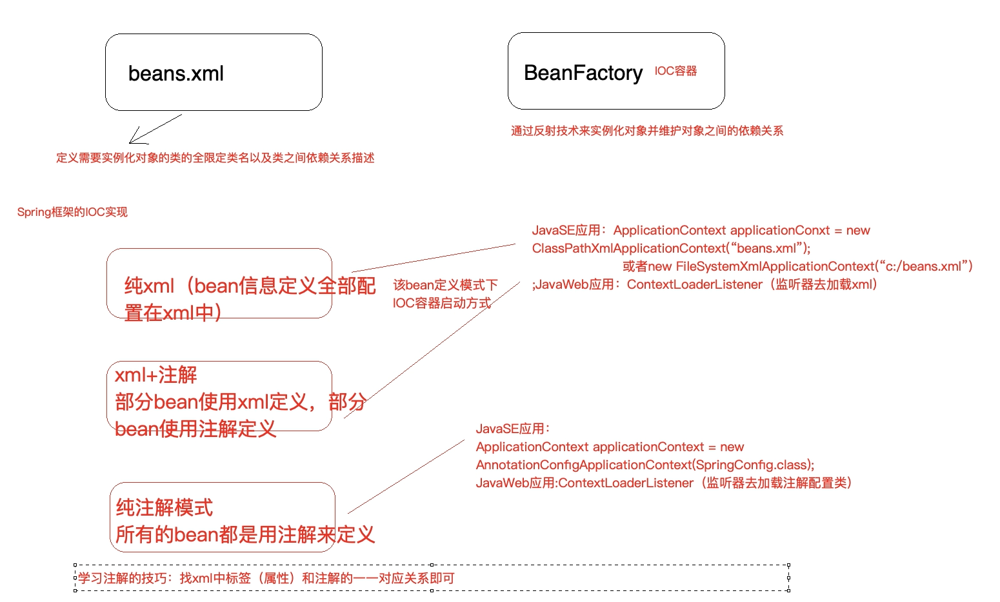
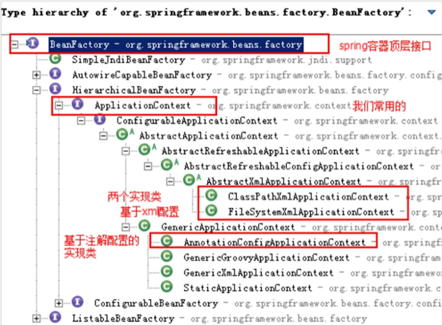

[toc]

## 一、BeanFactory与ApplicationContext区别




BeanFactory是Spring框架中IoC容器的顶层接⼝,它只是⽤来定义⼀些基础功能,定义⼀些基础规范，而ApplicationContext是它的⼀个⼦接⼝，所以ApplicationContext是具备BeanFactory提供的全部功能的。





通常，我们称BeanFactory为SpringIOC的基础容器，ApplicationContext是容器的⾼级接⼝，⽐BeanFactory要拥有更多的功能，⽐如说国际化⽀持和资源访问（xml，java配置类）等等


Spring容器是一套组件和过程的集合，包括BeanFactory顶层容器、ApplicationContext容器、MessageSource国际化处理器、单例池singletonObjects、后置处理器等


## 二、Spring容器启动的方式

1. JAVASE应用：

```java
// ClassPathXmlApplicationContext：从类的根路径下加载配置⽂件（推荐使⽤）
ApplicationContext a = new ClassPathXmlApplicationContext("classpath:applicationContext.xml")

// FileSystemXmlApplicationContext：从磁盘路径上加载配置⽂件
ApplicationContext a = new ClassPathXmlApplicationContext("D:\XX\XX\XX\applicationContext.xml")

// AnnotationConfigApplicationContext：纯注解模式下启动Spring容器
ApplicationContext a = new AnnotationConfigApplicationContext(SpringConfig.class)
```


1. JavaWeb：

   **从xml启动容器**

   ```xml
   <!DOCTYPE web-app PUBLIC
    "-//Sun Microsystems, Inc.//DTD Web Application 2.3//EN"
    "http://java.sun.com/dtd/web-app_2_3.dtd" >
   
   <web-app>
     <display-name>Archetype Created Web Application</display-name>
   
   
     <!--配置Spring ioc容器的配置文件-->
     <context-param>
       <param-name>contextConfigLocation</param-name>
       <param-value>classpath:applicationContext.xml</param-value>
     </context-param>
     <!--使用监听器启动Spring的IOC容器-->
     <listener>
       <listener-class>org.springframework.web.context.ContextLoaderListener</listener-class>
     </listener>
   </web-app>
   
   ```

   **从配置类启动容器**

   ```xml
   <!DOCTYPE web-app PUBLIC
    "-//Sun Microsystems, Inc.//DTD Web Application 2.3//EN"
    "http://java.sun.com/dtd/web-app_2_3.dtd" >
   
   <web-app>
     <display-name>Archetype Created Web Application</display-name>
   
   
     <!--告诉ContextloaderListener知道我们使用注解的方式启动ioc容器-->
     <context-param>
       <param-name>contextClass</param-name>
       <param-value>org.springframework.web.context.support.AnnotationConfigWebApplicationContext</param-value>
     </context-param>
     <!--配置启动类的全限定类名-->
     <context-param>
       <param-name>contextConfigLocation</param-name>
       <param-value>com.lagou.edu.SpringConfig</param-value>
     </context-param>
     <!--使用监听器启动Spring的IOC容器-->
     <listener>
       <listener-class>org.springframework.web.context.ContextLoaderListener</listener-class>
     </listener>
   </web-app>
   
   ```


## 三、xml配置bean的属性介绍

### bean标签属性：

- **id属性**： ⽤于给bean提供⼀个唯⼀标识，一般取beanName。在⼀个标签内部，标识必须唯⼀。

- **class属性**：⽤于指定创建Bean对象的全限定类名。
- **name属性**：⽤于给bean提供⼀个或多个名称。多个名称⽤空格分隔。
- **factory-bean属性**：⽤于指定创建当前bean对象的⼯⼚bean的唯⼀标识。当指定了此属性之后，class属性失效。
- **factory-method属性**：⽤于指定创建当前bean对象的⼯⼚⽅法，如配合factory-bean属性使⽤，
  则class属性失效。如配合class属性使⽤，则⽅法必须是static的。
- **scope属性**：⽤于指定bean对象的作⽤范围。默认使用单例singleton，bean对象⽣命周期与容器相同。当要⽤到多例模式时，可以配置为prototype，此模式spring框架只负责创建bean，不负责管理与销毁。其他还有request、session等等不常用的
- **init-method属性**：⽤于指定bean对象的初始化⽅法，此⽅法会在bean对象装配后调⽤。必须是⼀个⽆参⽅法。
- **destory-method属性**：⽤于指定bean对象的销毁⽅法，此⽅法会在bean对象销毁前执⾏。它只能为scope是singleton时起作⽤。

### property标签属性：

- **name**：指定注⼊时调⽤的set⽅法名称。（注：不包含set这三个字⺟,druid连接池指定属性名称）
- **value**：指定注⼊的数据。它⽀持基本类型和String类型。
- **ref**：指定注⼊的数据。它⽀持其他bean类型。写的是其他bean的唯⼀标识。

### constructor-arg标签属性：

- **name**：⽤于给构造函数中指定名称的参数赋值。
- **index**：⽤于给构造函数中指定索引位置的参数赋值。
- **value**：⽤于指定基本类型或者String类型的数据。
- **ref**：⽤于指定其他Bean类型的数据。写的是其他bean的唯⼀标识。


## 四、注解与xml标签的对应

| xml形式                 | 对应的注解形式                                               |
| :---------------------- | :----------------------------------------------------------- |
| 标签                    | @Component("accountDao")，注解加在类上bean的id属性内容直接配置在注解后⾯如果不配置，默认定义个这个bean的id为类的类名⾸字⺟⼩写；另外，针对分层代码开发提供了@Componenet的三种别名@Controller、@Service、@Repository分别⽤于控制层类、服务层类、dao层类的bean定义，这四个注解的⽤法完全⼀样，只是为了更清晰的区分⽽已 |
| 标签的scope属           | @Scope("prototype")，默认单例，注解加在类上                  |
| 标签的initmethod属性    | @PostConstruct，注解加在⽅法上，该⽅法就是初始化时调⽤的⽅法 |
| 标签的destorymethod属性 | @PreDestory，注解加在⽅法上，该⽅法就是销毁前调⽤的⽅法      |


## 五、纯xml

### 1.定义bean

#### 纯xml定义bean有三种方式，分别是无参构造创建、静态方法创建、实例化方法创建

```xml
<!--配置service对象-->
<bean id="transferService"class="com.lagou.service.impl.TransferServiceImpl" scope="singleton">
</bean>

<!--使⽤静态⽅法创建对象的配置⽅式-->
<bean id="userService" class="com.lagou.factory.BeanFactory"factory-method="getTransferService"></bean>

<!--使⽤实例⽅法创建对象的配置⽅式-->
<bean id="beanFactory" class="com.lagou.factory.instancemethod.BeanFactory"></bean>
<bean id="transferService" factory-bean="beanFactory" factorymethod="getTransferService"></bean>
```

#### DI依赖注入有两种配置方式，分别是set方法注入依赖、有参构造注入依赖

```xml
<!--set注入-->
<bean id="proxyFactory" class="com.lagou.edu.factory.ProxyFactory">
	<property name="TransactionManager" ref="transactionManager"/>
    <property name="age" value="15"/>
</bean>

<!--有参构造注入-->
<bean id="proxyFactory" class="com.lagou.edu.factory.ProxyFactory">
	<constructor-arg name="transactionManager" ref="transactionManager"/>
    <constructor-arg name="age" ref="15"/>
</bean>
```

### 2.依赖注入

#### 纯xml的依赖注入有两种方式，分别是set方法注入依赖、有参构造注入依赖

1.  在bean中使用set方法注入
2.  在bean中使用有参构造注入依赖

## 六、xml+注解

### 1.定义bean

1. #### xml+注解结合模式，xml⽂件依然存在，所以，spring IOC容器的启动仍然从加载xml开始。

2. #### 三方包的类使用xml定义bean，引入配置文件

   **applicationContext.xml**：

   ```xml
   <!--引入外部资源文件-->
   <context:property-placeholder location="classpath:jdbc.properties"/>
   
   <!--第三方jar中的bean定义在xml中-->
   <bean id="dataSource" class="com.alibaba.druid.pool.DruidDataSource">
   	<property name="driverClassName" value="${jdbc.driver}"/>
   	<property name="url" value="${jdbc.url}"/>
   	<property name="username" value="${jdbc.username}"/>
   	<property name="password" value="${jdbc.password}"/>
   </bean>
   ```

   **jdbc.properties**：

   ```properties
   jdbc.driver=com.mysql.jdbc.Driver
   jdbc.url=jdbc:mysql://localhost:3306/bank
   jdbc.username=root
   jdbc.password=123456
   ```

   

3. #### 自开发类使用注解定义bean

   使用注解，需要配置扫描使用注解定义bean的路径

   ```xml
   <!--开启注解扫描，base-package指定扫描的包路径-->
   <context:component-scan base-package="com.lagou.edu"/>
   ```

   

### 2.依赖注入

1. #### 使用set方法注入依赖

2. #### 使用有参构造注入依赖

3. #### 注解注入依赖

   @Autowired（推荐使⽤）：策略为按照类型注⼊

   @Qualifier（适用于接口有个实现类）：策略为按beanName注入（beanId）

   @Resource（JDK11已经移除，需要单独引⼊jar包javax.annotation-api）： 策略为按beanName注入（beanId）


## 七、纯注解

改造xm+注解模式，将xml中遗留的内容全部以注解的形式迁移出去，最终删除xml，从Java配置类启动

### 1.对应注解

- **@Configuration** 注解，表名当前类是⼀个配置类
- **@ComponentScan** 注解，替代<context:component-scan>
- **@PropertySource**，引⼊外部属性配置⽂件替代<property-placeholder>
- **@Import** 引⼊其他配置类
- **@Value** 对变量赋值，可以直接赋值，也可以使⽤${} 读取资源配置⽂件中的信息
- **@Bean** 将⽅法返回对象加⼊SpringIOC 容器

```java
// @Configuration 注解表明当前类是一个配置类
@Configuration
@ComponentScan({"com.lagou.edu"})
@PropertySource({"classpath:jdbc.properties"})
/*@Import()*/
public class SpringConfig {

    @Value("${jdbc.driver}")
    private String driverClassName;
    @Value("${jdbc.url}")
    private String url;
    @Value("${jdbc.username}")
    private String username;
    @Value("${jdbc.password}")
    private String password;


    @Bean("dataSource")
    public DataSource createDataSource(){
        DruidDataSource druidDataSource = new DruidDataSource();
        druidDataSource.setDriverClassName(driverClassName);
        druidDataSource.setUrl(url);
        druidDataSource.setUsername(username);
        druidDataSource.setPassword(password);
        return  druidDataSource;
    }
}
```


### 2.定义bean

1. 将xml中的扫描注解路径配置移到java配置类中
2. 将xml中的三方类bean定义改为配置定义bean
3. 将xml引入三方类配置文件如：jdbc.properties，改为注解引入

### 3.依赖注入

#### 	同xml+注解一致

## 八、SpringIoC高级特性

### 1.延迟加载

ApplicationContext 容器的默认⾏为是在启动服务器时将所有singleton bean进⾏实例化并放入缓存。提前
实例化意味着作为初始化过程的⼀部分，ApplicationContext 实例会创建并配置所有的singleton
bean。


Bean默认都是lazy-init="false"，⽴即加载，表示在spring启动时，⽴刻进⾏实例化。

Bean的延迟加载（延迟创建）lazy-init="true"，将bean设置为延迟实例化。

配置了延迟加载的bean，在被别的bean依赖时会由于别的bean被立即实例化而实例化

#### 1.1. xml配置

```xml
<bean id="testBean" calss="cn.lagou.LazyBean" lazy-init="false" />
```

#### 1.2. 注解配置

```java
@Lazy
```

### 2.FactoryBean和BeanFactory

#### 2.1. FactoryBean

​	Spring中Bean有两种，⼀种是普通Bean，⼀种是⼯⼚Bean（FactoryBean）， FactoryBean可以⽣成某⼀个类型的Bean实例（返回给我们），也就是说我们可以借助于它⾃定义Bean的创建过程。Bean创建的三种⽅式中的静态⽅法和实例化⽅法和FactoryBean作⽤类似（都是使用某方法创建复杂对象）， FactoryBean使⽤较多，尤其在Spring框架⼀些组件中会使⽤，还有其他框架和Spring框架整合时使⽤  

若想getBean()获取FactoryBean，需要在id之前添加“&

**FactoryBean接口定义：**

```java
// 可以让我们⾃定义Bean的创建过程（完成复杂Bean的定义）
public interface FactoryBean<T> {
	@Nullable
	// 返回FactoryBean创建的Bean实例，如果isSingleton返回true，则该实例会放到Spring容器的单例对象缓存池中Map
	T getObject() throws Exception;
	@Nullable
	// 返回FactoryBean创建的Bean类型
	Class<?> getObjectType();
	// 返回作⽤域是否单例
	default boolean isSingleton() {
		return true;
	}
}
```


**实现FactoryBean接口：**

```java
public class CompanyFactoryBean implements FactoryBean<Company> {
	private String companyInfo; // 公司名称,地址,规模
    
	public void setCompanyInfo(String companyInfo) {
		this.companyInfo = companyInfo;
    }
    
	@Override
	public Company getObject() throws Exception {
        // 模拟创建复杂对象Company
        Company company = new Company();
        String[] strings = companyInfo.split(",");
        company.setName(strings[0]);
        company.setAddress(strings[1]);
        company.setScale(Integer.parseInt(strings[2]));
        return company;
    }
    
    @Override
    public Class<?> getObjectType() {
        return Company.class;
    }
    
    @Override
    public boolean isSingleton() {
        return true;
    }
}
```

**xml配置bean：**

```xml
<bean id="companyBean" class="com.lagou.edu.factory.CompanyFactoryBean">
	<property name="companyInfo" value="IBM,北京,5000"/>
</bean>
```

**获取FactoryBean产⽣的对象 ：**

```java
Object companyBean = applicationContext.getBean("companyBean");
System.out.println("IBM:" + companyBean);
// 结果如下
bean:Company{name='IBM', address='北京', scale=5000}

// 获取FactoryBean，需要在id之前添加“&
Object companyBean = applicationContext.getBean("&companyBean");
System.out.println("bean:" + companyBean);
// 结果如下
bean:com.lagou.edu.factory.CompanyFactoryBean@53f6fd09
```


#### 2.2. BeanFactory

​	BeanFactory接⼝是容器的顶级接⼝，定义了容器的⼀些基础⾏为，负责⽣产和管理Bean的⼀个⼯⼚，具体使⽤它下⾯的⼦接⼝类型，⽐如ApplicationContext  

### 3.后置处理器

​	Spring提供了两种后处理bean的扩展接⼝，分别为 BeanPostProcessor 和BeanFactoryPostProcessor，两者在使⽤上是有所区别的。  

#### 3.1. BeanFactoryPostProcessor

**BeanFactoryPostProcessor**是Bean工厂级别的后置处理器，对整个bean工厂的处理。其在Spring容器的周期顺序如下**(详细见bean生命周期)**

1.  bean工厂实例化
2.  实例化实现了**BeanFactoryPostProcessor**接口的类
3.  通过**postProcessBeanFactory**()方法对bean工厂进行后置处理

典型应用是PropertyPlaceholderConfigurer接口，通过**getBeanDefinition**()方法，得到**BeanDefinition**对象（xml中bean标签的封装），然后对定义的属性进⾏修改，@Value("${xxx.xxx}")这个典型的占位符就是通过beanFactory工厂后置处理转换成真实值的


#### 3.2. BeanPostProcessor 

**BeanPostProcessor**是Bean级别的后置处理器，可以针对某个具体的Bean。

该接⼝提供了两个⽅法，分别在Bean的初始化⽅法前和初始化⽅法后执⾏，默认是会对整个Spring容器中所有的bean进⾏处理。如果要对具体的某个bean处理，可以通过⽅法参数判断，两个类型参数分别为Object和String，第⼀个参数是每个bean的实例，第⼆个参数是每个bean的name或者id属性的值。所以我们可以通过第⼆个参数，来判断我们将要处理的具体的bean。

其在Spring容器的周期顺序如下:**(详细见bean生命周期)**

1. 实例化实现了**BeanPostProcessor** 接口的类
2. 实例化bean对象
3. 设置属性值
4. 执行实现**BeanNameAware**、**BeanFactoryAware**、**ApplicationContextAware**接口获取beanName、beanFactory、ApplicationContext
5. 执行实现**BeanPostProcessor**接口后置处理器的**postProcessBeforeInitialization**方法
6. 执行其他初始化的方法，顺序为@**postConstruct**、**InitializingBean**接口、bean标签的**init-mothod**指定的方法
7. 执行实现**BeanPostProcessor**接口后置处理器的**postProcessAfterInitialization**方法

```java
@Component
public class MyBeanPostProcessor implements BeanPostProcessor {

	public MyBeanPostProcessor() {
		System.out.println("BeanPostProcessor 实现类构造函数...");
	}

	@Override
	public Object postProcessBeforeInitialization(Object bean, String beanName) throws BeansException {
		if("lagouBean".equals(beanName)) {
			System.out.println("BeanPostProcessor 实现类 postProcessBeforeInitialization 方法被调用中......");
		}
		return bean;
	}

	@Override
	public Object postProcessAfterInitialization(Object bean, String beanName) throws BeansException {
		if("lagouBean".equals(beanName)) {
			System.out.println("BeanPostProcessor 实现类 postProcessAfterInitialization 方法被调用中......");
		}
		return bean;
	}
}
```


### 4. 事件机制

##### 4.1 EventPublisher

`ApplicationEventPublisherAware`

```java
import lombok.extern.slf4j.Slf4j;
import org.springframework.context.ApplicationEvent;
import org.springframework.context.ApplicationEventPublisher;
import org.springframework.context.ApplicationEventPublisherAware;
import org.springframework.stereotype.Component;

/**
 * @program: practice
 * @description:
 * @author: Wangwentao
 * @date: 2022/08/15
 **/
@Component
@Slf4j
public class MyEventPublisher implements ApplicationEventPublisherAware {

    private ApplicationEventPublisher publisher;

    @Override
    public void setApplicationEventPublisher(ApplicationEventPublisher applicationEventPublisher) {
        log.info("初始化------>{}",applicationEventPublisher);
        this.publisher = applicationEventPublisher;
    }

    public void publish(ApplicationEvent event) {
        publisher.publishEvent(event);
    }
}

```

##### 4.2 Event

`ApplicationEvent`

```java
import org.springframework.context.ApplicationEvent;

/**
 * @program: practice
 * @description:
 * @author: Wangwentao
 * @date: 2022/08/15
 **/
public class MyEvent extends ApplicationEvent {

    private Msg msg;

    /**
     * Create a new ApplicationEvent.
     *
     * @param source the object on which the event initially occurred (never {@code null})
     */
    public MyEvent(Object source, Msg msg) {
        super(source);
        this.msg = msg;
    }

    public Msg getMsg() {
        return msg;
    }
}

```

##### 4.3 事件推送

```java
import com.tangdi.event.MyEvent;
import com.tangdi.event.MyEventPublisher;
import lombok.extern.slf4j.Slf4j;
import org.springframework.beans.factory.annotation.Autowired;
import org.springframework.web.bind.annotation.GetMapping;
import org.springframework.web.bind.annotation.RequestMapping;
import org.springframework.web.bind.annotation.RestController;

/**
 * @program: practice
 * @description:
 * @author: Wangwentao
 * @date: 2022/08/15
 **/

@RestController
@RequestMapping(value = "/api/event")
@Slf4j
public class EventTestController {
    @Autowired
    MyEventPublisher publisher;

    @GetMapping(value = "/t1")
    public void t1() throws InterruptedException {
        log.info("当前线程："+Thread.currentThread().getName());
        publisher.publish(new MyEvent(this,"hello"));
        log.info("发送并处理成功");
    }
}

```

##### 4.4 Listener

`ApplicationListener`

```java
import lombok.extern.slf4j.Slf4j;
import org.springframework.context.ApplicationListener;
import org.springframework.scheduling.annotation.Async;
import org.springframework.stereotype.Component;

/**
 * @program: practice
 * @description:
 * @author: Wangwentao
 * @date: 2022/08/15
 **/
@Component
@Slf4j
public class MyApplicationListener2 implements ApplicationListener<MyEvent> {

    @Override
    @Async("commonPool")
    public void onApplicationEvent(MyEvent event) {
        log.info("当前线程："+Thread.currentThread().getName());
        System.out.println("MyApplicationListener2 接收到事件消息："+event.getMsg());
        try {
            Thread.sleep(7000);
        } catch (InterruptedException e) {
            e.printStackTrace();
        }
        System.out.println("MyApplicationListener2 处理完成");
    }
}
```

`SmartApplicationListener`

```java
@Slf4j
@Component
public class ArticleChangeChannelListener implements SmartApplicationListener {
    @Autowired
    private ChannelMappingBiz channelMappingBiz;
    @Autowired
    private ChannelDataBiz channelDataBiz;
    @Autowired
    private ChannelDataFlowService channelDataFlowService;
    @Autowired
    private ChannelDataAuditBiz channelDataAuditBiz;
    @Autowired
    private ChannelSettingBiz channelSettingBiz;
    @Autowired
    private ArticleDao articleDao;
    @Autowired
    private ChannelDataService channelDataService;

    @Override
    public boolean supportsEventType(Class<? extends ApplicationEvent> eventType) {
        return ArticleChangeChannelEvent.class == eventType;
    }

    @Override
    public boolean supportsSourceType(Class<?> sourceType) {
        return true;
    }

    @Override
    public int getOrder() {
        return 0;
    }

    @Override
    public void onApplicationEvent(ApplicationEvent applicationEvent) {
        //禁用切换频道逻辑
        if(true) { return; }
        try {
            log.info("ArticleChangeChannelListener start!");
            ArticleChangeChannelEvent event = (ArticleChangeChannelEvent) applicationEvent;
            ArticleEventInfo eventInfo = event.getArticleEventInfo();
            if(ObjectUtil.isEmpty(eventInfo)) {
                return;
            }
            log.info("ArticleChangeChannelListener event:{}!", JSONUtil.toJsonStr(event));
            //处理逻辑
            handleArticleChangeChannelEvent(eventInfo);
            log.info("ArticleChangeChannelListener end!");
        }catch (Exception e){
            log.error("ArticleChangeChannelListener eventInfo:{}, error:{}", e);
        }
    }

    private void handleArticleChangeChannelEvent(ArticleEventInfo eventInfo) {
        List<Long> articleIds = eventInfo.getArticleIds();
        Map<Long, List<Long>> contentChannelIdMap = channelMappingBiz.getContentChannelIdMapByArticleIds(articleIds);
        Map<Long, List<ChannelDataEntity>> channelDataMap = channelDataBiz.getChannelDataMap(articleIds);

        List<Long> contentChannelIdList = contentChannelIdMap.values().stream().flatMap(Collection::stream).collect(Collectors.toList());
        Map<Long, Integer> contentChannelIdAndSourceMap = channelSettingBiz.getContentChannelIdAndSourceMap(contentChannelIdList);

        log.info("handleArticleChangeChannelEvent eventInfo:{}, contentChannelIdMap:{}, channelDataMap:{}",
                 JSONUtil.toJsonStr(eventInfo),
                 JSONUtil.toJsonStr(contentChannelIdMap),
                 JSONUtil.toJsonStr(channelDataMap));

        //处理
        articleIds.forEach(articleId -> {
            ArticleEntity articleEntity = articleDao.selectOne(new QueryWrapper<ArticleEntity>().lambda().eq(ArticleEntity::getId, articleId));
            if(ObjectUtil.isEmpty(articleEntity)) {
                log.info("handleArticleChangeChannelEvent articleEntity is empty! articleId:{}", articleId);
                return;
            }

            //判断是否有匹配频道
            List<Long> channelIdList = contentChannelIdMap.get(articleId);
            if(CollectionUtil.isEmpty(channelIdList)) {
                channelDataBiz.deleteChannelDataDao(articleId, null);
                channelDataFlowService.deleteChannelData(articleId,null);
                return;
            }

            //获取已存在文章集合
            List<ChannelDataEntity> channelDataList = channelDataMap.get(articleId);
            if(CollectionUtil.isNotEmpty(channelDataList)) {
                List<Long> exitChannelIdList = channelDataList.stream().map(ChannelDataEntity::getChannelId).collect(Collectors.toList());
                exitChannelIdList.forEach(channelId -> {
                    if(!channelIdList.contains(channelId)) {
                        channelDataBiz.deleteChannelDataDao(articleId, channelId);
                        channelDataFlowService.deleteChannelData(articleId,channelId);
                    }
                });
                channelIdList.forEach(channelId -> {
                    Integer source = null;
                    if(MapUtil.isNotEmpty(contentChannelIdAndSourceMap)) {
                        source = contentChannelIdAndSourceMap.get(channelId);
                    }
                    if(!exitChannelIdList.contains(channelId)) {
                        channelDataBiz.insertChannelData(articleId, channelId);
                        channelDataFlowService.addChannelData(articleId,channelId);
                        channelDataAuditBiz.insertOrUpdateChannelDataAudit(articleId, KD_PASS.getValue(), source, articleEntity.getCreateTime());
                        channelDataService.changeChanelDataStatus(articleId,KD_PASS.getValue(), source);
                    }
                });
            }else {
                channelIdList.forEach(channelId -> {
                    Integer source = null;
                    if(MapUtil.isNotEmpty(contentChannelIdAndSourceMap)) {
                        source = contentChannelIdAndSourceMap.get(channelId);
                    }
                    channelDataBiz.insertChannelData(articleId, channelId);
                    channelDataFlowService.addChannelData(articleId,channelId);
                    channelDataAuditBiz.insertOrUpdateChannelDataAudit(articleId, KD_PASS.getValue(), source, articleEntity.getCreateTime());
                    channelDataService.changeChanelDataStatus(articleId,KD_PASS.getValue(), source);
                });
            }
        });
    }
}
```

##### 4.5 异步通知/消费

除了在监听器的订阅方法上加 `@Async` 实现实现异步消费外，还可以手动创建一个`SimpleApplicationEventMulticaster`，并设置 `TaskExecutor`，来将所有的消费事件采用异步线程执行。

```java
@Configuration
public class SpringConfiguration {

    @Bean
    @Autowired
    @Qualifier("commonPool")
    public SimpleApplicationEventMulticaster applicationEventMulticaster(Executor commonPool) {
        SimpleApplicationEventMulticaster simpleApplicationEventMulticaster = new SimpleApplicationEventMulticaster();
        simpleApplicationEventMulticaster.setTaskExecutor(commonPool);
        return simpleApplicationEventMulticaster;
    }

}
```


