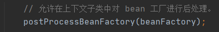

[toc]

# 一、容器启动主流程:

## 1.AbstractApplicationContext的refresh()方法

## 2. 创建bean工厂、解析bean文件

### 2.1.刷新容器，如果存在工厂，则销毁所有bean，关闭工厂（beanFactory属性置null）

### 2.3.beanFactory实例化（DefaultListableBeanFactory类型）；

### 2.4.doLoadBeanDefinitions加载并解析xml或注解定义的bean，封装成BeanDefinition对象

### 2.5.将BeanDefinition装饰后，id作为key，保存到beanDefinitionMap中，并注册到registerBeanDefinitions对象中

## 3.配置bean工厂上下文

### 3.1.配置上下文的ClassLoader、beanFactoryPostProcesser后置处理器

## 4.执行BeanFactoryPostProcessor后置处理器，对bean工厂后置处理

## 5.注册BeanPostProcessor后置处理器进bean工厂

## 6.初始化消息源、事件、监听器

## 7.实例化所有剩余的（非延迟初始化）单例。

### 7.1.通过bean工厂获得所有beansName

### 7.2.bean工厂合并beanDefinitionMap后遍历BeanDefinition，非抽象、单例、非延迟则调用bean工厂的getBean()

### 7.3.从缓存中取bean A，若没有则实例化加载bean A，若开启循环依赖，则提前暴露，放到三级缓存singletonFactories中

### 7.4.bean A继续往下装配属性，发现依赖引用属性B，调用getBean(Bname)去获取bean B；

### 7.5.（重复A的过程）从缓存中取bean B，若没有则实例化，若开启循环依赖，则提前暴露，放到三级缓存singletonFactories

### 7.6.bean B继续往下装配属性，发现依赖引用属性bean A，调用getBean(Aname)，发现三级缓存中有bean A，取出并通过beanPostProcesser后置扩展，并放入二级缓存earlysingletonFactories中，bean B装配扩展后的A，然后继续往下初始化，最后bean B放入单例池singletonObjects中

### 7.7.bean A装配完属性B后，A继续往下初始化，最后也放入了单例池singletonObjects中

### 7.8.调用Aware实现类并执行方法

### 7.9.调用bean后置处理器的before方法

### 7.10.调用其他三个初始化方法(@PostConstruct、Beaninitliazation、init-method)

### 7.11.调用bean后置处理器的after方法

### 7.12.bean回调

​	实现SmartInitializingSingleton的bean可调用afterSingletonsInstantiated方法做实例化后的处理

# 二、三级缓存解决SpringIoC循环依赖思路图

# 二、延迟加载的时机

非抽象、单例、延迟加载的bean，外部调用beanFactory.getBean()的时候实例化，底层调用的还是是doGetBean()

非抽象、单例、非延迟加载的bean，在容器启动的时候就加载了

原型bean（多例），不由容器管理，若延迟加载则抛异常。在需要的时候直接实例化返回

# 三、SpringIoC容器族谱

IoC容器是Spring的核⼼模块，是抽象了对象管理、依赖关系管理的框架解决⽅案。Spring 提供了很多的容器，其中BeanFactory 是顶层容器（根容器），不能被实例化，它定义了所有IoC 容器 必须遵从的⼀套原则，具体的容器实现可以增加额外的功能，⽐如我们常⽤到的ApplicationContext

其下更具体的实现如ClassPathXmlApplicationContext 包含了解析xml 等⼀系列的内容，
AnnotationConfigApplicationContext 则是包含了注解解析等⼀系列的内容。

Spring IoC 容器继承体系⾮常聪明，需要使⽤哪个层次⽤哪个层次即可，不必使⽤功能⼤⽽全的。

