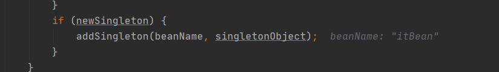

[toc]

# 一、容器启动主流程:

## 1.Spring容器加载的时机

**tomcat启动加载web.xml，配置ServletContext监听器加载applicationContext.xml去初始化Spring容器**


## 2.xml启动和注解启动区别

**AnnotationConfigApplicationContext(Class<?>)启动**


**ClassPathXmlApplicationContext("classpath:applicationContext.xml")启动**


**注解启动方式跟xml启动方式大同小异，区别在于AnnotationConfigApplicationContext容器在启动时，会多做一些初始化工作，创建一个beanDefinition读取器和扫描器**


最终都会调用**org.springframework.context.support.AbstractApplicationContext#refresh**，去刷新容器


## 3.AnnotationConfigApplicationContext启动的额外步骤 

### 		    3.1 加载默认后置处理器到注册器(就是一个Map)

通过**AnnotatedBeanDefinitionReader**调用AnnotationConfigUtils.registerAnnotationConfigProcessors(this.registry)，往beanDefinitionMap注册一些后置处理器，如：**BeanDefinitionRegistryPostProcessors**，用于后续加载解析bean注解配置


### 		    3.2 加载ClassPathBeanDefinitionScanner扫描器，用于扫描配置路径下所有的bean

### 		    3.3 注册启动配置类到beanDefinitionMap中


## 4. 创建bean工厂、解析bean文件（注解启动不走这步）

### 		    4.1.刷新容器，如果存在工厂，则销毁所有bean，关闭工厂（beanFactory属性置null）


### 		    4.2.beanFactory实例化（DefaultListableBeanFactory类型）；


### 		    4.3.doLoadBeanDefinitions()方法创建XmlBeanDefinitionReader读取器，来加载资源并解析xml的bean，封装成BeanDefinition对象注册到注册器中


### 		    4.4.将BeanDefinition装饰后，id作为key，注册到beanDefinitionMap中，


## 5.配置bean工厂上下文

配置上下文的ClassLoader、beanFactoryPostProcesser后置处理器


## 6.执行BeanFactoryPostProcessor做后置处理（注解启动方式）


#### 	 	    6.1 执行BeanDefinitionRegistryPostProcessors进行BeanDefinition注册


#### 6.2 ConfigurationClassPostProcessor#processConfigBeanDefinitions方法中调用ConfigurationClassParser#parse(Set<BeanDefinitionHolder>)


#### 6.3 ConfigurationClassParser#parse最终执行ConfigurationClassParser#doProcessConfigurationClass方法，处理@PropertySource、@ComponentScan、@Import、@Bean等注解，通过扫描解析或读取注解值得到所有bean的反射对象并存储


**ConfigurationClassParser#doProcessConfigurationClass方法执行ConfigurationClassParser#processImports进行递归扫描所有@Import注解**

**processImports方法中调用getImports获得所有@Import注解的value得到bean的反射对象进行存储**


#### 6.4 返回步骤-6.2执行ConfigurationClassParser#processDeferredImportSelectors()，执行从@Import注解得到的ImportSelector组件（[详情查看SpringBoot自动配置源码剖析](../../Spring Boot/SpringBoot源码剖析)）


**具体逻辑是：调用DeferredImportSelectorGrouping#getImports**，然后通过ImportSelector解析spring.factories文件下所有需自动配置的全限定类名，然后根据条件过滤（[详情查看SpringBoot自动配置源码剖析](../../Spring Boot/SpringBoot源码剖析)）


#### 6.5 最后返回步骤-6.2将得到的所有bean信息（包含自动配置bean）注册到beanDefinition注册表中ConfigurationClassBeanDefinitionReader#loadBeanDefinitions


## 7.注册BeanPostProcessor后置处理器进bean工厂


## 8.初始化消息源、事件、监听器

## 9.处理特殊bean

**如SpringMVC九大组件初始化、Tomcat初始化入口**


## 10.实例化所有剩余的（非延迟初始化）单例。


#### 	    1.通过bean工厂获得所有beansName

#### 	    2.bean工厂合并beanDefinitionMap后遍历BeanDefinition，非抽象、单例、非延迟则调用bean工厂的getBean()


#### 	    3.从缓存中取bean A，若没有则实例化加载bean A，若开启循环依赖，则提前暴露，封装成工厂对象放到三级缓存singletonFactories中


#### 	    4.bean A继续往下装配属性，发现依赖引用属性B，调用getBean(Bname)去获取bean B；


#### 	    5.（重复A的过程）从缓存中取bean B，若没有则实例化，若开启循环依赖，则提前暴露，封装成工厂对象放到三级缓存singletonFactories（[查看三级缓存详情](#二、三级缓存解决SpringIoC循环依赖思路图)）


#### 	    6.bean B继续往下装配属性，发现依赖引用属性bean A，调用getBean(Aname)，发现三级缓存中有bean A，通过工厂对象得到扩展后的A，并放入二级缓存earlysingletonFactories中，bean B装配扩展后的A，然后继续往下初始化，最后bean B放入单例池singletonObjects中





#### 	    7.bean A装配完属性B后，A继续往下进行初始化，最后放入了单例池singletonObjects中


#### 	    8.调用Aware实现类并执行方法

#### 	    9.调用bean后置处理器的before方法

#### 	    10.调用其他三个初始化方法(@PostConstruct、Beaninitliazation、init-method)

#### 	    11.调用bean后置处理器的after方法

#### 	    12.bean回调

​	实现SmartInitializingSingleton的bean可调用afterSingletonsInstantiated方法做实例化后的处理


# 二、三级缓存解决SpringIoC循环依赖思路图

### 为什么需要三级缓存？

解决：循环依赖及循环依赖中代理对象生成时机的问题

方案：提前暴露+三级缓存

场景：A在AOP的切面中，A与B相互依赖，那么B中装配的A是代理后的A还是原始A？

**若bean存在aop通知，则工厂对象返回的其实是一个代理对象**

1. 创建bean A，实例化后，提前暴露放入缓存，放入一个工厂对象A到三级缓存中，装配属性B


2. 属性B实例化，放入一个工厂对象B到三级缓存中，装配属性A

3. 从三级缓存中取出工厂对象A，并通过一个名为proxy啥的后置处理器，得到代理后的A放入二级缓存，清空三级缓存的A，B装配代理后的A，B存入一级缓存，清空三级缓存的B，返回

4. 将A原来的引用指向从二级缓存取出的代理后的A，装配成熟的B，成熟的A放入一级缓存，清空二级缓存的A

以上流程，可知二级缓存为扩展机制预留一个空间，存放bean的中间状态如：代理对象


提前暴露：解决“bean A在创建过程中装配属性时，其属性反过来依赖正在创建的A”问题，可从缓存中取尚未成熟的A

三级缓存：尽量延缓代理对象的产生时机，使用三级缓存存放工厂对象，在循环依赖时可直接取出工厂对象扩展后的A

优势：若A被反向依赖，则二级缓存可存放early A（被代理），返回A创建流程后可直接使用early A覆盖正在创建的A对象；若没被反向依赖，则二级缓存不会友early A，则A可在最后初始化的时候生成代理对象。


# 三、延迟加载的时机

非抽象、单例、延迟加载的bean，外部调用beanFactory.getBean()的时候实例化，底层调用的还是是doGetBean()

非抽象、单例、非延迟加载的bean，在容器启动的时候就加载了

原型bean（多例），不由容器管理，若延迟加载则抛异常。在需要的时候直接实例化返回


# 四、SpringIoC容器族谱

IoC容器是Spring的核⼼模块，是抽象了对象管理、依赖关系管理的框架解决⽅案。Spring 提供了很多的容器，其中BeanFactory 是顶层容器（根容器），不能被实例化，它定义了所有IoC 容器 必须遵从的⼀套原则，具体的容器实现可以增加额外的功能，⽐如我们常⽤到的ApplicationContext

其下更具体的实现如ClassPathXmlApplicationContext 包含了解析xml 等⼀系列的内容，
AnnotationConfigApplicationContext 则是包含了注解解析等⼀系列的内容。

Spring IoC 容器继承体系⾮常聪明，需要使⽤哪个层次⽤哪个层次即可，不必使⽤功能⼤⽽全的。


# 五、Web启动Spring源码解析

Tomcat启动加载web.xml，ServletContextListener监听器读取applicationContext.xml，执行Spring容器初始化，[进入容器启动流程](#一、容器启动主流程:)

SpringMVC启动流程：Spring容器启动后，Tomcat启动加载web.xml，Servlet初始化时读取springmvc.xml，执行SpringMVC容器初始化，将Spring容器作为父类容器，[进入容器启动流程](#一、容器启动主流程:)。SpringMVC容器可使用Parent容器的bean

#### 1.Spring通过配置监听器继承ServletContextListener接口，在容器启动时初始化应用上下文，并保存到servlet上下文中

```java
public class ContextLoaderListener extends ContextLoader implements ServletContextListener {

	public ContextLoaderListener() {
	}

	public ContextLoaderListener(WebApplicationContext context) {
		super(context);
	}

	/**
	 * Initialize the root web application context.初始化ApplicationContext
	 */
	@Override
	public void contextInitialized(ServletContextEvent event) {
		initWebApplicationContext(event.getServletContext());
	}

	/**
	 * Close the root web application context.
	 */
	@Override
	public void contextDestroyed(ServletContextEvent event) {
		closeWebApplicationContext(event.getServletContext());
		ContextCleanupListener.cleanupAttributes(event.getServletContext());
	}
```

#### 2.执行org.springframework.web.context.ContextLoader#initWebApplicationContext进行Spring容器的初始化


#### 3.通过在web.xml中配置的启动类型来判断实例化哪个容器对象


#### 4.这里设置父类容器默认为null


#### 5.刷新容器，[进入容器启动过程](#一、容器启动主流程:)


# 六、@Bean注解源码解析（待源码解析）

**@Bean配合@Configuration，用于三方类注册到Spring容器中**

提示：扫描@componentScan配置的bean路径，遍历所有类；通过反射获得带@Configuration注解的类，创建cglib动态代理对象对@Bean方法进行逻辑增强，执行所有带@Bean的方法，增强逻辑实现类的逻辑是：

1. 先从容器取bean
2. 若没则执行mothodProxy的方法（防止代理对象中方法互相调用导致不走增强逻辑）
3. 将方法名作为beanName，返回对象作为bean，存入容器

为什么这里使用cglib动态代理而不是jdk动态代理？

因为jdk动态代理的InvocationHandler实现增强逻辑接口，只提供了代理本身、委托对象被执行的方法和入参。而cglib额外提供了委托对象被执行方法的代理方法。因此，避免了代理对象中方法互相调用导致的代理失效（同类方法互调的是对象原方法，而不是代理对象方法）
