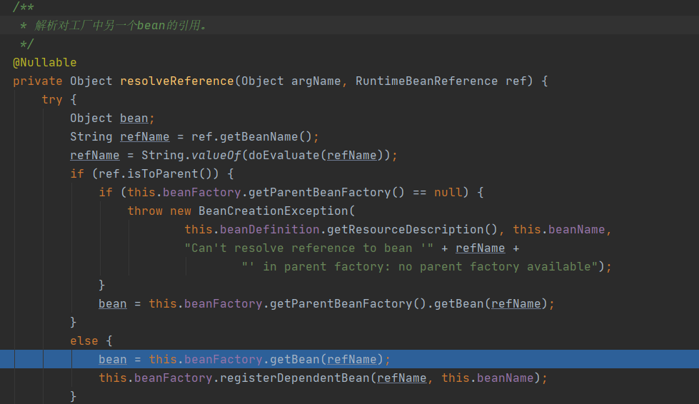

[toc]

# 一、容器启动主流程:

## 1.xml启动和注解启动区别

**AnnotationConfigApplicationContext(Class<?>)启动**

**ClassPathXmlApplicationContext("classpath:applicationContext.xml")启动**

**注解启动方式跟xml启动方式大同小异，区别在于AnnotationConfigApplicationContext容器在启动时，会多做一些初始化工作**

最终都会调用**org.springframework.context.support.AbstractApplicationContext#refresh**，去刷新容器

## 2.AnnotationConfigApplicationContext启动的额外步骤 

### 	2.1 加载默认后置处理器到注册器

通过**AnnotatedBeanDefinitionReader**调用AnnotationConfigUtils.registerAnnotationConfigProcessors(this.registry)，往beanDefinitionMap注册一些后置，如：**BeanDefinitionRegistryPostProcessors**，用于后续加载解析bean注解配置

### 	2.2 加载ClassPathBeanDefinitionScanner扫描器，用于扫描配置路径下所有的bean

### 	2.3 注册启动配置类到beanDefinitionMap中

## 3. 创建bean工厂、解析bean文件（注解启动不走这步）

### 	3.1.刷新容器，如果存在工厂，则销毁所有bean，关闭工厂（beanFactory属性置null）

### 	3.2.beanFactory实例化（DefaultListableBeanFactory类型）；

### 	3.3.doLoadBeanDefinitions加载并解析xml或注解定义的bean，封装成BeanDefinition对象

### 	3.4.将BeanDefinition装饰后，id作为key，保存到beanDefinitionMap中，并注册到registerBeanDefinitions对象中

## 4.配置bean工厂上下文

配置上下文的ClassLoader、beanFactoryPostProcesser后置处理器

## 5.执行BeanFactoryPostProcessor做后置处理（注解启动方式）

### 	 执行BeanDefinitionRegistryPostProcessors处理BeanDefinition注册

​		根据是否含@Component、@ComponentScan注解判断是否启动配置类

​		最终执行**org.springframework.context.annotation.ConfigurationClassParser#doProcessConfigurationClass**，解析启动配置类，扫描包下所有bean注册到注册表

## 6.注册BeanPostProcessor后置处理器进bean工厂

## 7.初始化消息源、事件、监听器

## 8.实例化所有剩余的（非延迟初始化）单例。

### 	8.1.通过bean工厂获得所有beansName

### 	8.2.bean工厂合并beanDefinitionMap后遍历BeanDefinition，非抽象、单例、非延迟则调用bean工厂的getBean()

### 	8.3.从缓存中取bean A，若没有则实例化加载bean A，若开启循环依赖，则提前暴露，封装成工厂对象放到三级缓存singletonFactories中

### 	8.4.bean A继续往下装配属性，发现依赖引用属性B，调用getBean(Bname)去获取bean B；

### 	8.5.（重复A的过程）从缓存中取bean B，若没有则实例化，若开启循环依赖，则提前暴露，封装成工厂对象放到三级缓存singletonFactories

### 	8.6.bean B继续往下装配属性，发现依赖引用属性bean A，调用getBean(Aname)，发现三级缓存中有bean A，通过工厂对象得到扩展后的A（详情请看第五点的三级缓存），并放入二级缓存earlysingletonFactories中，bean B装配扩展后的A，然后继续往下初始化，最后bean B放入单例池singletonObjects中

### 	8.7.bean A装配完属性B后，A继续往下进行初始化，最后放入了单例池singletonObjects中

### 	8.8.调用Aware实现类并执行方法

### 	8.9.调用bean后置处理器的before方法

### 	8.10.调用其他三个初始化方法(@PostConstruct、Beaninitliazation、init-method)

### 	8.11.调用bean后置处理器的after方法

### 	8.12.bean回调

​	实现SmartInitializingSingleton的bean可调用afterSingletonsInstantiated方法做实例化后的处理

# 二、三级缓存解决SpringIoC循环依赖思路图

为什么需要三级缓存？

现在有一个场景，A在AOP的切面中，A与B相互依赖，那么B中装配的A是代理后的A还是原始A？

当然是装配代理后的A

1. A实例化完后，放入一个工厂对象A到三级缓存中，装配属性B

2. 属性B实例化，放入一个工厂对象B到三级缓存中，装配属性A

3. 从三级缓存中取出工厂对象A，并通过一个名为proxy啥的后置处理器，得到代理后的A放入二级缓存，清空三级缓存的A，B装配代理后的A，B存入一级缓存，清空三级缓存的B，返回

4. 将A原来的引用指向从二级缓存取出的代理后的A，装配成熟的B，成熟的A放入一级缓存，清空二级缓存的A

以上流程，可知二级缓存为扩展机制预留一个空间，存放bean的中间状态如：代理对象

# 二、延迟加载的时机

非抽象、单例、延迟加载的bean，外部调用beanFactory.getBean()的时候实例化，底层调用的还是是doGetBean()

非抽象、单例、非延迟加载的bean，在容器启动的时候就加载了

原型bean（多例），不由容器管理，若延迟加载则抛异常。在需要的时候直接实例化返回

# 三、SpringIoC容器族谱

IoC容器是Spring的核⼼模块，是抽象了对象管理、依赖关系管理的框架解决⽅案。Spring 提供了很多的容器，其中BeanFactory 是顶层容器（根容器），不能被实例化，它定义了所有IoC 容器 必须遵从的⼀套原则，具体的容器实现可以增加额外的功能，⽐如我们常⽤到的ApplicationContext

其下更具体的实现如ClassPathXmlApplicationContext 包含了解析xml 等⼀系列的内容，
AnnotationConfigApplicationContext 则是包含了注解解析等⼀系列的内容。

Spring IoC 容器继承体系⾮常聪明，需要使⽤哪个层次⽤哪个层次即可，不必使⽤功能⼤⽽全的。

