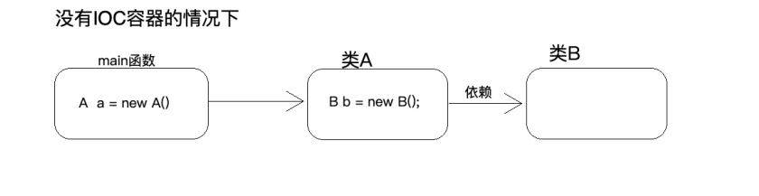
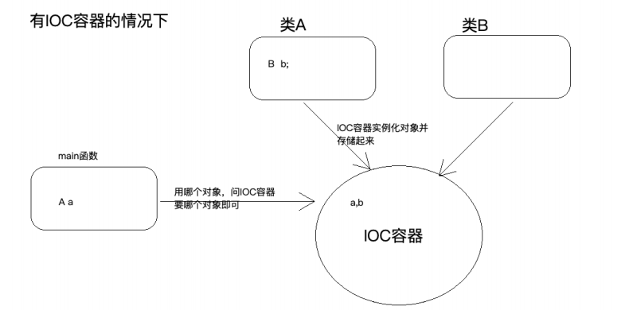
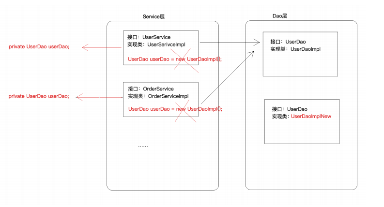
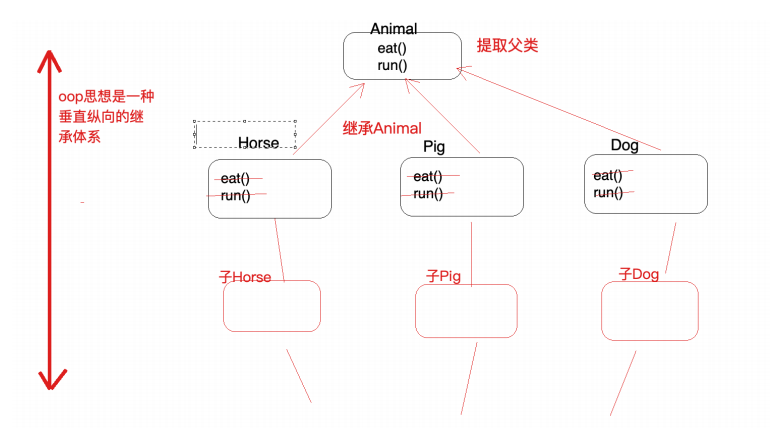
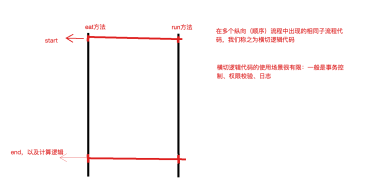
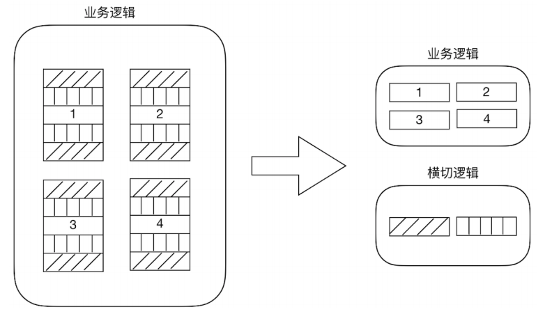

[TOC]

# 一、先抛出几个问题，供大家思考

## 问题1

​	传统开发方式中，需要调用外部方法时都要new一个对象，如果调用地方多或者功能变更，如DAO层改为Mybatis。对每⼀个new 的地⽅都需要修改源代码，重新编译，很是麻烦，如何才能⾯向接⼝开发？

## 问题2

​	servlet层的对象是在Web容器访问时被创建的，不被IoC容器管理，那么spring mvc的controller是怎么通过注解得到service层的？

## 问题3

​	在MVC架构中Service层可能会调用多个dao方法，如何确保同一个线程调用栈的JDBC连接是同一个，如何对事务进行管理控制

## 问题4

​	如果有成百上千个service层需要事务控制，难道要每个方法都要执行关闭autoCommit（可全局配置关闭）、commit事务、异常rollback？


# 一、IoC

## 1.1 什么是IoC

**IoC**：Inversion of Control (控制反转/反转控制)，它是⼀个技术思想，不是⼀个技术实现

**控制**：指的是对象创建（实例化、管理）的权利

**反转**：控制权交给外部环境了（spring框架、IoC容器）

**描述的事情**：Java开发领域对象的创建，管理的问题

**传统开发⽅式**：⽐如类A依赖于类B，往往会在类A中new⼀个B的对象



**IoC思想下开发⽅式**：我们不⽤⾃⼰去new对象了，⽽是由IoC容器（Spring框架）去帮助我们实例化对象并且管理它，我们需要使⽤哪个对象，去问IoC容器要即可



## 1.2 IoC解决什么问题

使用Ioc注入依赖的接口类型，即可得到接口对应的实现类bean，可以在不改动代码的情况下修改Dao层。

因此，**大大降低了类之间的耦合问题**



## 1.3 IoC和DI之间有什么区别吗？

**IoC**：控制反转（IoC站在对象的角度，将实例化和管理的权力交给了容器）

**DI**：Dependancy Injection依赖注入（DI站在容器的角度，将对象依赖的其他对象注入到这个对象中）

两者描述的都是**对象实例化和依赖维护的关系**，区别在于描述的角度不同。


# 二、OOP

​	**OOP是一种面向对象编程思想**

​	**OOP三⼤特征：封装、继承和多态**

​	**OOP是⼀种垂直继承体系，抽取相同属性、行为到父类，可以解决大多数纵向代码重复问题**

​	**但是，多个⽅法中相同位置出现了重复代码，这种横切逻辑代码OOP解决不了**




# 三、AOP

## 2.1 什么是AOP

​	**AOP**是OOP的延续

​	**AOP**: Aspect oriented Programming **⾯向切⾯编程/⾯向⽅⾯编程**

​	切：指的是横切逻辑，原有业务逻辑代码我们不能动，只能操作横切逻辑代码，所以⾯向横切逻辑
​	⾯：横切逻辑代码往往要影响的是很多个⽅法，每⼀个⽅法都如同⼀个点，多个点构成⾯，有⼀个⾯的概念在⾥⾯

​	

## 2.2 AOP解决什么问题

​	上面说到OOP无法解决多个方法相同位子出现重复代码的问题

​	**AOP**：在不改变原有业务逻辑的情况下，增强横切逻辑，横切逻辑代码往往是权限校验代码、⽇志代码、事务控制代码、性能监控代码。

​	**解决横切逻辑代码重复问题，将业务代码与横切逻辑代码解耦**




​    


# 四、IOC和AOP实现思路

1. 核心思想是创建一个beanFactory，解析定义了bean相关配置的文件，实例化bean对象放入map中
   1. 扫描路径下所有包含注解的对象，根据定义的beanName和反射对象放入BeanDefinition中
   2. getBean方法提供三级缓存
   3. 若注入依赖类型为接口类型，则从BeanDefinition中找到接口对应的bean
   4. 提供类名第一个字母小写方法
   5. 提供动态代理封装事务管理
2. 定义bean，有xml定义和注解定义两种
   1. xml：创建beans.xml，定义bean的唯一标识和全限定类名，以及提供所依赖bean的唯一标识（xml配置方式）
   2. 注解：自定义@AutoWired、@Component、@Service、@Repository、@ComponentScan、@Transactional
3. 创建连接管理ConnectionUtils，使用threadLocal保证线程上下文的JDBC是同一个连接，这里的dataSource暂时写死。有兴趣可以自己实现@Bean注解将三方类交由Spring托管，@PropertySource（引入外部资源），如：德鲁伊的连接池，然后在ConnectionUtils中注入连接池依赖
4. 创建事务管理TransactionManager，提供事务关闭自动提交、提交事务、回滚事务
5. 创建一个代理工厂ProxyFactory，提供JDK动态代理和cglib动态代理，对需要事务控制的bean进行代理
6. 创建一带@ComponentScan注解的配置类，定义了bean的路径，作为容器启动的入口。
7. 创建Servlet监听器，在Servlet启动的时候，触发容器的启动
8. 测试类以及MVC层，因为servlet层由web容器放问时创建，所以无法使用IoC注入，只能使用getBean获得servlet


# 五、自定义IoC和AOP

### 1.1 BeanFactory

​	**BeanFactory**：IOC容器顶级接口，定义了bean基本管理标准

```java
import java.io.IOException;

/**
 * @description:IOC容器顶级接口
 * @author: Wangwentao
 * @create: 2021-06-17 10:12
 **/
public interface BeanFactory {

    Object getBean(String beanName);
    void start(Class<?> clazz) throws IOException, ClassNotFoundException;
}

```

**AbstractBeanFactory**：容器接口实现模板

​	提供getBean实现，解决循环依赖问题的三级缓存实现

​	若注入依赖类型为接口类型，则从BeanDefinition中找到接口对应的bean

​	提供类名第一个字母大写方法

```java
package com.tangdi.factory;


import com.alibaba.druid.util.StringUtils;
import com.tangdi.annotation.Autowired;
import com.tangdi.annotation.Component;
import com.tangdi.annotation.Repository;
import com.tangdi.annotation.Service;

import java.io.IOException;
import java.lang.reflect.Field;
import java.util.HashMap;
import java.util.Map;
import java.util.Set;

/**
 * @program: lagou-transfer
 * @description:
 * @author: Wangwt
 * @create: 21:02 2021/6/17
 */
public abstract class AbstractBeanFactory implements BeanFactory {

    protected static String ROOT_WEB_APPLICATION_CONTEXT_ATTRIBUTE = BeanFactory.class.getName() + ".ROOT";
    protected static final String PROXY_FACTORY = "proxyFactory";


    /**
     * 单例池
     */
    protected static final Map<String,Object> singletonObjects = new HashMap<>();
    /**
     * 二级缓存
     */
    protected static final Map<String,Object> singletonFactories = new HashMap<>();
    protected static final Map<String,Class<?>> beanNames = new HashMap<>();


    /**
     * 加载容器
     * @param clazz
     * @throws IOException
     * @throws ClassNotFoundException
     */
    @Override
    public void start(Class<?> clazz) throws IOException, ClassNotFoundException {
        // 加载配置类获取所有扫描路径的class文件
        loadConfig(clazz);
        for (String beanName : beanNames.keySet()) {
            // 通过getbean加载所有bean
            getBean(beanName);
        }

        // 封装事务的代理对象
        // 此时事务代理对象无法注入到属性依赖中（A依赖B，B是先创建的原类型对象，单例池中的B才是代理对象）
        // 因为servlet层暂时没有实现被IoC容器管理，而是直接在servlet层获取beanFactory去单例池拿的service的代理对象，所以能起到管理事务的作用
        // 后续有时间的话再改进
        // TODO 1.在getBean方法实例化bean对象后，通过该方法包装后，将包装后的bean对象然后放入三级缓存（若需代理则放入的是代理对象，否则是实例化后的对象）
        // TODO 2.实例化得到的原bean对象继续装配属性，调用的getBean创建bean或从缓存中取bean，可得到代理后的bean，然后注入到Field中
        // TODO 3.getBean第一步获取缓存，先从三级缓存获取，若有值则将值存入二级缓存，并返回
        // TODO 4.装配完后从二级缓存中取bean，若二级中有bean，则说明当前bean存在代理后的对象，将代理后对象覆盖原来的实例化来的bean
        // TODO 5.将最终成熟的bean存入单例池中，同时清除二级三级缓存
        transactionProxy();
    }

    protected abstract void loadConfig(Class<?> clazz) throws IOException, ClassNotFoundException;

    protected abstract void transactionProxy();

    @Override
    public Object getBean(String beanName) {
        try {
            // 从缓存池中取bean
            Object singleton = getSingleton(beanName);
            if (singleton != null){
                return singleton;
            }

            // 根据构造函数实例化对象
            Class<?> aClass = beanNames.get(beanName);
            Object o = aClass.newInstance();

            // 存储到二级缓存
            addSingletonFactories(beanName,o);

            // 装配引用属性
            Field[] fields = aClass.getDeclaredFields();
            for (Field field : fields) {
                String fieldBeanName;
                boolean annotationAutowired = field.isAnnotationPresent(Autowired.class);
                if (annotationAutowired){
                    field.setAccessible(true);
                    Class<?> fieldDeclaringClass = field.getType();

                    // 属性类型为接口
                    if (fieldDeclaringClass.isInterface()){
                        // 匹配对应接口的实现类
                        fieldBeanName = searchInstance(fieldDeclaringClass);
                    }
                    // 属性类型为实现类
                    else {
                        fieldBeanName = getBeanName(fieldDeclaringClass);
                    }

                    Object bean = getBean(fieldBeanName);

                    field.set(o,bean);
                }
            }

            // 存入单例池
            addSingletonObjects(beanName,o);

            return o;
        } catch (Exception e) {
            e.printStackTrace();
        }
        return null;
    }

    protected void addSingletonObjects(String beanName,Object o){
        singletonObjects.put(beanName,o);
        singletonFactories.remove(beanName);
    }

    protected void addSingletonFactories(String beanName,Object o){
        if (!singletonObjects.containsKey(beanName)){
            singletonFactories.put(beanName,o);
        }
    }

    protected Object getSingleton(String beanName){
        Object o = singletonObjects.get(beanName);
        if (o == null){
            o = singletonFactories.get(beanName);
        }
        return o;
    }

    protected String searchInstance(Class<?> fieldDeclaringClass) {
        Set<String> keys = beanNames.keySet();
        for (String beanName : keys) {
            Class<?> instance = beanNames.get(beanName);
            if (!instance.isInterface()){
                Class<?>[] interfaces = instance.getInterfaces();
                for (Class<?> i : interfaces) {
                    if (i.getName().equalsIgnoreCase(fieldDeclaringClass.getName())){
                        return beanName;
                    }
                }
            }

        }
        return null;
    }


    protected String getBeanName(Class<?> aClass) {
        // 根据@Component、@Service、@Repository定义是否为bean
        String beanName = null;
        boolean annotationComponent = aClass.isAnnotationPresent(Component.class);
        boolean annotationService = aClass.isAnnotationPresent(Service.class);
        boolean annotationRepository = aClass.isAnnotationPresent(Repository.class);
        if (annotationComponent){
            Component component = aClass.getAnnotation(Component.class);
            beanName = convertClassName(aClass, component.value());
        } else if (annotationService){
            Service service = aClass.getAnnotation(Service.class);
            beanName = convertClassName(aClass, service.value());
        } else if (annotationRepository){
            Repository repository = aClass.getAnnotation(Repository.class);
            beanName = convertClassName(aClass, repository.value());
        }
        return beanName;
    }

    protected String convertClassName(Class<?> aClass, String value) {
        if (StringUtils.isEmpty(value)) {
            String name = aClass.getSimpleName();
            value = name.substring(0, 1).toLowerCase() + name.substring(1);
        }
        return value;
    }
}

```

**AnnotationConfigApplicationContext**：注解管理bean容器实现

​	扫描配置类中@ComponentScan定义的bean路径

​	解析含注解定义的类，将beanName(注解有定义，则则使用类名-第一个字母小写作为beanName)

​	解析@Transaction注解的类，创建需要事务管理的代理对象

```java
import com.alibaba.druid.util.StringUtils;
import com.tangdi.factory.AbstractBeanFactory;
import com.tangdi.factory.BeanFactory;
import com.tangdi.factory.ProxyFactory;
import com.tangdi.utils.ResourcesScanner;
import com.tangdi.annotation.ComponentScan;
import com.tangdi.annotation.Transactional;


import javax.servlet.ServletContext;
import java.io.IOException;

import java.util.*;

/**
 * @program: lagou-transfer
 * @description:
 * @author: Wangwentao
 * @create: 2021-06-17 11:12
 **/
public class AnnotationConfigApplicationContext extends AbstractBeanFactory {

    public AnnotationConfigApplicationContext(Class<?> clazz) {
        this(clazz,null);
    }

    public AnnotationConfigApplicationContext(Class<?> clazz, ServletContext servletContext) {
        try {
            start(clazz);
            if (servletContext != null){
                servletContext.setAttribute(AnnotationConfigApplicationContext.ROOT_WEB_APPLICATION_CONTEXT_ATTRIBUTE,this);
            }
        } catch (IOException e) {
            e.printStackTrace();
        } catch (ClassNotFoundException e) {
            e.printStackTrace();
        }
    }

    /**
     * 加载配置类
     * @param clazz
     * @throws IOException
     * @throws ClassNotFoundException
     */
    @Override
    public void loadConfig(Class<?> clazz) throws IOException, ClassNotFoundException {
        List<String> list = new ArrayList<>();

        // 扫描ComponentScan注解配置路径下所有class文件
        boolean annotationPresent = clazz.isAnnotationPresent(ComponentScan.class);
        if (annotationPresent){
            ComponentScan annotation = clazz.getAnnotation(ComponentScan.class);
            String[] pathArray = annotation.value();
            for (String path : pathArray) {
                ResourcesScanner.doScanClass(list,path);
            }
        }
        for (String className : list ) {
            // 通过反射技术实例化对象
            Class<?> aClass = Class.forName(className);
            String beanName = getBeanName(aClass);


            if (!StringUtils.isEmpty(beanName)){
                beanNames.put(beanName,aClass);
            }
        }
    }

    /**
     * 事务代理
     */
    @Override
    protected void transactionProxy() {
        for (String beanName : beanNames.keySet()) {

            Class<?> aClass = beanNames.get(beanName);
            Class<?>[] interfaces = aClass.getInterfaces();
            boolean transactionalPresent = aClass.isAnnotationPresent(Transactional.class);
            if (transactionalPresent) {
                // 获得代理工厂
                ProxyFactory proxyFactory = (ProxyFactory) getSingleton(PROXY_FACTORY);

                // 实现接口使用jdk动态代理
                if (interfaces.length > 0){
                    Object transactionalProxy = proxyFactory.getJdkProxy(getSingleton(beanName));
                    addSingletonObjects(beanName,transactionalProxy);
                }
                // 不实现接口使用cglib动态代理
                else {
                    Object transactionalProxy = proxyFactory.getCglibProxy(getSingleton(beanName));
                    addSingletonObjects(beanName,transactionalProxy);
                }
            }
        }
    }

    public static BeanFactory getContext(ServletContext servletContext){
        return (BeanFactory) servletContext.getAttribute(AnnotationConfigApplicationContext.ROOT_WEB_APPLICATION_CONTEXT_ATTRIBUTE);
    }

}

```


### 1.2 定义xml或者注解

beans.xml主要表述bean之间的依赖关系

```xml
<bean id="transferService" class="com.lagou.edu.service.impl.TransferServiceImpl">
	<property name="AccountDao" ref="accountDao"></property>
</bean>
```

注解定义

```java
import java.lang.annotation.*;

/**
 * @description:
 * @author: Wangwentao
 * @create: 2021-06-17 11:33
 **/
@Target({ElementType.CONSTRUCTOR, ElementType.METHOD, ElementType.PARAMETER, ElementType.FIELD, ElementType.ANNOTATION_TYPE})
@Retention(RetentionPolicy.RUNTIME)
@Documented
public @interface Autowired {


    boolean required() default true;

}


import java.lang.annotation.*;

/**
 * @description:
 * @author: Wangwentao
 * @create: 2021-06-17 11:34
 **/
@Target({ElementType.TYPE})
@Retention(RetentionPolicy.RUNTIME)
@Documented
public @interface Component {


    String value() default "";

}


import java.lang.annotation.*;

/**
 * @description:
 * @author: Wangwentao
 * @create: 2021-06-17 11:38
 **/
@Target({ElementType.TYPE})
@Retention(RetentionPolicy.RUNTIME)
@Documented
public @interface ComponentScan {

    String[] value() default "";
}


import java.lang.annotation.*;

/**
 * @description:
 * @author: Wangwentao
 * @create: 2021-06-17 11:33
 **/
@Target({ElementType.TYPE})
@Retention(RetentionPolicy.RUNTIME)
@Documented
public @interface Repository {


    String value() default "";

}


import java.lang.annotation.*;

/**
 * @description:
 * @author: Wangwentao
 * @create: 2021-06-17 11:32
 **/
@Target({ElementType.TYPE})
@Retention(RetentionPolicy.RUNTIME)
@Documented
public @interface Service {


    String value() default "";

}


import java.lang.annotation.*;

/**
 * @description:
 * @author: Wangwentao
 * @create: 2021-06-17 11:33
 **/
@Target({ElementType.TYPE, ElementType.METHOD})
@Retention(RetentionPolicy.RUNTIME)
@Inherited
@Documented
public @interface Transactional {

    String value() default "";
}

```


### 1.3 ConnectionUtils

1. 使用ThreadLocal保证线程上下文的连接是同一个

2. 提供获取getConnection()方法

3. 由于没实现@Bean，所以连接池的工具类时代码写死的

```java
   import com.lagou.edu.annotation.Component;
   
   import java.sql.Connection;
   import java.sql.SQLException;
   
   @Component
   public class ConnectionUtils {
   
       private ThreadLocal<Connection> threadLocal = new ThreadLocal<>(); // 存储当前线程的连接
   
       /**
        * 从当前线程获取连接
        */
       public Connection getCurrentThreadConn() throws SQLException {
           /**
            * 判断当前线程中是否已经绑定连接，如果没有绑定，需要从连接池获取一个连接绑定到当前线程
             */
               Connection connection = threadLocal.get();
               if(connection == null) {
                   // 从连接池拿连接并绑定到线程
                   connection = DruidUtils.getInstance().getConnection();
                   // 绑定到当前线程
                   threadLocal.set(connection);
               }
               return connection;
       }
   }
   
   
   import com.alibaba.druid.pool.DruidDataSource;
   
   
   public class DruidUtils {
   
       private DruidUtils(){
       }
   
       private static DruidDataSource druidDataSource = new DruidDataSource();
   
   
       static {
           druidDataSource.setDriverClassName("com.mysql.jdbc.Driver");
           druidDataSource.setUrl("jdbc:mysql://localhost:3306/demo_jpa");
           druidDataSource.setUsername("root");
           druidDataSource.setPassword("123456");
   
       }
   
       public static DruidDataSource getInstance() {
           return druidDataSource;
       }
   
   }
```


### 1.4 ResourcesScanner扫描器

```java
import org.slf4j.Logger;
import org.slf4j.LoggerFactory;

import java.io.*;
import java.net.JarURLConnection;
import java.net.URL;
import java.net.URLDecoder;
import java.util.*;
import java.util.jar.JarEntry;
import java.util.jar.JarFile;
import java.util.regex.Pattern;

/**
 * @program: transfer
 * @description: 扫描Class包
 * @author: Wangwentao
 * @create: 2021-06-17 11:09
 **/
public class ResourcesScanner {

    private static final Logger logger = LoggerFactory.getLogger(ResourcesScanner.class);

    public static final String CLASS_SUFFIX = ".class";
    private static final Pattern INNER_PATTERN = Pattern.compile("\\$(\\d+)", Pattern.CASE_INSENSITIVE);


    public static List<String> doScanClass(List<String> classNames,String path) throws IOException {

        String newpath = path.replace('.', '/');
        if (newpath.startsWith("/")){
            newpath = newpath.substring(1);
        }

        List<URL> urls = getResources(newpath);
        for (URL u : urls) {
            if (u == null){
                continue;
            }
            logger.info("[ResourcesScanner] doScan url:" + u.getFile());

            // IDEA中直接编译运行，则该资源目录为文件
            if ("file".equals(u.getProtocol())){
                File file = new File(URLDecoder.decode(u.getFile(), "utf-8"));
                File[] files = file.listFiles();
                if (files == null){
                    continue;
                }

                for (File f : files) {
                    String fileName = f.getName();
                    // 若为目录则继续解析
                    if (f.isDirectory()){
                        doScanClass(classNames,path+ "." + fileName);
                    }
                    else {
                        logger.info("[ResourcesScanner] doScan file:" + f.getPath());
                        if (fileName.endsWith(CLASS_SUFFIX) && !INNER_PATTERN.matcher(fileName).find()){
                            classNames.add(path+ "." + fileName.replace(".class",""));
                        }
                    }
                }
            }
            // 若将该项目打成jar包，则该资源目录为jar
            else if ("jar".equals(u.getProtocol())){
                // 获取Jar文件下所有条目
                JarFile jarFile = ((JarURLConnection) u.openConnection()).getJarFile();
                List<JarEntry> entries = Collections.list(jarFile.entries());
                for (JarEntry entry : entries) {
                    // 过滤内部类
                    if (entry.getName().replace('/','.').startsWith(path)
                            && !INNER_PATTERN.matcher(entry.getName()).find()
                            && entry.getName().endsWith(CLASS_SUFFIX)){
                        logger.info("[ResourcesScanner] doScan file:" + entry.getName());
                        classNames.add(entry.getName().replace(".class","").replace('/','.'));
                    }
                }
            }
        }
        return classNames;
    }

    private static List<URL> getResources(String path) throws IOException {
        return Collections.list(Thread.currentThread().getContextClassLoader().getResources(path));
    }
}
```


### 1.5 TransactionManager

​	提供事务管理，包括关闭自动提交、提交事务、回滚事务

```java
import com.lagou.edu.annotation.Autowired;
import com.lagou.edu.annotation.Component;

import java.sql.SQLException;

/**
 *
 * 事务管理器类：负责手动事务的开启、提交、回滚
 */
@Component
public class TransactionManager {

    @Autowired
    private ConnectionUtils connectionUtils;

    // 开启手动事务控制
    public void beginTransaction() throws SQLException {
        connectionUtils.getCurrentThreadConn().setAutoCommit(false);
    }


    // 提交事务
    public void commit() throws SQLException {
        connectionUtils.getCurrentThreadConn().commit();
    }


    // 回滚事务
    public void rollback() throws SQLException {
        connectionUtils.getCurrentThreadConn().rollback();
    }
}

```


### 1.6 ProxyFactory

1. 代理工厂提供多种代理对象的创建

2. 这里的代理主要用来做事务管控，依赖TransactionManager

   

```java
import com.lagou.edu.annotation.Autowired;
import com.lagou.edu.annotation.Component;
import com.lagou.edu.utils.TransactionManager;
import net.sf.cglib.proxy.Enhancer;
import net.sf.cglib.proxy.MethodInterceptor;
import net.sf.cglib.proxy.MethodProxy;

import java.lang.reflect.InvocationHandler;
import java.lang.reflect.Method;
import java.lang.reflect.Proxy;

/**
 *
 * 代理对象工厂：生成代理对象的
 */
@Component
public class ProxyFactory {

    @Autowired
    private TransactionManager transactionManager;


    /**
     * Jdk动态代理
     * @param obj  委托对象
     * @return   代理对象
     */
    public Object getJdkProxy(Object obj) {

        // 获取代理对象
        return  Proxy.newProxyInstance(obj.getClass().getClassLoader(), obj.getClass().getInterfaces(),
                new InvocationHandler() {
                    @Override
                    public Object invoke(Object proxy, Method method, Object[] args) throws Throwable {
                        Object result = null;

                        try{
                            System.out.println("方法："+method);
                            // 开启事务(关闭事务的自动提交)
                            transactionManager.beginTransaction();

                            result = method.invoke(obj,args);

                            // 提交事务

                            transactionManager.commit();
                        }catch (Exception e) {
                            e.printStackTrace();
                            // 回滚事务
                            transactionManager.rollback();

                            // 抛出异常便于上层servlet捕获
                            throw e;

                        }

                        return result;
                    }
                });

    }


    /**
     * 使用cglib动态代理生成代理对象
     * @param obj 委托对象
     * @return
     */
    public Object getCglibProxy(Object obj) {
        return  Enhancer.create(obj.getClass(), new MethodInterceptor() {
            @Override
            public Object intercept(Object o, Method method, Object[] objects, MethodProxy methodProxy) throws Throwable {
                Object result = null;
                try{
                    // 开启事务(关闭事务的自动提交)
                    transactionManager.beginTransaction();

                    result = method.invoke(obj,objects);

                    // 提交事务

                    transactionManager.commit();
                }catch (Exception e) {
                    e.printStackTrace();
                    // 回滚事务
                    transactionManager.rollback();

                    // 抛出异常便于上层servlet捕获
                    throw e;

                }
                return result;
            }
        });
    }
}

```

### 1.7 创建配置入口类

定义了bean的扫描路径，暂无实现@Bean注入三方类

```java
import com.alibaba.druid.pool.DruidDataSource;
import com.lagou.edu.annotation.ComponentScan;

import javax.sql.DataSource;


// @Configuration 注解表明当前类是一个配置类
//@Configuration
@ComponentScan({"com.lagou.edu"})
//@PropertySource({"classpath:jdbc.properties"})
public class SpringConfig {

//    @Value("${jdbc.driver}")
//    private String driverClassName;
//    @Value("${jdbc.url}")
//    private String url;
//    @Value("${jdbc.username}")
//    private String username;
//    @Value("${jdbc.password}")
//    private String password;
//
//
//    @Bean("dataSource")
//    public DataSource createDataSource(){
//        DruidDataSource druidDataSource = new DruidDataSource();
//        druidDataSource.setDriverClassName(driverClassName);
//        druidDataSource.setUrl(url);
//        druidDataSource.setUsername(username);
//        druidDataSource.setPassword(password);
//        return  druidDataSource;
//    }
}

```

### 1.8 创建Servlet监听器

**创建监听器类**

```java
import com.tangdi.SpringConfig;
import com.tangdi.factory.BeanFactory;
import org.slf4j.Logger;
import org.slf4j.LoggerFactory;

import javax.servlet.ServletContextEvent;
import javax.servlet.ServletContextListener;

/**
 * @program: lagou-transfer
 * @description: 自定义监听器
 * @author: Wangwentao
 * @create: 2021-06-17 10:38
 **/
public class MyContextLoaderListener implements ServletContextListener {

    private static final Logger logger = LoggerFactory.getLogger(MyContextLoaderListener.class);

    @Override
    public void contextInitialized(ServletContextEvent servletContextEvent) {
        long start = System.currentTimeMillis();
        logger.info("MyContextLoaderListener initialization start");
        BeanFactory context = new AnnotationConfigApplicationContext(SpringConfig.class,servletContextEvent.getServletContext());
        logger.info("MyContextLoaderListener initialization end in " + (System.currentTimeMillis() - start) + "ms");
    }

    @Override
    public void contextDestroyed(ServletContextEvent servletContextEvent) {

    }
}

```

**Web.xml中启用监听器**

```xml
<!DOCTYPE web-app PUBLIC
 "-//Sun Microsystems, Inc.//DTD Web Application 2.3//EN"
 "http://java.sun.com/dtd/web-app_2_3.dtd" >

<web-app>
  <display-name>Archetype Created Web Application</display-name>


  <!--使用监听器启动Spring的IOC容器-->
  <listener>
    <listener-class>com.lagou.edu.context.MyContextLoaderListener</listener-class>
  </listener>
</web-app>

```

### 1.9 测试类以及MVC层创建

**Servlet层**

```java
import com.lagou.edu.context.AnnotationConfigApplicationContext;
import com.lagou.edu.factory.BeanFactory;
import com.lagou.edu.utils.JsonUtils;
import com.lagou.edu.pojo.Result;
import com.lagou.edu.service.TransferService;

import javax.servlet.ServletException;
import javax.servlet.annotation.WebServlet;
import javax.servlet.http.HttpServlet;
import javax.servlet.http.HttpServletRequest;
import javax.servlet.http.HttpServletResponse;
import java.io.IOException;


@WebServlet(name="transferServlet",urlPatterns = "/transferServlet")
public class TransferServlet extends HttpServlet {


    private TransferService transferService;


    // 从servlet上下文中获取容器上下文
    // servlet不被IoC管理，所以只能使用getBean
    @Override
    public void init() throws ServletException {
        BeanFactory beanFactory = AnnotationConfigApplicationContext.getContext(this.getServletContext());
        transferService = (TransferService) beanFactory.getBean("transferServiceImpl");
    }


    @Override
    protected void doGet(HttpServletRequest req, HttpServletResponse resp) throws ServletException, IOException {
        doPost(req,resp);
    }

    @Override
    protected void doPost(HttpServletRequest req, HttpServletResponse resp) throws ServletException, IOException {

        // 设置请求体的字符编码
        req.setCharacterEncoding("UTF-8");

        String fromCardNo = req.getParameter("fromCardNo");
        String toCardNo = req.getParameter("toCardNo");
        String moneyStr = req.getParameter("money");
        int money = Integer.parseInt(moneyStr);

        Result result = new Result();

        try {

            // 2. 调用service层方法
            transferService.transfer(fromCardNo,toCardNo,money);
            result.setStatus("200");
        } catch (Exception e) {
            e.printStackTrace();
            result.setStatus("201");
            result.setMessage(e.toString());
        }

        // 响应
        resp.setContentType("application/json;charset=utf-8");
        resp.getWriter().print(JsonUtils.object2Json(result));
    }
}

```

**Service和Dao层**

```java
import com.lagou.edu.annotation.Autowired;
import com.lagou.edu.annotation.Service;
import com.lagou.edu.annotation.Transactional;
import com.lagou.edu.dao.AccountDao;
import com.lagou.edu.pojo.Account;
import com.lagou.edu.service.TransferService;


@Service
@Transactional
public class TransferServiceImpl implements TransferService {

    // 最佳状态
    @Autowired
    private AccountDao accountDao;


    @Override
    public void transfer(String fromCardNo, String toCardNo, int money) throws Exception {
        this.aaa()
        
        aaa(fromCardNo,toCardNo,money);
        Account from = accountDao.queryAccountByCardNo(fromCardNo);
        Account to = accountDao.queryAccountByCardNo(toCardNo);

        from.setMoney(from.getMoney()-money);
        to.setMoney(to.getMoney()+money);

        accountDao.updateAccountByCardNo(to);
		int c = 1/0;
        accountDao.updateAccountByCardNo(from);
    }

    @Override
    public void aaa(String fromCardNo, String toCardNo, int money) throws Exception {
        Account from = accountDao.queryAccountByCardNo(fromCardNo);
        Account to = accountDao.queryAccountByCardNo(toCardNo);

         from.setMoney(from.getMoney()-money);
        to.setMoney(to.getMoney()+money);

        accountDao.updateAccountByCardNo(to);
        // int c = 1/0;
        accountDao.updateAccountByCardNo(from);
    }
}

-----------------------------------------------分割线-------------------------------------------------------

import com.lagou.edu.annotation.Autowired;
import com.lagou.edu.annotation.Repository;
import com.lagou.edu.pojo.Account;
import com.lagou.edu.dao.AccountDao;
import com.lagou.edu.utils.ConnectionUtils;

import java.sql.Connection;
import java.sql.PreparedStatement;
import java.sql.ResultSet;


@Repository
public class JdbcAccountDaoImpl implements AccountDao {

    @Autowired
    private ConnectionUtils connectionUtils;


    @Override
    public Account queryAccountByCardNo(String cardNo) throws Exception {
        //从连接池获取连接
        // Connection con = DruidUtils.getInstance().getConnection();
        Connection con = connectionUtils.getCurrentThreadConn();
        String sql = "select * from account where cardNo=?";
        PreparedStatement preparedStatement = con.prepareStatement(sql);
        preparedStatement.setString(1,cardNo);
        ResultSet resultSet = preparedStatement.executeQuery();

        Account account = new Account();
        while(resultSet.next()) {
            account.setCardNo(resultSet.getString("cardNo"));
            account.setName(resultSet.getString("name"));
            account.setMoney(resultSet.getInt("money"));
        }

        resultSet.close();
        preparedStatement.close();
        //con.close();

        return account;
    }

    @Override
    public int updateAccountByCardNo(Account account) throws Exception {

        // 从连接池获取连接
        // 改造为：从当前线程当中获取绑定的connection连接
        //Connection con = DruidUtils.getInstance().getConnection();
        Connection con = connectionUtils.getCurrentThreadConn();
        String sql = "update account set money=? where cardNo=?";
        PreparedStatement preparedStatement = con.prepareStatement(sql);
        preparedStatement.setInt(1,account.getMoney());
        preparedStatement.setString(2,account.getCardNo());
        int i = preparedStatement.executeUpdate();

        preparedStatement.close();
        //con.close();
        return i;
    }
}
```


# 六、 关于问题的思考

## 问题1的思考

​	使用IoC实现控制反转将对象的管理交给容器，使用接口的类型注入依赖。**前提是实现类有且唯一**

## 问题2的思考

​	SpringMVC底层实现了通过ServletContext得到容器工厂，然后getBean获得service层

## 问题3的思考

​	使用ThreadLocal保证线程上下文得连接是同一个

## 问题4的思考

​	使用动态代理，去代理委托事务管理的类

