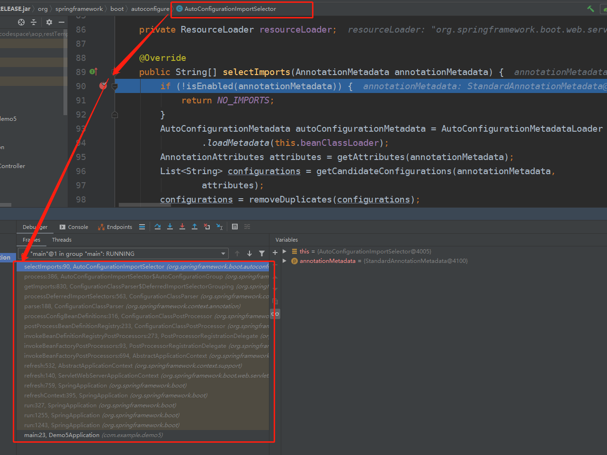

#### 简单说，以后再完善


大量反射、jdk动态代理（底层也是反射）、工厂模式、构建者模式、解析全局配置文件

大量接口定义行为、抽象类定义模板、实现、继承

大量使用有参构造函数传值


### 源码追踪

通过断点debug启动程序，观察调用栈

#### 如：springboo自动配置源码追踪

##### 1.进入开启自动配置的注解，进入@Import注册的自动配置核心组件AutoConfigurationImportSelector，在各个方法上断点

```java
@Target(ElementType.TYPE)
@Retention(RetentionPolicy.RUNTIME)
@Documented
@Inherited
@AutoConfigurationPackage
@Import(AutoConfigurationImportSelector.class)
public @interface EnableAutoConfiguration {
```

##### 2.debug启动springboot，查看调用栈即可研究自动配置的流程


