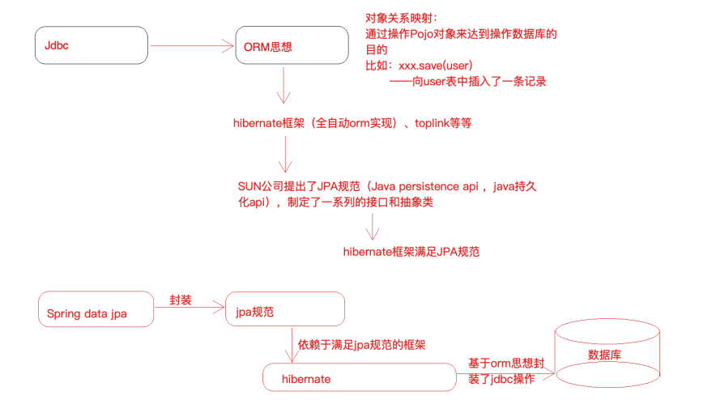

[toc]

### 一、Spring Data JPA 概述  

Spring Data JPA 是 Spring 基于JPA 规范的基础上封装的⼀套 JPA 应⽤框架，可使开发者⽤极简的代码即可实现对数据库的访问和操作。它提供了包括增删改查等在内的常⽤功能！学习并使⽤Spring Data JPA 可以极⼤提⾼开发效率。

**说明**： Spring Data JPA 极⼤简化了数据访问层代码。

如何简化呢？使⽤了Spring Data JPA，我们Dao层中只需要写接⼝，不需要写实现类，就⾃动具有了增删改查、分⻚查询等⽅法。使⽤Spring Data JPA 很多场景下不需要我们⾃⼰写sql语句  

### 二、Spring Data JPA， JPA规范和Hibernate之间的关系  

Spring Data JPA 是 Spring 提供的⼀个封装了JPA 操作的框架，⽽ JPA 仅仅是规范，单独使⽤规范⽆法具体做什么，那么Spring Data JPA 、 JPA规范 以及 Hibernate （JPA 规范的⼀种实现）之间的关系是什么？  




JPA 是⼀套规范，内部是由接⼝和抽象类组成的， Hiberanate 是⼀套成熟的 ORM 框架，⽽且Hiberanate 实现了 JPA 规范，所以可以称 Hiberanate 为 JPA 的⼀种实现⽅式，我们使⽤ JPA 的 API 编程，意味着站在更⾼的⻆度去看待问题（⾯向接⼝编程）。Spring Data JPA 是 Spring 提供的⼀套对 JPA 操作更加⾼级的封装，是在 JPA 规范下的专⻔⽤来进⾏数据持久化的解决⽅案。  

### 三、Spring Data JPA应用

##### 1.导入依赖

```xml
<dependencies>
        <!--单元测试jar-->
        <dependency>
            <groupId>junit</groupId>
            <artifactId>junit</artifactId>
            <version>4.12</version>
            <scope>test</scope>
        </dependency>


        <!--spring-data-jpa 需要引入的jar,start-->
        <dependency>
            <groupId>org.springframework.data</groupId>
            <artifactId>spring-data-jpa</artifactId>
            <version>2.1.8.RELEASE</version>
        </dependency>

        <dependency>
            <groupId>javax.el</groupId>
            <artifactId>javax.el-api</artifactId>
            <version>3.0.1-b04</version>
        </dependency>
        <dependency>
            <groupId>org.glassfish.web</groupId>
            <artifactId>javax.el</artifactId>
            <version>2.2.6</version>
        </dependency>
        <!--spring-data-jpa 需要引入的jar,end-->

        <!--spring 相关jar,start-->
        <dependency>
            <groupId>org.springframework</groupId>
            <artifactId>spring-aop</artifactId>
            <version>5.1.12.RELEASE</version>
        </dependency>
        <dependency>
            <groupId>org.aspectj</groupId>
            <artifactId>aspectjweaver</artifactId>
            <version>1.8.13</version>
        </dependency>
        <dependency>
            <groupId>org.springframework</groupId>
            <artifactId>spring-context</artifactId>
            <version>5.1.12.RELEASE</version>
        </dependency>
        <dependency>
            <groupId>org.springframework</groupId>
            <artifactId>spring-context-support</artifactId>
            <version>5.1.12.RELEASE</version>
        </dependency>

        <!--spring对orm框架的支持包-->
        <dependency>
            <groupId>org.springframework</groupId>
            <artifactId>spring-orm</artifactId>
            <version>5.1.12.RELEASE</version>
        </dependency>
        <dependency>
            <groupId>org.springframework</groupId>
            <artifactId>spring-beans</artifactId>
            <version>5.1.12.RELEASE</version>
        </dependency>
        <dependency>
            <groupId>org.springframework</groupId>
            <artifactId>spring-core</artifactId>
            <version>5.1.12.RELEASE</version>
        </dependency>
        <!--spring 相关jar,end-->


        <!--hibernate相关jar包,start-->
        <dependency>
            <groupId>org.hibernate</groupId>
            <artifactId>hibernate-core</artifactId>
            <version>5.4.0.Final</version>
        </dependency>
        <!--hibernate对jpa的实现jar-->
        <dependency>
            <groupId>org.hibernate</groupId>
            <artifactId>hibernate-entitymanager</artifactId>
            <version>5.4.0.Final</version>
        </dependency>
        <dependency>
            <groupId>org.hibernate</groupId>
            <artifactId>hibernate-validator</artifactId>
            <version>5.4.0.Final</version>
        </dependency>
        <!--hibernate相关jar包,end-->

        <!--mysql 数据库驱动jar-->
        <dependency>
            <groupId>mysql</groupId>
            <artifactId>mysql-connector-java</artifactId>
            <version>5.1.46</version>
        </dependency>
        <!--druid连接池-->
        <dependency>
            <groupId>com.alibaba</groupId>
            <artifactId>druid</artifactId>
            <version>1.1.21</version>
        </dependency>
        <!--spring-test-->
        <dependency>
            <groupId>org.springframework</groupId>
            <artifactId>spring-test</artifactId>
            <version>5.1.12.RELEASE</version>
        </dependency>
    </dependencies>
```

##### 2.spring的配置-applicationContext.xml

```xml
<?xml version="1.0" encoding="UTF-8"?>
<beans xmlns="http://www.springframework.org/schema/beans"
       xmlns:context="http://www.springframework.org/schema/context"
       xmlns:jpa="http://www.springframework.org/schema/data/jpa"
       xmlns:xsi="http://www.w3.org/2001/XMLSchema-instance"
       xsi:schemaLocation="
        http://www.springframework.org/schema/beans
        https://www.springframework.org/schema/beans/spring-beans.xsd
        http://www.springframework.org/schema/context
        https://www.springframework.org/schema/context/spring-context.xsd
        http://www.springframework.org/schema/data/jpa
        https://www.springframework.org/schema/data/jpa/spring-jpa.xsd
">

    <!--对Spring和SpringDataJPA进行配置-->

    <!--1、创建数据库连接池druid-->
            <!--引入外部资源文件-->
            <context:property-placeholder location="classpath:jdbc.properties"/>

            <!--第三方jar中的bean定义在xml中-->
            <bean id="dataSource" class="com.alibaba.druid.pool.DruidDataSource">
                <property name="driverClassName" value="${jdbc.driver}"/>
                <property name="url" value="${jdbc.url}"/>
                <property name="username" value="${jdbc.username}"/>
                <property name="password" value="${jdbc.password}"/>
            </bean>


    <!--2、配置一个JPA中非常重要的对象,entityManagerFactory
            entityManager类似于mybatis中的SqlSession
            entityManagerFactory类似于Mybatis中的SqlSessionFactory
    -->
            <bean id="entityManagerFactory" class="org.springframework.orm.jpa.LocalContainerEntityManagerFactoryBean">
                <!--配置一些细节.......-->

                <!--配置数据源-->
                <property name="dataSource" ref="dataSource"/>
                <!--配置包扫描（pojo实体类所在的包）-->
                <property name="packagesToScan" value="com.lagou.edu.pojo"/>
                <!--指定jpa的具体实现，也就是hibernate-->
                <property name="persistenceProvider">
                    <bean class="org.hibernate.jpa.HibernatePersistenceProvider"></bean>
                </property>
                <!--jpa方言配置,不同的jpa实现对于类似于beginTransaction等细节实现起来是不一样的，
                       所以传入JpaDialect具体的实现类-->
                <property name="jpaDialect">
                    <bean class="org.springframework.orm.jpa.vendor.HibernateJpaDialect"></bean>
                </property>


                <!--配置具体provider，hibearnte框架的执行细节-->
                <property name="jpaVendorAdapter" >
                    <bean class="org.springframework.orm.jpa.vendor.HibernateJpaVendorAdapter">
                        <!--定义hibernate框架的一些细节-->

                        <!--
                            配置数据表是否自动创建
                            因为我们会建立pojo和数据表之间的映射关系
                            程序启动时，如果数据表还没有创建，是否要程序给创建一下
                        -->
                        <property name="generateDdl" value="false"/>


                        <!--
                            指定数据库的类型
                            hibernate本身是个dao层框架，可以支持多种数据库类型的，这里就指定本次使用的什么数据库
                        -->
                        <property name="database" value="MYSQL"/>


                        <!--
                            配置数据库的方言
                            hiberante可以帮助我们拼装sql语句，但是不同的数据库sql语法是不同的，所以需要我们注入具体的数据库方言
                        -->
                        <property name="databasePlatform" value="org.hibernate.dialect.MySQLDialect"/>
                        <!--是否显示sql
                            操作数据库时，是否打印sql
                        -->
                        <property name="showSql" value="true"/>

                    </bean>
                </property>

            </bean>

    <!--3、引用上面创建的entityManagerFactory

             <jpa:repositories> 配置jpa的dao层细节
             base-package:指定dao层接口所在包
    -->
    <jpa:repositories base-package="com.lagou.edu.dao" entity-manager-factory-ref="entityManagerFactory"
                      transaction-manager-ref="transactionManager"/>


    <!--4、事务管理器配置
        jdbcTemplate/mybatis 使用的是DataSourceTransactionManager
        jpa规范：JpaTransactionManager

    -->
    <bean id="transactionManager" class="org.springframework.orm.jpa.JpaTransactionManager">
        <property name="entityManagerFactory" ref="entityManagerFactory"/>
    </bean>


    <!--5、声明式事务配置-->
    <!--
        <tx:annotation-driven/>
    -->

    <!--6、配置spring包扫描-->
    <context:component-scan base-package="com.lagou.edu"/>

</beans> 
    
```

##### 3.编写实体类，使⽤ JPA 注解配置映射关系  

**实体1**

```java
import javax.persistence.*;

/**
 * 简历实体类（在类中要使用注解建立实体类和数据表之间的映射关系以及属性和字段的映射关系）
 * 1、实体类和数据表映射关系
 * @Entity
 * @Table
 * 2、实体类属性和表字段的映射关系
 * @Id 标识主键
 * @GeneratedValue 标识主键的生成策略
 * @Column 建立属性和字段映射
 */
@Entity
@Table(name = "tb_resume")
public class Resume {

    @Id
    /**
     * 生成策略经常使用的两种：
     * GenerationType.IDENTITY:依赖数据库中主键自增功能  Mysql
     * GenerationType.SEQUENCE:依靠序列来产生主键     Oracle
     */
    @GeneratedValue(strategy = GenerationType.IDENTITY)
    @Column(name = "id")
    private Long id;
    @Column(name = "name")
    private String name;
    @Column(name = "address")
    private String address;
    @Column(name = "phone")
    private String phone;
    @Column(name = "pid")
    private String pid;

    // getter...
    // setter...
 	// toString...
}
```

**实体2**

```java
@Entity
@Table(name = "tb_part")
public class Part {

    @Id
    /**
     * 生成策略经常使用的两种：
     * GenerationType.IDENTITY:依赖数据库中主键自增功能  Mysql
     * GenerationType.SEQUENCE:依靠序列来产生主键     Oracle
     */
    @GeneratedValue(strategy = GenerationType.IDENTITY)
    @Column(name = "pid")
    private Long pid;
    @Column(name = "partName")
    private String partName;

    // getter...
    // setter...
 	// toString...
}
```

**关联查询结果对象**

```java
public interface ResumePart {
    Long getId();
    String getName();
    String getAddress();
    String getPhone();
    String getPid();
    String getPartName();
}
```


##### 4.编写⼀个符合 Spring Data JPA 的 Dao 层接⼝  

```java
import com.lagou.edu.pojo.Resume;
import org.springframework.data.jpa.repository.JpaRepository;
import org.springframework.data.jpa.repository.JpaSpecificationExecutor;
import org.springframework.data.jpa.repository.Query;

import java.util.List;


/**
 * 一个符合SpringDataJpa要求的Dao层接口是需要继承JpaRepository和JpaSpecificationExecutor
 *
 * JpaRepository<操作的实体类类型,主键类型>
 *      封装了基本的CRUD操作
 *
 * JpaSpecificationExecutor<操作的实体类类型>
 *      封装了复杂的查询（分页、排序等）
 *
 */
public interface ResumeDao extends JpaRepository<Resume,Long>, JpaSpecificationExecutor<Resume> {


    /**
     *使用jpql
     */
    @Query("from Resume  where id=?1 and name=?2")
    public List<Resume> findByJpql(Long id,String name);


    /**
     * 使用原生sql语句查询，需要将nativeQuery属性设置为true表示使用sql，默认为false（jpql）
     * @param name
     * @param address
     * @return
     */
    @Query(value = "select * from tb_resume  where name like ?1 and address like ?2",nativeQuery = true)
    public List<Resume> findBySql(String name,String address);

    /**
     * 使用原生sql语句关联查询，并返回关联结果
     */
    @Query(value = "select r.id,r.name,r.phone,p.partName from tb_resume as r left join tb_part as p on r.pid=p.id where r.name like ?1 and r.address like ?2",nativeQuery = true)
    public List<ResumePart> findBySql2(String name,String address);

    /**
     * 方法命名规则查询
     * 按照name模糊查询（like）
     * 方法名以findBy开头
     *  -属性名（首字母大写）
     *  -查询方式（模糊查询、等价查询），如果不写查询方式，默认等价查询
     */
    public List<Resume> findByNameLikeAndAddress(String name,String address);

}

```

##### 5.测试类

```java
import com.lagou.edu.dao.ResumeDao;
import com.lagou.edu.pojo.Resume;
import org.junit.Test;
import org.junit.runner.RunWith;
import org.springframework.beans.factory.annotation.Autowired;
import org.springframework.data.domain.*;
import org.springframework.data.jpa.domain.Specification;
import org.springframework.test.context.ContextConfiguration;
import org.springframework.test.context.junit4.SpringJUnit4ClassRunner;

import javax.persistence.criteria.*;
import java.util.List;
import java.util.Optional;

@RunWith(SpringJUnit4ClassRunner.class)
@ContextConfiguration(locations = {"classpath:applicationContext.xml"})
public class ResumeDaoTest {


    // 要测试IOC哪个对象注入即可
    @Autowired
    private ResumeDao resumeDao;


    /**
     * dao层接口调用，分成两块：
     * 1、基础的增删改查
     * 2、专门针对查询的详细分析使用
     */


    @Test
    public void testFindById(){
        // 早期的版本 dao.findOne(id);

        /*
            select resume0_.id as id1_0_0_,
                resume0_.address as address2_0_0_, resume0_.name as name3_0_0_,
                 resume0_.phone as phone4_0_0_ from tb_resume resume0_ where resume0_.id=?
         */

        Optional<Resume> optional = resumeDao.findById(1l);
        Resume resume = optional.get();
        System.out.println(resume);
    }


    @Test
    public void testFindOne(){
        Resume resume = new Resume();
        resume.setId(1l);
        resume.setName("张三");
        Example<Resume> example = Example.of(resume);
        Optional<Resume> one = resumeDao.findOne(example);
        Resume resume1 = one.get();
        System.out.println(resume1);
    }


    @Test
    public void testSave(){
        // 新增和更新都使用save方法，通过传入的对象的主键有无来区分，没有主键信息那就是新增，有主键信息就是更新
        Resume resume = new Resume();
        resume.setId(5l);
        resume.setName("赵六六");
        resume.setAddress("成都");
        resume.setPhone("132000000");
        Resume save = resumeDao.save(resume);
        System.out.println(save);

    }


    @Test
    public void testDelete(){
        resumeDao.deleteById(5l);
    }


    @Test
    public void testFindAll(){
        List<Resume> list = resumeDao.findAll();
        for (int i = 0; i < list.size(); i++) {
            Resume resume =  list.get(i);
            System.out.println(resume);
        }
    }


    @Test
    public void testSort(){
        Sort sort = new Sort(Sort.Direction.DESC,"id");
        List<Resume> list = resumeDao.findAll(sort);
        for (int i = 0; i < list.size(); i++) {
            Resume resume =  list.get(i);
            System.out.println(resume);
        }
    }


    @Test
    public void testPage(){
        /**
         * 第一个参数：当前查询的页数，从0开始
         * 第二个参数：每页查询的数量
         */
        Pageable pageable  = PageRequest.of(0,2);
        //Pageable pageable = new PageRequest(0,2);
        Page<Resume> all = resumeDao.findAll(pageable);
        System.out.println(all);
        /*for (int i = 0; i < list.size(); i++) {
            Resume resume =  list.get(i);
            System.out.println(resume);
        }*/
    }


    /**
     * ========================针对查询的使用进行分析=======================
     * 方式一：调用继承的接口中的方法  findOne(),findById()
     * 方式二：可以引入jpql（jpa查询语言）语句进行查询 (=====>>>> jpql 语句类似于sql，只不过sql操作的是数据表和字段，jpql操作的是对象和属性，比如 from Resume where id=xx)  hql
     * 方式三：可以引入原生的sql语句
     * 方式四：可以在接口中自定义方法，而且不必引入jpql或者sql语句，这种方式叫做方法命名规则查询，也就是说定义的接口方法名是按照一定规则形成的，那么框架就能够理解我们的意图
     * 方式五：动态查询
     *       service层传入dao层的条件不确定，把service拿到条件封装成一个对象传递给Dao层，这个对象就叫做Specification（对条件的一个封装）
     *
     *
     *          // 根据条件查询单个对象
     *          Optional<T> findOne(@Nullable Specification<T> var1);
     *          // 根据条件查询所有
     *          List<T> findAll(@Nullable Specification<T> var1);
     *          // 根据条件查询并进行分页
     *          Page<T> findAll(@Nullable Specification<T> var1, Pageable var2);
     *          // 根据条件查询并进行排序
     *          List<T> findAll(@Nullable Specification<T> var1, Sort var2);
     *          // 根据条件统计
     *          long count(@Nullable Specification<T> var1);
     *
     *      interface Specification<T>
     *              toPredicate(Root<T> var1, CriteriaQuery<?> var2, CriteriaBuilder var3);用来封装查询条件的
     *                  Root:根属性（查询所需要的任何属性都可以从根对象中获取）
     *                  CriteriaQuery 自定义查询方式 用不上
     *                  CriteriaBuilder 查询构造器，封装了很多的查询条件（like = 等）
     *
     *
     */


    @Test
    public void testJpql(){
        List<Resume> list = resumeDao.findByJpql(1l, "张三");
        for (int i = 0; i < list.size(); i++) {
            Resume resume =  list.get(i);
            System.out.println(resume);
        }
    }


    @Test
    public void testSql(){
        List<Resume> list = resumeDao.findBySql("李%", "上海%");
        for (int i = 0; i < list.size(); i++) {
            Resume resume =  list.get(i);
            System.out.println(resume);
        }
    }


    @Test
    public void testMethodName(){
        List<Resume> list = resumeDao.findByNameLikeAndAddress("李%","上海");
        for (int i = 0; i < list.size(); i++) {
            Resume resume =  list.get(i);
            System.out.println(resume);
        }

    }


    // 动态查询，查询单个对象
    @Test
    public void testSpecfication(){

        /**
         * 动态条件封装
         * 匿名内部类
         *
         * toPredicate：动态组装查询条件
         *
         *      借助于两个参数完成条件拼装，，， select * from tb_resume where name='张三'
         *      Root: 获取需要查询的对象属性
         *      CriteriaBuilder：构建查询条件，内部封装了很多查询条件（模糊查询，精准查询）
         *
         *      需求：根据name（指定为"张三"）查询简历
          */

        Specification<Resume> specification = new Specification<Resume>() {
            @Override
            public Predicate toPredicate(Root<Resume> root, CriteriaQuery<?> criteriaQuery, CriteriaBuilder criteriaBuilder) {
                // 获取到name属性
                Path<Object> name = root.get("name");

                // 使用CriteriaBuilder针对name属性构建条件（精准查询）
                Predicate predicate = criteriaBuilder.equal(name, "张三");
                return predicate;
            }
        };


        Optional<Resume> optional = resumeDao.findOne(specification);
        Resume resume = optional.get();
        System.out.println(resume);

    }


    @Test
    public void testSpecficationMultiCon(){

        /**

         *      需求：根据name（指定为"张三"）并且，address 以"北"开头（模糊匹配），查询简历
         */

        Specification<Resume> specification = new Specification<Resume>() {
            @Override
            public Predicate toPredicate(Root<Resume> root, CriteriaQuery<?> criteriaQuery, CriteriaBuilder criteriaBuilder) {
                // 获取到name属性
                Path<Object> name = root.get("name");
                Path<Object> address = root.get("address");
                // 条件1：使用CriteriaBuilder针对name属性构建条件（精准查询）
                Predicate predicate1 = criteriaBuilder.equal(name, "张三");
                // 条件2：address 以"北"开头（模糊匹配）
                Predicate predicate2 = criteriaBuilder.like(address.as(String.class), "北%");

                // 组合两个条件
                Predicate and = criteriaBuilder.and(predicate1, predicate2);

                return and;
            }
        };


        Optional<Resume> optional = resumeDao.findOne(specification);
        Resume resume = optional.get();
        System.out.println(resume);
    }
}
```

