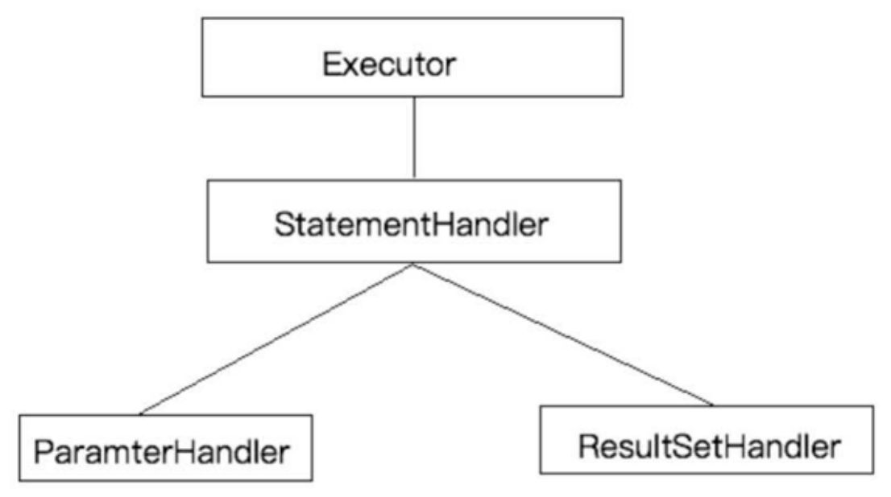

## 一、支持插件扩展

Mybatis作为一个应用广泛的优秀的ORM开源框架，这个框架具有强大的灵活性，在四大组件(Executor、StatementHandler、ParameterHandler、ResultSetHandler)处提供了简单易用的插 件扩
展机制。Mybatis对持久层的操作就是借助于四大核心对象。

对Mybatis来说插件就是**拦截器**，用来增强核心对象的功能，增强功能本质上是借助于底层的**动态
代理**实现的，换句话说，MyBatis中的四大对象都是代理对象




### 1.1MyBatis所允许拦截的方法如下：

1. 执行器Executor (update、query、commit、rollback等方法)；
2. SQL语法构建器StatementHandler (prepare、parameterize、batch、updates query等方 法)；
3. 参数处理器ParameterHandler (getParameterObject、setParameters方法)；
4. 结果集处理器ResultSetHandler (handleResultSets、handleOutputParameters等方法)；


## 二、实现原理

### 2.1在四大对象创建的时候

1. 每个创建出来的对象不是直接返回的，而是interceptorChain.pluginAll(parameterHandler);

2. 获取到所有的Interceptor (拦截器)(插件需要实现的接口)；调用interceptor.plugin(target);返回target 包装后的对象

3. 插件机制，我们可以使用插件为目标对象创建一个代理对象；AOP (面向切面)我们的插件可 以为四大对象创建出代理对象，代理对象就可以拦截到四大对象的每一个执行；

### 2.2如何拦截

1. **插件具体是如何拦截并附加额外的功能的呢？以ParameterHandler来说**

```java
public ParameterHandler newParameterHandler(MappedStatement mappedStatement,
Object object, BoundSql sql, InterceptorChain interceptorChain){
   	ParameterHandler parameterHandler =  				mappedStatement.getLang().createParameterHandler(mappedStatement,object,sql);

	parameterHandler = (ParameterHandler)
	interceptorChain.pluginAll(parameterHandler);
	return parameterHandler;
}

public Object pluginAll(Object target) {
	for (Interceptor interceptor : interceptors) {
		target = interceptor.plugin(target);
	}
	return target;
}
```

interceptorChain保存了所有的拦截器(interceptors)，是mybatis初始化的时候创建的。调用拦截器链中的拦截器依次的对目标进行拦截或增强。interceptor.plugin(target)中的target就可以理解为mybatis中的四大对象。返回的target是被重重代理后的对象


2. **如果我们想要拦截Executor的query方法，那么可以这样定义插件：**

```java
@Intercepts({
	@Signature(
		type = Executor.class,
		method = "query",
		args={MappedStatement.class,Object.class,RowBounds.class,ResultHandler.class}
	)
})     
public class ExeunplePlugin implements Interceptor {
//省略逻辑
}
```

3. **除此之外，我们还需将插件配置到sqlMapConfig.xm l中。**

```
<plugins>
	<plugin interceptor="com.lagou.plugin.ExamplePlugin"></plugin>
</plugins>
```


这样MyBatis在启动时可以加载插件，并保存插件实例到相关对象(InterceptorChain，拦截器链) 中。待准备工作做完后，MyBatis处于就绪状态。我们在执行SQL时，需要先通过DefaultSqlSessionFactory 创建SqlSession。Executor 实例会在创建SqlSession 的过程中被创建，Executor实例创建完毕后，MyBatis会通过JDK动态代理为实例生成代理类。这样，插件逻辑即可在Executor相关方法被调用前执行。

## 三、自定义插件

### 3.1 插件接口
**Mybatis 插件接口-Interceptor**

1. Intercept方法，插件的核心方法
2. plugin方法，生成target的代理对象
3. setProperties方法，传递插件所需参数

### 3.2 设计实现一个自定义插件

```
Intercepts ({//注意看这个大花括号，也就这说这里可以定义多个@Signature对多个地方拦截，都用这个拦截器
	@Signature (
		type = StatementHandler .class ,   //这是指拦截哪个接口
        method = "prepare"，//这个接口内的哪个方法名，不要拼错了
        args = { Connection.class, Integer .class} // 这是拦截的方法的入参，按顺序写到这，不要多也不要少，如果方法重载，可是要通过方法名和入参来确定唯一的
     )
})
public class MyPlugin implements Interceptor {
	private final Logger logger = LoggerFactory.getLogger(this.getClass());
	// 这里是每次执行操作的时候，都会进行这个拦截器的方法内
	Override
	public Object intercept(Invocation invocation) throws Throwable {
		//增强逻辑
		System.out.println("对方法进行了增强....")；
		return invocation.proceed(); //执行原方法
	}
	
	
	/**
    *   主要是为了把这个拦截器生成一个代理放到拦截器链中
    *   ^Description包装目标对象 为目标对象创建代理对象
    *   @Param target为要拦截的对象
    *   @Return代理对象
    */
	Override
	public Object plugin(Object target) {
		System.out.println("将要包装的目标对象："+target);
		return Plugin.wrap(target,this);
    }
    
    /**获取配置文件的属性**/
	//插件初始化的时候调用，也只调用一次，插件配置的属性从这里设置进来
    Override
   	public void setProperties(Properties properties) {
		System.out.println("插件配置的初始化参数："+properties );
	}
```

### 3.2 SqlMapConfig.xml

```
<plugins>
	<plugin interceptor="com.lagou.plugin.MySqlPagingPlugin">
		<!--配置参数-->
		<property name="name" value="Bob"/>
	</plugin>
</plugins>
```

### 3.3 mapper接口

```
public interface UserMapper {
List<User> selectUser();
}
```


## 四、源码分析

Plugin实现了InvocationHandler接口，因此它的invoke方法会拦截所有的方法调用。invoke方法会对所拦截的方法进行检测，以决定是否执行插件逻辑。

该方法的逻辑如下

```java
// -Plugin
   public Object invoke(Object proxy, Method method, Object[] args) throwsThrowable {
           /*
            *获取被拦截方法列表，比如：
            *  signatureMap.get(Executor.class), 可能返回 [query, update, commit]
            */
           Set<Method> methods = signatureMap.get(method.getDeclaringClass());
           //检测方法列表是否包含被拦截的方法
           if (methods != null && methods.contains(method)) {
               //执行插件逻辑
               return interceptor.intercept(new Invocation(target, method,
args));
               //执行被拦截的方法
               return method.invoke(target, args);
           }
    }
```

invoke方法的代码比较少，逻辑不难理解。首先,invoke方法会检测被拦截方法是否配置在插件的@Signature注解中，若是，则执行插件逻辑，否则执行被拦截方法。插件逻辑封装在intercept中，该方法的参数类型为Invocationo Invocation主要用于存储目标类，方法以及方法参数列表。