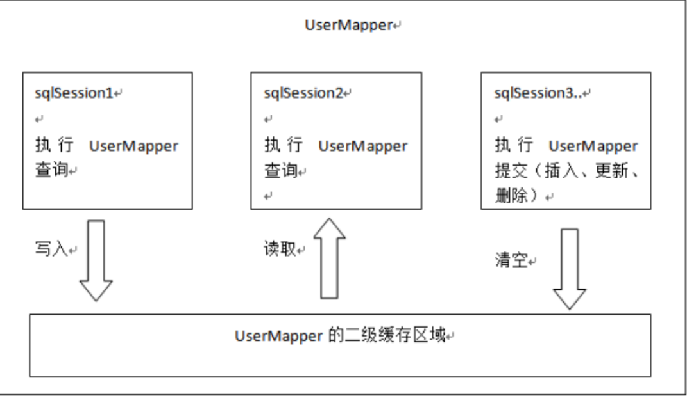

[toc]
# 一、一级缓存
1. 作用于SqlSession，SqlSession -> BaseExecutor -> Perpetualcache -> HashMap 
2. 执行查询时，根据statementId和入参组成cacheKey，查询是否有缓存
3. 无缓存则查库，然后写入缓存
4. 一级缓存默认开启，若开启二级缓存，二级缓然优先于一级缓存(若开启了二级缓存则执行器为CachingExecutor)
5. 一级缓存作用域SqlSession，执行数据库操作时将结果存于HashMap中
6. 执行commit、close，才会清空SqlSession中的缓存
7. 缓存只在autoCommit关闭时生效，在调用commit方法时，先清空缓存，再commit事务


```
Override
public <E> List<E> query(MappedStatement ms, Object parameter, RowBounds
        rowBounds, ResultHandler resultHandler) throws SQLException {
    BoundSql boundSql = ms.getBoundSql(parameter);
    //创建缓存
    CacheKey key = createCacheKey(ms, parameter, rowBounds, boundSql);
    return query(ms, parameter, rowBounds, resultHandler, key, boundSql);
}

@SuppressWarnings("unchecked")
Override
public <E> List<E> query(MappedStatement ms, Object parameter, RowBounds
        rowBounds, ResultHandler resultHandler, CacheKey key, BoundSql boundSql) throws
        SQLException {
            ...
    list = resultHandler == null ? (List<E>) localCache.getObject(key) : null;
    if (list != null) {
        //这个主要是处理存储过程用的。
        handleLocallyCachedOutputParameters(ms, key, parameter, boundSql);
    } else {
        list = queryFromDatabase(ms, parameter, rowBounds, resultHandler, key,
                boundSql);
    }
    ...
}

// queryFromDatabase 方法
private <E> List<E> queryFromDatabase(MappedStatement ms, Object parameter,
                                      RowBounds rowBounds, ResultHandler resultHandler, CacheKey key, BoundSql
                                              boundSql) throws SQLException {
    List<E> list;
    localCache.putObject(key, EXECUTION_PLACEHOLDER);
    try {
        list = doQuery(ms, parameter, rowBounds, resultHandler, boundSql);
    } finally {
        localCache.removeObject(key);
    }
    localCache.putObject(key, list);
    if (ms.getStatementType() == StatementType.CALLABLE) {
        localOutputParameterCache.putObject(key, parameter);
    }
    return list;
}
```


# 二、二级缓存
1. 二级缓存作用域namespace（相当于同一个mapper文件中），SqlSessionFactoryBuilder执行解析xml时，若配置了二级缓存则生成Cache缓存类，封装到对应的MappedStatement中，所有命名空间相同的MappedStatement共享一个Cache类，并创建CachingExecutor来进行缓存操作
2. 缓存cacheKey是怎么保证唯一性的？Cache类重写了hashCode()和equals()方法
3. 第一个sqlsession查询后，一定要进行commit和close，才能把一级缓存数据刷入二级缓存，这是为什么？
4. 因为查询操作并不是直接将结果放入Cache对象中，而是先放入map集合中，只有执行sqlsesion.commit/close时，才将map中缓存放入Cache对象中
5. 只在autoCommit关闭时生效，sqlSession执行查询后，执行commit、close时，清空一级缓存再执行connection.commit()，然后刷入二级缓存
6. 如sqlSession执行update时，并不会清空缓存，写入一个清空缓存标识true，当执行commit或colse时才清空缓存
7. 因为MappedStatement的全局性，所有线程共用MappedStatement，可导致脏读，TransactionalCacheManager为二级缓存提供了事务管理
8. 不推荐使用Mybatis的二级缓存，在分布式、多表查询情况下，会出现脏数据。比如有查询1（A表关联B表）得到结果被存入A的namespace二级缓存，后面B表更新清空B的namespace，再次执行查询1，得到的还是B更新之前的缓存，不是最新数据。推荐直接使用Redis
9. 实现原理：在SqlMapConfiguration和各Mapper.xml中开启二级缓存，在Executor执行查时先查缓存，执行删改操作时清空缓存
    <settings>
       <setting name="cacheEnabled" value="true"/>
    </settings>


