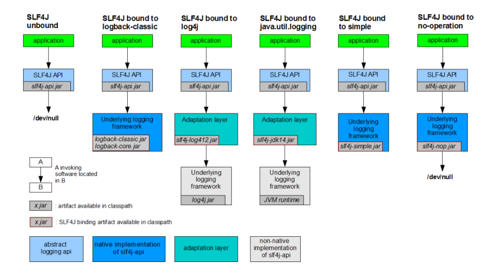
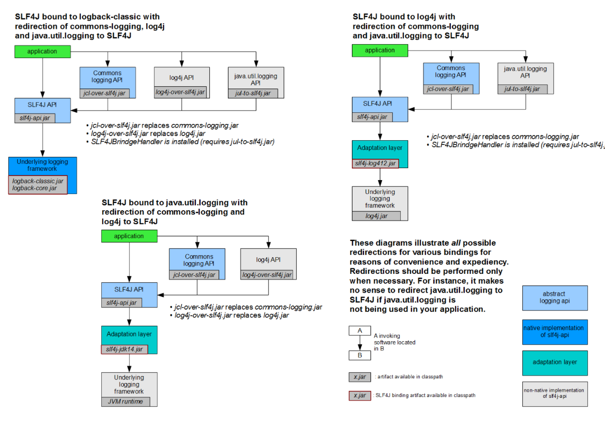
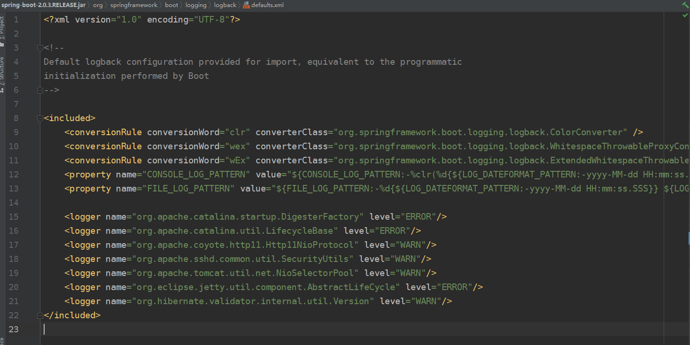
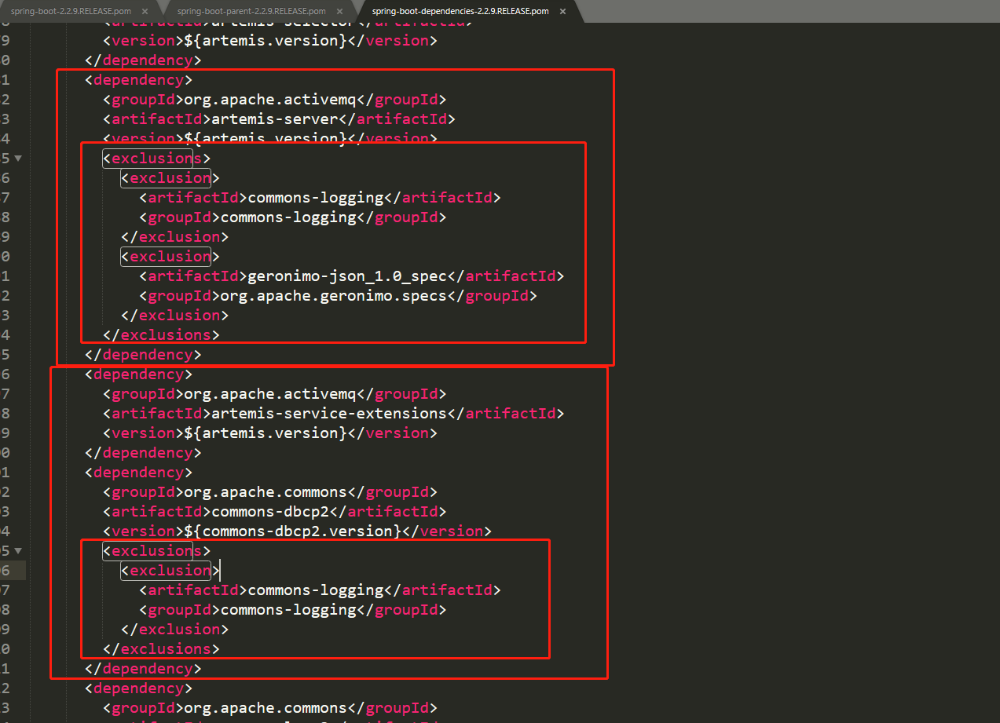

## 日志系统

#### 1. 介绍

通常情况下，日志是由一个抽象层+实现层的组合来搭建的。下表是目前市面最常见的日志框架，包含了抽象层和实现层

Spring 框架选择使用了JCL作为默认日志输出

Spring Boot默认选择了SLF4J 结合 logback

| 日志-抽象层                                                  | 日志-实现层                                           |
| ------------------------------------------------------------ | ----------------------------------------------------- |
| JCL（Jakarta Commons Logging）、SLF4J（Simple Logging Facade for Java）、jboss-logging | jul（java.util.logging）、jcl、log4j、logback、log4j2 |

为什么会有抽象层呢？直接使用实现层不是更方便吗？以下以SLF4J为入口讲解

#### 2. SLF4J怎么通配各个日志实现层的？

其实，早在SLF4J抽象层出现前，日志框架五花八门，其API接口命名不尽相同，更换日志框架将带来巨大的工作量。此时，SLF4J日志门面横空出世，定义了一套日志框架的API，由具体的实现层去实现这些规范。

SLF4J 的作者也是log4j的作者，他对log4j框架有所不满，便**重新开发了一套日志框架-logback，顺便定义了SLF4J作为logback的API接口层**。为了方便开发者**无缝切换日志框架**，使用SLF4J抽象层**整合了一系列流行的日志实现层框架（通过编写对应的SLF4J适配器去调用对应的实现层对象）**，从而实现了仅需一个日志门面，就来通配各种日志实现层框架。**适配器如下：**

- slf4j-log412.jar
- slfj-jdk12.jar

下图是SLF4J 结合各种日志框架的官方示例，从图中可以清晰的看出SLF4J API 永远作为日志的门面，直接应用与应用程序中。



**注意：日志的配置文件使用的还是各实现层框架自己的配置文件**

#### 3. 由于maven的依赖传递，各个框架中使用日志实现层不尽相同，怎么统一日志框架的使用呢？

如：A项目（slf4J + logback）-> Spring（commons logging）-> Hibernate（jboss-logging）

[官方方案步骤如下](http://www.slf4j.org/legacy.html)：

1. 排除各个依赖中不同的日志框架依赖。
2. 添加对应的替换包（over），将调用转发至slf4j的API。
3. 导入我们选择的SLF4J 实现。



#### 4.spring-boot-starter-logging的原理

##### 4.1 日志架构为SLF4j + LogBack及默认的配置文件



##### 4.2 排除其他日志框架



##### 4.3 统一框架引入替换包

```xml
<dependencies>
   <dependency>
     <groupId>ch.qos.logback</groupId>
     <artifactId>logback-classic</artifactId>
     <version>1.2.3</version>
     <scope>compile</scope>
   </dependency>
   <dependency>
     <groupId>org.apache.logging.log4j</groupId>
     <artifactId>log4j-to-slf4j</artifactId>
     <version>2.13.3</version>
     <scope>compile</scope>
   </dependency>
   <dependency>
     <groupId>org.slf4j</groupId>
     <artifactId>jul-to-slf4j</artifactId>
     <version>1.7.30</version>
     <scope>compile</scope>
   </dependency>
 </dependencies>
```

##### 4.4 自定义配置

```properties
# 日志配置
# 指定具体包的日志级别
logging.level.com.lagou=debug
# 控制台输出格式
logging.pattern.console=%d{yyyy-MM-dd HH:mm:ss.SSS} [%thread] %-5level %logger{50} - %msg%n
# 日志文件输出格式
logging.pattern.file=%d{yyyy-MM-dd HH:mm:ss.SSS} [%thread] %-5level %logger{50} - %msg%n
# 日志输出路径，
logging.path=/var/log
# 日志文件名，缺省默认为spring.log
logging.file=./log.log
```

##### 4.5 如何替换掉SpringBoot默认的spring-boot-starter-logging

```xml
<dependency>
    <groupId>org.springframework.boot</groupId>
    <artifactId>spring-boot-starter-web</artifactId>
    <exclusions>
        <exclusion>
            <artifactId>spring-boot-starter-logging</artifactId>
            <groupId>org.springframework.boot</groupId>
        </exclusion>
    </exclusions>
</dependency>
<dependency>
    <groupId>org.springframework.boot</groupId>
    <artifactId>spring-boot-starter-log4j2</artifactId>
</dependency>
```

