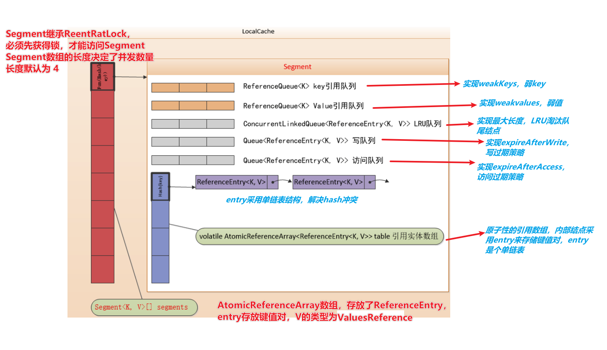
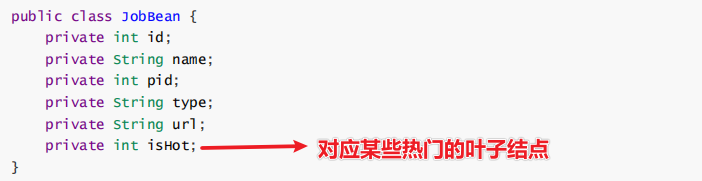

[toc]

## 一、Guava Cache 综述

#### 1. 简介

**Guava**是Google提供的一套 **Java工具包**，而**Guava Cache是一套非常完善的本地缓存机制**（JVM缓存）。

Guava cache的设计来源于 **CurrentHashMap**，可以按照**多种策略**来**清理**存储在其中的**缓存值**且保持很高的**并发读写性能**。

#### 2. 使用场景及优势

- **更新锁定**

  旁路模式下查缓存若不存在则会去**查数据源然后回填**，高并发时可能会**造成缓存穿透**

  而Guava Cache使用**load方法**中加以控制，对同一个key，只让**一个线程去读源并回填缓存**，其他线程阻塞等待

- 用于**缓存过期及淘汰策略**的场景

  采用**LRU**方式，淘汰缓存中的键值对

- 用于**并发要求高**的缓存设计

  类似于CurrentHashMap，提供了并发级别的api，**支持并发读写**，**采用分离锁机制**（能够减小锁粒度，将一个集合拆分成若干个Segment分别控制锁，提升并发能力）

- 集成数据源

  使用了[**直读直写模式**](../缓存设计)

  Guava Cache的**get**方法集成了数据源，若缓存没数据则**自动读取数据源回填缓存**

- 用于数据要求**不强一致性**的场景

- 监控缓存的命中情况

#### 2. 缺陷

- 不能持久化
- 不能做集群


## 二、实战

#### 1. 创建及查询（支持自动回填缓存）

##### 1.1 *CacheLoader* 集成数据源

实现CacheLoader的 load方法，用于集成数据源自动回填数据到缓存

```java
//CacheLoader的方式创建
LoadingCache<String,Object> cache = CacheBuilder
    .newBuilder()
    .build(new CacheLoader<String, Object>() {
        //读取数据源
        @Override
        public Object load(String key) throws Exception {
            return dao.getXXX(key);
        }
    });

//初始化缓存
for(int i=1;i<=3;i++){
    //查询缓存，若没有则调用load方法读取数据源回填缓存
    cache.get(String.valueOf(i));
}
```

##### 1.2 *Callable* 自定义查源

实现Callable的回调方法，自定义查源的逻辑

```java
//回调方法用于读源并回填缓存
cache.get(key, new Callable<Object>() {
    @Override 
    public Object call() throws Exception {
        return dao.getXXX(key);
    }
});
```

##### 1.3 迭代器遍历

```java
// 转Map遍历Guava缓存的键值
Iterator its=cache.asMap().entrySet().iterator();
```

##### 1.4 只查询缓存，若无则返回null

```java
// 只查缓存，若没有则返回null
cache.getIfPresent()
```


#### 2. 新增或更新

##### 2.1 put

```java
// 新增或修改
cache.put(key,value);
```


#### 3. 删除

##### 3.1 基于容量大小的被动删除

通过LRU删除最不常访问的缓存，实现原理是使用队列的FIFO原理

```java
LoadingCache<String,Object> cache = CacheBuilder
    .newBuilder()
    // guava LocalCache最大存储容量
    .maximumSize(3)
    .build(new CacheLoader<String, Object>() {
        //读取数据源
        @Override
        public Object load(String key) throws Exception {
            return dao.getXXX(key);
        }
    });
    
//读取缓存中的1的数据，缓存有就读取，没有则返回null
System.out.println(cache.getIfPresent("1"));

//读取4，读源并回写缓存，淘汰一个（LRU+FIFO）
get("4",cache);
System.out.println("==================================");
display(cache);
```

##### 3.2 基于过期时间的被动删除

多长时间没被访问的key被删除

写入多长时间后被删除

```java
LoadingCache<String,Object> cache = CacheBuilder
    .newBuilder()
    // 写过期策略，如果3秒内没有写操作则删除
    .expireAfterWrite(3, TimeUnit.SECONDS)
    .build(new CacheLoader<String, Object>() {
        //读取数据源
        @Override
        public Object load(String key) throws Exception {
            return dao.getXXX(key);
        }
    });
// 歇了1秒
Thread.sleep(1000); 
// 1被更新
cache.put("1","张侠");
// 歇了2.1秒 
Thread.sleep(2100); 
// 最后缓存中会留下1
display(cache);

    

LoadingCache<String,Object> cache = CacheBuilder
    .newBuilder()
    // 访问过期策略，如果3秒内没有访问则删除
    .expireAfterAccess(3, TimeUnit.SECONDS)
    .build(new CacheLoader<String, Object>() {
        //读取数据源
        @Override
        public Object load(String key) throws Exception {
            return dao.getXXX(key);
        }
    });
// 歇了1秒
Thread.sleep(1000); 
// 1被访问
cache.getIfPresent("1"); 
// 歇了2.1秒 
Thread.sleep(2100); 
// 最后缓存中会留下1
display(cache);
```

##### 3.3 基于引用被动删除

通过 weakKeys 和 weakValues方法 指定键值对的引用为弱引用，被 JVM 发生GC时 对象被自动回收

由于values占用内存较大，所以一般指定值为弱引用类型

```java
LoadingCache<String,Object> cache = CacheBuilder
    .newBuilder()
    // 值设为弱引用
    .weakValues()
    .build(new CacheLoader<String,Object>(){
        //读取数据源
        @Override
        public Object load(String key) throws Exception {
            return dao.getXXX(key);
        }
    });
// 创建强引用
Object v = new Object();
cache.put("1", v);
// 原对象不再有强引用
v = new Object();
//强制垃圾回收
System.gc();
System.out.println("================================");
display(cache);
```

##### 3.4 主动删除

```java
//将key=1 删除 
cache.invalidate("1");

//清空
cache.invalidateAll();


//删多个
cache.invalidateAll(Arrays.asList("1","3"));
```

##### 3.5 删除通知

```java
LoadingCache<String,Object> cache = CacheBuilder
    .newBuilder()
    .removalListener(new RemovalListener<Object, Object>() {
        @Override
        public void onRemoval(RemovalNotification<Object, Object> removalNotification) {
            //移除的key 移除的原因
            System.out.println(removalNotification.getKey()+":"+removalNotification.getCause());
        }
    })
    .build(new CacheLoader<String, Object>() {
        //读取数据源
        @Override
        public Object load(String key) throws Exception {
            return dao.getXXX(key);
        }
    });
```


#### 4. 统计命中率

```java
LoadingCache<String,Object> cache = CacheBuilder
    .newBuilder()
    .recordStats()
    .build(new CacheLoader<String, Object>() {
        //读取数据源
        @Override
        public Object load(String key) throws Exception {
            return dao.getXXX(key);
        }
    });

//打印输出统计
System.out.println(cache.stats().toString());
```


## 三、原理

#### 1. 内部数据结构



ValueReference默认为强引用值

#### 2. 回收/删除方式

- 惰性回收（删除）
- 主动回收（删除）


#### 3. 两次hash定位数据存放位置


## 四、深度应用

#### 1. 并发场景

##### 1. 设置ConcurrencyLevel（并发量）

设置Guava LocalCache 的 concurrencyLevel并发量，即Segment数组的长度（默认为 4），一般设置为服务器CPU的核数（必须为2的n次方）

```java
LoadingCache<String,Object> cache = CacheBuilder
    .newBuilder()
    // 同时支持CPU核数的线程并发，不指定默认为4
    .concurrencyLevel(Runtime.getRuntime().availableProcessors())
    .build(new CacheLoader<String, Object>() {
        //读取数据源
        @Override
        public Object load(String key) throws Exception {
            return dao.getXXX(key);
        }
    });
```

##### 2. 更新锁定

解决查数据源回填缓存的并发问题（缓存击穿），只让一个线程去查源，然后回填

```java
LoadingCache<String,Object> cache = CacheBuilder
    .newBuilder()
    //3秒内阻塞，超时会返回旧数据或者null
    .refreshAfterWrite(1, TimeUnit.SECONDS)
    .build(new CacheLoader<String, Object>() {
        //读取数据源
        @Override
        public Object load(String key) throws Exception {
            return dao.getXXX(key);
        }
    });
```

##### 3. 案例




#### 2. 动态加载

#### 3. 自定义LRU

#### 4. 面试问题

- 防止内存溢出

  缓存时间设置相对小些，使用弱引用方式存储对象（默认为强引用值）
