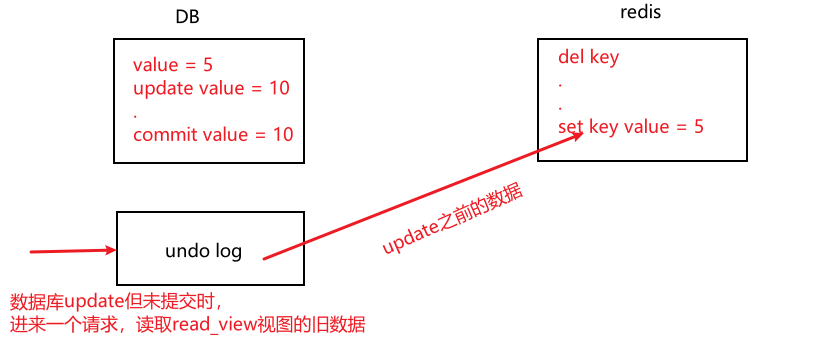

[toc]

## 一、Redis 的常见问题及解决方案

### 1. 缓存雪崩

定义：**Redis宕机重启**或者**大批量的Key在某时段过期**，高并发或大量的请求过来访问这些Key，穿过Redis直接落到DB，导致DB压力过大而宕机。缓存雪崩是**由于大批量的Key过期导致**

解决方案：

- Key的失效期分开（设置不同的TTL），防止某时段大批量的key同时过期
- 不设置TTL
- 搭建Redis高可用集群（RedisCluster）


### 2. 缓存击穿

定义：某些**热点Key**设置了TTL，当这些热点Key**过期**时，大量的请求并发过来访问热点Key，穿过Redis直接落到DB，导致DB压力过大而宕机。缓存击穿只是**热点Key过期导致**

解决方案：

- 使用分布式锁，去控制这些热点Key访问的代码块
- 热点Key不设置TTL


### 3. 缓存穿透

定义：高并发或者大量的请求去查询 **不存在的key（缓存和DB都不存在）**，每次都会穿过缓存查询数据库，导致数据库压力过大而宕机

解决方案：**布隆过滤器**、或者使用Write Behind Caching Pattern（缓存优先模式）（查询只操作缓存，异步将修改数据加载到缓存）

- 查缓存前先去布隆过滤器查询key是否存在
- **如果不存在则直接返回**
- **如果存在则继续查缓存或DB**
- 项目启动时，将所有的key存入布隆过滤器
- 当DB新添加数据时，将key存入布隆过滤器，


#### 布隆过滤器

布隆过滤器可以用于检索一个元素是否在一个集合中，本质是**一个很长的二进制向量**和**一系列随机hash映射函数**

基本思想：当有**元素经过布隆过滤器时**，内部通过**N个Hash函数**对元素求散列值，并把**散列值映射成数组中的N个点（取模求下标），把它们置为1**。检索某个元素时，若这N个下标**有一个0**，则表示该元素**不存在**；**若都是1**，**则可能存在**（这些1可能刚好都是别的多个元素凑齐的）


### 4. 旁路缓存模式的并发问题

旁路缓存模式的更新模式为：**先更新数据库，再删除缓存。但存在并发问题**，描述如下：

update数据库但未commit，同时删除了缓存，此时有请求进来读取该key，查到了数据库更新前的数据并回填缓存，数据库commit，此时**DB和Redis的数据不一致**



#### 延时双删

针对以上并发问题导致的数据不一致，可采用延时双删策略，思路如下

- 更新数据库，同时删除缓存key
- 2秒后在删除一次缓存key
- 查询回填的缓存key设置 TTL
- 将删除失败的记录到日志，利用脚本提取失败记录再次删除（定时任务1天或者7天）


### 5. Hot Key

#### Hot key 发现

- 预估hot key，如秒杀商品、热点新闻等
- 通过运营童鞋获取
- 基于大数据领域的流式计算技术进行实时数据访问次数的统计，如：Spark Streaming、Flink等

#### Hot key 处理

- 缓存预热

- 使用多级缓存
- 客户端流控，对服务进行降级，保护缓存集群及数据库


### 6. Big key（value非常大的key）

#### Big key 影响

- 占用内存大
- 影响Redis性能，主从复制久
- big key删除时会导致主进程长时间阻塞（惰性删除或者主动删除）

#### Big key 发现

- 通过`redis-cli --bigkeys`命令

- 通过rdbtools分析rdb生成csv文件，再导入MySQL或其他数据库中进行分析统计，根据size_in_bytes统计bigkey

#### Big key 处理

- 拆分成多个key存储
- 实在无法拆分，则使用MongoDB存储，或者缓存到边缘缓存CDN
- 删除big key使用 **`unlink`**命令，这是一个异步的删除命令


## 二、分布式锁

### 1. 乐观锁（基于watch）

乐观锁基于**CAS（compare and swap）**思想实现，不具有互斥性，也无需等待锁而造成资源消耗。原理是通过不断的重试比较，能比较快的响应

Redis 基于 wacth监听机制 实现乐观锁：**监听某个key并开启事务，当该key的值被修改，则事务的命令会被清空。**

简单实现

```java
public class Second {
    public static void main(String[] arg){
        String redisKey = "lock";
        
        ExecutorService executorService = Executors.newFixedThreadPool(20);
        try {
            Jedis jedis = new Jedis("127.0.0.1", 6378); 
            // 初始值 
            jedis.set(redisKey, "0"); 
            jedis.close();
        } catch (Exception e) { 
            e.printStackTrace(); 
        }
        
        for (int i = 0; i < 1000; i++) {
            executorService.execute(() ->{
                Jedis jedis1 = new Jedis("127.0.0.1", 6378);
                try{
                    jedis1.watch(redisKey); 
                    String redisValue = jedis1.get(redisKey); 
                    int valInteger = Integer.valueOf(redisValue); 
                    String userInfo = UUID.randomUUID().toString();
                    
                    // 没有秒完
                    if (valInteger < 20){
                        Transaction tx = jedis1.multi(); 
                        tx.incr(redisKey); 
                        List list = tx.exec();
                        
                        // 秒成功 失败返回空list而不是空
                        if (list != null && list.size() > 0){
                            System.out.println("用户：" + userInfo + "，秒杀成功！ 当前成功人数：" + (valInteger + 1));
                        } 
                        // 版本变化，被别人抢了。
                        else{
                            System.out.println("用户：" + userInfo + "，秒杀失 败");
                        }
                    } 
                    // 秒完了
                    else {
                        System.out.println("已经有20人秒杀成功，秒杀结束");
                    }
                } catch (Exception e) { 
                    e.printStackTrace(); 
                } finally {
                    jedis.close();
                }
            });
        }
        executorService.shutdown();
    }
}
```

### 2. 分布式锁

#### 2.1 setnx

#### 2.2 Red lock

#### 2.3 Redisson

### 3. 与ZK分布式锁的对比


## 三、阿里Redis使用手册


