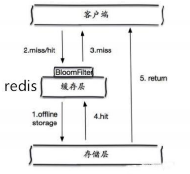
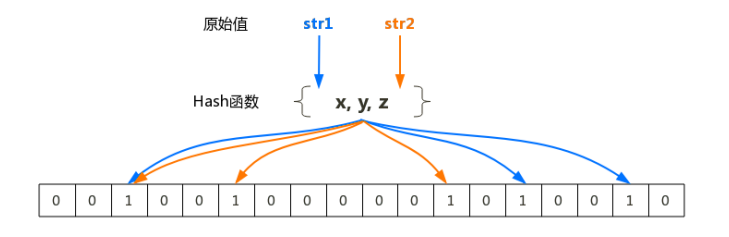
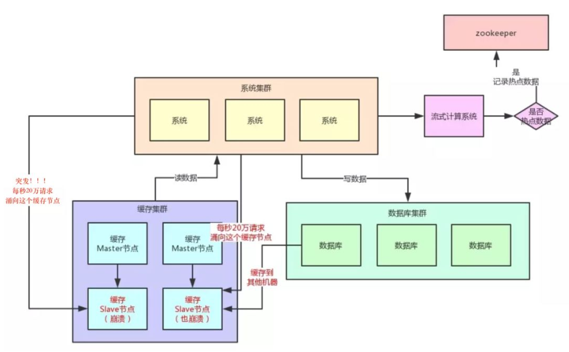
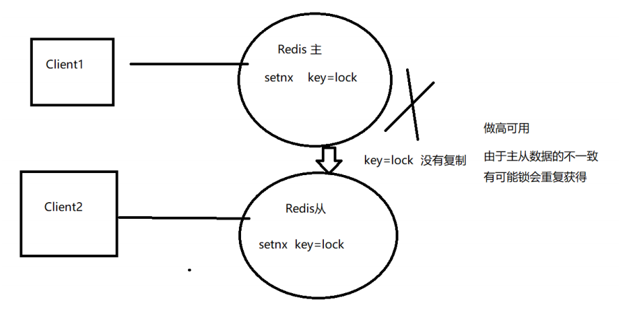
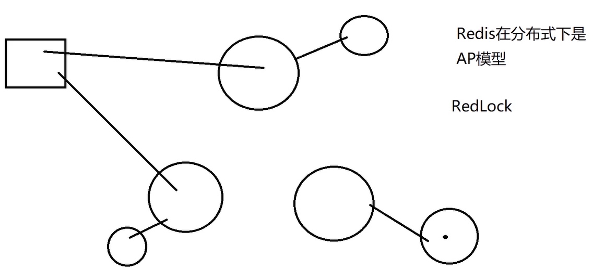
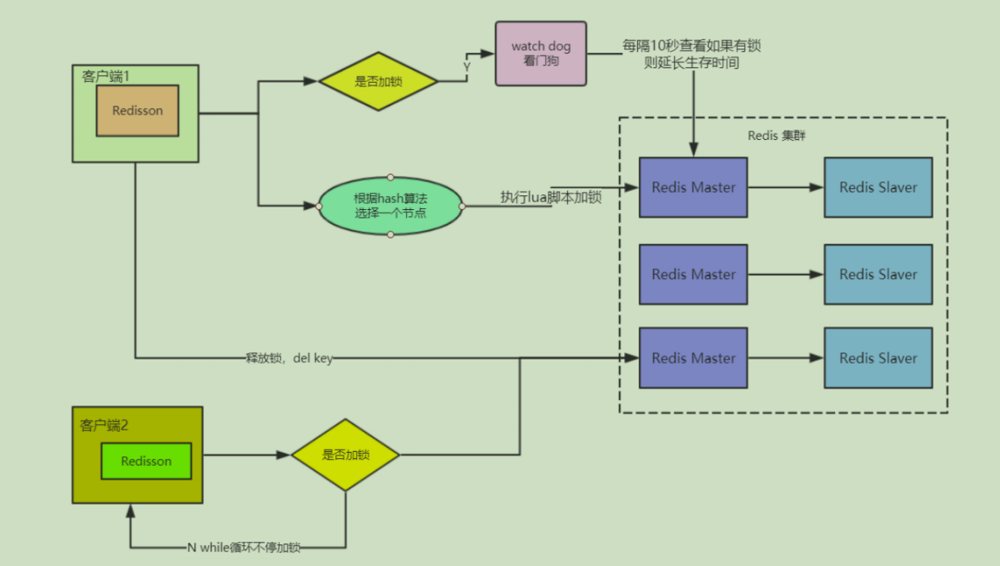
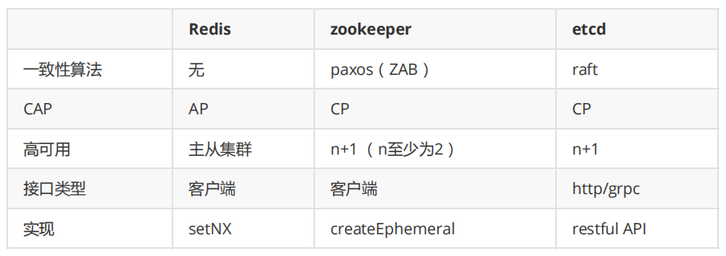

[toc]

## 一、Redis 的常见问题及解决方案

### 1. 缓存雪崩

定义：**Redis宕机重启**或者**大批量的Key在某时段过期**，高并发或大量的请求过来访问这些Key，穿过Redis直接落到DB，导致DB压力过大而宕机。缓存雪崩是**由于大批量的Key过期导致**

解决方案：

- Key的失效期分散（设置不同的TTL），防止某时段大批量的key同时过期
- 不设置TTL，然后通过中间件canal将修改数据发布到MQ，然后再修改缓存中的数据
- 搭建Redis高可用集群（RedisCluster）


### 2. 缓存击穿

定义：某些**热点Key**设置了TTL，当这些热点Key**过期**时，大量的请求并发过来访问热点Key，穿过Redis直接落到DB，导致DB压力过大而宕机。缓存击穿只是**热点Key过期导致**

解决方案：

- 并发回填缓存时，使用**分布式锁控制只让一个请求去读书数据库**，**其他请求阻塞并重试**时若**get到缓存数据则不再阻塞**
- 不设置TTL，然后通过中间件canal将修改数据发布到MQ，然后再修改缓存中的数据


### 3. 缓存穿透

定义：高并发或者大量的请求去查询 **不存在的key（缓存和DB都不存在）**，每次都会穿过缓存查询数据库，导致数据库压力过大而宕机

解决方案：**布隆过滤器**、或者为Redis设置大量默认值的Key（不实际）

- 查缓存前先去布隆过滤器查询key是否存在
- **如果不存在则直接返回**
- **如果存在则继续查缓存或DB**
- 项目启动时，将所有的key存入布隆过滤器
- 当DB新添加数据时，将key存入布隆过滤器，



#### 布隆过滤器

常用实现有Google Guava、Redis。

布隆过滤器可以用于检索一个元素是否在一个集合中，本质是**一个很长的二进制向量**和**一系列随机hash映射函数**

基本思想：当有**元素经过布隆过滤器时**，内部通过**N个Hash函数**对元素求散列值，并把**散列值映射成数组中的N个点（取模求下标），把它们置为1**。检索某个元素时，若这N个下标**有一个0**，则表示该元素**不存在**；**若都是1**，**则可能存在**（这些1可能刚好都是别的多个元素凑齐的）




### 4. 数据一致性问题

旁路模式的写需要保证更新库后，缓存数据彻底被删除，不然可能存在数据不一致的情况（事务执行还未提交时，删除缓存然后快照读到了旧数据，事务提交，导致数据库和缓存数据不一致）。所以采用延时双删策略

#### 4.1 被动更新（延时双删）

被动或主动删除缓存（设置缓存key的ttl 或者 写数据库时删除缓存），然后在**读时，查数据库回填数据到缓存**，这属于被动更新

**注意：**针对热点Key的高并发场景，采取**延时双删策略**。读时可能造成缓存击穿，可以**采用分布式锁控制一个请求去查库，剩余请求阻塞等待缓存更新，可设置等待超时时间**

- 更新数据库，同时删除缓存key
- 2秒后在删除一次缓存key
- 查询回填的缓存key设置 TTL
- 兜底：将需要删除的key写入MQ，再次删除，保证可以彻底删除干净

#### 4.2 主动更新

更新数据库后，通过Canal中间件将binlog日志采集发送到MQ中，然后更新缓存


### 5. Hot Key

当有**大量的请求(几十万)访问某个Redis某个key**时，由于流量集中达到**带宽上限**，从而导致这个redis的**服务器宕机**。造成缓存击穿，接下来对这个key的访问将**直接访问数据库造成数据库崩溃**，或者访问数据库回填Redis再访问Redis，**继续崩溃**

#### Hot key 发现

- 预估hot key，如秒杀商品、热点新闻等

- 通过运营童鞋获取

- 利用Redis自带的命令，monitor、hotkeys。但是执行缓慢（不要用）

- 利用基于大数据领域的流式计算技术来进行实时数据访问次数的统计，比如 Storm、SparkStreaming、Flink，发现热点数据后可以写到zookeeper或者MQ

  

#### Hot key 处理

- 使用**多级缓存（本地缓存** -> 分布式缓存 -> 数据库，数据不要求强一致性）
- 使用**Redis集群架构（分片）**
- 客户端对热点数据访问的**限流熔断保护措施**，每个服务实例每秒最多请求缓存集群读操作不超过 400 次，一旦超过则熔断降级（根据业务是否可以降级使用）

**总结：**自研热点key发现服务，同时做一个热点key请求**限流熔断保护措施** ，热点**迁移到本地缓存后**，**放开限流**


### 6. Big key（value非常大的key）

#### Big key 影响

- 占用内存大
- 影响Redis性能，主从复制久
- big key删除时会导致主进程长时间阻塞（惰性删除或者主动删除）

#### Big key 发现

- 通过`redis-cli --bigkeys`命令

- 通过rdbtools分析rdb生成csv文件，再导入MySQL或其他数据库中进行分析统计，根据size_in_bytes统计bigkey

#### Big key 处理

- 拆分成多个key存储
- 实在无法拆分，则使用MongoDB存储，或者缓存到边缘缓存CDN
- 删除big key使用 **`unlink`**命令，这是一个异步的删除命令（redis 4.0已经支持key的异步删除）


## 二、分布式锁

### 1. 乐观锁（基于watch）

乐观锁基于**CAS（compare and swap）**思想实现，不具有互斥性，也无需等待锁而造成资源消耗。原理是通过不断的重试比较，能比较快的响应

Redis 基于 wacth监听机制 实现乐观锁：**监听某个key并开启事务，当该key的值被修改，则事务的命令会被清空。**

#### 基于乐观锁的秒杀实现

*秒杀等场景的防止超卖，使用CAS方式实现*

```java
import redis.clients.jedis.Jedis;
import redis.clients.jedis.Transaction;

import java.util.List;
import java.util.UUID;
import java.util.concurrent.ExecutorService;
import java.util.concurrent.Executors;

public class TestCAS {

    public static void main(String[] args){
        String redisKey = "lock";

        ExecutorService executorService = Executors.newFixedThreadPool(20);
        try {
            Jedis jedis = new Jedis("192.168.127.128", 6380);
            // 初始值
            jedis.set(redisKey, "0");
            jedis.close();
        } catch (Exception e) {
            e.printStackTrace();
        }

        for (int i = 0; i < 1000; i++) {

            executorService.execute(() -> {

                Jedis jedis1 = new Jedis("192.168.127.128", 6380);
                try {
                    jedis1.watch(redisKey); //第二次 前面改过的值
                    String redisValue = jedis1.get(redisKey);
                    int valInteger = Integer.valueOf(redisValue);
                    String userInfo = UUID.randomUUID().toString();

                    // 没有秒完
                    if (valInteger < 20) {
                        Transaction tx = jedis1.multi();
                        //自增
                        tx.incr(redisKey);
                        // watch
                        List list = tx.exec();
                        // 秒成功   失败返回空list而不是空
                        if (list != null && list.size() > 0) {
                            System.out.println("用户：" + userInfo + "，秒杀成功！当前成功人数：" + (valInteger + 1));
                        }
                        // 版本变化，被别人抢了。
                        else {
                            System.out.println("用户：" + userInfo + "，秒杀失败");
                        }
                    }
                    // 秒完了
                    else {
                        System.out.println("已经有20人秒杀成功，秒杀结束");
                    }
                } catch (Exception e) {
                    e.printStackTrace();
                } finally {
                    jedis1.close();
                }
            });
        }
        executorService.shutdown();
    }
}

```


### 2. 分布式锁

#### 2.1 set|nx|ex

##### 2.1.1 获取锁

**推荐使用set命令实现**，**切勿使用setnx和expire两步实现**，因为要保证该操作的原子性，防止死锁

```java
/**
* 使用redis的set命令实现获取分布式锁
* @param lockKey 可以就是锁
* @param requestId 请求ID，保证同一性 uuid+threadID
* @param expireTime 过期时间，避免死锁
* @return 
*/
public boolean getLock(String lockKey,String requestId,int expireTime) {
    // set|nx|ex 保证了原子性，当key存在则返回失败并设置了ttl
    String result = jedis.set(lockKey, requestId, "NX", "EX", expireTime);
    
    if("OK".equals(result)) { 
        return true; 
    }
    
    return false;
}
```

##### 2.1.2 释放锁

**推荐使用lua脚本实现**，切勿先get然后del，要保证该操作的原子性，防止误删（由于并发get和del的不是同一个key）

```java
public static boolean releaseLock(String lockKey, String requestId) {
    String script = "if redis.call('get', KEYS[1]) == ARGV[1] then return redis.call('del', KEYS[1]) else return 0 end"; 
    Object result = jedis.eval(script, Collections.singletonList(lockKey),Collections.singletonList(requestId));
    
    if (result.equals(1L)) { 
        return true; 
    }
    return false;
}
```

##### 2.1.3 锁自旋

```java
import redis.clients.jedis.Jedis;

public class RedisDistributedLock {

    //每次请求的时间为200ms
    private  Long PER_REQ_MILL = null;
    //总体等待时间不超过10s
    private  Long WAIT_TIME_OUT = null;
    //锁名称
    private  String LOCK_NAME = null;
    //锁过期时间
    private Long EXPIRE_TIME = null;

    public RedisDistributedLock() {
        LOCK_NAME = Thread.currentThread().getName();
        PER_REQ_MILL = 200l; //默认每次自旋请求间隔200ms
        WAIT_TIME_OUT = 10 * 1000l; //默认自旋时间10s
        EXPIRE_TIME = 2 * 1000l;//默认过期时间2s
    }

    public RedisDistributedLock(String lockName, Long perReqMill, Long waitTimeOut, Long expireTime) {
        LOCK_NAME = lockName;
        PER_REQ_MILL = perReqMill;
        WAIT_TIME_OUT = waitTimeOut;
        EXPIRE_TIME = expireTime;
    }


    public void lock() {
        //先用set key value nx ex expireAt 命令查询是否已经有了该锁
        Jedis jedis = JedisUtil.getJedis();
        String isSet = jedis.set(this.LOCK_NAME, this.LOCK_NAME, "NX", "EX", this.EXPIRE_TIME / 1000);
        if ("OK".equals(isSet)) {
            //没有该锁，则直接占用
            System.out.println("<<<<<线程" + Thread.currentThread().getName() + "占用" + this.LOCK_NAME + "锁成功");
            return;
        } else {
            //该锁仍然存在,原地自旋，每隔一段时间请求一次，直至成功或超时抛出错误
            spin();
        }
    }

    /**
     * 锁的自旋
     */
    private void spin() {
        //进入时的时间
        long beginTime = System.currentTimeMillis();
        //获取锁
        Jedis jedis = JedisUtil.getJedis();
        String isSet = jedis.set(this.LOCK_NAME, this.LOCK_NAME, "NX", "EX", this.EXPIRE_TIME / 1000);
        if ("OK".equals(isSet)) {
            //没有该锁，则直接占用
            System.out.println("<<<<<线程" + Thread.currentThread().getName() + "占用" + this.LOCK_NAME + "锁成功");
        } else {
            while (true) {
                try {
                    //睡眠短暂时间继续请求
                    Thread.sleep(this.PER_REQ_MILL);
                    System.out.println("线程"+Thread.currentThread().getName()+"自旋睡眠"+this.PER_REQ_MILL+"毫秒");
                } catch (InterruptedException e) {
                    e.printStackTrace();
                }
                if (System.currentTimeMillis() - beginTime >= this.WAIT_TIME_OUT) {
                    //已经超时
                    System.out.println("线程"+Thread.currentThread().getName()+"超过了" + this.WAIT_TIME_OUT + "毫秒都无法获取到名为"+this.LOCK_NAME+"的锁，超时退出");
                    throw new RuntimeException("获取锁失败");
                } else {
                    //没有超时，继续请求
                    isSet = jedis.set(this.LOCK_NAME, this.LOCK_NAME, "NX", "EX", this.EXPIRE_TIME / 1000);
                    if ("OK".equals(isSet)) {
                        //上锁成功
                        System.out.println("<<<<<线程" + Thread.currentThread().getName() + "占用" + this.LOCK_NAME + "锁成功");
                        break;
                    }
                }
            }
        }
    }


    public void unlock() {
        Jedis jedis = JedisUtil.getJedis();
        //先获取该锁
        String lockValue = jedis.get(this.LOCK_NAME);
        if (lockValue == null) {
            System.out.println(">>>>>" + Thread.currentThread().getName() + "解除了对" + this.LOCK_NAME + "的占用");
            return;
        } else if (this.LOCK_NAME.equals(lockValue)){
            Long del = jedis.del(this.LOCK_NAME);
            System.out.println(">>>>>"+Thread.currentThread().getName() + "解除了对" + this.LOCK_NAME + "的占用");
            return;
        }
        System.out.println("*****"+Thread.currentThread().getName() + "无法解除对" + this.LOCK_NAME + "的占用");
    }
    
    
    
    public static void main(String[] args) throws Exception{
        ExecutorService executor = Executors.newCachedThreadPool();
        executor.submit(() -> {
        //设置每500ms请求自旋一次，超时时间为5s,锁过期时间为5s
            RedisDistributedLock lock1 = new RedisDistributedLock("lock", 500l, 10 * 1000l, 5 * 1000l);
            lock1.lock();
            try {
                //占用锁４ｓ钟
                Thread.sleep(4 * 1000l);
            } catch (InterruptedException e) {
                e.printStackTrace();
            }
            lock1.unlock();
        });

        RedisDistributedLock lock2 = new RedisDistributedLock("lock", 500l, 10 * 1000l, 5 * 1000l);
        lock2.lock();
        Thread.sleep(2000l);
        lock2.unlock();
    }
}
```


##### 2.1.4 存在缺陷

- **无法保证数据（锁）的强一致性**

  主从+哨兵架构中无法保证数据的强一致性，所以当主宕机，从切换为主时数据尚未同步，导致分布式锁被重复获取，引发并发问题



- **无法续租**


#### 2.2 Red lock

为了解决数据一致性问题，Redis作者提出了红锁方案：搭建多个主从Redis，当客户端成功在一半以上的主从获取锁，则表示成功获得分布式锁。这就防止了客户端2重复获得锁的问题。




#### 2.3 Lua脚本

lua脚本保证以下语句的结对原子性和隔离性，执行过程中不会执行其他命令

```lua
local sku = KEYS[1] 
local num = tonumber(ARGV[1]) 
local stock = tonumber(redis.call('GET',sku)) 
local result = 0 
if(stock >= num) then 
redis.call('DECRBY',sku,num) 
result = 1 
end 
return result
```


#### 2.4 Redisson（强烈推荐）

**Redisson是架设在Redis基础上**的一个Java驻内存数据网格（In-Memory Data Grid）

Redisson在**基于NIO的Netty框架上，生产环境使用分布式锁**

##### 2.4.1 Redisson 使用

- 引入依赖

  ```xml
  <dependency> 
      <groupId>org.redisson</groupId> 
      <artifactId>redisson</artifactId> 
      <version>2.7.0</version> 
  </dependency>
  ```

- 配置Redisson

  ```java
  public class RedissonManager{
      private static Config config = new Config(); 
      //声明redisso对象 
      private static Redisson redisson = null;
      
      //实例化redisson
      static{
          config.useClusterServers()
              // 集群状态扫描间隔时间，单位是毫秒
              .setScanInterval(2000)
              //cluster方式至少6个节点(3主3从，3主做sharding，3从用来保证主宕机后可以高可用)
              .addNodeAddress("redis://127.0.0.1:6379")
              .addNodeAddress("redis://127.0.0.1:6380")
              .addNodeAddress("redis://127.0.0.1:6381")
              .addNodeAddress("redis://127.0.0.1:6382")
              .addNodeAddress("redis://127.0.0.1:6383")
              .addNodeAddress("redis://127.0.0.1:6384");
          
          //得到redisson对象
          redisson = (Redisson) Redisson.create(config);
      }
      
      //获取redisson对象的方法 
      public static Redisson getRedisson(){ 
          return redisson; 
      }
  }
  ```

- 锁获取与释放

  ```java
  public class DistributedRedisLock{
      //从配置类中获取redisson对象
      private static Redisson redisson = RedissonManager.getRedisson(); 
      private static final String LOCK_TITLE = "redisLock_";
      
      //加锁
      public static boolean acquire(String lockName){
          //声明key对象 
          String key = LOCK_TITLE + lockName; 
          //获取锁对象 
          RLock mylock = redisson.getLock(key); 
          //加锁，并且设置锁过期时间3秒，防止死锁的产生 uuid+threadId 
          mylock.lock(2,3,TimeUtil.SECOND); 
          //加锁成功 
          return true;
      }
      
      //锁的释放
      public static void release(String lockName){
          //必须是和加锁时的同一个key 
          String key = LOCK_TITLE + lockName; 
          //获取所对象 
          RLock mylock = redisson.getLock(key); 
          //释放锁（解锁） 
          mylock.unlock();
      }
      
  }
  ```

- 结合业务使用

  ```java
  public String discount() throws IOException{ 
      String key = "lock001"; 
      //加锁 
      DistributedRedisLock.acquire(key); 
      
      //执行具体业务逻辑
      String something = dosomething();
      
      //释放锁 
      DistributedRedisLock.release(key); 
      
      //返回结果 
      return something; 
  }
  ```

  

##### 2.4.2 Redisson 原理

Redisson的原理图



- **基于lua脚本的加锁：**

  lua脚本保证复杂逻辑的原子性操作，并且逻辑提供了互斥和可重入锁的实现

  ```lua
  "if (redis.call('exists',KEYS[1])==0) then "+		--查看锁是否被获取，0表示不存在
  	"redis.call('hset',KEYS[1],ARGV[2],1); "+		--加锁的客户端ID (UUID.randomUUID()） + “:” + threadId)
  	"redis.call('pexpire',KEYS[1],ARGV[1]); "+ 		--设置过期时间，默认30s
  	"return nil; end ;" + 
  "if (redis.call('hexists',KEYS[1],ARGV[2]) ==1 ) then "+		--查看锁以及客户端ID是否对应
  		"redis.call('hincrby',KEYS[1],ARGV[2],1); "+			--重入锁，value加1
  		"redis.call('pexpire',KEYS[1],ARGV[1]) ; "+
  	"return nil; end ;" + 
  "return redis.call('pttl',KEYS[1]) ;" 				--其他等待的客户端获取锁ttl（剩余时间）
  ```

  - 互斥锁：第一个判断为锁是否被获取，体现互斥性
  - 可重入锁：第二个判断为锁及获取锁的客户端检查，是的话则客户端重入锁（基于hash数据类型实现）

- **看门狗：**

  **一旦加锁成功，就会启动一个watch dog看门狗**，他是一个**后台线程**，会每隔**10秒**检查一下，如果客户端1还持有锁key，那么就会不断的**延长锁key的生存时间**

- **基于lua脚本的释放锁：**

  脚本略。。每次执行lock.unlock()，都将对重入锁的加锁次数 -1，**直到 0 为止才会调用`del key`**，并发布 **`publish` 一条解锁的消息**

### 3. 与ZK分布式锁的对比




## 三、相关工具

#### 1、数据同步

redis间数据同步可以使用：redis-port

#### 2、big key搜索

redis大key搜索工具

#### 3、热点key寻找

内部实现使用monitor，所以建议短时间使用facebook的redis-faina

阿里云Redis已经在内核层面解决热点key问题

