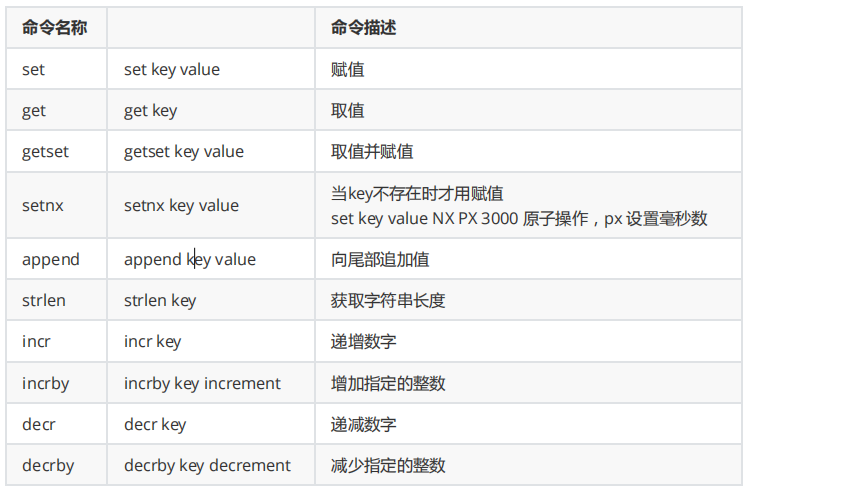
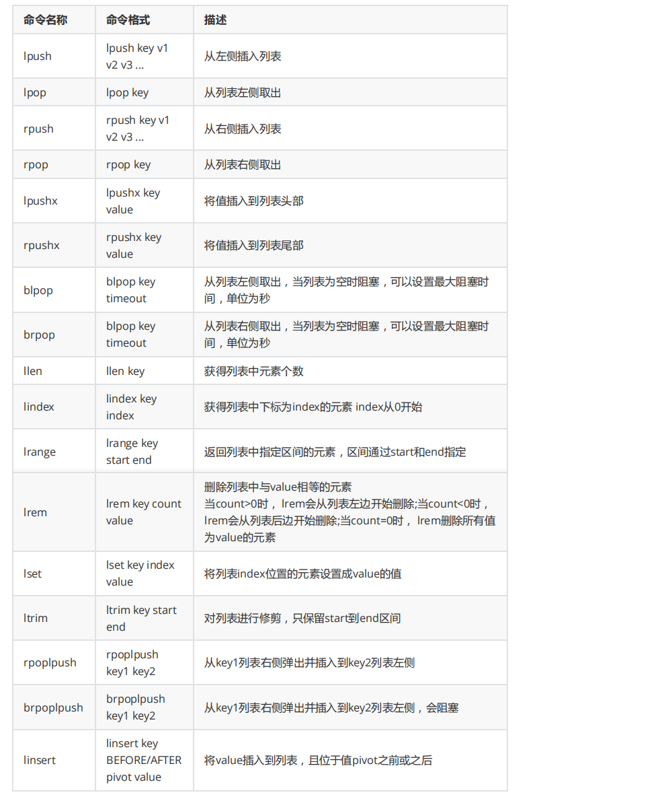
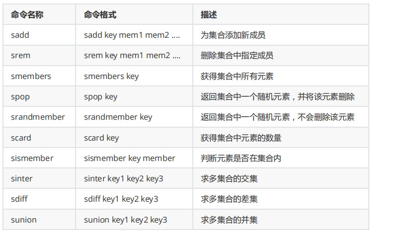
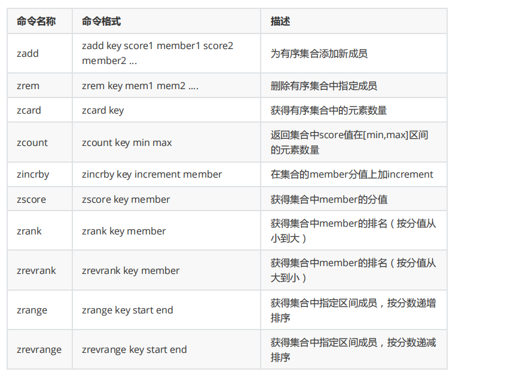
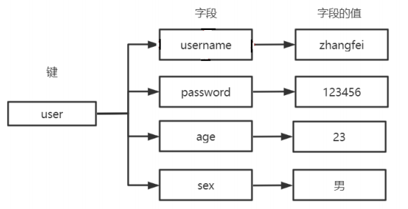
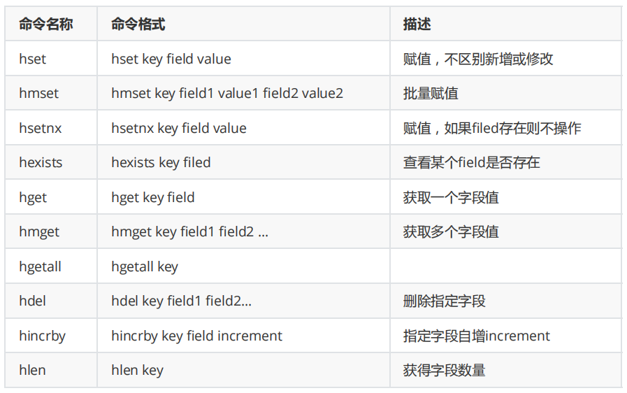
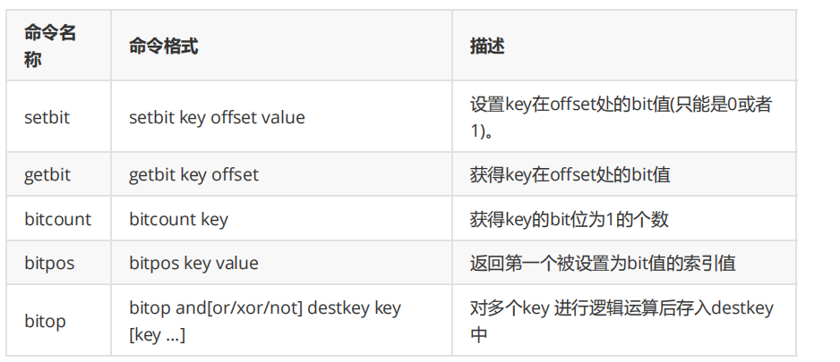
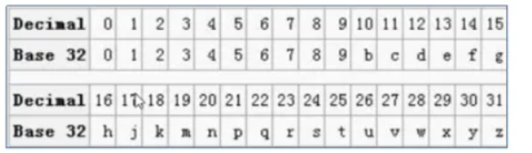
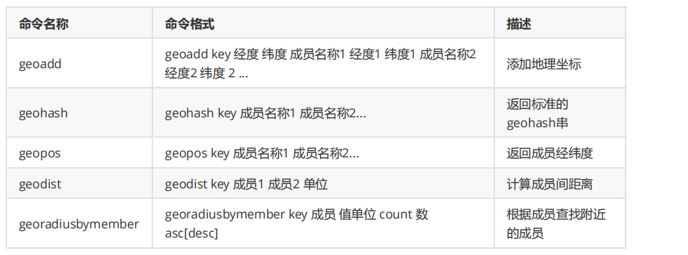

[toc]

## 一、Redis简介

**Redis （Remote Dictionary Server）远程字典服务器**，是用 **C语言** 开发的一个**开源的高性能键值对（ key-value ）内存数据库**，是NoSQL的一种数据库


最新版Redis6.0 单机QPS可达10W/S，redis为什么快？

- 基于内存
- 基于C语言的数据结构


### 1. 历史

**2008**年，意大利的一家创业公司 `Merzia `推出了一款基于 `MySQL `的网站实时统计系统 `LLOOGG `，然而没过多久该公司的创始人` Salvatore Sanfilippo` （ antirez）便 对MySQL的性能感到失望，于是他决定亲自**为 `LLOOGG `量身定做一个数据库，并于2009年开发完成**，这个数据库就是 **Redis**。


**Redis2.6**

Redis2.6在2012年正式发布，主要内容：服务端支持Lua脚本、去掉虚拟内存相关功能、键的过期时间支持毫秒、新增两个新的位图命令：bitcount和bitop

**Redis2.8**

Redis2.8在2013年正式发布，主要内容：主从复制、Redis Sentinel生产可用

**Redis3.0**

Redis3.0在2015年正式发布，主要内容：Redis Cluster：Redis的官方分布式实现（Ruby）

**Redis3.2**

Redis3.2在2016年正式发布，主要内容：添加GEO相关功能、SDS在速度和节省空间上都做了优化

**Redis4.0**

Redis4.0在2017年7月发布，主要内容：新增缓存剔除算法：LFU（Last Frequently Used）、新增RDB-AOF混合持久化


### 2. 应用场景

- **缓存，用于减轻DB压力**

  特别是访问量大的数据和高并发场景，使用Redis在服务器启动的时候加载热点key，配合本地缓存Guava cache，可以大量减轻数据库压力

- DB，用于**存储数量小且固定但访问量有很大的数据**，如字典表

  当成数据库使用时，还是需要一个完整的数据源，在服务器启动时从文件或者关系数据库加载

- 存储临时数据，如一些中间状态

- 分布式session，用于解决分布式场景下的Session问题
- **任务队列，用于乐观锁实现（高性能）**
- **冷热数据交换**
- **分布式锁**
- 使用zset做应用排行榜
- 使用bitmap做签到


## 二、Redis安装（单机）

### 1. Redis 下载

官网地址：http://redis.io/

中文官网地址：http://www.redis.cn/

下载地址：http://download.redis.io/releases/


### 2. Redis 安装环境

Redis 没有官方的 Windows 版本，所以建议在 Linux 系统上安装运行。


### 3. Redis 安装

- 安装 C 语言需要的 GCC 环境

  ```sh
  yum install -y gcc-c++ 
  yum install -y wget
  ```

- 下载并解压 Redis 源码压缩包

  ```sh
  wget http://download.redis.io/releases/redis-5.0.5.tar.gz 
  tar -zxf redis-5.0.5.tar.gz
  ```

- 编译 Redis 源码，进入 redis-5.0.5 目录，执行编译命令

  ```sh
  cd redis-5.0.5/src 
  make
  ```

- 安装 Redis ，需要通过 PREFIX 指定安装路径

  ```sh
  mkdir -p /usr/local/redis 
  make install PREFIX=/usr/local/redis
  ```

- 文件说明

  - redis-server：启动 redis 服务
  - redis-cli：进入 redis 命令客户端
  - redis-benchmark：性能测试的工具
  - redis-check-aof：aof 文件进行检查的工具
  - redis-check-dump：rdb 文件进行检查的工具
  - redis-sentinel：启动哨兵监控服务


### 4. Redis 服务端启动

#### 非守护进程启动

```sh
./redis-server
```

#### 守护进程启动

- 拷贝 redis-5.0.5/redis.conf 配置文件到 Redis 安装目录的 bin 目录

  ```sh
  cp redis.conf /usr/local/redis/bin/
  ```

- 修改 redis.conf

  ```sh
  vim redis.conf
  ```

  ```sh
  # 将`daemonize`由`no`改为`yes` 
  daemonize yes 
  
  # 默认绑定的是回环地址，默认不能被其他机器访问 
  # bind 127.0.0.1 
  
  # 是否开启保护模式，由yes该为no 
  protected-mode no
  ```

- 启动服务

  ```sh
  ./redis-server redis.conf
  ```


### 5. Redis 命令行客户端连接

```sh
./redis-cli -h 127.0.0.1 -p 6379
```


## 三、整合项目使用

### 1. Java程序访问Redis

#### 1. 添加依赖

```xml
<dependency>
    <groupId>redis.clients</groupId> 
    <artifactId>jedis</artifactId> 
    <version>2.9.0</version>
</dependency>
```

#### 2. 访问Redis

```java
public void testConn(){ 
    //与Redis建立连接 IP+port 
    Jedis redis = new Jedis("192.168.127.128", 6379); 
    
    //在Redis中写字符串 key value 
    redis.set("jedis:name:1","jd-zhangfei"); 
    
    //获得Redis中字符串的值 
    System.out.println(redis.get("jedis:name:1")); 
    
    //在Redis中写list 
    redis.lpush("jedis:list:1","1","2","3","4","5"); 
    
    //获得list的长度 
    System.out.println(redis.llen("jedis:list:1")); 
}
```


### 2. Spring 整合Redis

#### 1. 添加依赖

```xml
<dependencies>
    <!-- 添加spring依赖 -->
	<dependency> 
        <groupId>org.springframework</groupId> 
        <artifactId>spring-beans</artifactId> 
        <version>5.2.5.RELEASE</version> 
    </dependency> 
    <dependency> 
        <groupId>org.springframework</groupId> 
        <artifactId>spring-core</artifactId> 
        <version>5.2.5.RELEASE</version> 
    </dependency> 
    <dependency> 
        <groupId>org.springframework</groupId> 
        <artifactId>spring-context</artifactId> 
        <version>5.2.5.RELEASE</version> 
    </dependency>
    <dependency> 
        <groupId>org.springframework</groupId> 
        <artifactId>spring-test</artifactId>
        <version>5.2.5.RELEASE</version> 
    </dependency>
    <dependency> 
        <groupId>junit</groupId> 
        <artifactId>junit</artifactId> 
        <version>4.12</version>
        <scope>test</scope> 
    </dependency>
    
    <!-- 添加redis依赖 -->
    <dependency> 
        <groupId>org.springframework.data</groupId> 
        <artifactId>spring-data-redis</artifactId> 
        <version>1.0.3.RELEASE</version> 
    </dependency>
</dependencies>
```


#### 2. spring 命名空间配置文件

```xml
<?xml version="1.0" encoding="UTF-8"?> 
<beans xmlns="http://www.springframework.org/schema/beans" xmlns:xsi="http://www.w3.org/2001/XMLSchema-instance" xsi:schemaLocation="http://www.springframework.org/schema/beans http://www.springframework.org/schema/beans/spring-beans.xsd">

	<bean id="propertyConfigurer" class="org.springframework.beans.factory.config.PropertyPlaceholderConfigurer>
		<property name="locations"> 
			<list>
				<value>classpath:redis.properties</value> 
			</list> 
		</property>
	</bean>


	<!--redis config--> 
	<bean id="jedisPoolConfig" class="redis.clients.jedis.JedisPoolConfig"> 
		<property name="maxActive" value="${redis.pool.maxActive}" /> 
		<property name="maxIdle" value="${redis.pool.maxIdle}" /> 
		<property name="maxWait" value="${redis.pool.maxWait}" /> 
		<property name="testOnBorrow" value="${redis.pool.testOnBorrow}" /> 
	</bean>


	<bean id="jedisConnectionFactory" class="org.springframework.data.redis.connection.jedis.JedisConnectionFactory">
		<property name="hostName" value="${redis.server}"/> 
		<property name="port" value="${redis.port}"/> 
		<property name="timeout" value="${redis.timeout}" />
		<property name="poolConfig" ref="jedisPoolConfig" />
	</bean>


	<bean id="redisTemplate" class="org.springframework.data.redis.core.RedisTemplate">
		<property name="connectionFactory" ref="jedisConnectionFactory"/>
		<property name="KeySerializer">
			<bean class="org.springframework.data.redis.serializer.StringRedisSerializer"> </bean>
		</property>
		<property name="ValueSerializer">
			<bean class="org.springframework.data.redis.serializer.StringRedisSerializer"> </bean>
		</property>
	</bean>

</beans>
```


#### 3. redis 配置文件

```properties
redis.pool.maxActive=100 
redis.pool.maxIdle=50 
redis.pool.maxWait=1000 
redis.pool.testOnBorrow=true 

redis.timeout=50000 
redis.server=192.168.207.135 
redis.port=6379
```


#### 4. 测试

```java
@ContextConfiguration({ "classpath:redis.xml" })
public class RedisTest extends AbstractJUnit4SpringContextTests {
    @Autowired 
    private RedisTemplate<Serializable, Serializable> rt;
    
    @Test public void testConn() {
        rt.opsForValue().set("name","zhangfei"); 
        System.out.println(rt.opsForValue().get("name"))
    }
}
```


### 3. SpringBoot 整合Redis

#### 1. 添加依赖

```xml
<dependency> 
    <groupId>org.springframework.boot</groupId> 
    <artifactId>spring-boot-starter-data-redis</artifactId> 
</dependency
```


#### 2. 全局配置文件

```yaml
spring:
  redis:
    host: 192.168.207.135
    port: 6379
    jedis:
      pool:
        min-idle: 0
        max-idle: 8
        max-active: 80
        max-wait: 30000
        timeout: 3000
```


#### 3. 启动类

```java
@SpringBootApplication
@EnableCaching 
public class SpringbootRedisApplication {    
    ....
}
```


#### 4. 自定义RedisConfig

```java
import org.springframework.beans.factory.annotation.Autowired; 
import org.springframework.context.annotation.Bean; 
import org.springframework.context.annotation.Configuration; 
import org.springframework.data.redis.connection.RedisConnectionFactory; 
import org.springframework.data.redis.core.RedisTemplate; 
import org.springframework.data.redis.serializer.StringRedisSerializer;

@Configuration 
public class RedisConfig {
    @Autowired 
    private RedisConnectionFactory factory;
    
    @Bean 
    public RedisTemplate<String, Object> redisTemplate() {
    	RedisTemplate<String, Object> redisTemplate = new RedisTemplate<>(); 
        
        // String 编码
        redisTemplate.setKeySerializer(new StringRedisSerializer()); 
        redisTemplate.setValueSerializer(new StringRedisSerializer()); 
        
        // Hash 编码
        redisTemplate.setHashKeySerializer(new StringRedisSerializer()); 
        redisTemplate.setHashValueSerializer(new StringRedisSerializer()); 
        
        redisTemplate.setConnectionFactory(factory); 
        return redisTemplate;    
    }
}
```


#### 5. 测试

```java
@Autowired 
RedisTemplate redisTemplate;

//设置过期时间为20秒 
redisTemplate.opsForValue().set(key,value,20, TimeUnit.SECONDS);

(String) redisTemplate.opsForValue().get(key);
```


## 四、Redis 数据类型

### 1. Redis Key-Value 简述

Redis是一个以 Key-Value 结构存储的存储系统

Key 的数据类型是字符串，**注意：Key 是大小写敏感的**

Value 的常见数据类型有：

- String：底层是SDS
- List：底层是quicklist
- Set：底层是
  - 存储整数且整数值小于64位时采用 intset
  - 否则采用dict
- sortedSet：底层是
  - 元素个数过小且是小整数或小字符串时采用ziplist
  - 否则采用skiplist
- Hash：底层是
  - 元素个数过小且是小整数或小字符串时采用ziplist
  - 否则字典dict

Value 的不常见数据类型有：

- bitmap：位图类型
- geo：地理位置类型
- stream：流类型


### 2. Key 设计

- 用:分割

- 把表名转换为key前缀,，比如：user:
- 第二段根据实际查询字段设置，比如：根据uid的值查询，则 user:${uid}
- 若使用hash存储value或使用json存储value，可不设置第三段
- 若使用单值String类型存储value，可使用列名存储第三段，比如：根据uid的值查询手机号，则user:${uid}:phoneNo


### 3. Value 类型介绍

Value一共有8种类型，分别是，String、List、Set、SortedSet、Hash、bitmap、Geo、Stream

#### 3.1 String 字符串类型

##### 使用方法

Redis 的 String字符串类型，支持字符串、整数、浮点数三种类型

底层 **基于Redis 自己实现的SDS（简单动态字符串）**



##### 应用场景

- 用于value值为字符串

- 乐观锁（基于incr操作递增数字配合事务watch实现）
- 分布式锁（setnx）

##### 案例

```sh
127.0.0.1:6379> setnx name zhangf #如果name不存在赋值 
(integer) 1 
127.0.0.1:6379> setnx name zhaoyun #再次赋值失败 
(integer) 0 
127.0.0.1:6379> get name 
"zhangf"
127.0.0.1:6379> set age 18 NX PX 10000 #如果不存在赋值 有效期10秒 
OK
127.0.0.1:6379> set age 20 NX #赋值失败 
(nil) 
127.0.0.1:6379> get age #age失效 
(nil) 
127.0.0.1:6379> set age 30 NX PX 10000 #赋值成功 
OK
127.0.0.1:6379> get age 
"30
```


#### 3.2 List 列表类型

##### 使用方法

Redis 的 List列表类型是一个双向不循环链表，内部结构存储了头尾结点，因此获取头尾结点极快

底层基于 **quickList 快速列表**实现

list的元素个数最多为$2^{32}-1$个（40亿）



##### 应用场景

- 作为 **栈或队列使用**
- 可用于各种列表，比如**用户列表、商品列表、评论列表**等

##### 案例

```sh
127.0.0.1:6379> lpush list:1 1 2 3 4 5
(integer) 5 
127.0.0.1:6379> lrange list:1 0 -1 
1) "5" 
2) "4" 
3) "3" 
4) "2" 
5) "1" 
127.0.0.1:6379> lpop list:1 # 从0开始 
"5" 
127.0.0.1:6379> rpop list:1 
"1" 
127.0.0.1:6379> lindex list:1 1 
"3" 
127.0.0.1:6379> lrange list:1 0 -1 
1) "4" 
2) "3" 
3) "2" 
127.0.0.1:6379> lindex list:1 1 
"3" 
127.0.0.1:6379> rpoplpush list:1 list:2 
"2" 
127.0.0.1:6379> lrange list:2 0 -1 
1) "2" 
127.0.0.1:6379> lrange list:1 0 -1
1) "4" 
2) "3"

```


#### 3.3 Set 集合类型

##### 使用方法

Redis 的 Set类型是一个 **无序且唯一元素**的结构

底层 **基于整数集合或hash表**的数据结构实现

集合最长为$2^{32}-1$个（40亿个）



##### 应用场景

- 用于 **无序且不重复的**数据 存储
- 可**使用 spop或srandmenmber 进行随机抽奖**

##### 案例

```sh
127.0.0.1:6379> sadd set:1 a b c d 
(integer) 4 
127.0.0.1:6379> smembers set:1 
1) "d" 
2) "b" 
3) "a" 
4) "c" 
127.0.0.1:6379> srandmember set:1 
"c" 
127.0.0.1:6379> srandmember set:1 
"b" 
127.0.0.1:6379> sadd set:2 b c r f 
(integer) 4 
127.0.0.1:6379> sinter set:1 set:2 
1) "b" 
2) "c" 
127.0.0.1:6379> spop set:1
"d" 
127.0.0.1:6379> smembers set:1 
1) "b" 
2) "a" 
3) "c"
```


#### 3.4 SortedSet 有序集合类型

##### 使用方法

Redis 的 ZSet类型，是一个有序且不重复 的数据类型

底层 **基于zskiplist跳跃表或者压缩列表**实现，排序根据**跳跃表属性 score分值**实现



##### 应用场景

- 用于各种排行榜的展示

##### 案例

```sh
127.0.0.1:6379> zadd hit:1 100 item1 20 item2 45 item3 
(integer) 3
127.0.0.1:6379> zcard hit:1 
(integer) 3
127.0.0.1:6379> zscore hit:1 item3 
"45"
127.0.0.1:6379> zrevrange hit:1 0 -1
1) "item1"
2) "item3"
3) "item2"
```


#### 3.5 Hash 散列类型

##### 使用方法

Redis 的 Hash类型，是一个 `field `和 `value `都是 String类型的数据类型

每个hash 可以存储 $2^{32}-1$ 个键值对（40亿）





##### 应用场景

- 对象的存储 
- DB表数据

##### 案例

```sh
127.0.0.1:6379> hmset user:001 username zhangfei password 111 age 23 sex M 
OK
127.0.0.1:6379> hgetall user:001 
1) "username" 
2) "zhangfei" 
3) "password" 
4) "111" 
5) "age" 
6) "23" 
7) "sex" 
8) "M" 
127.0.0.1:6379> hget user:001 username 
"zhangfei" 
127.0.0.1:6379> hincrby user:001 age 1 
(integer) 24 
127.0.0.1:6379> hlen user:001 
(integer) 4
```


#### 3.6 bitmap位图类型

##### 使用方法

bitmap是进行位操作的

通过一个bit位来表示某个元素对应的值或者状态，其中的key就是对应元素本身。

bitmap本身会极大的节省储存空间。



##### 应用场景

- 用户每月签到，用户id为key，日期作为偏移量 1表示签到

- 统计活跃用户，日期为key，用户id为偏移量 1表示活跃

- 查询用户在线状态，日期为key，用户id为偏移量 1表示在线

##### 案例

```sh
127.0.0.1:6379> setbit user:sign:1000 20200101 1 #id为1000的用户20200101签到
(integer) 0 
127.0.0.1:6379> setbit user:sign:1000 20200103 1 #id为1000的用户20200103签到 
(integer) 0
127.0.0.1:6379> getbit user:sign:1000 20200101 #获得id为1000的用户20200101签到状态 1 表示签到 
(integer) 1 
127.0.0.1:6379> getbit user:sign:1000 20200102 #获得id为1000的用户20200102签到状态 0表示未签到
(integer) 0
127.0.0.1:6379> bitcount user:sign:1000 # 获得id为1000的用户签到次数 
(integer) 2
127.0.0.1:6379> bitpos user:sign:1000 1 #id为1000的用户第一次签到的日期 
(integer) 20200101
127.0.0.1:6379> setbit 20200201 1000 1 #20200201的1000号用户上线 
(integer) 0 
127.0.0.1:6379> setbit 20200202 1001 1 #20200202的1000号用户上线 
(integer) 0
127.0.0.1:6379> setbit 20200201 1002 1 #20200201的1002号用户上线 
(integer) 0 
127.0.0.1:6379> bitcount 20200201 #20200201的上线用户有2个 
(integer) 2
127.0.0.1:6379> bitop or desk1 20200201 20200202 #合并20200201的用户和20200202上线 了的用户 
(integer) 126
127.0.0.1:6379> bitcount desk1 #统计20200201和20200202都上线的用 户个数 
(integer) 3
```


#### 3.7 geo 地理位置类型

##### 使用方法

geo是Redis用来处理位置信息的。在Redis3.2中正式使用。主要是利用了Z阶曲线、Base32编码和geohash算法

- Base32 编码

  Base32编码是**将二进制数据编码成可见的字符串**，以5个bit为一组进行切分（base64以6个bit为一组），然后对每个组进行编码得到1个可见字符。

  Base32编码表字符集中的字符总数为32个（0-9、b-z去掉a、i、l、o），这也是Base32名字的由来。

  

- geohash算法

  Gustavo在2008年2月上线了geohash.org网站。Geohash是一种地理位置信息编码方法，通过Geohash可以将地球上任意经纬度坐标转换为较短的字符串码，以北京的坐标举例，`[39.928167,116.389550]`可以转换成 `wx4g0s8q3jf9 `



##### 应用场景

- 记录地理位置

- 计算距离

- 查找"附近的人"

##### 案例

```sh
127.0.0.1:6379> geoadd user:addr 116.31 40.05 zhangf 116.38 39.88 zhaoyun 116.47 40.00 diaochan #添加用户地址 zhangf、zhaoyun、diaochan的经纬度 
(integer) 3
127.0.0.1:6379> geohash user:addr zhangf diaochan #获得zhangf和diaochan的geohash 码
1) "wx4eydyk5m0" 
2) "wx4gd3fbgs0"
127.0.0.1:6379> geopos user:addr zhaoyun #获得zhaoyun的经纬度
1) 1) "116.38000041246414185"
   2) "39.88000114172373145"
127.0.0.1:6379> geodist user:addr zhangf diaochan #计算zhangf到diaochan的距离,单 位是m
"14718.6972" 
127.0.0.1:6379> geodist user:addr zhangf diaochan km #计算zhangf到diaochan的距离, 单位是km
"14.7187"
127.0.0.1:6379> geodist user:addr zhangf zhaoyun km 
"19.8276" 
127.0.0.1:6379> georadiusbymember user:addr zhangf 20 km withcoord withdist count 3 asc # 获得距离zhangf20km以内的按由近到远的顺序排出前三名的成员名称、距离及经纬度 #withcoord ： 获得经纬度 withdist：获得距离 withhash：获得geohash码
1) 1) "zhangf"
   2) "0.0000"
   3) 1) "116.31000012159347534"
      2) "40.04999982043828055"
2) 1) "diaochan" 
   2) "14.7187" 
   3) 1) "116.46999925374984741" 
      2) "39.99999991084916218"
3) 1) "zhaoyun" 
   2) "19.8276" 
   3) 1) "116.38000041246414185" 
      2) "39.88000114172373145"
```
