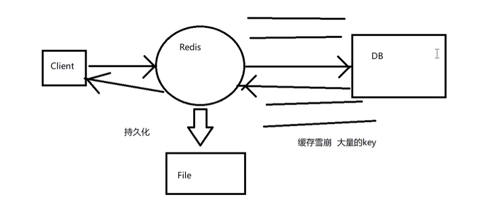
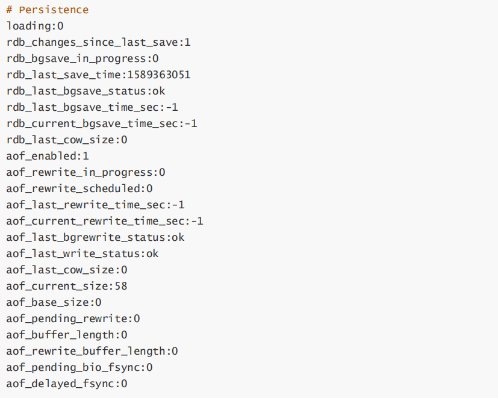
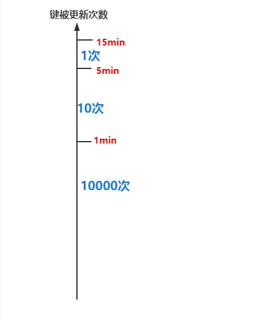
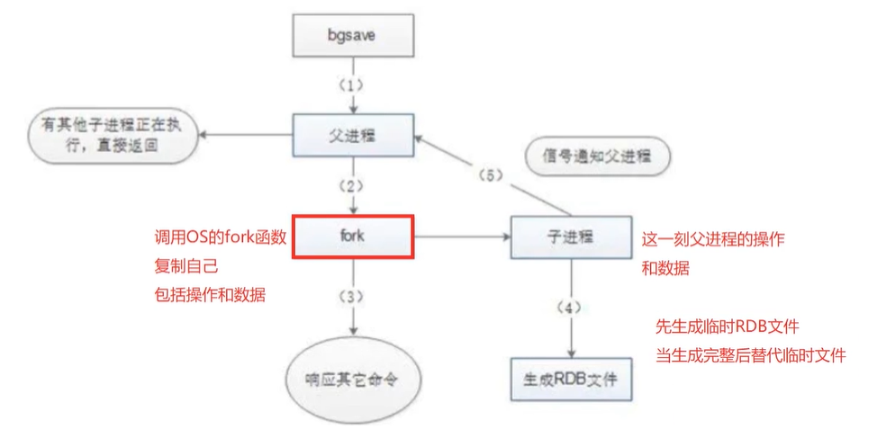
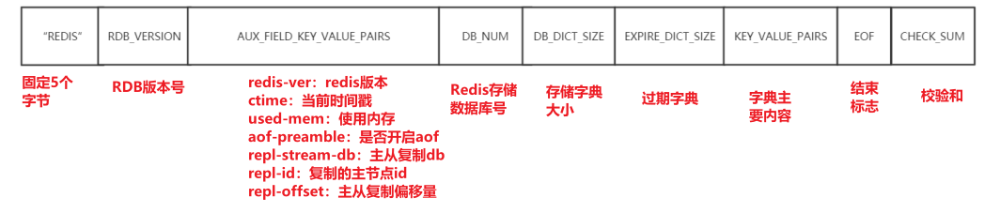
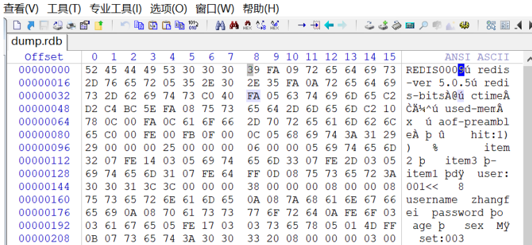
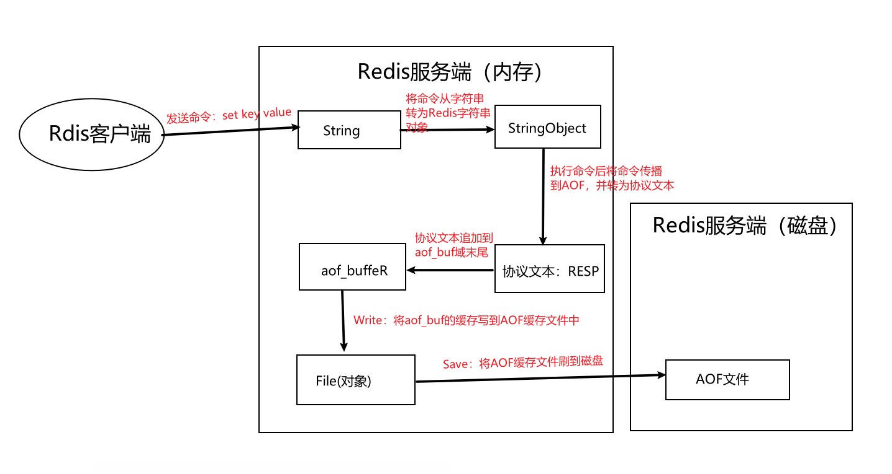
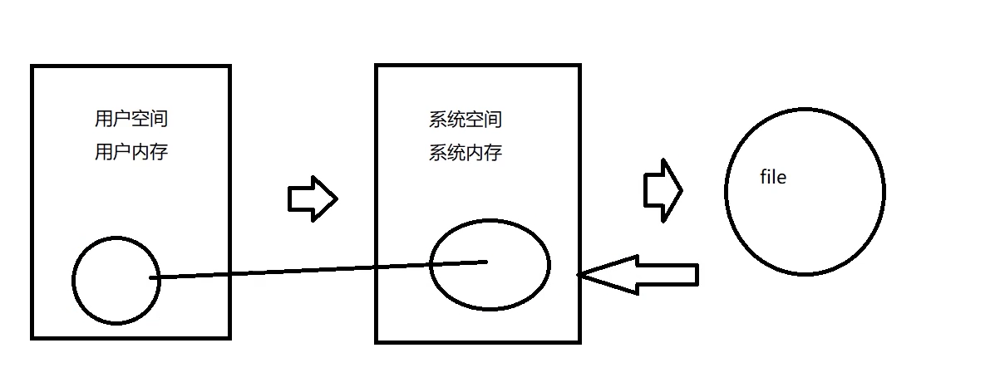

[toc]

## 一、Redis 持久化

### 1. 为什么要持久化

Redis 持久化的目的并不是存储数据，而是**在服务器宕机后（保存在内存中的数据消失），可以重启从磁盘文件中快速恢复数据。**




Redis 提供了两种持久化的方式，分别时RDB 和 AOF，通过 `info `命令可以查看关于持久化的信息：




### 2. RDB

RDB（Redis Database）是 Redis **默认的持久化存储方式**，实现方式是生成某一刻的二进制快照文件，所以当Redis宕机重启后，可能会丢失一些数据

#### 2.1 RDB触发快照方式

- 配置快照生成规则

  ```sh
  save "" # 不使用RDB存储 不能主从
  
  save 900 1 # 表示15分钟（900秒钟）内至少1个键被更改则进行快照。
  save 300 10 # 表示5分钟（300秒）内至少10个键被更改则进行快照。
  save 60 10000 # 表示1分钟内至少10000个键被更改则进行快照。
  ```

  

- 手动执行 `bgsave `命令

  ```sh
  127.0.0.1:6379> bgsave 
  Background saving started
  ```

- 手动执行 `flushall` 命令

- 第一次执行主从复制操作

#### 2.2 RDB 原理



1. 主进程收到生成快照的指令后，首先判断是否已有其他子进程在执行RDB操作，是的话则结束当前任务（如：bgsave命令直接返回）
2. 主进程调用 OS 的 fork函数创建一个子进程（复制主进程的所有操作和数据），此过程需要阻塞主进程
3. 主进程 fork 完成，`bgsave `命令返回 `”Background saving started”` 信息并不再阻塞父进程，并可以响应其他命令
4. 子进程利用内存快照中的数据，生成临时的RDB文件，当临时文件完全生成后替换原来的RDB文件
5. 子进程发送信号给主进程表示完成，父进程更新统计信息

#### 2.3 RDB文件

RDB文件存储再 **dump.rdb** 中，其文件如下



可以用 **winhex** 打开 **dump.rdb**文件查看



#### 2.4 RDB的优缺点

**优点**

- RDB文件是二进制的压缩文件，占用空间小且便于传输（主从复制）
- 主进程fork子进程，通过子进程生成新的RDB文件，减少了主进程的阻塞时间

**缺点**

- 由于RDB是一种快照文件，根据触发规则重新生成快照，无法做到实时的数据持久化，所以存在数据不一致（主从复制）及重启丢失数据（根据默认快照配置，可能存在15min的数据丢失）的情况

- 当主进程的资源很大时（内存数据），fork过程将导致主进程长时间阻塞


### 3. AOF 

- AOF：存命令

  


## 二、Redis 底层数据结构

Redis 实例对象

RedisObject 对象

底层数据数据结构

- 动态字符串SDS
- 跳跃表skiplist
- hash表
- 快速列表quiklist
  - 压缩列表ziplist
  - 整数集合
- 流对象


## 三、Redis 缓存过期及淘汰策略

maxmemery

删除策略


## 四、Redis 通讯协议及时间处理机制

Redis 请求协议及命令处理流程

Redis 多路复用模式以及实现方式

Redis 时间事件处理机制、文件事件处理机制


