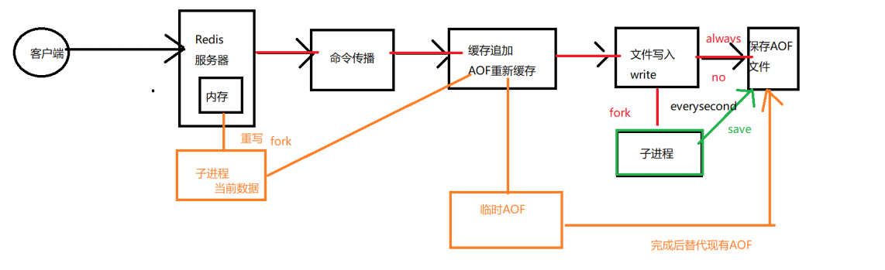

[toc]

## 一、Redis 持久化

### 1. 为什么要持久化

Redis 持久化的目的并不是存储数据，而是**在服务器宕机后（保存在内存中的数据消失），可以重启从磁盘文件中快速恢复数据。**


Redis 提供了两种持久化的方式，分别时RDB 和 AOF，通过 `info `命令可以查看关于持久化的信息：


### 2. RDB

RDB（Redis Database）是 Redis **默认的持久化存储方式**，实现方式是**生成某一刻的二进制快照文件**，所以当Redis宕机重启后，可能会丢失一些数据

#### 2.1 RDB触发快照方式

- 配置快照生成规则

  ```sh
  save "" # 不使用RDB存储 不能主从
  
  save 900 1 # 表示15分钟（900秒钟）内至少1个键被更改则进行快照。
  save 300 10 # 表示5分钟（300秒）内至少10个键被更改则进行快照。
  save 60 10000 # 表示1分钟内至少10000个键被更改则进行快照。
  ```

  

- 手动执行 **`bgsave `**命令

  ```sh
  127.0.0.1:6379> bgsave 
  Background saving started
  ```

- 手动执行 **`flushall`** 命令

- 第一次执行主从复制操作

#### 2.2 RDB 原理


1. 主进程收到生成快照的指令后，首先判断是否已有其他子进程在执行RDB操作，是的话则结束当前任务（如：bgsave命令直接返回）
2. 主进程调用 OS 的 fork函数创建一个子进程（复制主进程的所有操作和数据），此过程需要阻塞主进程
3. 主进程 fork 完成，`bgsave `命令返回 `”Background saving started”` 信息并不再阻塞父进程，并可以响应其他命令
4. 子进程利用内存快照中的数据，生成临时的RDB文件，当临时文件完全生成后替换原来的RDB文件
5. 子进程发送信号给主进程表示完成，父进程更新统计信息

#### 2.3 RDB文件

RDB文件存储再 **dump.rdb** 中，其文件如下


可以用 **winhex** 打开 **dump.rdb**文件查看


#### 2.4 RDB的优缺点

**优点**

- RDB文件是二进制的压缩文件，占用空间小且便于传输（主从复制）
- 主进程fork子进程，通过子进程生成新的RDB文件，减少了主进程的阻塞时间

**缺点**

- 由于RDB是一种快照文件，根据触发规则重新生成快照，无法做到实时的数据持久化，所以存在数据不一致（主从复制）及重启丢失数据（根据默认快照配置，可能存在15min的数据丢失）的情况

- 当主进程的资源很大时（内存数据），fork过程将导致主进程长时间阻塞


### 3. AOF

AOF（append only file）也是Redis持久化方式之一，默认不开启。

开启AOF持久化后，Redis 将所有**写操作的命令及参数（RESP）记录到 AOF 文件**，以此达到记录数据库状态的目的。当Redis宕机重启后，只需按顺序重新执行AOF中的命令即可恢复数据

#### 3.1 开启 AOF 配置

配置 redis.conf

```sh
# 可以通过修改redis.conf配置文件中的appendonly参数开启 
appendonly yes 

# AOF文件的保存位置和RDB文件的位置相同，都是通过dir参数设置的。 
dir ./ 

# 默认的文件名是appendonly.aof，可以通过appendfilename参数修改 
appendfilename appendonly.aof
```

#### 3.2 AOF 流程及原理

AOF 原理流程图如下：


其流程图主要分为三个阶段：

- **命令传播**

  当 Client端 将命令发送到 Redis 后，将协议文本的 **字符串转为 Redis的StringObject对象**，并调用函数执行命令，若是写操作则将执行后的命令、参数和参数个数**传播到 AOF 模块**

- **缓存追加**

  AOF 模块接受到数据后，将 **StringObject对象 重新转为协议文本（RESP）**并追加到 **`redis.h/redisServer`（该文件记录了Redis服务端的状态）** 结构的 **`aof_buf`（记录待写入AOF文件的RESP命令）** 末尾

- **写入文件**

  调用 **`aof.c/flushAppendOnlyFile`** 函数，其执行以下两个工作：

  - **WRITE：**根据条件，将 **`aof_buf`** 中的缓存写入到 AOF 文件对象中
  - **SAVE：**根据条件，调用 **`fsync`** 或 **`fdatasync`** 函数，将 AOF 文件保存到磁盘中

#### 3.3 AOF 保存方式

AOF 目前包含有以下三种保存方式：


- **AOF_FSYNC_NO**

  不保存，每次调用 `flushAppendOnlyFile `函数，只执行`WRITE ` 而不执行`SAVE `。

  但在以下三种情况会执行 `SAVE`（**会阻塞主进程**）：

  - Redis 被关闭

  - AOF 功能被关闭

  - 系统的写缓存被刷新（缓存被写满，定期刷盘从而执行 `SAVE`）

- **AOF_FSYNC_EVERYSEC（默认）**

  每一秒钟保存一次， 此模式的 `SAVE `由后台子进程（fork）调用的， 所以它**不会阻塞主进程**

- **AOF_FSYNC_ALWAYS**

  每执行一个命令保存一次（不推荐），此模式的 `SAVE `由 Redis 主进程执行。每次执行完一个命令之后， `WRITE `和 `SAVE `都会**阻塞主进程**

#### 3.4 AOF 重写/瘦身

AOF 记录的是操作命令**即所有数据的变化过程**，所以体积会越来越大，Redis提供了重写的机制来为 AOF 文件瘦身，**通过 fork子进程对 AOF进行重写，然后替换旧 AOF 文件**，其重写效果如下：


##### 2.4.1 重写流程

在整个 AOF 后台重写过程中， 只有最后的写入缓存和改名操作会造成主进程阻塞， 在其他时候， AOF 后台重写都不会对主进程造成阻塞， 这将 AOF 重写对性能造成的影响降到了最低。以上就是 AOF 后台重写， 也即是 BGREWRITEAOF 命令(AOF重写)的工作原理。



**当触发AOF重写机制时，主进程的操作：**

- 主进程会 **fork一个子进程**（同RDB机制一样，调用OS的fork函数克隆一个子进程，**子进程拥有主进程fork时的所有资源**）
- 主进程**继续 AOF 的流程（命令传播、缓存追加、文件写入），将命令写入现有 AOF 文件**（总不能因为AOF重写就不进行最新数据的持久化吧哈哈）
- 主进程将协议文本（RESP）**写入到 AOF缓存文件 的同时**，也会**记录到 AOF重写缓存**（AOF 机制添加了一个 AOF 重写缓存，**用于记录重写过程中主进程接受的新命令**）

**当触发AOF重写机制时，子进程的操作：**

- 子进程 fork自 主进程，拥有主进程相同的内存数据
- 子进程通过对 **AOF缓存文件 + AOF重写缓存 进行优化**，生成瘦身后的 AOF文件
- 子进程完成 AOF重写后，向父进程发送一个完成信号，父进程在接到完成信号之后，会调用一个信号处理函数， 并完成以下工作：
  - 将 AOF 重写缓存中的内容全部写入到新 AOF 文件中
  - 对新的 AOF 文件进行改名，**覆盖**原有的 AOF 文件
  - 这个信号处理函数执行完毕之后， 主进程就可以继续像往常一样接受命令请求了

##### 3.4.2 触发方式


## 二、Redis 底层数据结构

Redis 实例对象

RedisObject 对象

底层数据数据结构

- 动态字符串SDS
- 跳跃表skiplist
- hash表
- 快速列表quiklist
  - 压缩列表ziplist
  - 整数集合
- 流对象


## 三、Redis 缓存过期及淘汰策略

maxmemery

删除策略


## 四、Redis 通讯协议及时间处理机制

Redis 请求协议及命令处理流程

Redis 多路复用模式以及实现方式

Redis 时间事件处理机制、文件事件处理机制


