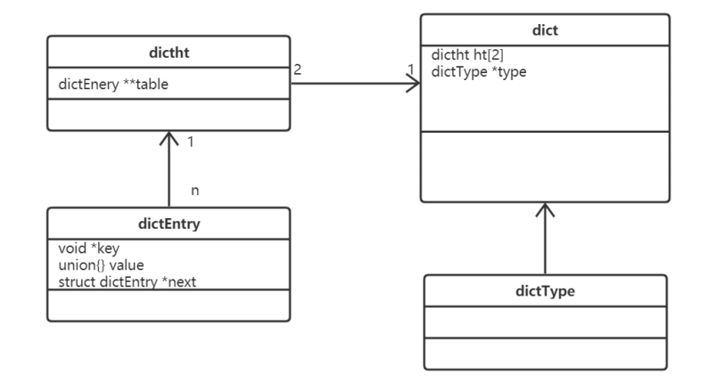
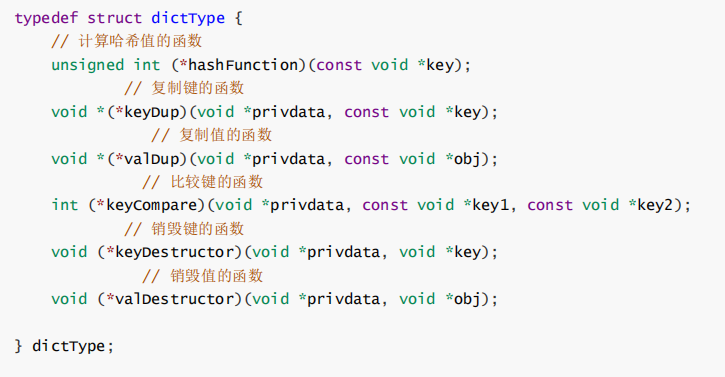

[toc]

## 一、Redis 持久化

### 1. 为什么要持久化

Redis 持久化的目的并不是存储数据，而是**在服务器宕机后（保存在内存中的数据消失），可以重启从磁盘文件中快速恢复数据。**


Redis 提供了两种持久化的方式，分别时RDB 和 AOF，通过 `info `命令可以查看关于持久化的信息：


### 2. RDB

RDB（Redis Database）是 Redis **默认的持久化存储方式**，实现方式是**生成某一刻的二进制快照文件**，所以当Redis宕机重启后，可能会丢失一些数据

#### 2.1 RDB触发快照方式

- 配置 `redis.conf` RDB快照生成规则

  ```sh
  save "" # 不使用RDB存储 不能主从
  
  save 900 1 # 表示15分钟（900秒钟）内至少1个键被更改则进行快照。
  save 300 10 # 表示5分钟（300秒）内至少10个键被更改则进行快照。
  save 60 10000 # 表示1分钟内至少10000个键被更改则进行快照。
  ```

  

- 手动执行 **`bgsave `**命令

  ```sh
  127.0.0.1:6379> bgsave 
  Background saving started
  ```

- 手动执行 **`flushall`** 命令

- 第一次执行主从复制操作


#### 2.2 RDB 原理


1. 主进程收到生成快照的指令后，首先判断是否已有其他子进程在执行RDB操作，是的话则结束当前任务（如：bgsave命令直接返回）
2. 主进程调用 OS 的 fork函数创建一个子进程（复制主进程的所有操作和数据），此过程需要阻塞主进程
3. 主进程 fork 完成，`bgsave `命令返回 `”Background saving started”` 信息并不再阻塞父进程，并可以响应其他命令
4. 子进程利用内存快照中的数据，生成临时的RDB文件，当临时文件完全生成后替换原来的RDB文件
5. 子进程发送信号给主进程表示完成，父进程更新统计信息


#### 2.3 RDB文件

RDB文件存储再 **dump.rdb** 中，其文件如下


可以用 **winhex** 打开 **dump.rdb**文件查看


#### 2.4 RDB的优缺点

**优点**

- RDB文件是二进制的压缩文件，占用空间小且便于传输（主从复制）
- 主进程fork子进程，通过子进程生成新的RDB文件，减少了主进程的阻塞时间

**缺点**

- 由于RDB是一种快照文件，根据触发规则重新生成快照，无法做到实时的数据持久化，所以存在数据不一致（主从复制）及重启丢失数据（根据默认快照配置，可能存在15min的数据丢失）的情况

- 当主进程的资源很大时（内存数据），fork过程将导致主进程长时间阻塞


### 3. AOF

AOF（append only file）也是Redis持久化方式之一，默认不开启。

开启AOF持久化后，Redis 将所有**写操作的命令及参数（RESP）记录到 AOF 文件**，以此达到记录数据库状态的目的。当Redis宕机重启后，只需按顺序重新执行AOF中的命令即可恢复数据

#### 3.1 开启 AOF 配置

配置 `redis.conf` AOF开启

```sh
# 可以通过修改redis.conf配置文件中的appendonly参数开启 
appendonly yes 

# AOF文件的保存位置和RDB文件的位置相同，都是通过dir参数设置的。 
dir ./ 

# 默认的文件名是appendonly.aof，可以通过appendfilename参数修改 
appendfilename appendonly.aof
```


#### 3.2 AOF 流程及加载数据原理

##### 3.2.1 AOF 原理流程图


其流程图主要分为三个阶段：

- **命令传播**

  当 Client端 将命令发送到 Redis 后，将协议文本的 **字符串转为 Redis的StringObject对象**，并调用函数执行命令，若是写操作则将执行后的命令、参数和参数个数**传播到 AOF 模块**

- **缓存追加**

  AOF 模块接受到数据后，将 **StringObject对象 重新转为协议文本（RESP）**并追加到 **`redis.h/redisServer`（该文件记录了Redis服务端的状态）** 结构的 **`aof_buf`（记录待写入AOF文件的RESP命令）** 末尾

- **写入文件**

  调用 **`aof.c/flushAppendOnlyFile`** 函数，其执行以下两个工作：

  - **WRITE：**根据条件，将 **`aof_buf`** 中的缓存写入到 AOF 文件对象中
  - **SAVE：**根据条件，调用 **`fsync`** 或 **`fdatasync`** 函数，将 AOF 文件保存到磁盘中

##### 3.2.2 AOF 加载数据原理

由于**AOF文件存储的是命令**，而Redis命令**只能在客户端中执行**，所以当Redis重启时，Redis Server会**创建一个不带网络连接的伪客户端**（fake client，**命令来源于AOF文件而不需要网络接收**），通过fake client来执行AOF文件命令来恢复数据


#### 3.3 AOF 触发及保存方式

AOF 目前包含有以下三种保存方式：


- **AOF_FSYNC_NO**

  不保存，每次调用 `flushAppendOnlyFile `函数，只执行`WRITE ` 而不执行`SAVE `。

  但在以下三种情况会执行 `SAVE`（**会阻塞主进程**）：

  - Redis 被关闭

  - AOF 功能被关闭

  - 系统的写缓存被刷新（缓存被写满，定期刷盘从而执行 `SAVE`）

- **AOF_FSYNC_EVERYSEC（默认）**

  每一秒钟保存一次， 此模式的 `SAVE `由后台子进程（fork）调用的， 所以它**不会阻塞主进程**

- **AOF_FSYNC_ALWAYS**

  每执行一个命令保存一次（不推荐），此模式的 `SAVE `由 Redis 主进程执行。每次执行完一个命令之后， `WRITE `和 `SAVE `都会**阻塞主进程**


#### 3.4 AOF 重写/优化

AOF 记录的是操作命令**即所有数据的变化过程**，所以体积会越来越大，Redis提供了重写的机制来为 AOF 文件瘦身，**通过 fork子进程对 AOF进行重写，然后替换旧 AOF 文件**，其重写效果如下：


##### 3.4.1 重写流程

在整个 AOF重写 过程中，只有**主进程for子进程**、主进程**接收子进程信号**并执行**追加缓存**和**替换旧AOF文件** 是**阻塞的**，其他时候都是非阻塞的。这将 AOF 重写对性能造成的影响降到了最低。以下是 AOF后台重写，也即是 **bgrewriteaof** 命令(AOF重写)的工作原理。


**当触发AOF重写机制时，主进程的操作：**

- 主进程会 **fork一个子进程**（同RDB机制一样，调用OS的fork函数克隆一个子进程，**子进程拥有主进程fork时的所有资源**）
- 主进程**继续 AOF 的流程（命令传播、缓存追加、文件写入），将命令写入现有 AOF 文件**（总不能因为AOF重写就不进行最新数据的持久化吧哈哈）
- 主进程将协议文本（RESP）**写入到 AOF缓存文件 的同时**，也会**记录到 AOF重写缓存**（AOF 机制添加了一个 AOF 重写缓存，**用于记录重写过程中主进程接受的新命令**）

**当触发AOF重写机制时，子进程的操作：**

- 子进程 fork自 主进程，拥有主进程相同的内存数据
- 子进程通过对 **AOF缓存文件 + AOF重写缓存 进行优化**，生成瘦身后的 AOF文件
- 子进程完成 AOF重写后，向父进程发送一个完成信号，父进程在接到完成信号之后，会调用一个信号处理函数， 并完成以下工作：
  - 主进程**将 AOF重写缓存 中新添加的数据全部写入到新 AOF 文件中**
  - 对**新的 AOF文件进行改名**，**覆盖**原有的 AOF 文件
  - 这个信号处理函数执行完毕之后， 主进程就可以继续像往常一样接受命令请求了

##### 3.4.2 AOF 重写触发方式

- 配置 `redis.conf` AOF重写规则

  ```sh
  # 表示当前aof文件大小超过上一次aof文件大小的百分之多少的时候会进行重写。如果之前没有重写过， 以启动时aof文件大小为准
  auto-aof-rewrite-percentage 100
  
  # 限制允许重写最小aof文件大小，也就是文件大小小于64mb的时候，不需要进行优化
  auto-aof-rewrite-min-size 64mb
  ```

- 执行bgrewriteaof命令

  ```sh
  127.0.0.1:6379> bgrewriteaof 
  Background append only file rewriting started
  ```


### 4. 混合持久化

Redis4.0 开始支持RDB和AOF混合持久化方式，aofrewrite 的时候就直接把 rdb 的内容写到 aof 文件开头即：**RDB的头+AOF的身体——》appendonly.aof**

#### 4.1 Redis重启时，加载方式

- 首先读取 AOF文件 appendonly.aof
- 判断是否REDIS字符串开头，是则先按RDB格式加载数据
- 再按AOF格式加载剩余数据


#### 4.2 redis.conf 开启配置：

```sh
aof-use-rdb-preamble yes
```


### 5. RDB与AOF 的对比

- RDB存储的是某时刻的**二进制快照数据文件**；而AOF存储的是**协议文本命令**
- RDB持久化的性能较AOF高，**直接通过fork子进程来对数据进行快照**；而AOF主进程需要进行命令传播/缓存追加/写入文件操作（**只有在`EVERYSEC模式`下才会fork子进程来 `SAVE`**），阻塞时间较RDB久。
- RDB持久化按默认触发规则，可能会丢失十几分钟的数据，而AOF至多只会丢失一秒的数据


### 6. 应用场景

#### 6.1 追求高性能

不使用持久化，通过原始数据源，Redis每次启动时都从原始数据源加载数据


#### 6.2 确保数据不易丢失

使用RDB + AOF


#### 6.3 较高性能

使用RDB


## 二、Redis 底层数据结构


### 1. RedisDB对象

Redis 中存在数据库的概念，该**结构由 `redis.h` 中的 RedisDb定义**，保存在**redisServer.db 数组中（RedisServer的一个成员 属性）**，redisClient通过一个名叫db的指针指向当前使用的数据库

**RedisDB 结构体源码如下**


**dict类型**为一个字典，是Redis的一个底层数据结构，key就是需要存储数据的key，详细结构见[底层结构-hash表](#3.3 字典dict)


### 2. RedisObject 对象

value 是一个对象，类型是 RedisObject，其结构源码如下


- **type**

  代表 value对象的**[数据类型](./Redis基础篇/#四、Redis 数据类型)**，常见的有**string(字符串)**、**list(列表)**、**hash(哈希)**、**set(集合)**、**zset(有序集合)等。。。**

  通过命令 **`type key`** 查询 key 对应 value的数据类型

  ```sh
  127.0.0.1:6379> type a1 
  string
  ```

- **encoding**

  代表 value对象的**内部编码**，Redis可通过不同的场景来为对象设置合适的编码，如`set a1 1`，则编码将设置为 int类型，而不是String类型

  通过 **`object encoding key`** ，查询 value 的编码方式

  ```sh
  127.0.0.1:6379> object encoding a1 
  "int"
  ```

- **ptr**

  代表 value对象使用的**[底层的数据结构](#3. 底层数据数据结构)**，ptr指针 指向具体的数据结构，有**SDS**、**skiplist**、**dict/hash**、**quiklist**、**stream**等。。。

- **refcount**

  代表 value对象**被引用的次数**，当refcount > 1 时，被称为共享对象，节省了重复创建相同对象的开销

- **lru**

  代表 value对象最后一次被访问的时间，由24位二进制码组成，高16位存**最近访问时间**，剩余位存储**最近访问次数**

  lru——》 高16位: 最后被访问的时间

  lfu——》低8位：最近访问次数


### 3. 底层数据数据结构

#### 3.1 简单动态字符串SDS

Redis的字符串对象是自己实现的简单动态字符串（Simple Dynamic String）


##### 3.1.1 其结构源码如下


##### 3.1.2 优势如下

- SDS**获取字符串长度的时间复杂度为$O(1)$，**而C语言的字符串为$O(n)$

  $SDS长度 =  free + len + 1$

- 当SDS增加字符时，缓冲区不够存储则会自动分配内存，**防止了缓冲区内存溢出**

##### 3.1.3 使用场景

- 存储key
- 存储value的字符串和整型数据
- AOF缓冲区和用户输入缓冲。


#### 3.2 跳表skiplist

跳表是Redis有序集合的底层数据结构，**本质是一种二分查找的链表**。通过在原始链表上**创建多级索引，实现有序链表的二分查找**，每次查找都能过滤剩余一半的数据，相当于链表版的二分查找，**时间复杂度是$O(log_2n)$**

其结构特点如下：

- skiplist由**很多层有序链表组成**
- **最底层是原始链表**，包含**所有元素**
- 最底层**之上每一层链表都是索引层**，上层索引是下层索引的子集
- 每个结点有两个指针，**一个指向同层右边的结点**，**一个指向下层的结点**
- 跳表的**head结点**是**最高层的第一个结点**

操作特点如下：

- 查找元素，从 head 开始，从左到右、从上到下依次查找并比较
  - 如果 right 指向的结点为null，即尾节点，则下移
  - 如果 结点值 等于 target则返回
  - 如果 target 大 则继续往右
  - 如果 target 小 则往下

- 添加元素允许重复
- **添加**元素，**定位**新元素在原始链表要**插入的位置**，然后插入；然后通过**抛硬币**的方式**决定是否创建索引，概率50%**；若**超过当前索引层**，则**新建索引链表的头结点**，并创建该元素的索引结点
- 删除重复元素时，只删前一个
- **删除**元素时，找到目标，**从索引到原始元素，逐层删除**

若要插入80和45示意图如下：


##### 3.2.1 结构源码如下


跳跃表的特点是 每层都是一个链表

##### 3.2.2 优势如下

- 查找、新增、删除的时间复杂度都是 $O(log_2n)$
- 可以在$O(1)$的时间复杂度下，**快速获得跳跃表的头节点、尾结点、长度和高度**

##### 3.2.3 使用场景

跳跃表是有序集合（sorted-set）的底层实现，效率高，实现简单


#### 3.3 字典dict

dict（字典）的内部维护了一个Hash表（dictht）和字典类型，类图及示意图如下所示




- **dictht：**即hash表，数组的初始容量为4，扩容是时为一倍扩容
- **dictEntry：**即hash表的结点
- **dictType：**type字段，指向dictType结构体，里边包括了对该字典操作的函数指针

##### 3.3.1 结构源码如下

- dict 字典

  

- dictht（hash表）

  

- dictEntry（hash表节点）

  

- dictType

  

##### 3.3.2 字典dict的扩容

1. 初次申请默认容量为4个dictEntry，非初次申请为当前hash表容量的一倍。

2. rehashidx=0表示要进行rehash操作。

3. 新增加的数据在新的hash表h[1]

4. 修改、删除、查询在老hash表h[0]、新hash表h[1]中（rehash中）

5. 将老的hash表h[0]的数据重新计算索引值后全部迁移到新的hash表h[1]中，这个过程称为rehash。

##### 3.3.3 使用场景

- k-v存储的hash数据类型
- 所有的散列表对象
- 元素大小过大的集合数据类型（set）
- 哨兵模式中的主从节点管理


#### 3.4 压缩列表ziplist

压缩列表是由一系列**特殊编码的顺序表**组成，示意图如下


##### 3.4.1 结构源码如下


##### 3.4.2 使用场景

- sorted-set和hash元素个数少且是小整数或短字符串（直接使用）
- list用快速链表(quicklist)数据结构存储，而快速链表是双向链表与压缩列表的组合。（间接使用）


#### 3.5 整数集合intset

整数集合是一个**有序的**、**存储整数的**、**不会出现重复元素**的**顺序表**，当 集合（set） 是整数并且都处在64位有符号整数范围内（2^64），使用该结构体存储


示意图如下


##### 3.5.1 结构源码如下


##### 3.5.2 使用场景

- 当集合（set）的元素是整数且大小范围在64位整数内，底层结构使用整数集合


#### 3.6 快速列表quicklist

快速列表quicklist 是 列表list数据类型 的底层数据结构，**快速列表quicklist是一个双向链表**，链表中的**每个节点是一个ziplist结构**。quicklist中的**每个节点ziplist都能够存储多个数据元素**


快速链表quicklist示意图如下


##### 3.6.1 结构源码如下


##### 3.6.2 优势如下

- 使用双向链表结构，无需进行扩容操作
- 双向链表结构，插入删除更为高效，可以通过头结点和尾结点去遍历位置然后新增或删除
- 使用压缩列表，更加节省空间

##### 3.6.3 使用场景

- 列表(List)的底层实现
- 发布与订阅
- 慢查询
- 监视器


#### 3.7 流对象stream

流对象stream主要由：消息、生产者、消费者和消费组构成


Redis Stream的底层主要使用了listpack（紧凑列表）和Rax树（基数树）

##### 3.7.1 listpack

listpack表示一个字符串列表的序列化，listpack可用于存储字符串或整数。用于存储stream的消息内容


##### 3.7.2 Rax树

Rax 是一个有序字典树 (基数树 Radix Tree)，按照 key 的字典序排列，支持快速地定位、插入和删除操作

用于存储消息队列，在 Stream 里面消息 ID 的前缀是时间戳 + 序号，这样的消息可以理解为时间序列消息。使用 Rax 结构 进行存储就可以快速地根据消息 ID 定位到具体的消息，然后继续遍历指定消息 之后的所有消息


##### 3.7.3 使用场景

stream的底层实现


## 三、Redis 缓存过期及淘汰策略

### 1. 为什么要有缓存过期和淘汰策略

Redis 是内存数据库，当缓存的数据过大可能会将打满，从而使用swap虚拟内存，导致IO性能急剧下降

- **缓存过期：**为key**设置一个TTL（time to live）**，**通过惰性删除来删除数据**

- **淘汰策略：**当Redis使用内存 **达到 maxmemory阈值**时，会**触发主动删除**，通过配置的淘汰策略进行删除数据


### 2. 缓存过期

通过expire命令可以设置一个key的 TTL（time to live），单位默认为秒

- 设置过期时间命令：**`expire key TTL(second)`**、**`setex key value TTL(second)`**
- 查看剩余过期时间命令：**`ttl key`**

#### 2.1 结构源码如下

RedisDb 的 `expires`属性 用于维护设置了过期时间的key。

- 当执行expire命令，则**先判断字典dict表是否含有该key**，有的话则存入ttl至expires中
- 当执行setex命令，则**先将k-v存入字典然后再将ttl存入expires**


#### 2.2 删除策略

缓存过期**采用的是惰性删除策略**


### 3. 删除策略

Redis的删除方式包含**主动删除、惰性删除和定时删除**三种方式，目前**Redis的删除策略采用主动删除+惰性删除**

#### 3.2.1 惰性删除

当key被访问时，先判断是否再expires中，是的话则调用 `expireIfNeeded `函数，**先检查一下它有没有失效，若失效则删除数据**


#### 3.2.2 定时删除（不推荐）

当设置key 的 ttl时，同时**创建一个定时器**，当定时器到了 ttl 时间，主动删除数据

#### 3.2.3 主动删除

主动删除也就是淘汰策略的配置，需要开启maxmemory且不为0，在 `redis.conf` 配置


### 4. 淘汰策略

主动删除的前提是**设置了maxmemory且不为0**，在` redis.conf` 配置 `maxmemory`

```sh
maxmemory 1024mb # 最大缓存量 一般为内存的3/4 
```

配置主动删除（淘汰策略），在` redis.conf` 配置 `maxmemory-policy`（默认为no-enviction）

```sh
maxmemory-policy allkeys-lru
```

#### 4.1 LRU（基于最近访问时间）

LRU (Least recently used) 即最近最少使用，通用的实现思想如下

- 在 Java中可以使用**LinkHashMap**去实现LRU，利用队列的FIFO思想，淘汰队首结点
- **新数据**插入到**队尾**
- 每当缓存命中（即缓存数据**被访问**），则将**数据移到链队列尾部**
- 当**链队列满**的时候，将链表**首结点的数据丢弃**

而Redis的LRU算法包含volatile-lru和allkeys-lru两种，基于 **redisObject对象的 LRU属性值**最近访问时间实现淘汰数据

##### 4.1.1 volatile-lru

从**设置过期时间的数据集**（server.db[i].expires）中**随机挑选几个字典**，**淘汰lru属性值最小的**（最小说明上次访问时间很久了）

##### 4.1.2 allkeys-lru

从**数据字典集**（server.db[i].dict）中**随机挑选几个字典**，**淘汰lru属性值最小的**（最小说明上次访问时间很久了）


#### 4.2 LFU（基于最近访问次数）

LFU (Least frequently used) 最不经常使用，淘汰一段时间内访问次数最少的，基于 **redisObject对象的 LRU属性值**中的最近访问次数实现淘汰数据

##### 4.2.1 volatile-lfu

从设置过期时间的数据集（server.db[i].expires）中随机挑选几个字典，**淘汰lfu属性值最小的（最小说明访问次数最少）**

##### 4.2.2 allkeys-lfu

从数据字典集（server.db[i].dict）中随机挑选几个字典，**淘汰lfu属性值最小的（最小说明访问次数最少）**


#### 4.3 random

random 为随机淘汰策略

##### 4.3.1 volatile-random

从设置过期时间的数据集（server.db[i].expires）中**任意选择数据淘汰**

##### 4.3.2 allkeys-random

从数据集（server.db[i].dict）中**任意选择数据淘汰**


#### 4.4 TTL 

TTL 淘汰策略仅针对设置了过期时间的数据，取 ttl 值最小的字典淘汰（即将过期）

##### 4.4.1 volatile-ttl

从设置过期时间的数据集（server.db[i].expires）中挑选**将要过期的数据淘汰**


#### 4.5 no-enviction（默认 ）

禁止驱逐数据，不删除数据


#### 4.6 淘汰策略的选择

- 若是Redis 当作DB使用，则不应设置淘汰策略（不设置maxmemory或者使用no-enviction）
- 冷热数据交换，使用allkeys-lru


## 四、Redis 通讯协议及事件处理机制

### 1. Redis 请求响应模式

Redis通讯协议基于TCP连接，Client 和 Server保持双工连接，拥有以下几种请求响应模式

#### 1.1 非流水方式/非管道方式

只有接收到前一个响应后才能发起第二个请求（一问一答），redis-cli

#### 1.2 流水方式/管道方式

批量发起请求及批量接收响应，pipeline

无原子性，命令都是独立的，属于无状态的操作


#### 1.3 利用基本原子性的事务

[详情查看高级篇-事务](./Redis高级篇)

弱原子性，但是又缺陷

#### 1.4 发布订阅模式（sub/pub）

[详情查看高级篇-发布订阅](./Redis高级篇)

#### 1.5 利用lua脚本

[详情查看高级篇-lua脚本](./Redis高级篇)

强原子性和隔离性，另外的客户端 其它任何脚本或者命令都无法执行，脚本的执行时间应该尽量短，不能太耗时的脚本


### 2. Redis 请求协议及命令处理流程

#### 2.1 请求协议

Redis Client和Server通过 **TCP 连接**来网络通信，服务器默认的端口号为 6379，使用序列化文本协议（RESP），**RESP是以字符串数组的形式来传输命令及参数**

Client 发送 set命令

```sh
redis> SET mykey Hello 
"OK"
```

Client 实际发送请求的RESP协议的格式如下


Client 实际接收响应的RESP协议格式如下


RESP协议说明如下

- 间隔符号，在Linux下是**\r\n**，Windows下是\n
- （小）Simple Strings，以 "**+**"加号 开头
- （大）Bulk Strings，以 "**$**"美元符号开头，长度限制512M
- Errors，以"**-**"减号 开头
- Integer，以 "**:**" 冒号开头
- Arrays，以 "*****"星号开头

#### 2.2 命令处理流程


- 调用 lookupCommand 方法获得对应的 redisCommand
- 检测当前 Redis 是否可以执行该命令
- 调用 call 方法真正执行命令


### 3. Redis 事件处理机制

Redis 是典型的**事件驱动系统**，Redis又将事件分为 文件事件 和 时间事件

#### 3.1 文件事件（IO事件）

文件事件也就是读写事件，即IO事件。

Redis的事件处理机制采用的是 **单线程的[Reactor模式](../../框架/Netty/Netty基础及原理)**，Reactor是**事件驱动的一种设计模式**，**IO多路复用默认采用的是 epoll方式实现**

##### 3.1.1 Reactor 模型及流程


1. 主程序向事件分派器（Reactor）注册要监听的事件，并指定事件处理函数
2. Reactor调用OS提供的事件处理分离器，监听事件（wait）
3. 当有事件产生时，Reactor将事件派给相应的处理器来处理 handle_event()

##### 3.1.2 Redis Reactor 源码解析

###### 主循环


Redis在主循环中 不断地循环 **`aeEventLoop `**处理就绪事件

- **`aeEventLoop`** 是整个事件驱动的核心，它管理着所有事件列表等


- **`aeProcessEvent`**

  调用 aeApiPoll 函数去等待底层的I/O多路复用事件就绪

###### 事件处理器

- 连接事件处理器acceptTCPHandler

  当 Client 向 Server 建立Socket连接时，aeEventLoop 会调用 acceptTcpHandler函数，创建client socket对象，并创建对应读写事件来监听读写操作

  

- 请求事件处理器readQueryFromClient

  当 Client通过Socket 向Server发送数据时，aeEventLoop 会调用 readQueryFromClient 方函数，从 socket 中读取数据到输入缓冲区中，然后判断其大小是否大于系统设置的 `client_max_querybuf_len`，如果大于，则向 Redis返回错误信息，并关闭 client

  

- 响应处理器sendReplyToClien

  sendReplyToClien 处理器 将 Server写入输出缓冲区outbuf的内容，通过Socket 传输到 Client

  

##### 3.1.3 IO 多路复用实现

- select

  调用select 等待事件就绪是阻塞的，直到有事件发生或者超时（timeout指定等待时间，如果立即返回设为null即可）

  - 优点：所有平台都支持

  - 缺点：**单个进程打开的文件描述/句柄是有一定限制的，它由FD_SETSIZE设置，默认值是1024**；在检查文件描述符/句柄是否需要读写时，**无论socket是否活跃都将线性扫描整个数组**

- poll

  与select基本相同

  - 优点：**采样链表的形式存储**，所以**监听的事件没有限制**

  - 缺点：在检查文件描述符/句柄是否需要读写时，**无论socket是否活跃都将线性扫描整个链表**

- epoll

  epoll**创建一个epoll的文件描述符/句柄管理多个描述符**，将用户关系的文件描述符的事件存放到内核的一个事件表中，这样在用户空间和内核空间的copy只需一次

  - 优点：epoll 没有最大并发连接的限制，**上限是最大可以打开文件的数目**（在1GB内存的机器上大约是10万左右）；**检查fd是否需要读写时，只关心活跃的socket连接**；epoll使用了共享内存，不用做内存拷贝

- kqueue

  kqueue 是 **unix** 下的一个IO多路复用库，注册一批socket描述符到 kqueue 以后，当其中的描述符状态发生变化时，kqueue 将一次性通知应用程序哪些描述符

  - 优点：能处理大量数据，性能较好


#### 3.2 时间事件


### 4. Redis 时间事件处理机制、文件事件处理机制


