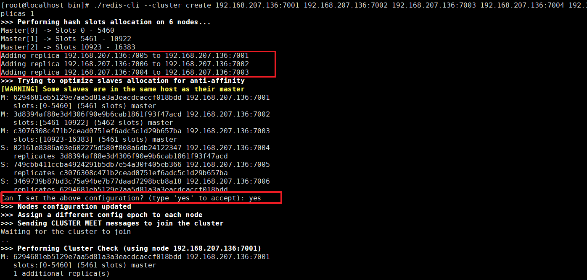
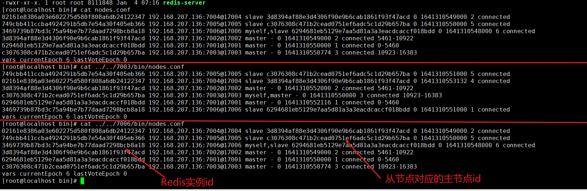
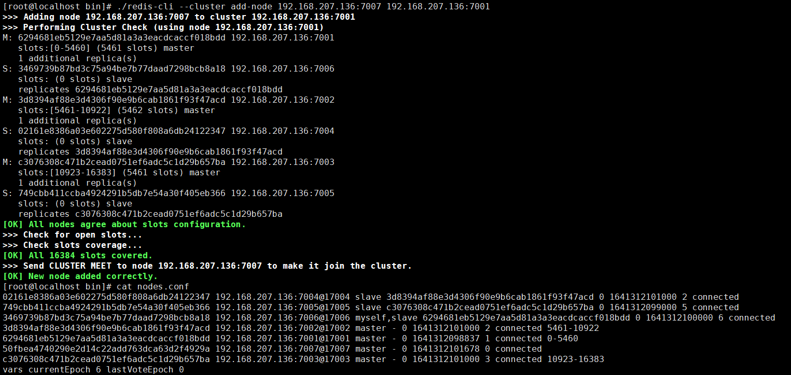
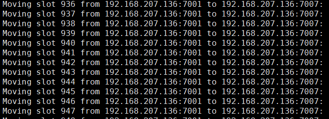
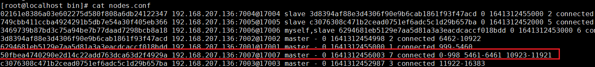
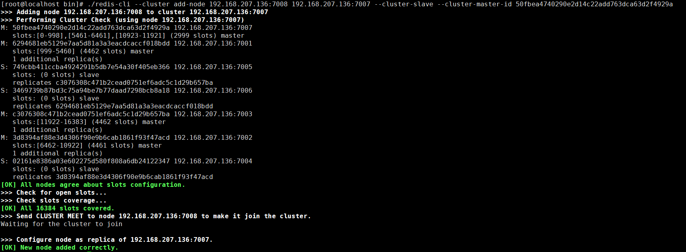
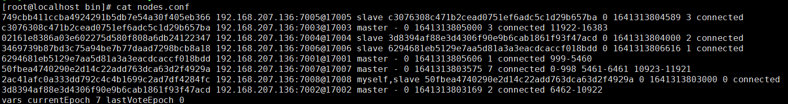

[toc]

## 一、主从


## 二、主从+哨兵


## 三、主从+集群

### 1. 按照[基础篇](Redis基础篇)在多台服务器上安装Redis

### 2. 修改 redis.conf 配置

```
vim /usr/local/redis-cluster/7001/bin/redis.conf
```

```sh
#注释bind 127.0.0.1
#bind 127.0.0.1

#关闭保护机制
protected-mode no

#修改端口
port 7001

#使用守护进程启动
daemonize yes

#打开被注释得cluster-enabled yes
cluster-enabled yes
```

### 3. 启动所有Redis服务

此处redis安装在一个服务器内，伪集群，因此需要一个个启动

```sh
./redis-server redis.conf
```

### 4. 创建Redis集群（创建时Redis里不要有数据）

- **在任意redis服务器上执行以下命令**

  cluster-replicas 表示主从架构只有一个从机，即前三个是主节点，后三个对应的从节点

  ip地址必须是对外的ip

  ```sh
  ./redis-cli --cluster create 192.168.207.136:7001 192.168.207.136:7002 192.168.207.136:7003 192.168.207.136:7004 192.168.207.136:7005 192.168.207.136:7006 --cluster-replicas 1
  ```

- **查看节点信息**

  ```sh
  cat nodes.conf
  ```





### 5. 客户端相关命令

- **命令客户端连接集群**

  **-c** 表示是以redis集群方式进行连接

  ```sh
  ./redis-cli -h 127.0.0.1 -p 7001 -c
  ```

- **查看集群中的节点**

  ```sh
  127.0.0.1:7003> cluster nodes 
  ```

- **查看集群状态（进入客户端）**

  ```sh
  127.0.0.1:7003> cluster info
  ```

### 6. （主从+集群）架构扩容

##### 6.1 先创建Redis7007节点 （无数据，需重新安装，切勿从有数据的Redis拷贝）

##### 6.2 启动7007节点服务

```sh
./redis-server redis.conf
```

##### 6.3 客户端连接7007，并添加7007结点作为新节点

在任意客户端执行，并添加倒集群中任意节点即可

```sh
./redis-cli --cluster add-node 192.168.207.136:7007 192.168.207.136:7001
```



##### 6.4 hash槽重新分配（数据迁移），给刚添加的7007结点分配槽

- 查看7007实例id

  ```sh
  cat nodes.conf
  ```

- 连接上集群（连接集群中任意一个可用结点都行）

  ```sh
  ./redis-cli --cluster reshard 192.168.207.136:7007
  ```

- 分配槽数

  输入：**3000**，表示要给目标节点分配3000个槽

  ```sh
  How many slots do you want to move (from 1 to 16384)? 3000
  ```

- 输入需被分配槽点及数据迁移的实例id

  ```sh
  What is the receiving node ID?
  50b073163bc4058e89d285dc5dfc42a0d1a222f2
  ```

- 输入源节点的id

  输入all，代表从所有主节点分配槽数倒新节点

  ```sh
  Please enter all the source node IDs. 
    Type 'all' to use all the nodes as source nodes for the hash slots. 
    Type 'done' once you entered all the source nodes IDs.
  ```

- 输入yes开始移动槽到目标结点id

  ```sh
  Do you want to proceed with the proposed reshard plan (yes/no)?
  ```

  

- 查看节点信息

  槽点及数据迁移成功

  

##### 6.5 为7007主节点添加从节点7008

- 创建Redis7008节点 （无数据，需重新安装，切勿从有数据的Redis拷贝）

- 启动7008节点

- 执行以下命令添加从节点到7007

  50fbea4740290e2d14c22add763dca63d2f4929a为7007节点的实例id

  ```sh
  ./redis-cli --cluster add-node 192.168.207.136:7008 192.168.207.136:7007 --cluster-slave --cluster-master-id 50fbea4740290e2d14c22add763dca63d2f4929a
  ```



- 查看节点信息

  ```sh
  cat nodes.conf
  ```

  

##### 6.6 常见问题

注意：如果原来该结点在集群中的配置信息已经生成到cluster-config-file指定的配置文件中（如果cluster-config-file没有指定则默认为**nodes.conf**），这时可能会报错：

```sh
[ERR] Node XXXXXX is not empty. Either the node already knows other nodes (check with CLUSTER NODES) or contains some key in database 0
```

解决方法是删除 nodes.conf，再执行 **`./redis-cli --cluster add-node`** 指令

### 7. （主从+集群）架构缩容

执行以下命令即删除集群中某个节点

```sh
./redis-cli --cluster del-node 192.168.207.136:7008 6be94480315ab0dd2276a7f70c82c578535d6666
```

如果删除已占有hash槽的结点，则会失败，报错如下：

```sh
[ERR] Node 192.168.127.128:7008 is not empty! Reshard data away and try again.
```

需要将该结点占用的hash槽分配出去即可

### 8. RedisCluster在JAVA中的使用

##### 8.1 添加依赖

```xml
<?xml version="1.0" encoding="UTF-8"?>
<project xmlns="http://maven.apache.org/POM/4.0.0"
         xmlns:xsi="http://www.w3.org/2001/XMLSchema-instance"
         xsi:schemaLocation="http://maven.apache.org/POM/4.0.0 http://maven.apache.org/xsd/maven-4.0.0.xsd">
    <modelVersion>4.0.0</modelVersion>
    <parent>
        <groupId>org.springframework.boot</groupId>
        <artifactId>spring-boot-starter-parent</artifactId>
<!--        <version>2.3.1.RELEASE</version>-->
        <version>1.4.2.RELEASE</version>
        <relativePath/>
    </parent>

    <groupId>com.tangdi</groupId>
    <artifactId>redis_demo</artifactId>
    <version>1.0-SNAPSHOT</version>

    <properties>
        <java.version>1.8</java.version>
    </properties>


    <dependencies>
        <dependency>
            <groupId>org.springframework.boot</groupId>
            <artifactId>spring-boot-starter</artifactId>
        </dependency>

        <dependency>
            <groupId>org.springframework.boot</groupId>
            <artifactId>spring-boot-starter-data-redis</artifactId>
            <exclusions>
                <exclusion>
                    <artifactId>lettuce-core</artifactId>
                    <groupId>io.lettuce</groupId>
                </exclusion>
            </exclusions>
        </dependency>
        <dependency>
            <groupId>redis.clients</groupId>
            <artifactId>jedis</artifactId>
            <version>2.9.0</version>
        </dependency>

        <dependency>
            <groupId>org.springframework.boot</groupId>
            <artifactId>spring-boot-starter-test</artifactId>
            <scope>test</scope>
        </dependency>
    </dependencies>

    <build>
        <plugins>
            <plugin>
                <groupId>org.springframework.boot</groupId>
                <artifactId>spring-boot-maven-plugin</artifactId>
            </plugin>
        </plugins>
    </build>
</project>
```

##### 8.2 Springboot全局配置

```yaml
spring:
  redis:
    database: 0 # Redis数据库索引（默认为0）
    timeout: 10000 # 连接超时时间（毫秒）
    pool:
        maxActive: 8 # 连接池最大连接数（使用负值表示没有限制）
        maxIdle: 8 # 连接池中的最大空闲连接
        maxWait: -1 # 连接池最大阻塞等待时间（使用负值表示没有限制）
        minIdle: 0 # 连接池中的最小空闲连接
    cluster:
      nodes:
        - 192.168.207.136:7001
        - 192.168.207.136:7002
        - 192.168.207.136:7003
        - 192.168.207.136:7004
        - 192.168.207.136:7005
        - 192.168.207.136:7006
        - 192.168.207.136:7007
        - 192.168.207.136:7008
```

##### 8.3 RedisCluster配置类

```java
package com.tangdi.config;

import org.apache.commons.pool2.impl.GenericObjectPoolConfig;
import org.springframework.boot.autoconfigure.data.redis.RedisProperties;
import org.springframework.boot.context.properties.ConfigurationProperties;
import org.springframework.context.annotation.Bean;
import org.springframework.context.annotation.Configuration;
import org.springframework.data.redis.connection.jedis.JedisConnectionFactory;
import redis.clients.jedis.HostAndPort;
import redis.clients.jedis.JedisCluster;
import redis.clients.jedis.JedisPoolConfig;

import java.util.HashSet;
import java.util.List;
import java.util.Set;

/**
 * @program: redis_demo
 * @description:
 * @author: Wangwt
 * @create: 1:28 2022/1/6
 */
@Configuration
public class RedisConfiguration {

    @Bean
    public JedisCluster jedisCluster(RedisProperties redisProperties){
        Set<HostAndPort> set = new HashSet<HostAndPort>();
        List<String> nodes = redisProperties.getCluster().getNodes();
        for (String node : nodes) {
            String[] split = node.split(":");
            set.add(new HostAndPort(split[0],Integer.parseInt(split[1])));
        }

        int maxRedirects = redisProperties.getCluster().getMaxRedirects() == null ? 5 : redisProperties.getCluster().getMaxRedirects();
        int timeout = redisProperties.getTimeout();
        GenericObjectPoolConfig jedisPoolConfig = new JedisPoolConfig();
        jedisPoolConfig.setMaxIdle(redisProperties.getPool().getMaxIdle());
        jedisPoolConfig.setMinIdle(redisProperties.getPool().getMinIdle());
        jedisPoolConfig.setMaxTotal(redisProperties.getPool().getMaxActive());
        return new JedisCluster(set,timeout,timeout,maxRedirects,jedisPoolConfig);
    }
}
```

##### 8.4 测试

```java
package com.tangdi;

import org.junit.Test;
import org.junit.runner.RunWith;
import org.springframework.beans.factory.annotation.Autowired;
import org.springframework.boot.test.context.SpringBootTest;
import org.springframework.test.context.junit4.SpringRunner;
import redis.clients.jedis.JedisCluster;

/**
 * @program: redis_demo
 * @description:
 * @author: Wangwt
 * @create: 0:52 2022/1/6
 */

@RunWith(SpringRunner.class)
@SpringBootTest(classes = RedisDemoApplication.class)
public class RedisDemoApplicationTest {

    @Autowired
    private JedisCluster jedisCluster;

    @Test
    public void set(){
        String s = jedisCluster.set("user:001","fawaikuangtu");
        System.out.println(s);
    }

    @Test
    public void get(){
        String s = jedisCluster.get("user:001");
        System.out.println(s);
    }

}
```

