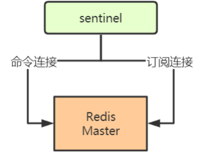
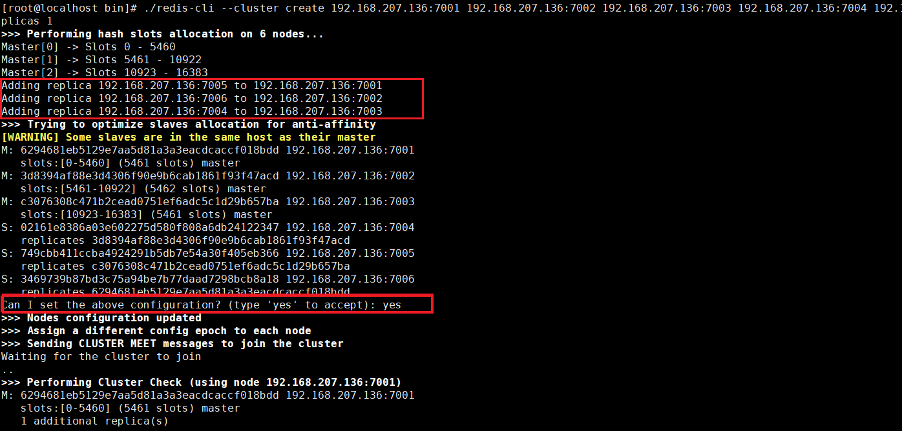
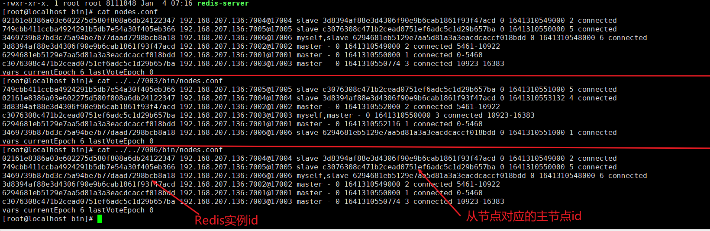
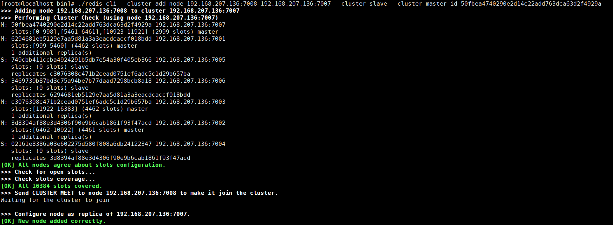

[toc]

## 一、主从复制

主从复制特点：同Mysql主从特点相同（读扩展，容灾备份）

主从复制缺点：同Mysql主从特点相同（主挂从不会自动切换为主，主从数据同步延时问题）

### 1. 主从搭建

- 按照[基础篇](Redis基础篇)在多台服务器上安装Redis

- 主 Redis

  无需特殊配置

  Master可通过配置**防止主服务器在不安全的情况下执行写命令**，修改 `redis.conf`

  ```sh
  min-slaves-to-write 3  #或者min-replicas-to-write 3，表示slavers少于3时，master拒绝执行写命令
  min-slaves-max-lag 10 #或者min-replicas-max-lag 10，表示slavers的延迟（心跳命令的延迟）值都大于或等于10秒
  ```

- 从 Redis

  修改 `redis.conf`

  ```sh
  # slaveof <masterip> <masterport> 
  # 表示当前【从服务器】对应的【主服务器】的IP是192.168.10.135，端口是6379。
  replicaof 127.0.0.1 6379
  ```

### 2. 主从原理

#### 2.1 复制流程


- Slaver启动，加载redis.conf文件，读取配置 `replicaof masterIp masterPort`
- Slaver 与 Master **创建socket连接**（slaver相当于master的client端），并**进行权限验证**
- 接收Master的**RDB文件进行全量复制（第一次连接上Master才会全量复制）**
- 第一次的全量复制完之后，主从进入**命令传播阶段**，Master会将执行的命令传播给Slaver（**增量复制**）
- 当Slaver**断线重连**后，全量还是增量同步由 Master **判断offset偏移量是否一致**来决定

#### 2.3 心跳检测

在命令传播阶段，从服务器默认会以每秒一次的频率向主服务器发送命令：

```sh
replconf ack <replication_offset> 
#ack :应答 
#replication_offset：从服务器当前的复制偏移量
```

向主服务器发送`INFO replication`命令，查看最后一次向master发送命令距离现在过了多少秒。lag如果超过1则说明主从之间的连接有故障


## 二、主从+哨兵（sentinel）

哨兵模式是Redis**主从架构高可用的解决方案**，用于故障时**进行主从切换**，由一个或多个sentinel实例组成**sentinel集群**可以**监视一个或多个主服务器和多个从服务器**，示意图如下


### 1. 哨兵搭建

- 按照[基础篇](Redis基础篇)在三台服务器上安装Redis，作为sentinel集群节点

- 从源码目录 拷贝 redis-5.0.5/sentinel.conf 配置文件到 Redis 安装目录的 bin 目录

  ```sh
  cp sentinel.conf /usr/local/redis/bin/
  ```

- 修改 `sentinel.conf` 配置文件并修改 

  ```sh
  # 哨兵sentinel实例运行的端口 默认26379 
  port 26379 
  
  # 将`daemonize`由`no`改为`yes` 
  daemonize yes
  
  # 哨兵sentinel监控的redis主节点的 ip port 
  # master-name：可以自己命名的主节点名字 只能由字母A-z、数字0-9 、这三个字符".-_"组成。 
  # quorum：当这些quorum个数sentinel哨兵认为master主节点失联，那么就认为主节点失联了 
  # sentinel monitor <master-name> <ip> <redis-port> <quorum> 
  sentinel monitor mymaster 127.0.0.1 6379 2
  
  
  # 当在Redis实例中开启了requirepass foobared 授权密码 这样所有连接Redis实例的客户端都要提供密码 
  # 设置哨兵sentinel连接主从的密码，注意必须为主从设置一样的验证密码 
  # sentinel auth-pass <master-name> <password> 
  sentinel auth-pass mymaster MySUPER--secret-0123passw0rd
  
  
  # 指定多少毫秒之后，主节点没有应答哨兵sentinel，哨兵主观上认为主节点下线，默认30秒，改成3秒
  # sentinel down-after-milliseconds <master-name> <milliseconds> 
  sentinel down-after-milliseconds mymaster 3000
  
  # 重新生成master时，最多可以有多少个slave同时对新的master进行同步，越大则主从切换的时间的越快，但是阻塞的时间也越长
  # 设为 1 保证了每次只有一个slave 处于不能处理命令请求的状态
  sentinel parallel-syncs mymaster 1
  
  # 故障转移的超时时间 failover-timeout
  sentinel failover-timeout mymaster 180000
  ```

- 以此启动主从和哨兵

  ```sh
  #启动redis-master和redis-slaver 
  在redis-master目录下 ./redis-server redis.conf 
  在redis-slaver1目录下 ./redis-server redis.conf 
  在redis-slaver2目录下 ./redis-server redis.conf 
  #启动redis-sentinel 
  在redis-sentinel1目录下 ./redis-sentinel sentinel.conf 
  在redis-sentinel2目录下 ./redis-sentinel sentinel.conf 
  在redis-sentinel3目录下 ./redis-sentinel sentinel.conf
  ```

### 2. 哨兵原理

#### 2.1 工作流程

- Sentinel 启动，加载sentinel.conf文件，读取配置

- **Sentinel 向Redis主节点建立2个连接**，分别是**命令连接**、**订阅连接**

  

- Sentinel **每10秒**向Redis主节点发送一次 **`info` 命令**，获取**主和从**服务器的**信息**

- 根据在Redis主节点获取的从服务器信息，**向Redis主从节点建立2个连接**，分别是**命令**和**订阅连接**，并**每隔10秒**向Redis从节点发送一次 **`info`命令**，获取**从节点状态**

  

- Sentinel **每2秒**向 **`_sentinel_:hello`频道推送**sentinel和Redis主节点节点的信息，给到所有Redis节点

- Sentinel 同时也 **订阅了`_sentinel_:hello`频道**，接收Redis主节点和从节点的信息

- Sentinel 集群的各个**Sentinel节点之间，只建立命令连接**，通过订阅Redis主从节点，发现新加入的Sentinel，然后通过命令连接进行通信

- Sentinel **每秒**向所有建立了命令连接的节点（Redis主从节点、其他Sentinel节点）**发送PING命令**

- 节点有以下情况则**被该sentinel认定为主观下线**

  - 若节点在**`down-after-milliseconds`时间内未回复**
  - 若节点**返回无效回复**（除了PONG、LOADING、MASTERDOWN外）

- 经过下述过程才会被sentinel集群认定为**客观下线**
  - 该sentinel发现某节点主观下线后，**向其他sentinel发送查询命令**
  - 若判定该节点**主观下线**的**sentinel数量达到quorum**，则认为**该节点客观下线了**
  
- Sentinel 集群**通过[Raft共识算法](../../分布式架构设计/分布式理论基础与一致性算法)选举Sentinel Leader**，由这个**Sentinel Leader来执行Redis的主从切换**（failover）

#### 2.2 主从切换/故障转义的流程

- Sentinel Leader从众多Slavers中选择一个Slaver，升级为Master
  - 选择 **`slave-priority` 最高**的slaver，若没有则继续往下选择
  - 选择**复制偏移量offset最大的slaver**，offset越大表示复制越完整，若没有则继续往下选择
  - 选择 **`run_id`** 最小的slaver，**`run_id`**越小表示重启次数越少

- 将剩余Slaver


## 三、主从+集群分区

### 1. 按照[基础篇](Redis基础篇)在多台服务器上安装Redis

### 2. 修改 redis.conf 配置

```
vim /usr/local/redis-cluster/7001/bin/redis.conf
```

```sh
#注释bind 127.0.0.1
#bind 127.0.0.1

#关闭保护机制
protected-mode no

#修改端口
port 7001

#使用守护进程启动
daemonize yes

#打开被注释得cluster-enabled yes
cluster-enabled yes
```

### 3. 启动所有Redis服务

此处redis安装在一个服务器内，伪集群，因此需要一个个启动

```sh
./redis-server redis.conf
```

### 4. 创建Redis集群（创建时Redis里不要有数据）

- **在任意redis服务器上执行以下命令**

  cluster-replicas 表示主从架构只有一个从机，即前三个是主节点，后三个对应的从节点

  ip地址必须是对外的ip

  ```sh
  ./redis-cli --cluster create 192.168.207.136:7001 192.168.207.136:7002 192.168.207.136:7003 192.168.207.136:7004 192.168.207.136:7005 192.168.207.136:7006 --cluster-replicas 1
  ```

- **查看节点信息**

  ```sh
  cat nodes.conf
  ```





### 5. 客户端相关命令

- **命令客户端连接集群**

  **-c** 表示是以redis集群方式进行连接

  ```sh
  ./redis-cli -h 127.0.0.1 -p 7001 -c
  ```

- **查看集群中的节点**

  ```sh
  127.0.0.1:7003> cluster nodes 
  ```

- **查看集群状态（进入客户端）**

  ```sh
  127.0.0.1:7003> cluster info
  ```

### 6. （主从+集群）架构扩容

##### 6.1 先创建Redis7007节点 （无数据，需重新安装，切勿从有数据的Redis拷贝）

##### 6.2 启动7007节点服务

```sh
./redis-server redis.conf
```

##### 6.3 客户端连接7007，并添加7007结点作为新节点

在任意客户端执行，并添加倒集群中任意节点即可

```sh
./redis-cli --cluster add-node 192.168.207.136:7007 192.168.207.136:7001
```


##### 6.4 hash槽重新分配（数据迁移），给刚添加的7007结点分配槽

- 查看7007实例id

  ```sh
  cat nodes.conf
  ```

- 连接上集群（连接集群中任意一个可用结点都行）

  ```sh
  ./redis-cli --cluster reshard 192.168.207.136:7007
  ```

- 分配槽数

  输入：**3000**，表示要给目标节点分配3000个槽

  ```sh
  How many slots do you want to move (from 1 to 16384)? 3000
  ```

- 输入需被分配槽点及数据迁移的实例id

  ```sh
  What is the receiving node ID?
  50b073163bc4058e89d285dc5dfc42a0d1a222f2
  ```

- 输入源节点的id

  输入all，代表从所有主节点分配槽数倒新节点

  ```sh
  Please enter all the source node IDs. 
    Type 'all' to use all the nodes as source nodes for the hash slots. 
    Type 'done' once you entered all the source nodes IDs.
  ```

- 输入yes开始移动槽到目标结点id

  ```sh
  Do you want to proceed with the proposed reshard plan (yes/no)?
  ```

  

- 查看节点信息

  槽点及数据迁移成功

  

##### 6.5 为7007主节点添加从节点7008

- 创建Redis7008节点 （无数据，需重新安装，切勿从有数据的Redis拷贝）

- 启动7008节点

- 执行以下命令添加从节点到7007

  50fbea4740290e2d14c22add763dca63d2f4929a为7007节点的实例id

  ```sh
  ./redis-cli --cluster add-node 192.168.207.136:7008 192.168.207.136:7007 --cluster-slave --cluster-master-id 50fbea4740290e2d14c22add763dca63d2f4929a
  ```



- 查看节点信息

  ```sh
  cat nodes.conf
  ```

  

##### 6.6 常见问题

注意：如果原来该结点在集群中的配置信息已经生成到cluster-config-file指定的配置文件中（如果cluster-config-file没有指定则默认为**nodes.conf**），这时可能会报错：

```sh
[ERR] Node XXXXXX is not empty. Either the node already knows other nodes (check with CLUSTER NODES) or contains some key in database 0
```

解决方法是删除 nodes.conf，再执行 **`./redis-cli --cluster add-node`** 指令

### 7. （主从+集群）架构缩容

执行以下命令即删除集群中某个节点

```sh
./redis-cli --cluster del-node 192.168.207.136:7008 6be94480315ab0dd2276a7f70c82c578535d6666
```

如果删除已占有hash槽的结点，则会失败，报错如下：

```sh
[ERR] Node 192.168.127.128:7008 is not empty! Reshard data away and try again.
```

需要将该结点占用的hash槽分配出去即可

### 8. RedisCluster在JAVA中的使用

##### 8.1 添加依赖

```xml
<?xml version="1.0" encoding="UTF-8"?>
<project xmlns="http://maven.apache.org/POM/4.0.0"
         xmlns:xsi="http://www.w3.org/2001/XMLSchema-instance"
         xsi:schemaLocation="http://maven.apache.org/POM/4.0.0 http://maven.apache.org/xsd/maven-4.0.0.xsd">
    <modelVersion>4.0.0</modelVersion>
    <parent>
        <groupId>org.springframework.boot</groupId>
        <artifactId>spring-boot-starter-parent</artifactId>
<!--        <version>2.3.1.RELEASE</version>-->
        <version>1.4.2.RELEASE</version>
        <relativePath/>
    </parent>

    <groupId>com.tangdi</groupId>
    <artifactId>redis_demo</artifactId>
    <version>1.0-SNAPSHOT</version>

    <properties>
        <java.version>1.8</java.version>
    </properties>


    <dependencies>
        <dependency>
            <groupId>org.springframework.boot</groupId>
            <artifactId>spring-boot-starter</artifactId>
        </dependency>

        <dependency>
            <groupId>org.springframework.boot</groupId>
            <artifactId>spring-boot-starter-data-redis</artifactId>
            <exclusions>
                <exclusion>
                    <artifactId>lettuce-core</artifactId>
                    <groupId>io.lettuce</groupId>
                </exclusion>
            </exclusions>
        </dependency>
        <dependency>
            <groupId>redis.clients</groupId>
            <artifactId>jedis</artifactId>
            <version>2.9.0</version>
        </dependency>

        <dependency>
            <groupId>org.springframework.boot</groupId>
            <artifactId>spring-boot-starter-test</artifactId>
            <scope>test</scope>
        </dependency>
    </dependencies>

    <build>
        <plugins>
            <plugin>
                <groupId>org.springframework.boot</groupId>
                <artifactId>spring-boot-maven-plugin</artifactId>
            </plugin>
        </plugins>
    </build>
</project>
```

##### 8.2 Springboot全局配置

```yaml
spring:
  redis:
    database: 0 # Redis数据库索引（默认为0）
    timeout: 10000 # 连接超时时间（毫秒）
    pool:
        maxActive: 8 # 连接池最大连接数（使用负值表示没有限制）
        maxIdle: 8 # 连接池中的最大空闲连接
        maxWait: -1 # 连接池最大阻塞等待时间（使用负值表示没有限制）
        minIdle: 0 # 连接池中的最小空闲连接
    cluster:
      nodes:
        - 192.168.207.136:7001
        - 192.168.207.136:7002
        - 192.168.207.136:7003
        - 192.168.207.136:7004
        - 192.168.207.136:7005
        - 192.168.207.136:7006
        - 192.168.207.136:7007
        - 192.168.207.136:7008
```

##### 8.3 RedisCluster配置类

```java
package com.tangdi.config;

import org.apache.commons.pool2.impl.GenericObjectPoolConfig;
import org.springframework.boot.autoconfigure.data.redis.RedisProperties;
import org.springframework.boot.context.properties.ConfigurationProperties;
import org.springframework.context.annotation.Bean;
import org.springframework.context.annotation.Configuration;
import org.springframework.data.redis.connection.jedis.JedisConnectionFactory;
import redis.clients.jedis.HostAndPort;
import redis.clients.jedis.JedisCluster;
import redis.clients.jedis.JedisPoolConfig;

import java.util.HashSet;
import java.util.List;
import java.util.Set;

/**
 * @program: redis_demo
 * @description:
 * @author: Wangwt
 * @create: 1:28 2022/1/6
 */
@Configuration
public class RedisConfiguration {

    @Bean
    public JedisCluster jedisCluster(RedisProperties redisProperties){
        Set<HostAndPort> set = new HashSet<HostAndPort>();
        List<String> nodes = redisProperties.getCluster().getNodes();
        for (String node : nodes) {
            String[] split = node.split(":");
            set.add(new HostAndPort(split[0],Integer.parseInt(split[1])));
        }

        int maxRedirects = redisProperties.getCluster().getMaxRedirects() == null ? 5 : redisProperties.getCluster().getMaxRedirects();
        int timeout = redisProperties.getTimeout();
        GenericObjectPoolConfig jedisPoolConfig = new JedisPoolConfig();
        jedisPoolConfig.setMaxIdle(redisProperties.getPool().getMaxIdle());
        jedisPoolConfig.setMinIdle(redisProperties.getPool().getMinIdle());
        jedisPoolConfig.setMaxTotal(redisProperties.getPool().getMaxActive());
        return new JedisCluster(set,timeout,timeout,maxRedirects,jedisPoolConfig);
    }
}
```

##### 8.4 测试

```java
package com.tangdi;

import org.junit.Test;
import org.junit.runner.RunWith;
import org.springframework.beans.factory.annotation.Autowired;
import org.springframework.boot.test.context.SpringBootTest;
import org.springframework.test.context.junit4.SpringRunner;
import redis.clients.jedis.JedisCluster;

/**
 * @program: redis_demo
 * @description:
 * @author: Wangwt
 * @create: 0:52 2022/1/6
 */

@RunWith(SpringRunner.class)
@SpringBootTest(classes = RedisDemoApplication.class)
public class RedisDemoApplicationTest {

    @Autowired
    private JedisCluster jedisCluster;

    @Test
    public void set(){
        String s = jedisCluster.set("user:001","fawaikuangtu");
        System.out.println(s);
    }

    @Test
    public void get(){
        String s = jedisCluster.get("user:001");
        System.out.println(s);
    }

}
```

