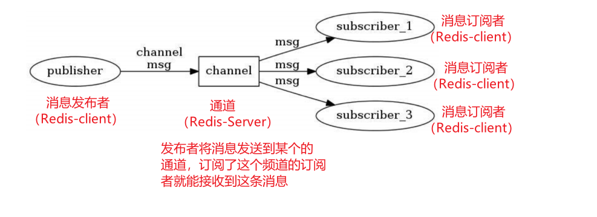
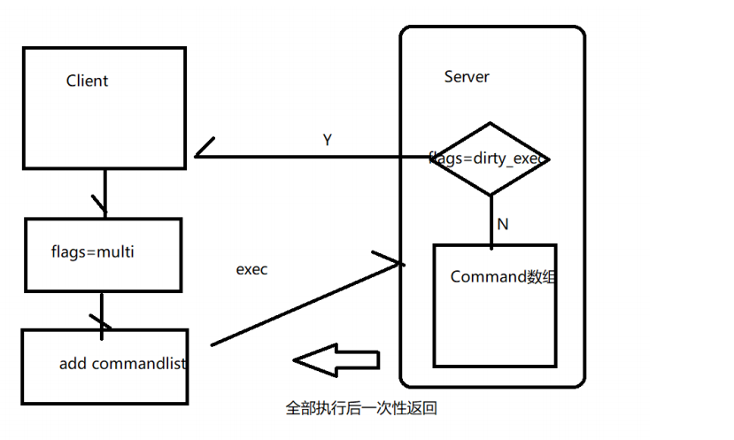
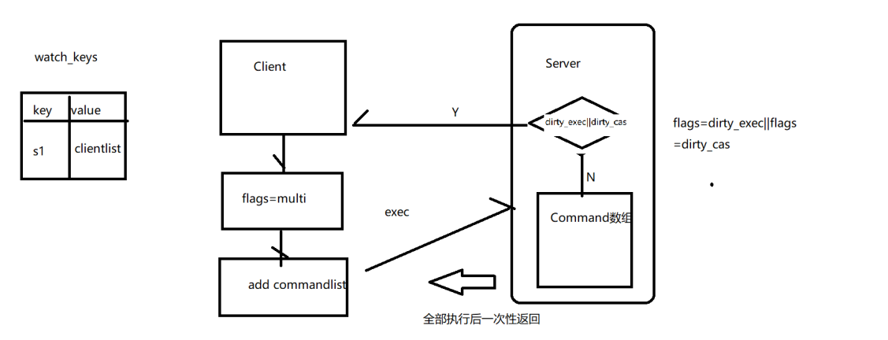
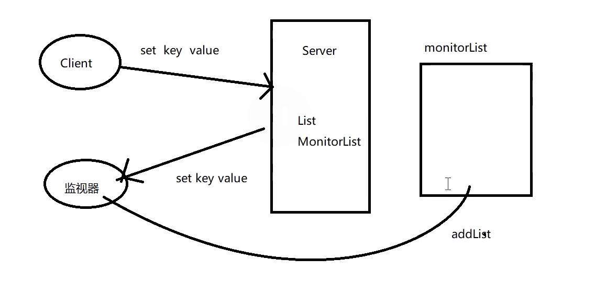
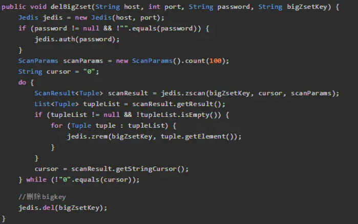

[toc]


## 一、发布订阅

订阅/发布：类似于消息队列的发布消息与消费消息，实现哨兵模式，哨兵通过发布与订阅的方式与Redis主服务器和Redis从服务器进行通信

Redis提供了发布订阅功能，可以用于消息的传输。包含了三部分：publisher、subscriber 和 Channel



### 1. 订阅（subscribe channel1 channel2 ...）

客户端A 订阅通道ch1 和 ch2

```sh
127.0.0.1:6379> subscribe ch1 ch2 
Reading messages... (press Ctrl-C to quit) 
1) "subscribe" 
2) "ch1" 
3) (integer) 1 

1) "subscribe" 
2) "ch2" 
3) (integer) 2
```


### 2. 发布（publish channel message）

客户端B 发布消息：向 ch1分别发送 "hello" 和 "world"

```sh
127.0.0.1:6379> publish ch1 hello 
(integer) 1 
127.0.0.1:6379> publish ch2 world 
(integer) 1
```

此时客户端A收到消息

```sh
1) "message" 
2) "ch1" 
3) "hello" 

1) "message" 
2) "ch2" 
3) "world"
```


### 3. 退订（unsubscribe channel ...）

客户端A退订 ch1

```sh
127.0.0.1:6379> unsubscribe ch1 
1) "unsubscribe" 
2) "ch1" 
3) (integer) 0
```


### 4. 模糊匹配通道订阅、退订、发布

##### 4.1 订阅（psubscribe）

订阅所有ch开头的通道

```sh
127.0.0.1:6379> psubscribe ch* 
Reading messages... (press Ctrl-C to quit)
1) "psubscribe" 
2) "ch*" 
3) (integer) 1
```

##### 4.2 退订（punsubscribe）

```sh
127.0.0.1:6379> punsubscribe ch* 
1) "punsubscribe" 
2) "ch*" 
3) (integer) 0
```


## 二、Redis 事务

### 1. Redis 事务特性

- Redis的事务通过multi、exec、discard和watch这四个命令来完成

- Redis的单个命令具有原子性

- Redis 将命令集合封装在一个事务中，确保命令连续且不被中断地执行

- Redis不支持回滚操作


### 2. Redis 事务操作

#### 2.1 命令操作事务

- **multi：**用于标记事务块的开始（事务开始）

- **exec：**执行命令队列（事务提交）

- **discard：**清除命令队列

- **watch：**监视key

  监视某个key，后面紧跟multi的事务。若此时别的客户端修改这个key，则所有监视这个key的客户端的事务都将清空

- **unwatch：**清除监视key 

```sh
127.0.0.1:6379> multi 
OK
127.0.0.1:6379> set s1 222 
QUEUED 
127.0.0.1:6379> hset set1 name zhangfei
QUEUED 
127.0.0.1:6379> exec 
1) OK
2) (integer) 1 
127.0.0.1:6379> multi 
OK
127.0.0.1:6379> set s2 333 
QUEUED 
127.0.0.1:6379> hset set2 age 23 
QUEUED 
127.0.0.1:6379> discard 
OK
127.0.0.1:6379> exec 
(error) ERR EXEC without MULTI 
127.0.0.1:6379> watch s1 
OK
127.0.0.1:6379> multi 
OK
127.0.0.1:6379> set s1 555 
QUEUED 
127.0.0.1:6379> exec # 此时在没有exec之前，通过另一个命令窗口对监控的s1字段进行 修改
(nil) 
127.0.0.1:6379> get s1 
222 
127.0.0.1:6379> unwatch 
OK
```

#### 2.2 java操作事务

```java
Transaction tx = jedis.multi(); 
tx.incr(redisKey); 
List list = tx.exec();
```


### 3. Redis 事务流程 



1. 在RedisClient 中，有属性flags，若事务开始则 **`flags=REDIS_MULTI`**
2. RedisClient 执行multi命令开始事务，将命令存放在事务队列中 **`multiCmd *commands`** （EXEC,DISCARD,WATCH,MULTI除外）
   - 若入队失败，则标识为REDIS_DIRTY_EXEC，执行exec直接失败
3. RedisClient 向 Server发送exec命令以及命令队列**`commands`**
4. Server 检查语法，若语法有误，则标识为 **`REDIS_DIRTY_EXEC`**，并清空 **`commands`**
5. Server 遍历 **`commands`**并执行，最后将结果一次性返回倒 Client


**Redis的事务是一种弱事务，并不能完全保证原子性与隔离性**

- 无法完全保证原子性

  - 保证原子性：server端检查语法，若语法有误，则将标识为 **`REDIS_DIRTY_EXEC`**，然后清空 **`commands`**，保证了事务的原子性
  - 无法保证原子性：语法正确，但是中间发生错误（如事务中包含`set name01 2`和 `lpush name01 1,2,3`，name01类型已经为String，却又使用了list类型，导致执行失败），此时第一条执行成功，第二条执行失败，无法保证事务的原子性；不支持回滚

- 无法保证隔离性

  server端在执行事务A的命令时，可能会插入事务B的命令

  


### 4. Redis 事务—Watch 机制

redisDb有一个watched_keys字典（key是被监视的key，value是一个链表记录了所有监视这个key的client）

当修改数据后，监视这个数据的客户端的flags置为 **`REDIS_DIRTY_CAS`**

RedisClient向服务器端发送exec命令，服务器判断RedisClient的flags，如果为 **`REDIS_DIRTY_CAS`**，则清空事务队列




## 三、Lua脚本

Lua是一种底层使用C语言编写的脚本语言，其设计目的是为了嵌入应用程序中，可作为插件来扩展应用程序的功能，如：

- Redis通过lua实现读写分离；通过lua提供性能以及加强事务
- Nginx 的高并发模块；一致性hash负载均衡
- 基于Nginx结合Lua模块，高性能高并发的网关有OpenRestry、Kong（Api Gateway）、tengine（阿里）
- OpenRestry支持日活千万级别的高并发，并提供负载均衡、请求路由、安全认证、服务鉴权、流量控制与日志监控等服务


### 1. Lua安装

- 下载地址：http://www.lua.org/download.html

  可以本地下载上传到linux，也可以使用curl命令在linux系统中进行在线下载

  ```sh
  curl -R -O http://www.lua.org/ftp/lua-5.3.5.tar.gz
  ```

- 安装

  ```sh
  yum -y install readline-devel ncurses-devel 
  tar -zxvf lua-5.3.5.tar.gz 
  #在src目录下执行make linux或make install
  make linux
  ```

- 可能出现的问题

  如果报错，说找不到readline/readline.h，可以通过yum命令安装

  ```sh
  yum -y install readline-devel ncurses-devel
  #在src目录下执行make linux或make install
  make linux
  ```

  

### 2. Redis整合lua

从Redis2.6.0版本开始，通过**内置的lua编译/解释器**，可以使用 **`EVAL`** 命令操作Lua语言，并且Lua脚本的命令具有**原子性以及隔离性，可以代替Redis的事务使用**

- **直接使用 `EVAL` 执行lua语句**

  客户端每次执行 **`EVAL`** 都要向server发送lua语句，然后编译。缺点：即占用带宽，又需要重复编译

  `EVAL script numkeys key [key ...] arg [arg ...] `

  - script：需要执行的Lua语句
  - numkeys：键值对的个数

  ```sh
  eval "return {KEYS[1],KEYS[2],ARGV[1],ARGV[2]}" 2 key1 key2 first second
  
  # redis.call()返回值就是redis命令执行的返回值
  eval "return redis.call('set',KEYS[1],ARGV[1])" 1 n1 zhaoyun
  ```

- **使用EvalSha执行 `script load lua` 语句生成的 `sha1`，`sha1` 对应 redis server中缓存的编译好的lua语句**

  ```sh
  192.168.24.131:6380> script load "return redis.call('set',KEYS[1],ARGV[1])"
  "c686f316aaf1eb01d5a4de1b0b63cd233010e63d"
  192.168.24.131:6380> evalsha c686f316aaf1eb01d5a4de1b0b63cd233010e63d 1 n2 zhangfei
  OK
  192.168.24.131:6380> get n2
  ```

  - SCRIPT LOAD：将一个脚本装入脚本缓存，返回SHA1摘要，但并不立即运行它
  - SCRIPT FLUSH：清除所有脚本缓存
  - SCRIPT EXISTS：根据给定的脚本校验和，检查指定的脚本是否存在于脚本缓存
  - SCRIPT KILL：杀死当前正在运行的脚本

- **编写lua脚本，然后直接执行**

  利用Redis整合Lua脚本，主要是利用Lua脚本的**完全的原子性和隔离性**，这一点Redis的事务无法做到的。但是脚本执行期间，**另外的客户端其它任何脚本或者命令都无法执行**

  - test.lua

    ```lua
    return redis.call('set',KEYS[1],ARGV[1])
    ```

  - 执行test.lua

    ```sh
    ./redis-cli -h 127.0.0.1 -p 6379 --eval test.lua name:6 , caocao #，两边有空格
    ```

  - list.lua

    ```lua
    local key=KEYS[1] 
    
    local list=redis.call("lrange",key,0,-1); 
    
    return list;
    ```

  - 执行list.lua

    ```sh
    ./redis-cli -h 127.0.0.1 -p 6379 --eval list.lua listname:01
    ```


### 3. Lua 脚本复制（主从模式）

Redis 传播 Lua 脚本，在使用主从模式和开启AOF持久化的前提下：

当执行lua脚本时，Redis 服务器有两种模式：**脚本传播模式**和**命令传播模式**

##### 3.1 脚本传播模式

脚本传播模式是 Redis 复制脚本时默认使用的模式

Redis会将被执行的脚本及其参数复制到 AOF 文件和从服务器中

**注意：**若是参数中有当前时间、生成随机数等函数，则会造成主从服务器数据不一致情况

##### 3.2 命令传播模式

将**执行脚本产生的所有写命令**用事务包裹起来，然后将事务复制到 AOF文件 以及从服务器里面，因此主服务器给所有从服务器复制的写命令仍然是相同的

开启命令传播模式，用户在使用脚本执行任何写操作之前，需要先在脚本里面调用以下函数 **`redis.replicate_commands()`**，并且**只对调用该函数的脚本有效**，其他脚本依然使用默认的脚本传播模式

```sh
eval "redis.replicate_commands();redis.call('set',KEYS[1],ARGV[1]);redis.call('set',KEYS[2],ARGV[2])" 2 n1 n2 zhaoyun11 zhaoyun22
```


## 四、Redis 慢查询

### 1. Rdis慢查询配置及查询

在 **`redis.conf`** 中可以配置和慢查询日志相关的选项：

```sh
#执行时间超过多少微秒的命令请求会被记录到日志上 0 :全记录 <0 不记录 
slowlog-log-slower-than 10000 
#slowlog-max-len 存储慢查询日志条数，使用FIFO队列存储慢查询日志，条数满时最早的日志会被移除
slowlog-max-len 128
```

- 查看慢查询日志

  **`slowlog get [n]`**

  ```sh
  127.0.0.1:6379> slowlog get
  1) 1) (integer) 7 #日志的唯一标识符(uid) 
     2) (integer) 1589774302 #命令执行时的UNIX时间戳 
     3) (integer) 65 #命令执行的时长(微秒) 
     4) 1) "get" #执行命令及参数 
        2) "name:002" 
     5) "127.0.0.1:37277" 
     6) ""
  ```

- 查看日志数量的 

  **`slowlog len`**

- 清除日志 

  **`slowlog reset`**


### 2. Redis 慢查询优化

- 使用短key，对于value有些也可精简，能使用int就int

- 避免使用**`keys *`**、**`hgetall`** 等全量操作

- 将 RDB 改为 AOF 模式 

   RDB fork子进程时，由于数据量过大导致主进程阻塞

- 关闭持久化（适合于数据量较小，有固定数据源）

- 设置内存淘汰策略（maxmemery以及删除策略）


## 五、监视器

Redis客户端通过执行 **`MONITOR`** 命令可以将自己变为一个监视器，实时地接受并打印出服务器当前处理的命令请求的相关信息。

此时，当其他客户端向服务器发送一条命令请求时，服务器除了会处理这条命令请求之外，还会将这条命令请求的信息发送给所有监视器



`redisServer `维护一个 `monitors `的链表，记录自己的监视器，每次收到 **`MONITOR`** 命令之后，将客户端追加到链表尾。然后调用**`call函数`** 实现向监视器发送命令

client1

```sh
127.0.0.1:6379> monitor 
OK
1589706136.030138 [0 127.0.0.1:42907] "COMMAND" 
1589706145.763523 [0 127.0.0.1:42907] "set" "name:10" "zhaoyun" 
1589706163.756312 [0 127.0.0.1:42907] "get" "name:10"
```

client2

```sh
127.0.0.1:6379> set name:10 zhaoyun 
OK
127.0.0.1:6379> get name:10 
"zhaoyun"
```


## 六、Redis 监控平台

grafana、prometheus以及redis_exporter

- **Grafana** 是一个开箱即用的可视化工具，具有功能齐全的度量仪表盘和图形编辑器，有灵活丰富的图形化选项，可以混合多种风格，支持多个数据源特点

- **Prometheus** 是一个开源的服务监控系统，它通过HTTP协议从远程的机器收集数据并存储在本地的时序数据库上
- **redis_exporter** 为Prometheus提供了redis指标的导出，配合Prometheus以及grafana进行可视化及监控


## 七、Redis 主要性能监控指标

通过**`info`** 查看状态

```sh
connected_clients:68 #连接的客户端数量 
used_memory:433264648 # 已使用的内存大小
used_memory_rss_human:847.62M #系统给redis分配的内存 
used_memory_peak_human:794.42M #内存使用的峰值大小 
total_connections_received:619104 #服务器已接受的连接请求数量 
instantaneous_ops_per_sec:1159 #服务器每秒钟执行的命令数量 
qps instantaneous_input_kbps:55.85 #redis网络入口kps 
instantaneous_output_kbps:3553.89 #redis网络出口kps 
rejected_connections:0 #因为最大客户端数量限制而被拒绝的连接请求数量 
keyspace_hits:1000 #缓存命中 
keyspace_misses:20 #缓存未命中 
expired_keys:0 #因为过期而被自动删除的数据库键数量 
evicted_keys:0 #因为最大内存容量限制而被驱逐（evict）的键数量 
keyspace_hits:0 #查找数据库键成功的次数 
keyspace_misses:0 #查找数据库键失败的次数
```


## 八、Redis 使用手册

### 1. 键值设计

key：使用业务名或者数据库名作为前缀，使用冒号分隔，切勿使用空格、斜线等转义字符。正例：order:16424869562100001

value：String类型的大小不超过10KB，l、h、s、zs这些元素不超过5000个

### 2. 命令规范

##### 2.1 禁止使用

- 尽量**不使用 `hgetall` 、`lrange`、`smembers`、`zrange`、`sinter`** 这些命令，可使用**`hscan`、`sscan`、`zscan`**代替
- **禁止线上使用keys、flushall、flushdb等**

##### 2.2 不推荐使用

- Redis事务功能较弱，有的Case无法回滚，且Redis集群对事务操作的key要求在同一个slot槽上（可以使用hashtag功能解决）

##### 2.3 推荐使用

- 使用**`hscan`、`sscan`、`zscan`**代替hgetall、lrange。。。

- 使用批量操作提高效率，如原生命令的 **`hmset`**、**`hmget`**、pipeline的管道查询

##### 2.4 集群使用Lua注意事项

- 所有**key都应该由 KEYS 数组来传递**，redis.call/pcall 里面调用的redis命令，key的位置，必须是**KEYS array**, 否则直接返回error，"-ERR bad lua script for redis cluster, all the keys that the scriptuses should be passed using the KEYS arrayrn" 
- 所有key，必须在1个slot上
- 必要情况下使用monitor命令时，要注意不要长时间使用。


### 3. 客户端使用

- 避免多个应用使用一个Redis实例，对庞大的业务拆分成多个服务

- 使用连接池

  

- 熔断功能

- 合理的加密，可以使用SSL加密访问（阿里云Redis支持）

- 淘汰策略


### 4. 相关工具

- 1、数据同步

  redis间数据同步可以使用：redis-port

- 2、big key搜索

  redis大key搜索工具

- 3、热点key寻找

  内部实现使用monitor，所以建议短时间使用facebook的redis-faina阿里云Redis已经在内核层面解决热点key问题

### 5. 删除bigkey

- 使用redis 4.0 的异步删除命令`UNLINK key1 key2..`

- Hash删除: hscan + hdel

  

- List删除: ltrim

  

- Set删除: sscan + srem

  

- SortedSet删除: zscan + zrem

  
