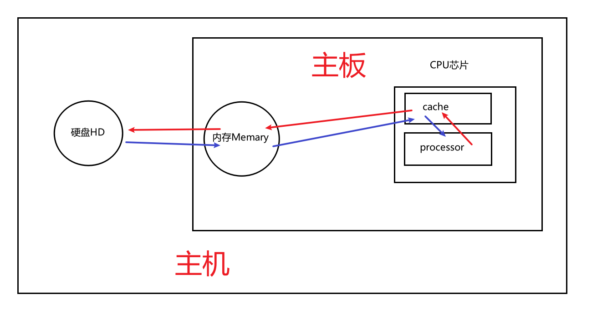
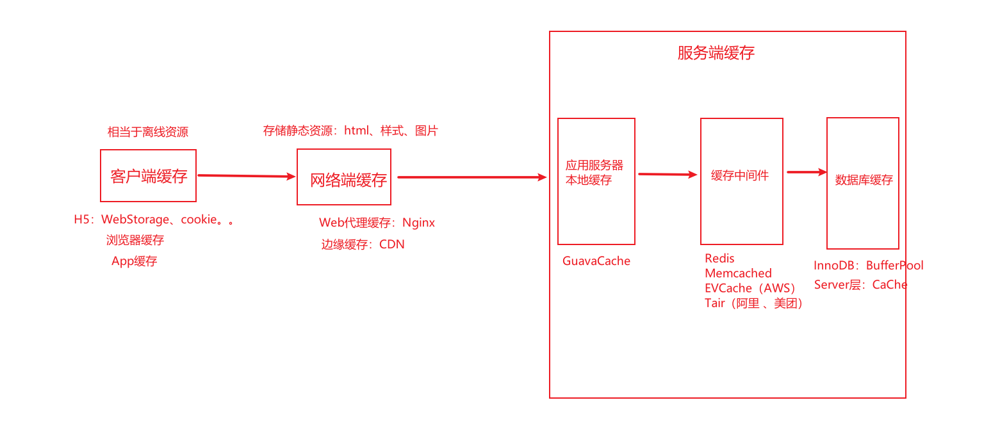
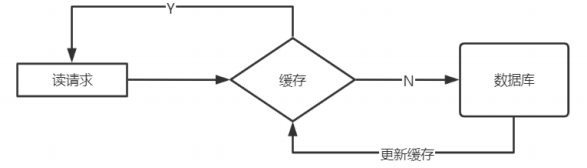
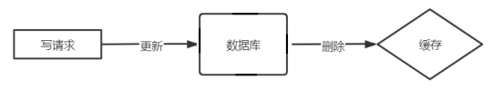
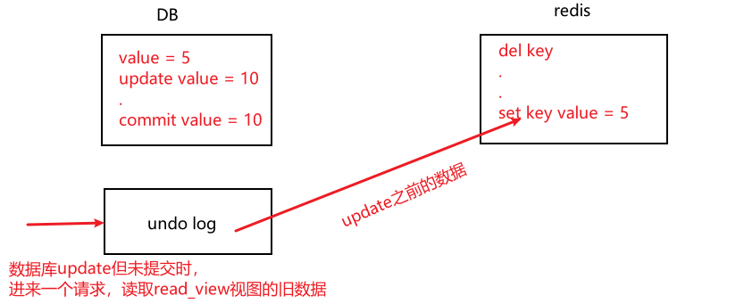
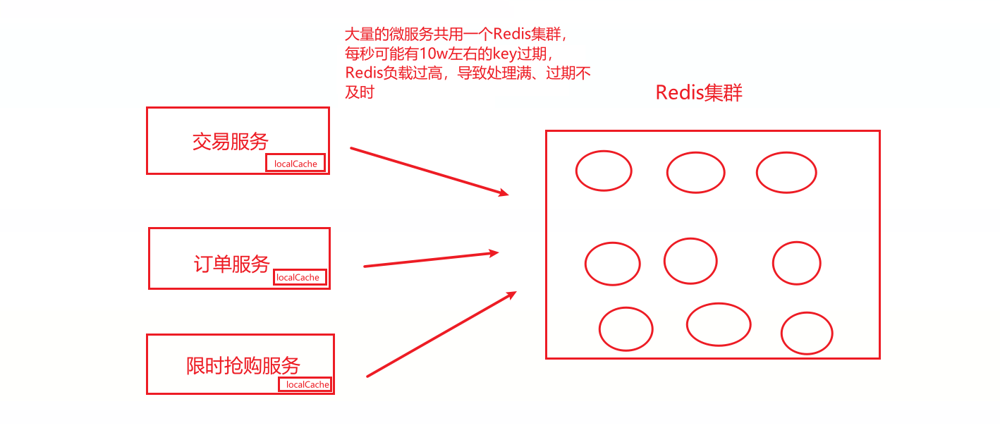
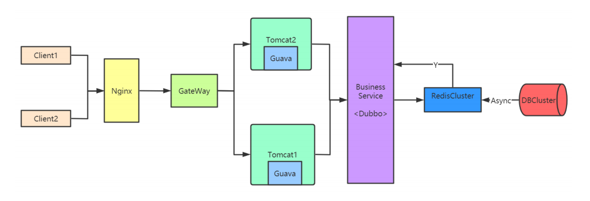
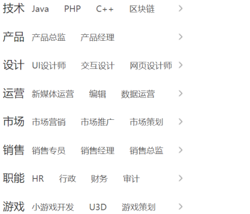
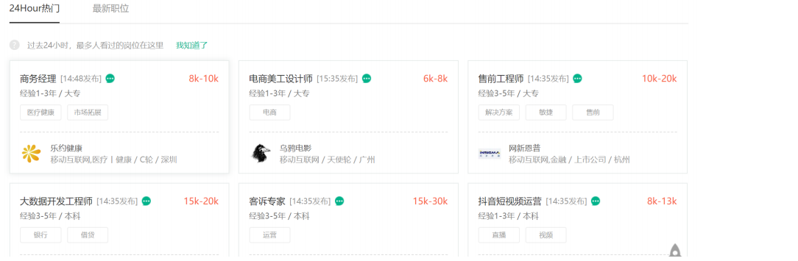

[toc]

### 一、缓存概述

#### 1. 缓存简介

缓存原指CPU上的一种高速存储器

它先于内存与CPU交换数据，速度很快现在泛指存储在计算机上的原始数据的复制集，便于快速访问。

在互联网技术中，缓存是系统快速响应的关键技术之一以空间换时间的一种技术（艺术）




#### 2. 缓存分类



##### 2.1 客户端缓存

- H5 缓存

  WebStorage、WebSql、ApplicationCache等

- 浏览器缓存

- APP缓存

  原生APP中把数据缓存在内存、文件或本地数据库（SQLite）中。比如图片文件

##### 2.2 网络端缓存

- Web代理缓存

  Nginx可以缓存静态资源，如样式、图片、html等

- 边缘缓存

  典型的是CDN（内容分发网络），通过部署各地边缘服务器存储和分发内容，使用户就近获取内容，降低网络拥塞，提供响应速度。

##### 2.3 服务端缓存

- 服务器本地缓存

  GuavaCache、CurrentHashMap、EhCache等

- 中间件缓存

  Redis、Memcached、EVCache（AWS）、Tair（阿里、美团）等

- 数据库缓存

  Mysql在Server层使用了Cache缓存结果，InnoDB存储引擎使用BufferPool等缓存page页


#### 3. 缓存优势与挑战

##### 3.1 优势

- 提升用户体验

- 提升系统性能（响应时间、吞吐量、并发量）
- 减轻DB压力

##### 3.2 挑战

- 额外的硬件支出
- 缓存穿透/雪崩/击穿
- 无法与数据库实时同步


#### 4. 缓存的读写模式

##### 4.1 Cache Aside Pattern（常用，旁路缓存模式）

- 读

  ==先读缓存，缓存没有则再查库，将数据加载进缓存，返回数据==

  

- 更新

  ==先更新数据库，然后再删除缓存==

  为何不是更新缓存？

  - 若缓存是list、hash或者set结构，可能需要大量遍历修改数据耗时太大
  - 可能存在并发问题

  

- 并发问题

  - **先更新库，再更新缓存**：事务update但还未commit时，更新缓存完成，但是commit失效，事务回滚，缓存与库数据不一致

  - **先删除缓存，再更新数据库**：删除缓存完成，事务update但还未commit，此时有读请求进来读到read-view旧数据的视图并加载进缓存，数据库commit成功，缓存与库数据不一致

  - **先更新库，再删除缓存（同上）**：事务update但还未commit时，删除缓存完成，此时有读请求进来读到read-view旧数据的视图并加载进缓存，数据库commit成功，缓存与库数据不一致

    

- 解决并发问题

  ==先更新库，再删除缓存，并采用延时[双删策略](./Redis/Redis使用场景及问题方案)==


##### 4.2 Read/Write Through Pattern（直读/直写模式）

应用程序只操作缓存，缓存操作数据库，需要提供数据库的handler，开发较为复杂

- 直读

  应用程序读缓存，缓存没有，由缓存回源到数据库，并写入缓存。（guavacache）

- 直写

  应用程序写缓存，缓存写数据库。


##### 4.3 Write Behind Caching Pattern（缓存优先模式，适合秒杀等高并发场景，弊端是数据不实时同步）

适合秒杀等高并发场景，短时间内大量读写，可以先写到redis，然后异步刷盘到数据库

- 读

  **读缓存，若无数据也直接返回。异步将数据从数据库写入缓存，防止缓存穿透/雪崩/击穿**

- 写

  **写入缓存，然后通过异步的方式将数据批量或合并后更新到DB中**


### 二、缓存架构思想

#### 1. 缓存设计方案

##### 1.1 多级缓存

当分布式缓存宕机，本地缓存还可使用


##### 1.2 分布式缓存选择

- Memcached

  简单数据类型，Value是字符串或整数或二进制，Value的值比较大（大于100K），只进行setter和getter，Memcached纯内存缓存，多线程

- Redis

  Value是hash、set、list、zset等丰富的类型存储关系，可聚合，可计算，可持久化，支持事务

##### 1.3 缓存大小设置

- GuavaCache

  ```sh
  CacheBuilder.newBuilder().maximumSize(num) // 超过num会按照LRU算法来移除缓存
  ```

- Redis

  ```sh
  maxmemory=num # 最大缓存量 一般为内存的3/4 
  maxmemory-policy allkeys lru # 淘汰策略
  ```

- Nginx

  ```sh
  http {
  	proxy_cache_path /path/to/cache levels=1:2 keys_zone=my_cache:10m max_size=10g inactive=60m use_temp_path=off;
  	
  	server {
  		proxy_cache mycache;
  		location / {
  			proxy_pass http://localhost:8000;
  		}
  	}
  }
  ```

##### 1.4 命中率

通过 **`info `** 命令查看，如下所示

```sh
#缓存命中 
keyspace_hits:1000
#缓存未命中
keyspace_misses:20
used_memory:433264648 
expired_keys:1333536 
evicted_keys:1547380
```

命中率=1000/1000+20=83%

提高缓存命中率：缓存大对象的命中率更高；缓存过期时间越大命中率越高

##### 1.5 缓存预热

- 当数据不大的时候，可以在项目启动的时候将数据从数据源加载到缓存
- 通过**定时任务或者MQ**，将**修改数据**异步加载到缓存中

##### 1.6 分布式缓存集群（Redis）

- 哨兵+主从

  每个微服务最好都有一个自己的主从+哨兵

- RedisCluster

  每个微服务最好都有一个自己的Redis集群
  
  

##### 1.7 缓存更新策略

结合之前的缓存的更新方式，现总结如下：

- **旁路模式的懒加载策略**，（延时双删、缓存过期、淘汰策略）删除缓存，然后**查询回填**缓存
- **缓存优先模式的异步加载策略**，通过定时任务或者MQ**异步将更新数据加载到缓存**


#### 2. 缓存架构设计——拉勾首页缓存职位列表、热门职位

拉勾网(www.lagou.com)，是国内的招聘门户网站，亿万级PV，单机响应性能QPS万级

其首页的职位列表和热门职位，都是热点数据，所以采用缓存技术减轻DB压力及提升用户体验



##### 2.1 静态文件 

在nginx中，放置静态文件，比如css/js/图片等不常变的静态文件，使用proxy_cache将用户的请求缓存到本地一个目录。下一个相同请求可以直接调取缓存文件，就不用去请求服务器了

```js
server {
	

	listen 80 default_server; 
	server_name localhost; 
	root /mnt/blog/;

	location / { 

	}

	#要缓存文件的后缀，可以在以下设置。 
	location ~ .*\.(gif|jpg|png|css|js)(.*) {
		proxy_pass http://ip地址:90; 
		proxy_redirect off; 
		proxy_set_header Host $host; 
		proxy_cache cache_one; 
		proxy_cache_valid 200 302 24h; 
		proxy_cache_valid 301 30d; 
		proxy_cache_valid any 5m; 
		expires 90d; 
		add_header wall "hello lagou.";
	} 
}
```


##### 2.2 少量固定的数据（职位列表）



固定数据，一次性读取

在服务器开启时一次性初始化（从xml）到服务器本地缓存

采用Guava Cache，Guava Cache用于存储频繁使用的少量数据，支持高并发访问

也可以使用 JDK 的CurrentHashMap，需要自行实现


##### 2.3 频繁变化的数（热门职位）



频繁变化，不必实时同步，但一定要有数据，不能为空

数据从下游缓存（Redis）或数据库读取，然后放到本地缓存（Guava）

如果出现超时或读取为空，则返回原来本地缓存的数据

**注意：**不同客户端看到的数据可能不一样


##### 2.4 数据回填

- 先读取Redis集群的缓存，如果缓存命中则直接返回

- 如果缓存不命中则返回本地缓存，**不能直接读取数据库**

- **采用异步的形式（定时任务或MQ）从数据库刷入到缓存中**


##### 2.5 热点策略

对于热点数据我们采用本地缓存策略，而不采用服务熔断策略，因为首页数据可以不准确，但不能不响应。


