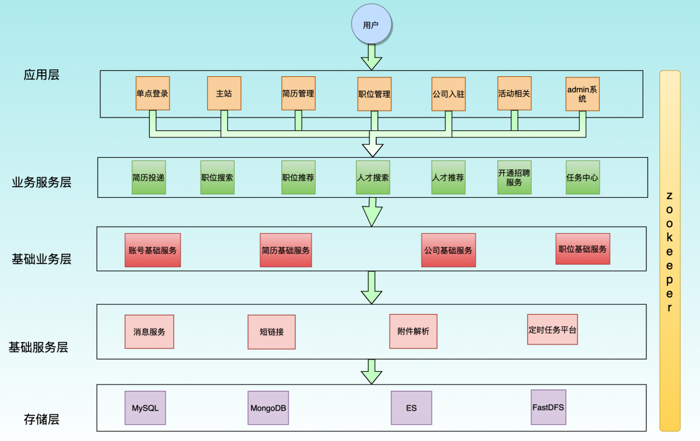

[toc]

### 单体架构

##### 单体架构的大型项目，存在问题：

1. 模块耦合严重，不宜开发
2. 新增业务困难
3. 核心业务和边缘业务混在一起

### 垂直架构

##### 架构的核心目标：

1. 基于业务的特性，对模块做垂直划分
2. 业务之间互不影响，减少之间的依赖

##### 优点

1. 实现分流，比如：主站和活动分别是独立系统，实现流量分担
2. 可以针对不同系统扩容及优化，独立测试，部署
3. 方便水平扩展做集群、负载均衡
4. 系统间相互独立，互不影响，新系统及旧业务迭代更高效

##### 缺点

1. 系统接口调用存在硬编码
2. 系统间调用方式不统一
3. 服务监控不到位
4. 数据库资源浪费，充斥慢查询，主从同步延迟大
5. 通用业务和模块重复越来越多

### 分布式架构(SOA)

SOA全称**面向服务架构**，通常将通用的业务逻辑下沉到服务层，通过接口暴露对上层业务系统提供服务调用。同时引入了Dubbo或者SpringCloud的Feign进行RPC调用。

Dubbo是一款高性能轻量级的RPC框架，其核心功能：面向接口代理的RPC调用  ，智能容错和负载均衡，服务自动注册和发现。

SOA采取分层，分级

##### 分层，按业务性质分层，每一层维护简单

- 应用层(接入层)：一般部署Web容器中，面向用户的服务。调用下游接口获取对应的数据，应用层禁止使用数据库

- 业务服务层：根据具体的业务场景演变来的模块

- 基础业务层：主站核心业务的核心基础模块

- 基础服务层：与业务无关的模块，一般是通用的服务或基础平台。如：消息服务、附件解析、定时任务平台。特点：请求或并发量大、功能独立
- 存储层：提供关系型数据库、ES搜索引擎、分布式文件存储

##### 分级

同一层的业务根据业务的重要性进行分级，按照二八定律，网站80%的流量都在核心功能上，优先保证核心业务的稳定

##### 隔离

不同性质、重要性的业务进行隔离。包括业务、缓存、DB、中间件都要做好隔离。

如核心业务、核心业务的DB、核心业务的缓存及中间件，要和活动业务、活动业务的DB等做好隔离

##### 调用

由上游往下游单向调用服务，切记下游调用上有服务。不过可以通过MQ等进行消息分发

##### 优点

1. 为开发者屏蔽了远程调用的底层细节
2. 架构更清晰，每个业务模块职责单一，扩展能力强
3. 数据隔离，数据访问都通过接口，系统更加稳定安全
4. 服务责任易确定，每个服务可以确定责任人

##### 缺点

1. **粒度控制比较复杂**，如果拆的服务很多很细，可能导致一个事务操作由两个独立的服务进行了操作。引发分布式事务等问题
2. **调用的服务链路过长**，下游服务的不稳定将影响上游服务。导致超时等
3. **服务接口爆炸**，建议接口以业务场景划分，并对相近的业务进行抽象提取公共模板

### 微服务架构

将单个应用程序作为小型服务开发，并通过全自动部署进行独立部署运行。并使用http协议的API接口通信。它们可以采用不同的编程语言编写。

微服务是SOP的升华，粒度更细致。微服务架构强调的是**业务彻底组件化和服务化**。微服务架构现有成熟的springCloud全家桶来完成
