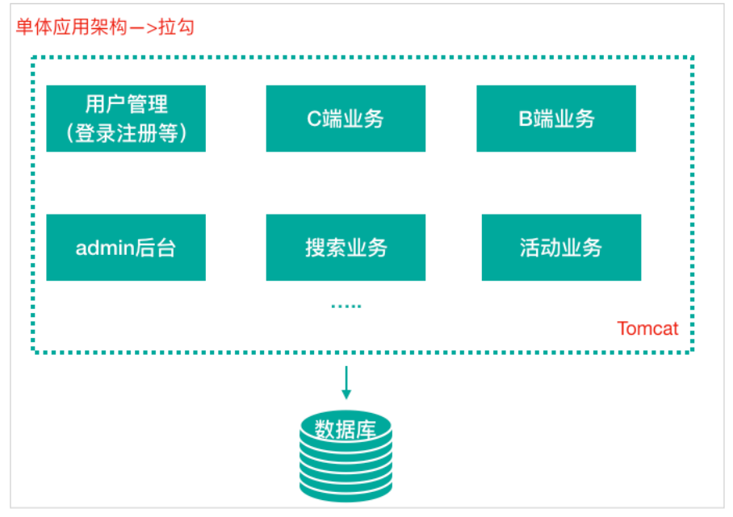
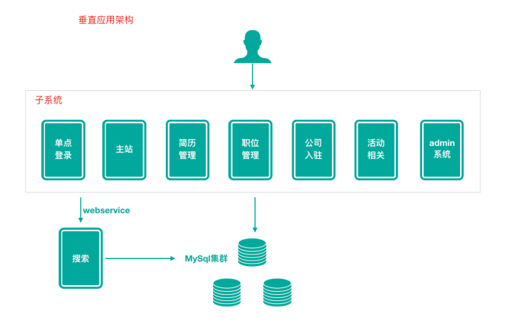
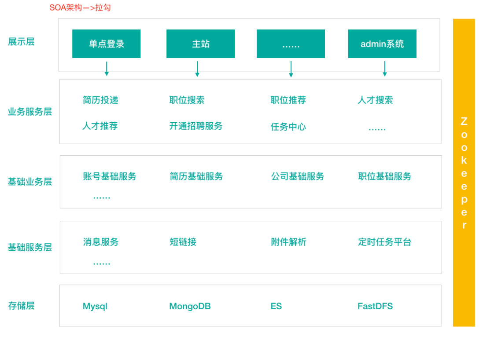
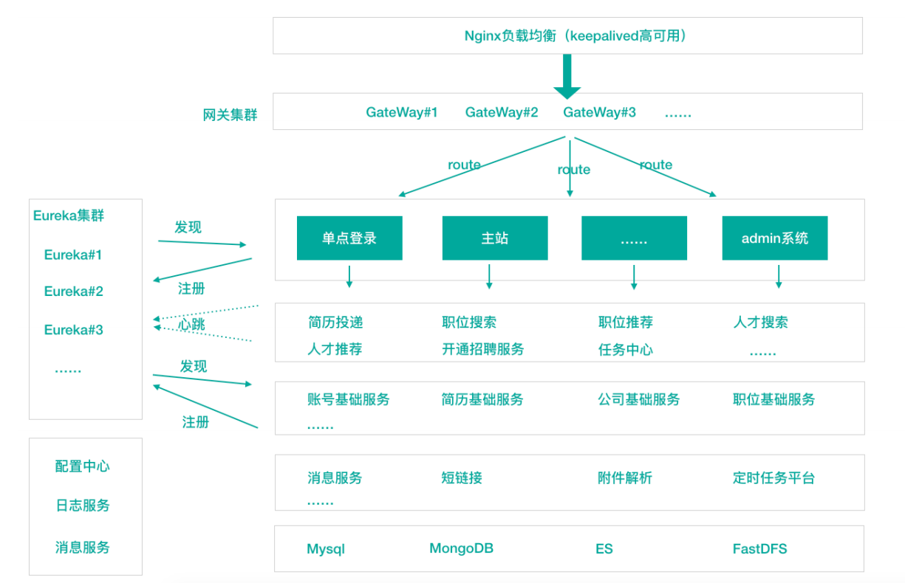

[toc]

### 单体架构

在诞⽣之初，拉勾的⽤户量、数据量规模都⽐较⼩，项⽬**所有的功能模块都放在⼀个⼯程中编码、编译、打包并且部署在⼀个Tomcat容器**中的架构模式就是单体应⽤架构，这样的架构既简单实⽤、便于维护，成本低，成为了那个时代的主流架构⽅式。

##### 优点：

- 成本低
- 前期开发节奏快，团队成员少的时候能够快速迭代
- 架构简单：MVC架构，只需要借助IDE开发、调试即可
- 易于测试：只需要通过单元测试或者浏览器完成
- 易于部署：打包成单⼀可执⾏的jar或者打成war包放到容器内启动

##### 缺点：

1. 随着不断的功能迭代，单个项⽬过⼤，代码杂乱，耦合严重，代码从编译到启动耗时变得很长
2. 新增业务困难：在已经乱如麻的系统中增加新业务，维护旧功能，⼀脚踩进去全是不可预测 的问题。新⼈来了以后很难接⼿任务，学习成本⾼，需要⼤概 ⼀周时间 才能上⼿开发
3. 核⼼业务与边缘业务混合在⼀块，出现问题互相影响，如⼀个临时活动流量猛涨，机器负载升⾼就会影响正常的业务服务

### 垂直架构

为了避免上⾯提到的那些问题，开始做模块的垂直划分，做垂直划分的原则是基于拉勾现有的业 务特性来做，核⼼⽬标第⼀个是为了业务之间互不影响，第⼆个是在研发团队的壮⼤后为了提⾼ 效率，减少之间的依赖

##### 优点

1. 系统拆分实现了流量分担，解决了并发问题
2. 可以针对不同模块进⾏优化
3. ⽅便⽔平扩展，负载均衡，容错率提⾼
4. 系统间相互独⽴，互不影响，新的业务迭代时更加⾼效

##### 缺点

1. 服务之间相互调⽤，如果某个服务的端⼝或者ip地址发⽣改变，调⽤的系统得⼿动改变
2. 搭建集群之后，实现负载均衡⽐较复杂，如：内⽹负载，在迁移机器时会影响调⽤⽅的路 由，导致线上故障
3. 服务之间调⽤⽅式不统⼀，基于 httpclient 、 webservice ，接⼝协议不统⼀
4. 服务监控不到位：除了依靠端⼝、进程的监控，调⽤的成功率、失败率、总耗时等等这些监 控指标是没有的

### 分布式架构(SOA)

在做了垂直划分以后，模块随之增多，维护的成本在也变⾼，⼀些通⽤的业务和模块重复的越来越多，为了解决上⾯提到的接⼝协议不统⼀、服务⽆法监控、服务的负载均衡，引⼊了阿⾥巴巴开源的 Dubbo ，⼀款⾼性能、轻量级的开源Java RPC框架，它提供了三⼤核⼼能⼒：⾯向接⼝的远程⽅法调⽤，智能容错和负载均衡，以及服务⾃动注册和发现。

SOA (Service-Oriented Architecture)，即⾯向服务的架构。根据实际业务，把系统拆分成合适的、独⽴部署的模块，模块之间相互独⽴（通过Webservice/Dubbo等技术进⾏通信）

SOA采取分层，分级

##### 分层，按业务性质分层，每一层维护简单

- 应用层(展示层)：一般部署Web容器中，面向用户的服务。调用下游接口获取对应的数据，应用层禁止使用数据库

- 业务服务层：根据具体的业务场景演变来的模块

- 基础业务层：主站核心业务的核心基础模块

- 基础服务层：与业务无关的模块，一般是通用的服务或基础平台。如：消息服务、附件解析、定时任务平台。特点：请求或并发量大、功能独立
- 存储层：提供关系型数据库、ES搜索引擎、分布式文件存储

##### 分级

同一层的业务根据业务的重要性进行分级，按照二八定律，网站80%的流量都在核心功能上，优先保证核心业务的稳定

##### 隔离

不同性质、重要性的业务进行隔离。包括业务、缓存、DB、中间件都要做好隔离。

如核心业务、核心业务的DB、核心业务的缓存及中间件，要和活动业务、活动业务的DB等做好隔离

##### 调用

由上游往下游单向调用服务，切记下游调用上有服务。不过可以通过MQ等进行消息分发

##### 优点

分布式、松耦合、扩展灵活、可重⽤

##### 缺点

服务抽取粒度较⼤、服务调⽤⽅和提供⽅耦合度较⾼（接⼝耦合度）

### 微服务架构

[微服务架构概念及综述](微服务架构/微服务架构基础)

微服务架构可以说是SOA架构的⼀种拓展，这种架构模式下它**拆分粒度更⼩**、服务更独⽴。把应⽤拆分成为⼀个个微⼩的服务，不同的服务可以使⽤不同的开发语⾔和存储，服务之间往往通过Restful等轻量级通信。微服务架构关键在于**微⼩、独⽴、轻量级通信**

微服务是在 SOA 上做的粒度更加细致，微服务架构强调的⼀个重点是“**==业务需要彻底的组件化和服务化==**”

微服务架构和SOA架构很明显的⼀个区别就是**服务拆分粒度的不同**，但是对于拉勾的架构发展来说，我们所看到的SOA阶段其实服务拆分粒度相对来说已经⽐较细了，所以上述拉勾SOA到拉勾微服务，从服务拆分上来说变化并不⼤，只是引⼊了相对完整的新⼀代Spring Cloud微服务技术。

**举个拉勾案例：**来说明SOA和微服务拆分粒度不同我们在SOA架构的初期，“简历投递模块”和“⼈才搜索模块”都有简历内容展示的需求，只不过说可能略有区别，⼀开始在两个模块中各维护了⼀套简历查询和展示的代码；后期我们将服务更细粒度拆分，拆分出简历基础服务，那么不同模块调⽤这个基础服务即可

##### 微服务架构优点

- 微服务很⼩，便于特定业务功能的聚焦 A B C D

- 微服务很⼩，每个微服务都可以被⼀个⼩团队单独实施（开发、测试、部署上线、运维），团队合作⼀定程度解耦，便于实施敏捷开发

- 微服务很⼩，便于重⽤和模块之间的组装

- 微服务很独⽴，那么不同的微服务可以使⽤不同的语⾔开发，松耦合

- 微服务架构下，我们更容易引⼊新技术

- 微服务架构下，我们可以更好的实现DevOps开发运维⼀体化；

##### 微服务架构缺点

- 微服务架构下，分布式复杂难以管理，当服务数量增加，管理将越加复杂；
- 微服务架构下，分布式链路跟踪难等；
