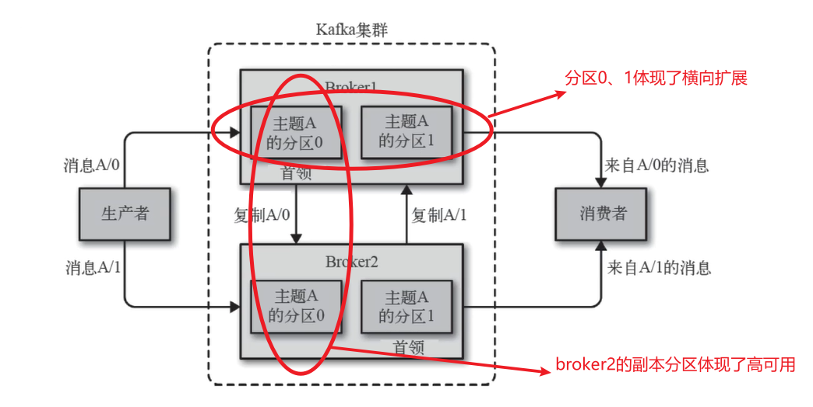

[toc]

特性：

- 支持持久化，数据零丢失

- 发布订阅模式，消息拉取

- 用于流式计算平台

- 日志收集

- 支持**集群分区**和**高可用**，**多个Broker体现高可用**，**每个主题多个分区体现横向扩展**

  多个Broker组成集群，每个主题有多个横向扩展的分区，并且每个**首领分区**在别的Broker中有一份**副本分区**

  集群中有一个Broker是集群控制器，职能如下：若一个Broker宕机了，则将宕机Broker**对应的副本分区提升为首领分区**，同时**分配其他Broker一个副本分区**

  集群控制器的选举使用的是**ZK的分布式锁原理（创建临时节点）**，选举**成功后其他Broker监听该节点**

  

- 单机支持每秒几十万的并发量

- 消费组中有多个消费者，kafka可以保证消息不会重复消费

- 消费失败状态由客户端自身维护，失败时能自动平衡

- kafka支持在线消费和离线消费

应用场景

- 日志收集
- 消息中间件
- 用户活动跟踪：用户的所有动作信息被各个服务器发布到Topic中，然后消费者消费这些消息用来做实时的监控分析
- 流式处理：如Spark Streaming和Storm

优势

- **kafka吞吐量大**，可以达到上千万的吞吐量，使用**字节数组**传输消息，然后根据不同的路由规则**发送到不同分区**，同一个主题和分区为**一个批次并进行压缩**
- **单个broker**可以轻松处理**数千个分区**和**每秒百万级的消息量**
- broker接收生产者的消息，为消息设置偏移量，并将消息持久化到磁盘，做出了如下优化
  - 零拷贝
  - 顺序读写
  - 

### 概念

生产者

消费者

