[toc]

### 一、Kafka综述

#### 1. 特性

- 支持持久化，数据零丢失

- 发布订阅模式，消息拉取

- 用于流式计算平台

- 日志收集

- 支持**分区**和**高可用**，**多个Broker体现高可用**，**每个主题多个分区体现横向扩展**

  - 每个 **Topic** 主题可分为多个**Partition** 分区，横向扩展提高系统吞吐量与性能
  - 每个 **Partition** 分区，又拥有多个 **Replicas** 副本，体现了高可用

- **单机吞吐量达几十万的TPS**

- 消费组中有多个消费者，kafka可以保证消息不会重复消费

- 消费失败状态由客户端自身维护，失败时能自动平衡

- kafka支持在线消费和离线消费

#### 2. 应用场景

- 日志收集
- 消息中间件
- 用户活动跟踪：用户的所有动作信息被各个服务器发布到Topic中，然后消费者消费这些消息用来做实时的监控分析
- 流式处理：如Spark Streaming和Storm

#### 3. 优势

- **kafka吞吐量大**，可以达到上千万的吞吐量，使用**字节数组**传输消息，然后根据**分区器**路由**发送到不同分区**，同一个主题和分区为**一个批次并进行压缩**

- **单个broker**可以轻松处理**数千个分区**和**每秒几十万级的消息量**，如果做**集群分区，吞吐量将轻松千万级别**

- 横向扩展

  topic主题可创建多个分区，提供kafka的处理性能

- 高可用

  每个主题的每个分区，都可有多个副本，分别在不同的broker上

- broker接收生产者的消息，为消息设置偏移量，并将消息持久化到磁盘，做出了如下优化
  - 零拷贝
  - 顺序读写
  - Linux 页缓存
  
- 消费者定义一个消费组，消费组保证每个分区只会被一个消费者消费，并且消费时会移动偏移量，保证消息不被重复消费

#### 4. 角色作用及配置

##### 4.1 Producer-生产者

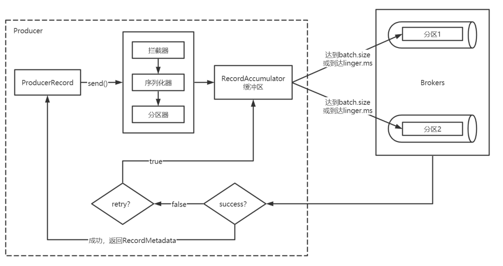

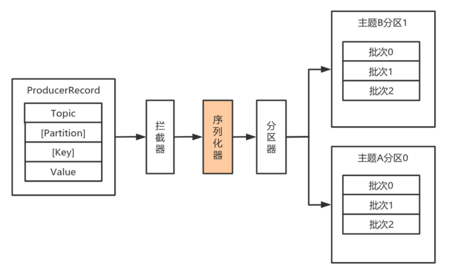

###### 配置说明

| 属性                    | 说明                                                         | 重要性 |
| ----------------------- | ------------------------------------------------------------ | ------ |
| bootstrap.servers       | 生产者与broker集群建立初始连接需要的broker地址列表，不需要写全（因为可通过初始连接发现其他broker），最好写三个 | hign   |
| key.serializer          | 实现了接⼝ org.apache.kafka.common.serialization.Serializer 的key序列化类 | hign   |
| value.serializer        | 实现了接⼝ org.apache.kafka.common.serialization.Serializer 的value序列化类 | hign   |
| acks                    | **acks=0：生产者不等待broker对消息的确认**，生产者发送到缓冲区就认为发送成功<br>**acks=1：消息发送到分区主副本并持久化完成，就标识发送完成，不等待副本分区的确认**<br>**acks=all（默认）：消息发送到分区主副本并持久化完成，并且副本分区ISR也同步完成，才表示发送完成，能够保证消息不丢失** | hign   |
| compression.type        | **对一个批次的消息压缩格式**。值： none（默认值） ，gzip ，snappy 和 lz4<br>消息批越⼤，压缩效率越好 | hign   |
| retries                 | retries**重试次数**，消息发送出现错误的时候，系统会重发消息<br>另外**设置MAX_IN_FLIGHT_REQUESTS_PER_CONNECTION=1，可以保证在重试时消息的有序性，防止重试导致消息排在了队列末尾而乱序** | hign   |
| retry.backoff.ms        | 重试之间的等待时间，默认100                                  |        |
| request.timeout.ms      | 客户端等待请求响应的最大时长，及等待Broker确认消息的最大时长，若**超时则会触发重试**，默认：30000 |        |
| interceptor.classes     | 在序列化器处理之前，可以通过拦截器对消息进行处理             |        |
| batch.size              | 缓冲区的消息批次容量，单位为字节，容量达到则会发送至Broker   |        |
| linger.ms               | 缓冲区的消息批次等待时长，单位为毫秒，**默认为0（立即发送）** |        |
| client.id               | 生产者传递给Broker的客户端id，用于日志**记录该消息的业务系统ID** |        |
| connections.max.idle.ms | 当连接空闲时间达到这个值，就关闭连接。long型数据，默认：540000 |        |

###### 序列化器

- org.apache.kafka.common.serialization.ByteArraySerializer

- org.apache.kafka.common.serialization.ByteBufferSerializer

- org.apache.kafka.common.serialization.BytesSerializer

- org.apache.kafka.common.serialization.DoubleSerializer

- org.apache.kafka.common.serialization.FloatSerializer

- org.apache.kafka.common.serialization.IntegerSerializer

- org.apache.kafka.common.serialization.StringSerializer

- org.apache.kafka.common.serialization.LongSerializer

- org.apache.kafka.common.serialization.ShortSerializer

- 自定义序列化器

  ```java
  import com.tangdi.kafka.demo.entity.User;
  import org.apache.kafka.common.errors.SerializationException;
  import org.apache.kafka.common.serialization.Serializer;
  import java.io.UnsupportedEncodingException;
  import java.nio.Buffer;
  import java.nio.ByteBuffer;
  import java.util.Map;
  
  public class UserSerializer implements Serializer<User> {
      @Override
      public void configure(Map<String, ?> configs, boolean isKey) {
          // do nothing
      }
      @Override
      public byte[] serialize(String topic, User data) {
          try {
              // 如果数据是null，则返回null
              if (data == null) return null;
              Integer userId = data.getUserId();
              String username = data.getUsername();
              int length = 0;
              byte[] bytes = null;
              if (null != username) {
                  bytes = username.getBytes("utf-8");
                  length = bytes.length;
              }
              ByteBuffer buffer = ByteBuffer.allocate(4 + 4 + length);
              buffer.putInt(userId);
              buffer.putInt(length);
              buffer.put(bytes);
              return buffer.array();
          } catch (UnsupportedEncodingException e) {
              throw new SerializationException("序列化数据异常");
          }
      }
      @Override
      public void close() {
          // do nothing
      }
  }
  ```

###### 分区器

1. 若record提供了分区号，则**使用record提供的分区号**
2. 若record**没有提供分区号，则使用key**的序列化后的值的hash值对分区数量取模
3. 若record**没有提供分区号，也没有提供key，则使用轮询**的方式分配分区号。

###### 自定义拦截器

- 拦截器1

  ```java
  import org.apache.kafka.clients.producer.ProducerInterceptor;
  import org.apache.kafka.clients.producer.ProducerRecord;
  import org.apache.kafka.clients.producer.RecordMetadata;
  import org.apache.kafka.common.header.Headers;
  import org.slf4j.Logger;
  import org.slf4j.LoggerFactory;
  
  import java.util.Map;
  
  public class InterceptorOne implements ProducerInterceptor<Integer, String> {
  
      private static final Logger LOGGER = LoggerFactory.getLogger(InterceptorOne.class);
  
      @Override
      public ProducerRecord<Integer, String> onSend(ProducerRecord<Integer, String> record) {
          System.out.println("拦截器1 -- go");
  
  
          // 消息发送的时候，经过拦截器，调用该方法
  
          // 要发送的消息内容
          final String topic = record.topic();
          final Integer partition = record.partition();
          final Integer key = record.key();
          final String value = record.value();
          final Long timestamp = record.timestamp();
          final Headers headers = record.headers();
  
  
          // 拦截器拦下来之后根据原来消息创建的新的消息
          // 此处对原消息没有做任何改动
          ProducerRecord<Integer, String> newRecord = new ProducerRecord<Integer, String>(
                  topic,
                  partition,
                  timestamp,
                  key,
                  value,
                  headers
          );
          // 传递新的消息
          return newRecord;
      }
  
      @Override
      public void onAcknowledgement(RecordMetadata metadata, Exception exception) {
          System.out.println("拦截器1 -- back");
          // 消息确认或异常的时候，调用该方法，该方法中不应实现较重的任务
          // 会影响kafka生产者的性能。
      }
  
      @Override
      public void close() {
  
      }
  
      @Override
      public void configure(Map<String, ?> configs) {
          final Object classContent = configs.get("classContent");
          System.out.println(classContent);
      }
  }
  ```

- 拦截器2

  ```java
  import org.apache.kafka.clients.producer.ProducerInterceptor;
  import org.apache.kafka.clients.producer.ProducerRecord;
  import org.apache.kafka.clients.producer.RecordMetadata;
  import org.apache.kafka.common.header.Headers;
  import org.slf4j.Logger;
  import org.slf4j.LoggerFactory;
  
  import java.util.Map;
  
  public class InterceptorTwo implements ProducerInterceptor<Integer, String> {
  
      private static final Logger LOGGER = LoggerFactory.getLogger(InterceptorTwo.class);
  
      @Override
      public ProducerRecord<Integer, String> onSend(ProducerRecord<Integer, String> record) {
          System.out.println("拦截器2 -- go");
  
  
          // 消息发送的时候，经过拦截器，调用该方法
  
          // 要发送的消息内容
          final String topic = record.topic();
          final Integer partition = record.partition();
          final Integer key = record.key();
          final String value = record.value();
          final Long timestamp = record.timestamp();
          final Headers headers = record.headers();
  
  
          // 拦截器拦下来之后根据原来消息创建的新的消息
          // 此处对原消息没有做任何改动
          ProducerRecord<Integer, String> newRecord = new ProducerRecord<Integer, String>(
                  topic,
                  partition,
                  timestamp,
                  key,
                  value,
                  headers
          );
          // 传递新的消息
          return newRecord;
      }
  
      @Override
      public void onAcknowledgement(RecordMetadata metadata, Exception exception) {
          System.out.println("拦截器2 -- back");
          // 消息确认或异常的时候，调用该方法，该方法中不应实现较重的任务
          // 会影响kafka生产者的性能。
      }
  
      @Override
      public void close() {
  
      }
  
      @Override
      public void configure(Map<String, ?> configs) {
          final Object classContent = configs.get("classContent");
          System.out.println(classContent);
      }
  }
  ```

- 生产者

  ```java
  import org.apache.kafka.clients.producer.*;
  import org.apache.kafka.common.serialization.IntegerSerializer;
  import org.apache.kafka.common.serialization.StringSerializer;
  
  import java.util.HashMap;
  import java.util.Map;
  
  public class MyProducer {
      public static void main(String[] args) {
  
          Map<String, Object> configs = new HashMap<>();
          configs.put(ProducerConfig.BOOTSTRAP_SERVERS_CONFIG, "node1:9092");
          configs.put(ProducerConfig.KEY_SERIALIZER_CLASS_CONFIG, IntegerSerializer.class);
          configs.put(ProducerConfig.VALUE_SERIALIZER_CLASS_CONFIG, StringSerializer.class);
  
          // 保证等待确认的消息只有设置的这几个。如果设置为1，则只有一个请求在等待响应
          // 此时可以保证发送消息即使在重试的情况下也是有序的。
          configs.put(ProducerConfig.MAX_IN_FLIGHT_REQUESTS_PER_CONNECTION, 1);
  //        configs.put("max.in.flight.requests.per.connection", 1);
  
  //        interceptor.classes
          // 如果有多个拦截器，则设置为多个拦截器类的全限定类名，中间用逗号隔开
          configs.put(ProducerConfig.INTERCEPTOR_CLASSES_CONFIG, "com.tangdi.kafka.demo.interceptor.InterceptorOne," +
                  "com.tangdi.kafka.demo.interceptor.InterceptorTwo,");
  
  
          configs.put("classContent", "this is lagou's kafka class");
  
          KafkaProducer<Integer, String> producer = new KafkaProducer<Integer, String>(configs);
  
          ProducerRecord<Integer, String> record = new ProducerRecord<Integer, String>(
                  "tp_inter_01",
                  0,
                  1001,
                  "this is lagou's 1001 message"
          );
  
          producer.send(record, new Callback() {
              @Override
              public void onCompletion(RecordMetadata metadata, Exception exception) {
                  if (exception == null) {
                      System.out.println(metadata.offset());
                  }
              }
          });
  
          // 关闭生产者
          producer.close();
      }
  }
  ```


##### 4.2 Consumer-消费者

- 消费者从订阅的主题消费消息，**消费消息的偏移量保存在Kafka中**，名字是 __consumer_offsets 的文件中

- **消费组可保证组内消费者不会消费某个Topic下的同个分区（防止多个消费者重复消费）**

- **消费者数量最好与分区数保持一致，如下图所示**

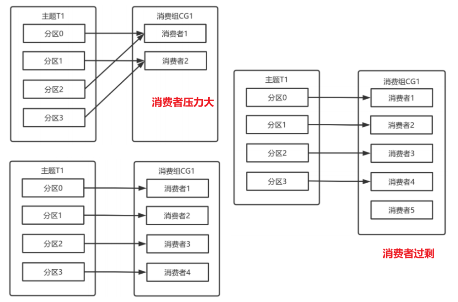

###### 配置说明

| 属性                    | 说明                                                         | 重要性 |
| ----------------------- | ------------------------------------------------------------ | ------ |
| bootstrap.servers       | 生产者与broker集群建立初始连接需要的broker地址列表，不需要写全（因为可通过初始连接发现其他broker），最好写三个 | hign   |
| key.deserializer        | 实现了org.apache.kafka.common.serialization.Deserializer 接口的key的反序列化类 | hign   |
| value.deserializer      | 实现了 org.apache.kafka.common.serialization.Deserializer 接口的value反序列化类 | hign   |
| group.id                | 如果消费者受用组管理功能如subscribe(topic)或使用基于Kafka的偏移量管理策略，该项必须设置 | hign   |
| client.id               | 从服务器消费消息的时候向服务器发送的id字符串，记录在服务端的请求日志中，用于追踪请求 |        |
| auto.offset.reset       | 当Kafka中没有初始偏移量或当前偏移量在服务器中不存在（如，数据被删除了），该如何处理？<br/>earliest：⾃动重置偏移量到最早的偏移量<br/>latest：⾃动重置偏移量为最新的偏移量<br/>none：如果消费组原来的（previous）偏移量不存在，则向消费者抛异常<br/>anything：向消费者抛异常 |        |
| enable.auto.commit      | 默认设置为true，消费者会自动周期性地向服务器提交偏移量       |        |
| auto.commit.interval.ms | ⾃动偏移量提交间隔，默认为 5000                              |        |
| interceptor.classes     | 拦截器需要实现 org.apache.kafka.clients.consumer.ConsumerInterceptor 接口，对消费者接收到的消息进行拦截处理 |        |

###### 反序列化器

同序列化器相对应，若需要自定义则如下

```java
import com.tangdi.kafka.demo.entity.User;
import org.apache.kafka.common.serialization.Deserializer;
import java.nio.ByteBuffer;
import java.util.Map;

public class UserDeserializer implements Deserializer<User> {
    @Override
    public void configure(Map<String, ?> configs, boolean isKey) {
    }
    @Override
    public User deserialize(String topic, byte[] data) {
        ByteBuffer allocate = ByteBuffer.allocate(data.length);
        allocate.put(data);
        allocate.flip();
        int userId = allocate.getInt();
        int length = allocate.getInt();
        System.out.println(length);
        String username = new String(data, 8, length);
        return new User(userId, username);
    }
    @Override
    public void close() {
    }
}
```

###### 偏移量管理

- **自动提交**

  默认为自动提交，间隔为5S。当提交Offset后的3S发生再均衡，Offset还未提交，则该3S的数据会被重复消费

- **手动异步+同步提交（推荐）**

  ```java
  try {
      while(true) {
          ConsumerRecords<String, String> records = consumer.poll(Duration.ofSeconds(1));
          process(records); // 处理消息
          // 使⽤异步提交规避阻塞
          consumer.commitAsync((offsets, exception) -> {
              if (exception != null) {
                  handle(exception);
              }
          });
      }
  } catch(Exception e) {
      handle(e); // 处理异常
  } finally {
      try {
          consumer.commitSync(); // 最后⼀次提交使⽤同步阻塞式提交
      } finally {
          consumer.close();
      }
  }
  ```


##### 4.3 Partition-分区、Replicas-副本

###### 副本机制

一个Topic可以有多个partition分区，每个partition分区可以有多个副本，存储再多个broker中

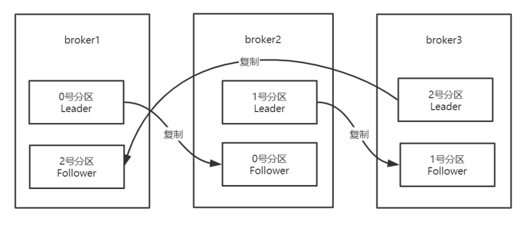

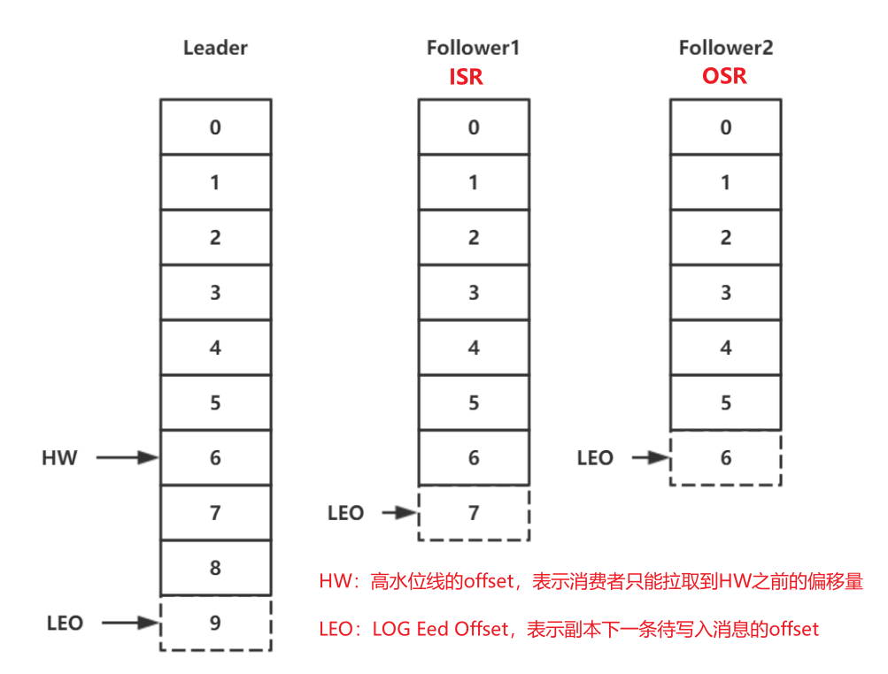

- **Leader：**Leader副本负责读写
- **Follower：**Follower副本同步数据，用作容灾备份
  - **ISR：**与leader副本保持**一定程度同步的Follower副本**（包括Leader），有一定程度可以接受的滞后，可以**通过参数进行配置**
  - **OSR：**与leader副本**同步滞后较大的Follower副本**（不包括leader）副本

- **HW：**表示**高水位的offset**，消费者只能拉取到HW之前的消息
- **LEO：**表示副本**下一条待写入消息的offset**

###### Leader选举

有三台broker，三个Partition，每个Partition有三个Replicas，布局如下

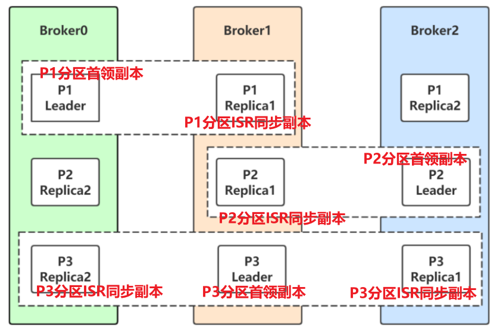

集群中有一个Broker是**集群控制器**，负责broker宕机后的选举，场景如下：

- 仅仅P1 Leader所在的Broker0宕机

  Kafka在Zookeeper上，针对每个Topic都有⼀个动态变化的ISR集合，会从ISR中选举一个成为Leader。当Broker0重新恢复，会把之前commit的数据清空，重新从 Leader 里 pull 数据

  **选举的方式：**Zookeeper分布式锁（**创建临时节点**），成功创建的成为Leader，其他Broker监听该节点

- 所有副本所在得broker都宕机，即Broker0、Broker1、Broker2都宕机

  - 等待 ISR 中的一个恢复后，并选它作为Leader**（需要时间等待）**

  - 选择第一个恢复的 OSR副本作为新的leader，**等待时间短，但会造成数据丢失**，需要设置如下

    ```
    unclean.leader.election.enable=true
    ```

###### 分区分配

- 定义需要重新分配的Topic，创建 `topics-to-move.json`

  ```json
  {
  	"topics": [
  		{
  			"topic":"tp_re_01"
  		}
  	],
  	"version":1 
  }
  ```

- 使用脚本 `kafka-reassign-partitions.sh` 生成 reassign plan

  对 `broker0` 和 `broker1` 的主题重新分区

  ```sh
  kafka-reassign-partitions.sh --zookeeper node1:2181/myKafka --topics-to-move-json-file topics-to-move.json --broker-list "0,1" --generate
  ```

- 将计划分配策略保存为 `topics-to-execute.json`，可按需修改策略

  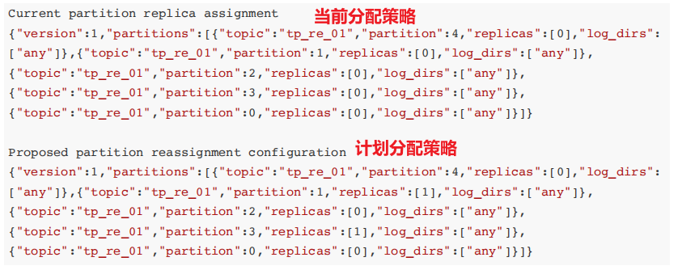

- 执行计划

  ```sh
  kafka-reassign-partitions.sh --zookeeper node1:2181/myKafka --reassignment-json-file topics-to-execute.json --execute
  ```

- 校验执行进度

  ```sh
  kafka-reassign-partitions.sh --zookeeper node1:2181/myKafka --reassignment-json-file topics-to-execute.json --verify
  ```

- 查看主题的细节

  ```sh
  kafka-topics.sh --zookeeper localhost:2181/myKafka --describe --topic tp_re_01
  ```


##### 4.4 Broker-Kafka服务器

Kafka 服务器被称为broker，集群中有多台Broker，有一个BroKer充当了**集群控制器**，负责 **分区分配** 和 **监控broker**。

- Kafka 使用 Zookeeper 的**分布式锁选举控制器**，并在节点加入集群或退出集群时通知控制器。

- 控制器负责在节点加入或离开集群时进行分区Leader选举。

- （不懂为啥会有脑裂，向Zookeeper争取分布式锁不是只有一个能成功吗）控制器使用epoch 来避免**“脑裂”（集群中两个Broker同时认为自己是当前集群的控制器）**，当epoch最新的为控制器


### 二、Kafka 安装及配置

#### 1. 安装Java及配置环境

- 上传jdk-8u261-linux-x64.rpm到服务器并安装

  ```sh
  rpm -ivh jdk-8u261-linux-x64.rpm
  ```

- 配置环境变量

  ```sh
  vim /etc/profile
  ```

  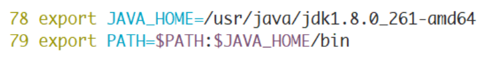

  ```sh
  # ⽣效
  source /etc/profile
  # 验证
  java -version
  ```


#### 2. 安装Zookeeper及配置环境

- 上传zookeeper-3.4.14.tar.gz到服务器

- 解压到 `/opt`

  ```sh
  tar -zxf zookeeper-3.4.14.tar.gz -C /opt
  cd /opt/zookeeper-3.4.14/conf
  # 复制zoo_sample.cfg命名为zoo.cfg
  cp zoo_sample.cfg zoo.cfg
  # 编辑zoo.cfg⽂件
  vim zoo.cfg
  ```

- 修改Zookeeper保存数据的⽬录 `dataDir`

  ```sh
  dataDir=/var/lagou/zookeeper/data
  ```

- 配置环境变量

  ```sh
  vim /etc/profile
  ```

  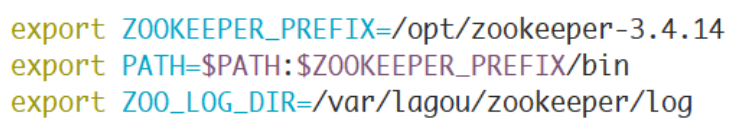

  ```sh
  # ⽣效
  source /etc/profile
  # 验证
  zkServer.sh status
  ```


#### 3. Kafka安装及配置

- 上传kafka_2.12-1.0.2.tgz到服务器并解压

  ```sh
  tar -zxf kafka_2.12-1.0.2.tgz -C /opt
  ```

- 配置环境变量并生效

  ```sh
  vim /etc/profile
  ```

  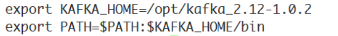

  ```sh
  # ⽣效sh
  source /etc/profile
  ```

- 配置/opt/kafka_2.12-1.0.2/config中的server.conf，在vim编辑模式下使用 `set nu`，标识文本的行号
  - zookeeper配置

    ```sh
    zookeeper.connect=localhost:2181/myKafka
    ```

  - kafka持久化数据的存储目录

    ```sh
    log.dir=/var/kafka/kafka-logs
    ```


#### 4. 启动ZK及查看状态

```sh
zkServer.sh start
```


#### 5. 启动Kafka及查看状态

- **使用sh脚本启动kafka**

  - 非守护线程启动

    ```sh
    kafka-server.start.sh ../config/server.properties
    ```

  - 守护线程启动

    ```sh
    kafka-server.start.sh -daemon ../config/server.properties
    ```

- **使用sh脚本停止kafka**

  ```sh
  kafka-server-stop.sh
  ```

- 启动成功，可以看到控制台输出的最后⼀⾏的started状态

  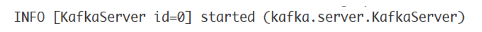


#### 6. 查看Zookeeper的节点

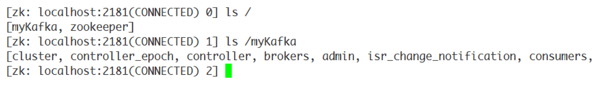


### 三、kafka实战

#### 1. Linux

##### 1.1 kafka-topics.sh 管理主题

```sh
# 列出现有的主题
kafka-topics.sh --zookeeper localhost:2181/myKafka --list
# 创建主题，该主题包含⼀个分区，该分区为Leader分区，它没有Follower分区副本。
kafka-topics.sh --zookeeper localhost:2181/myKafka --create --topic topic_1 --partitions 1 --replication-factor 1
# 创建主题，指定分区及副本的分布，逗号分隔分区，冒号左边为该分区的首领副本
kafka-topics.sh --zookeeper node1:2181/myKafka --create --topic tp_demo_03 --replica-assignment "0:1,1:0,0:1"
# 查看指定主题的详细信息
kafka-topics.sh --zookeeper localhost:2181/myKafka --describe --topic topic_1
# 删除指定主题
kafka-topics.sh --zookeeper localhost:2181/myKafka --delete --topic topic_1
```

##### 1.2 kafka-console-producer.sh 生产消息

```sh
# 开启⽣产者
kafka-console-producer.sh --broker-list localhost:9020 --topic topic_1 
```

##### 1.3 kafka-console-consumer.sh 消费消息

```sh
# 开启消费者
kafka-console-consumer.sh --bootstrap-server localhost:9092 --topic topic_1
# 开启消费者⽅式⼆，从头消费，不按照偏移量消费
kafka-console-consumer.sh --bootstrap-server localhost:9092 --topic topic_1 --from-beginning
```


#### 2. Java Kafka

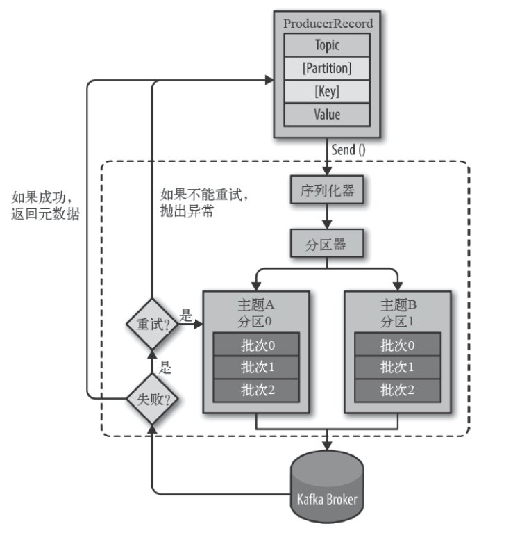

**生产者生产消息后，需要broker端的确认，可以同步确认，也可以异步确认。异步确认效率高，但是需要设置回调对象。**

##### 2.1 依赖

```xml
<dependency>
    <groupId>org.apache.kafka</groupId>
    <artifactId>kafka-clients</artifactId>
    <!-- 高版本兼容低版本，我们使用和broker一致的版本 -->
    <version>1.0.2</version>
</dependency>
```

##### 2.2 生产者

同步确认

```java
import org.apache.kafka.clients.producer.Callback;
import org.apache.kafka.clients.producer.KafkaProducer;
import org.apache.kafka.clients.producer.ProducerRecord;
import org.apache.kafka.clients.producer.RecordMetadata;
import org.apache.kafka.common.header.Header;
import org.apache.kafka.common.header.internals.RecordHeader;
import org.apache.kafka.common.serialization.IntegerSerializer;
import org.apache.kafka.common.serialization.StringSerializer;

import java.util.ArrayList;
import java.util.HashMap;
import java.util.List;
import java.util.Map;
import java.util.concurrent.ExecutionException;
import java.util.concurrent.Future;

public class MyProducer1 {
    public static void main(String[] args) throws InterruptedException,ExecutionException, TimeoutException {
        Map<String, Object> configs = new HashMap<>();
        // 设置连接Kafka的初始连接⽤到的服务器地址
        // 如果是集群，则可以通过此初始连接发现集群中的其他broker
        configs.put("bootstrap.servers", "node1:9092");
        // 设置key的序列化器
        configs.put("key.serializer", IntegerSerializer.class);
        // 设置value的序列化器
        configs.put("value.serializer", StringSerializer.class);
        configs.put("acks", "1");
        KafkaProducer<Integer, String> producer = new KafkaProducer<Integer, String> (configs);
        // ⽤于封装Producer的消息
        ProducerRecord<Integer, String> record = new ProducerRecord<Integer, String>(
            "topic_1", // 主题名称
            0, // 分区编号，现在只有⼀个分区，所以是0
            0, // 数字作为key
            "message 0" // 字符串作为value
        );
        // 发送消息，同步等待消息的确认
        producer.send(record).get(3_000, TimeUnit.MILLISECONDS);
        // 关闭⽣产者
        producer.close();
    }
}
```

异步确认

```java
import org.apache.kafka.clients.producer.Callback;
import org.apache.kafka.clients.producer.KafkaProducer;
import org.apache.kafka.clients.producer.ProducerRecord;
import org.apache.kafka.clients.producer.RecordMetadata;
import org.apache.kafka.common.header.Header;
import org.apache.kafka.common.header.internals.RecordHeader;
import org.apache.kafka.common.serialization.IntegerSerializer;
import org.apache.kafka.common.serialization.StringSerializer;

import java.util.ArrayList;
import java.util.HashMap;
import java.util.List;
import java.util.Map;
import java.util.concurrent.ExecutionException;

public class MyProducer2 {
    public static void main(String[] args) {
        Map<String, Object> configs = new HashMap<>();
        configs.put("bootstrap.servers", "node1:9092");
        // 设置key的序列化器
        configs.put("key.serializer", IntegerSerializer.class);
        // 设置value的序列化器
        configs.put("value.serializer", StringSerializer.class);
        KafkaProducer<Integer, String> producer = new KafkaProducer<Integer, String> (configs);
        ProducerRecord<Integer, String> record = new ProducerRecord<Integer, String>(
            "topic_1",
            0,
            1,
            "lagou message 2"
        );
        // 使⽤回调异步等待消息的确认
        producer.send(record, new Callback() {
            @Override
            public void onCompletion(RecordMetadata metadata, Exception exception) {
                if (exception == null) {
                    System.out.println(
                        "主题：" + metadata.topic() + "\n"
                        + "分区：" + metadata.partition() + "\n"
                        + "偏移量：" + metadata.offset() + "\n"
                        + "序列化的key字节：" + metadata.serializedKeySize() +
                        "\n"
                        + "序列化的value字节：" +
                        metadata.serializedValueSize() + "\n"
                        + "时间戳：" + metadata.timestamp()
                    );
                } else {
                    System.out.println("有异常：" + exception.getMessage());
                }
            }
        });
        // 关闭连接
        producer.close();
    }
}
```

循环生产

```java
import org.apache.kafka.clients.producer.Callback;
import org.apache.kafka.clients.producer.KafkaProducer;
import org.apache.kafka.clients.producer.ProducerRecord;
import org.apache.kafka.clients.producer.RecordMetadata;
import java.util.HashMap;
import java.util.Map;

public class MyProducer3 {
    public static void main(String[] args) {
        Map<String, Object> configs = new HashMap<>();
        configs.put("bootstrap.servers", "node1:9092");
        configs.put("key.serializer",
                    "org.apache.kafka.common.serialization.IntegerSerializer");
        configs.put("value.serializer",
                    "org.apache.kafka.common.serialization.StringSerializer");
        KafkaProducer<Integer, String> producer = new KafkaProducer<Integer, String> (configs);
        for (int i = 100; i < 200; i++) {
            ProducerRecord<Integer, String> record = new ProducerRecord<Integer,
            String>(
                "topic_1",
                0,
                i,
                "lagou message " + i
            );
            // 使⽤回调异步等待消息的确认
            producer.send(record, new Callback() {
                @Override
                public void onCompletion(RecordMetadata metadata, Exception
                                         exception) {
                    if (exception == null) {
                        System.out.println(
                            "主题：" + metadata.topic() + "\n"
                            + "分区：" + metadata.partition() + "\n"
                            + "偏移量：" + metadata.offset() + "\n"
                            + "序列化的key字节：" +
                            metadata.serializedKeySize() + "\n"
                            + "序列化的value字节：" +
                            metadata.serializedValueSize() + "\n"
                            + "时间戳：" + metadata.timestamp()
                        );
                    } else {
                        System.out.println("有异常：" + exception.getMessage());
                    }
                }
            });
        }
        // 关闭连接
        producer.close();
    }
}
```

##### 2.3 消费者

```java
import org.apache.kafka.clients.consumer.ConsumerConfig;
import org.apache.kafka.clients.consumer.ConsumerRecord;
import org.apache.kafka.clients.consumer.ConsumerRecords;
import org.apache.kafka.clients.consumer.KafkaConsumer;
import org.apache.kafka.common.serialization.IntegerDeserializer;
import org.apache.kafka.common.serialization.StringDeserializer;

import java.util.Arrays;
import java.util.HashMap;
import java.util.Map;
import java.util.function.Consumer;

public class MyConsumer1 {
    public static void main(String[] args) {

        Map<String, Object> configs = new HashMap<>();
        // node1对应于192.168.100.101，windows的hosts文件中手动配置域名解析
        configs.put(ConsumerConfig.BOOTSTRAP_SERVERS_CONFIG, "node1:9092");
        // 使用常量代替手写的字符串，配置key的反序列化器
        configs.put(ConsumerConfig.KEY_DESERIALIZER_CLASS_CONFIG, IntegerDeserializer.class);
        // 配置value的反序列化器
        configs.put(ConsumerConfig.VALUE_DESERIALIZER_CLASS_CONFIG, StringDeserializer.class);
        // 配置消费组ID
        configs.put(ConsumerConfig.GROUP_ID_CONFIG, "consumer_demo1");
        // 如果找不到当前消费者的有效偏移量，则自动重置到最开始
        // latest表示直接重置到消息偏移量的最后一个
        configs.put(ConsumerConfig.AUTO_OFFSET_RESET_CONFIG, "earliest");

        KafkaConsumer<Integer, String> consumer = new KafkaConsumer<Integer, String>(configs);

 		// 正则表达式订阅
		// consumer.subscribe(Pattern.compile("topic_[0-9]"));
        
        // 先订阅，再消费
        consumer.subscribe(Arrays.asList("topic_1"));

//        while (true) {
//            final ConsumerRecords<Integer, String> consumerRecords = consumer.poll(3_000);
//        }
        // 如果主题中没有可以消费的消息，则该方法可以放到while循环中，每过3秒重新拉取一次
        // 如果还没有拉取到，过3秒再次拉取，防止while循环太密集的poll调用。

        // 批量从主题的分区拉取消息
        final ConsumerRecords<Integer, String> consumerRecords = consumer.poll(3_000);

        // 遍历本次从主题的分区拉取的批量消息
        consumerRecords.forEach(new Consumer<ConsumerRecord<Integer, String>>() {
            @Override
            public void accept(ConsumerRecord<Integer, String> record) {
                System.out.println(record.topic() + "\t"
                        + record.partition() + "\t"
                        + record.offset() + "\t"
                        + record.key() + "\t"
                        + record.value());
            }
        });

        consumer.close();

    }
}
```


#### 3. SpringBoot Kafka

##### 3.1 pom依赖

```xml
<?xml version="1.0" encoding="UTF-8"?>
<project xmlns="http://maven.apache.org/POM/4.0.0" xmlns:xsi="http://www.w3.org/2001/XMLSchema-instance"
         xsi:schemaLocation="http://maven.apache.org/POM/4.0.0 https://maven.apache.org/xsd/maven-4.0.0.xsd">
    <modelVersion>4.0.0</modelVersion>
    <parent>
        <groupId>org.springframework.boot</groupId>
        <artifactId>spring-boot-starter-parent</artifactId>
        <version>2.3.2.RELEASE</version>
        <relativePath/> <!-- lookup parent from repository -->
    </parent>
    <groupId>com.tangdi.kafka.demo</groupId>
    <artifactId>demo-02-springboot-kafka</artifactId>
    <version>0.0.1-SNAPSHOT</version>
    <name>demo-02-springboot-kafka</name>
    <description>Demo project for Spring Boot</description>

    <properties>
        <java.version>1.8</java.version>
    </properties>

    <dependencies>
        <dependency>
            <groupId>org.springframework.boot</groupId>
            <artifactId>spring-boot-starter-web</artifactId>
        </dependency>
        <dependency>
            <groupId>org.springframework.kafka</groupId>
            <artifactId>spring-kafka</artifactId>
        </dependency>

        <dependency>
            <groupId>org.springframework.boot</groupId>
            <artifactId>spring-boot-starter-test</artifactId>
            <scope>test</scope>
            <exclusions>
                <exclusion>
                    <groupId>org.junit.vintage</groupId>
                    <artifactId>junit-vintage-engine</artifactId>
                </exclusion>
            </exclusions>
        </dependency>
        <dependency>
            <groupId>org.springframework.kafka</groupId>
            <artifactId>spring-kafka-test</artifactId>
            <scope>test</scope>
        </dependency>
    </dependencies>

    <build>
        <plugins>
            <plugin>
                <groupId>org.springframework.boot</groupId>
                <artifactId>spring-boot-maven-plugin</artifactId>
            </plugin>
        </plugins>
    </build>

</project>
```

##### 3.2 全局配置文件

```properties
spring.application.name=springboot-kafka-02
server.port=8080

# kafka的配置
spring.kafka.bootstrap-servers=node1:9092

#producer配置
spring.kafka.producer.key-serializer=org.apache.kafka.common.serialization.IntegerSerializer
spring.kafka.producer.value-serializer=org.apache.kafka.common.serialization.StringSerializer
# 生产者每个批次最多放多少条记录
spring.kafka.producer.batch-size=16384
# 生产者一端总的可用发送缓冲区大小，此处设置为32MB
spring.kafka.producer.buffer-memory=33554432

#consumer配置
spring.kafka.consumer.key-deserializer=org.apache.kafka.common.serialization.IntegerDeserializer
spring.kafka.consumer.value-deserializer=org.apache.kafka.common.serialization.StringDeserializer
spring.kafka.consumer.group-id=springboot-consumer02
# 如果在kafka中找不到当前消费者的偏移量，则直接将偏移量重置为最早的
spring.kafka.consumer.auto-offset-reset=earliest
# 消费者的偏移量是自动提交还是手动提交，此处自动提交偏移量
spring.kafka.consumer.enable-auto-commit=true
# 消费者偏移量自动提交的时间间隔
spring.kafka.consumer.auto-commit-interval=1000

```

##### 3.3 Javaconfig

```java
import org.apache.kafka.clients.admin.NewTopic;
import org.apache.kafka.clients.producer.ProducerConfig;
import org.springframework.beans.factory.annotation.Autowired;
import org.springframework.context.annotation.Bean;
import org.springframework.context.annotation.Configuration;
import org.springframework.kafka.core.KafkaAdmin;
import org.springframework.kafka.core.KafkaTemplate;
import org.springframework.kafka.core.ProducerFactory;

import java.util.HashMap;
import java.util.Map;

@Configuration
public class KafkaConfig {


    @Bean
    public NewTopic topic1() {
        return new NewTopic("nptc-01", 3, (short) 1);
    }

    @Bean
    public NewTopic topic2() {
        return new NewTopic("nptc-02", 5, (short) 1);
    }

    @Bean
    public KafkaAdmin kafkaAdmin() {
        Map<String, Object> configs = new HashMap<>();
        configs.put("bootstrap.servers", "node1:9092");
        KafkaAdmin admin = new KafkaAdmin(configs);
        return admin;
    }

    @Bean
    @Autowired
    public KafkaTemplate<Integer, String> kafkaTemplate(ProducerFactory<Integer, String> producerFactory) {

        // 覆盖ProducerFactory原有设置
        Map<String, Object> configsOverride = new HashMap<>();
        configsOverride.put(ProducerConfig.BATCH_SIZE_CONFIG, 200);

        KafkaTemplate<Integer, String> template = new KafkaTemplate<Integer, String>(
                producerFactory, configsOverride
        );
        return template;
    }

}
```

##### 3.4 生产者

```java
import org.apache.kafka.clients.producer.RecordMetadata;
import org.springframework.beans.factory.annotation.Autowired;
import org.springframework.kafka.core.KafkaTemplate;
import org.springframework.kafka.support.SendResult;
import org.springframework.util.concurrent.ListenableFuture;
import org.springframework.util.concurrent.ListenableFutureCallback;
import org.springframework.web.bind.annotation.PathVariable;
import org.springframework.web.bind.annotation.RequestMapping;
import org.springframework.web.bind.annotation.RestController;

import java.util.concurrent.ExecutionException;

@RestController
public class KafkaProducerController {

    @Autowired
    private KafkaTemplate<Integer, String> template;


    @RequestMapping("send/async/{message}")
    public String asyncSend(@PathVariable String message) {

        final ListenableFuture<SendResult<Integer, String>> future = this.template.send("topic-spring-01", 0, 1, message);

        // 设置回调函数，异步等待broker端的返回结果
        future.addCallback(new ListenableFutureCallback<SendResult<Integer, String>>() {
            @Override
            public void onFailure(Throwable throwable) {
                System.out.println("发送消息失败：" + throwable.getMessage());
            }

            @Override
            public void onSuccess(SendResult<Integer, String> result) {
                final RecordMetadata metadata = result.getRecordMetadata();

                System.out.println("发送消息成功：" + metadata.topic() + "\t" + metadata.partition() + "\t" + metadata.offset());
            }
        });

        return "success";
    }


    @RequestMapping("send/sync/{message}")
    public String syncSend(@PathVariable String message) {

        final ListenableFuture<SendResult<Integer, String>> future = template.send("topic-spring-01", 0, 0, message);
        // 同步发送消息
        try {
            final SendResult<Integer, String> sendResult = future.get();
            final RecordMetadata metadata = sendResult.getRecordMetadata();

            System.out.println(metadata.topic() + "\t" + metadata.partition() + "\t" + metadata.offset());

        } catch (InterruptedException e) {
            e.printStackTrace();
        } catch (ExecutionException e) {
            e.printStackTrace();
        }

        return "success";
    }
}
```

##### 3.5 消费者

```java
import org.apache.kafka.clients.consumer.ConsumerRecord;
import org.springframework.kafka.annotation.KafkaListener;
import org.springframework.stereotype.Component;

@Component
public class MyConsumer {

    @KafkaListener(topics = "topic-spring-01")
    public void onMessage(ConsumerRecord<Integer, String> record) {
        System.out.println("消费者收到的消息："
                + record.topic() + "\t"
                + record.partition() + "\t"
                + record.offset() + "\t"
                + record.key() + "\t"
                + record.value());
    }

}
```


### 四、Kafa服务端配置

#### 1. 配置ZK连接

使用逗号分隔Zookeeper的多个地址。Zookeeper的单个地址是 host:port 形式的，可以在最后添加Kafka在Zookeeper中的根节点路径

```properties
zookeeper.connect=node2:2181,node3:2181,node4:2181/myKafka
zookeeper.connection.timeout.ms=6000
```


#### 2. 内外网隔离

- listeners 分别配置两个host提供对内和对外的服务

  监听器名称和端口不能一样

- 配置 broker节点间通信的 host

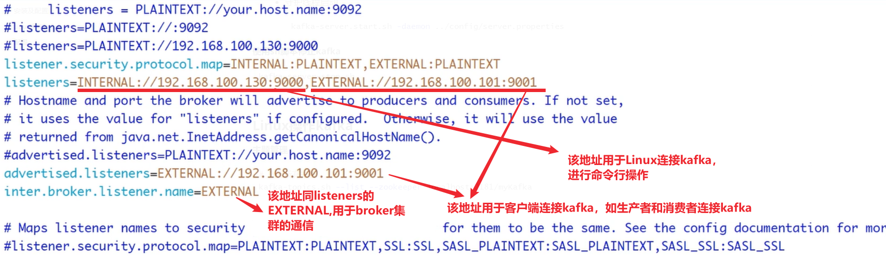


#### 3. broker.id

唯⼀标记⼀个Kafka的Broker，它的值是⼀个任意integer值，Kafka为分布式集群架构时这属性极为重要

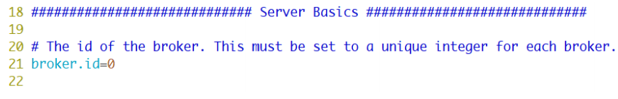


#### 4. log.dir

指定Kafka在磁盘上保存消息（持久化数据）的目录

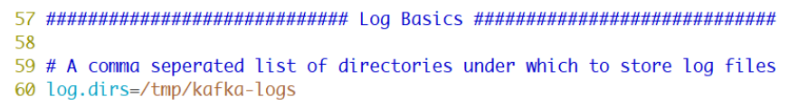
