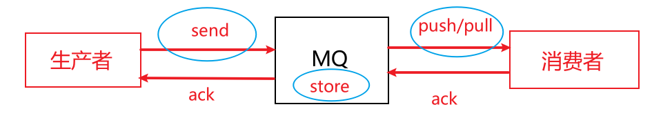

[toc]

#### 消息丢失

消息丢失存在三种情况，分别是生产者发送时、MQ保存时、消费者消费时，如下图所示：

解决方案有以下两种

- **确认机制**
  - 生产者发送失败（例如，与MQ网络波动），捕获异常重新发送消息。若一直重试达到最大阈值，可将消息写入消息表，由后台线程定时重试
  
  - MQ保存失败，MQ自身通过持久化消息保证消息不丢失并且通过主从复制保证高可用，当持久化成功时才会返回一个ack标识给生产者（Kafka可设置ack类型），当生产者接收到MQ保存失败时，可重试发送消息。若一直重试达到最大阈值，可将消息写入消息表，由后台线程定时重试。
  
  - MQ Push或者消费者Pull并消费消息，也是通过确认机制。
  
    例如RocketMQ：消费失败或异常时可重试消费消息，当达到重试的最大阈值时消息便被放入DLQ。
  
    Kafka：由于Kafka消费者没有重试机制和DLQ，所以可以通过本地消息表记录消费失败记录或者将失败消息发送到自定义的重试队列。
- **消息表**
  - 生产者生产消息时，进行本地消息表保存，并发送MQ。若MQ保存失败则生产者重试发送消息。
  - 定时检查消息表消费状态，对未消费的进行补偿处理。

#### 幂等性（消息重复）

重复消息没法避免，原因：

1. 生产者**由于网络波动未收到broker的ack**，**重试发送消息**，导致broker存在**多份相同消息**；
2. 消费者再平衡重复消费消息（例如Kafka一个消费者消费完消息还未commit offset而宕机，此时另一个消费者接手这个分区而重复消费）

解决方案有以下两种

- **保证消费者的幂等性**

  如果消息的消费满足幂等，由业务层自己保证幂等性。可为每个消息添加一个唯一标识ID

- **消息表**
  - 对消息进行编号，如果已经存在编号，则不再重试发送消息
  - 消费者判断消息状态，已经消费的消息不再处理

#### 保证有序性

- Kafka和RocketMQ为了提升性能都可以进行并行消费的横向扩展，每个主题都可以进行分片（Kafka的partition或者RocketMQ的message queue）。并行消费的模式是为了高性能，所以无法保证全局有序性，而局部有序性可以通过将需要保证有序的消息放入同一个分片（partition或者message queue）

#### 消息积压

- **批量方式**进行消费，例如一次10个消息或者一次10个update    速度远远快于    十次消息和10次update
- **增加**Partition或者Message Queue和**消费者实例**，**并行消费消息**

- 消费者开启**多线程消费消息**