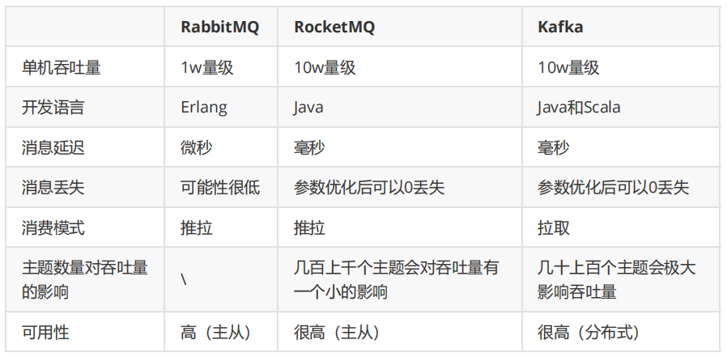

#### RabbitMQ

RabbitMQ开始是用在电信业务的可靠通信的，也是少有的几款支持AMQP协议的产品之一。

优点：

- 轻量级，快速，部署使用方便

- 支持灵活的路由配置。RabbitMQ中，在生产者和队列之间有一个交换器模块。根据配置的路由规则，生产者发送的消息可以发送到不同的队列中。路由规则很灵活，还可以自己实现。

- RabbitMQ的客户端支持大多数的编程语言。

缺点：

- 如果有大量消息堆积在队列中，性能会急剧下降

- RabbitMQ的性能在Kafka和RocketMQ中是最差的，每秒处理几万到几十万的消息。如果应用要求高的性能，不要选择RabbitMQ。 

- RabbitMQ是Erlang开发的，功能扩展和二次开发代价很高。

#### RocketMQ

RocketMQ是一个开源的消息队列，使用java实现。借鉴了Kafka的设计并做了很多改进。RocketMQ主要用于有序，事务，流计算，消息推送，日志流处理，binlog分发等场景。经过了历次的双11考验，性能，稳定性可可靠性没的说。

RocketMQ几乎具备了消息队列应该具备的所有特性和功能。

java开发，阅读源代码、扩展、二次开发很方便。

对电商领域的响应延迟做了很多优化。在大多数情况下，响应在毫秒级。如果应用很关注响应时间，可以使用RocketMQ。

性能比RabbitMQ高一个数量级，每秒处理几十万的消息。

缺点：

跟周边系统的整合和兼容不是很好。

#### Kafka

Kafka的可靠性，稳定性和功能特性基本满足大多数的应用场景。跟周边系统的兼容性是数一数二的，尤其是大数据和流计算领域，几乎所有相关的开源软件都支持Kafka。

Kafka高效，可伸缩，消息持久化。支持分区、副本和容错。

Kafka是Scala和Java开发的，对批处理和异步处理做了大量的设计，因此Kafka可以得到非常高的性能。它的异步消息的发送和接收是三个中最好的，但是跟RocketMQ拉不开数量级，每秒处理几十万的消息。

如果是异步消息，并且开启了压缩，Kafka最终可以达到每秒处理2000w消息的级别。但是由于是异步的和批处理的，延迟也会高，不适合电商场景。
