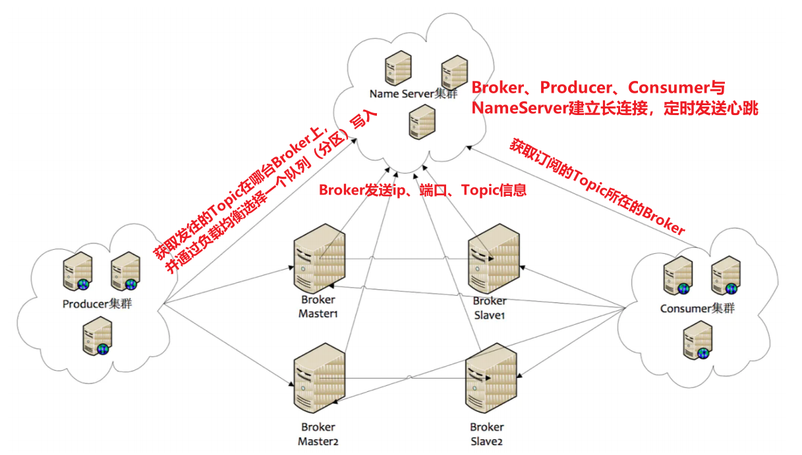

[toc]

## 一、RocketMQ概述

### 起源

RocketMQ是阿里巴巴在2012年开发的分布式消息中间件，专为万亿级超大规模的消息处理而设计，具有高吞吐量、低延迟、海量堆积、顺序收发等特点。它是阿里巴巴双十一购物狂欢节和众多大规模互联网业务场景的必备基础设施。在同一年，阿里巴巴正式开源了RocketMQ的第一个版本。

2015年，RocketMQ在消息传递方面迎来了一批重量级功能发布，包括事务消息、SQL过滤、轨迹追踪、定时消息、高可用多活等，以满足阿里巴巴日益丰富的业务场景。由于这些优势，RocketMQ 取代了阿里巴巴自主研发的另一款MQ产品Notify，成为阿里巴巴的首选消息中间件，实现了内部应用的百分百接入。在2016年，RocketMQ在阿里云上开发了首个全托管服务，帮助大量数字化转型的企业构建现代应用，并开始体验大规模的云计算实践。同年，RocketMQ被捐赠给Apache基金会，并入选孵化器项目，旨在未来为更多开发者服务。

2017年从Apache基金会毕业后，RocketMQ被指定为顶级项目（TLP）。

从诞生到成熟，再到成为Apache TLP，RocketMQ的成功与它的创始团队和众多开发者多年来的努力是分不开的。

### 应用场景

#### 1. 异步

将同步操作异步话，提升系统性能。

#### 2. 解耦

系统耦合性越低，容错性就越高。例如电商系统的下单、支付、库存扣减、优惠券扣减、短信发送等操作，一旦哪个系统暂时不可用都会影响整个流程。

#### 3. 削峰

当业务系统遇上流量洪峰，超出了系统的处理能力，可以将请求以消息的形式保存到MQ服务器中，由消费者服务器慢慢的根据自身处理能力来消费。当然消费者可以设置每个批次接受的Message，也可是设置处理的线程数。

#### 4. 分发

通过消息队列可以让数据在多个系统之间进行流通。数据的产生方不需要关心谁来使用数据，只需要将数据发送到消息队列，数据使用方直接在消息队列中直接获取数据即可

#### 5. 分布式事务

[分布式事务](../../架构/分布式架构设计/分布式理论、事务、一致性算法)

 

### 角色及部署架构

#### 1. 角色

- **Producer**：消息的发送者，比喻为发信者
- **Consumer**：消息的接收者，比喻为收信者
- **Broker**：存储及传输者，比喻为邮局
- **NameServer**：Broker、Producer、Consumer的注册及管理中心，记录每个broker状态、有哪些topic、有哪些messagequeue、ip、port。比喻为各邮局的管理机构
- **Topic**：消息主题，区分消息的类型。一个发送者可以发消息给一个或多个Topic；一个接收者可以订阅一个或多个Topic。
- **Message Queue**：Topic分区，用于并行发送、接收消息。**等同于Kafka的 Partition分区**。

#### 2. 部署架构



##### 各节点职责

- NameServer是一个几乎无状态节点，可集群部署，节点之间无任何信息同步。

- Broker部署相对复杂，Broker分为Master与Slave。Master与Slave 的对应**关系通过指定相同的BrokerName，不同的BrokerId来定义**，BrokerId为**0表示Master**，非0表示Slave，**一组BrokerName的Master和Slaver构成一个Broker组**，每个Broker组只有一个Master，一个或多个Slaver。**每个Broker与NameServer集群中的所有节点建立长连接**，定时**注册Topic信息到所有NameServer**。 注意：当前RocketMQ版本在部署架构上支持一Master多Slave，但**只有BrokerId=1的从服务器才会参与消息的读负载**。

- Producer**与NameServer**集群中的其中一个节点（随机选择）**建立长连接**，**定期从NameServer获取Topic路由信息**，并向提供Topic 服务的**Master Broker建立长连接**，且**定时向Master Broker发送心跳**。Producer完全无状态，可集群部署。

- Consumer**与NameServer**集群中的其中一个节点（随机选择）**建立长连接**，**定期从NameServer获取Topic路由信息**，并向提供Topic服务的**Master、Slave建立长连接**，且定时向Master、Slave发送心跳。**Consumer既可以从Master订阅消息，也可以从Slave订阅消息**，消费者在向Master拉取消息时，Master服务器会根据拉取偏移量与最大偏移量的距离（判断是否读老消息，产生读I/O），以及从服务器是否可读等因素建议下一次是从Master还 是Slave拉取。


### 了解特性

#### 1. 发布与订阅

- 发布：某个生产者向某个Topic发送消息，可打上Tag；
- 订阅：某个消费者订阅了某个Topic中带有某些Tag的消息；**RocketMQ使用长轮询Pull机制来模拟Push效果**。

#### 2. 消息顺序

- 全局顺序：只用一个队列（分区），并开发重试有序的设置；
- 局部顺序：通过某个具有全局唯一的业务标识，将消息发到同个队列，保证这部分业务顺序，并开启重试有序设置。如某个订单创建、付款、库存，保证发往同一个队列即可。

#### 3. 消息过滤

- 消费者可以根据Tag来进行消息过滤消费。支持自定义属性过滤。消息过滤在Broker端实现，减少了对Consumer无用消息的网络传输，但增加了Broker的负担。

#### 4. 高性能

在Linux操作系统层级进行调优，推荐使用EXT4文件系统，IO调度算法使用deadline算法。

#### 5. 至少一次

At least Once，每个消息必须投递一次。Consumer先Pull到本地，消费完成后再返回服务器ACK，如果没有消费则不会ACK。

#### 6. 回溯消息

Broker在向Consumer投递成功消息后，消息仍然需要保留。并且重新消费一般是按照时间维度，例如由于Consumer系统故障，恢复后需要重新消费1小时前的数据，那么Broker要提供一种机制，可以按照时间维度来回退消费进度。RocketMQ支持按照时间回溯消费，时间维度精确到毫秒

#### 7. 事务消息

Transactional Message事务消息**将本地数据库事务**和**发送消息的操作**绑定到**一个全局事务中**。

#### 8. 定时消息（延时队列）

Broker有配置项 **`messageDelayLevel`**，默认值为“1s 5s 10s 30s 1m 2m 3m 4m 5m 6m 7m 8m 9m 10m 20m 30m 1h 2h”，**18个level**。

定时消息被暂存再名为  **`SCHEDULE_TOPIC_XXXX`**  的topic中，**每个Level都对应一个Message Queue，队列中存放相同延迟消息，保证顺序消费**

使用：**`msg.setDelayLevel(level)`**，level有以下三种情况：

- level = 0，立即发送消息
- 1<= level <= maxLevel，指定延时时间
- level > maxLevel，则level = maxLevel，例如level = 20，则还是2h

#### 9. 消息重投

可能重发消息的场景：

- 同步消息到从Slaver失败
- 异步消息有重试
- Oneway没有任何保证

重投可设置的策略：

- **`retryTimesWhenSendFailed`**：**同步发送消息失败重投**，默认次数为**2次**，超过则抛异常**。注意：为了保证消息不丢失，由业务端创建消息表，并在后续补偿重投**。
- **`retryTimesWhenSendAsyncFailed`**：异步发送消息失败重投，默认为2次。
- **`retryAnotherBrokerWhenNotStoreOK`**：消息刷盘并同步到Slaver

#### 10. 消息重试

#### 11. 流量控制

- 生产者流控：
  - commitLog文件被锁时间超过osPageCacheBusyTimeOutMills时，参数默认为1000ms，发生流控
  - 如果开启transientStorePoolEnable = true，且broker为异步刷盘的主机，且transientStorePool中资源不足，拒绝当前send请求，发生流控。
  - broker每隔10ms检查send请求队列头部请求的等待时间，如果超过waitTimeMillsInSendQueue，默认200ms，拒绝当前send请求，发生流控。
  - broker通过拒绝send 请求方式实现流量控制。
- 消费者流控：
  - 消费者本地缓存消息数超过pullThresholdForQueue时，默认1000。
  - 消费者本地缓存消息大小超过pullThresholdSizeForQueue时，默认100MB。
  - 消费者本地缓存消息跨度超过consumeConcurrentlyMaxSpan时，默认2000。
  - 消费者流控的结果是降低拉取频率。

#### 12. 死信队列

当消费者消息重试达到最大次数后，消息队列会将该消息发到一个特殊队列中-死信队列。


## 二、环境搭建

### 1. 下载RocketMQ:4.5.1

[官网下载地址](https://www.apache.org/dyn/closer.cgi?path=rocketmq/4.5.1/rocketmq-all-4.5.1-bin-release.zip)

```sh
#下载
wget https://archive.apache.org/dist/rocketmq/4.5.1/rocketmq-all-4.5.1-bin-release.zip
```


### 2. 安装及环境配置

- 修改脚本(**JDK8可忽略**，若JDK为11则需要修改一些JVM配置)

  ```
  vim bin/runserver.sh
  vim bin/runbroker.sh
  vim bin/tools.sh
  ```

- 启动NameServer

  ```sh
  # 1.不挂断式启动 NameServer 
  nohup sh mqnamesrv &
  # 2.查看启动日志 
  tail -f ~/logs/rocketmqlogs/namesrv.log
  ```

- 启动Broker

  ```sh
  # 1.不挂断式启动 启动Broker
  nohup sh mqbroker -n localhost:9876 &
  # 或者指定配置文件启动
  nohup sh mqbroker -c ../conf/broker.conf &
  # 2.查看启动日志
  tail -f ~/logs/rocketmqlogs/broker.log
  ```

- 启动brocker集群

  ```sh
  nohup sh mqbroker -c /home/rocketmq/conf/2m-2s-sync/broker-a.properties >master.log &
  nohup sh mqbroker -c /home/rocketmq/conf/2m-2s-sync/broker-a-s.properties >slave.log &
  ```

- broker配置文件`broker.conf`

  ```sh
  # [rocketmq broker.conf参数解释]
  #4.7.1版本
   
  #所属集群名字
  brokerClusterName=rocketmq-cluster
  #broker名字，名字可重复,为了管理,每个master起一个名字,他的slave同他,eg:Amaster叫broker-a,他的slave也叫broker-a
  brokerName=broker-a
  #0 表示 Master，>0 表示 Slave
  brokerId=0
  brokerIp=127.0.0.1
  #nameServer地址，分号分割
  namesrvAddr=127.0.0.1:9876
   #在发送消息时，自动创建服务器不存在的topic，默认创建的队列数
  defaultTopicQueueNums=8
   #是否允许 Broker 自动创建Topic，建议线下开启，线上关闭
  autoCreateTopicEnable=true
  #是否允许 Broker 自动创建订阅组，建议线下开启，线上关闭
  autoCreateSubscriptionGroup=true
  #Broker 对外服务的监听端口,
  listenPort=10911
  #删除文件时间点，默认凌晨 4点
  deleteWhen=04
  #文件保留时间，默认 48 小时
  fileReservedTime=48
  #commitLog每个文件的大小默认1G
  mapedFileSizeCommitLog=1073741824
  #ConsumeQueue每个文件默认存30W条，根据业务情况调整
  mapedFileSizeConsumeQueue=300000
  destroyMapedFileIntervalForcibly=120000
  
  redeleteHangedFileInterval=120000
  #检测物理文件磁盘空间
  diskMaxUsedSpaceRatio=88
  #存储路径
  storePathRootDir=D:\\rocketMqTestData\\store
  #commitLog 存储路径
  storePathCommitLog=D:\\rocketMqTestData\\store\\commitlog
  #消费队列存储路径存储路径
  storePathConsumeQueue=D:\\rocketMqTestData\\store\\consumequeue
  #消息索引存储路径
  storePathIndex=D:\\rocketMqTestData\\store\\index
  #checkpoint 文件存储路径
  storeCheckpoint=D:\\rocketMqTestData\\store\\checkpoint
  #abort 文件存储路径
  abortFile=D:\\rocketMqTestData\\store\\abort
  #限制的消息大小
  maxMessageSize=65536
  flushCommitLogLeastPages=4
  flushConsumeQueueLeastPages=2
  flushCommitLogThoroughInterval=10000
  flushConsumeQueueThoroughInterval=60000
  #Broker 的角色
  brokerRole=ASYNC_MASTER
  #刷盘方式
  flushDiskType=ASYNC_FLUSH
  
  checkTransactionMessageEnable=false
  #发消息线程池数量
  sendMessageTreadPoolNums=128
  #拉消息线程池数量
  pullMessageTreadPoolNums=128
  ```

### 3. 环境测试

- 发送消息

  ```sh
  # 1.设置环境变量 2.使用安装包的Demo发送消息 
  export NAMESRV_ADDR=localhost:9876 && sh bin/tools.sh org.apache.rocketmq.example.quickstart.Producer
  ```
  
- 接收消息

  ```sh
  # 1.设置环境变量 2.接收消息 
  export NAMESRV_ADDR=localhost:9876 && sh bin/tools.sh org.apache.rocketmq.example.quickstart.Consumer
  ```
  
- 关闭RocketMQ

  ```sh
  # 1.关闭NameServer 
  mqshutdown namesrv 
  # 2.关闭Broker 
  mqshutdown broker
  ```

### 4. 常用命令

```sh
#1.查看帮助：在 mqadmin 下可以查看有哪些命令
   1): 查看具体命令的使用 : sh mqadmin    
   2): sh mqadmin help 命令名称  
#2. 关闭nameserver和所有的broker: 
   sh mqshutdown namesrv
   sh mqshutdown broker
#3. 查看所有消费组group:
   sh mqadmin consumerProgress -n 192.168.1.23:9876
   注：-n，即配置的namesrvAddr参数
#4. 查看指定消费组下的所有topic数据堆积情况：
   sh mqadmin consumerProgress -n 192.168.1.23:9876 -g warning-group
#5. 查看所有topic :
   sh mqadmin topicList -n 192.168.1.23:9876
#6. 查看topic信息列表详情统计
   sh mqadmin topicstatus -n 192.168.1.23:9876 -t topicWarning
#7.  新增topic
   sh mqadmin updateTopic –n 192.168.1.23:9876 –c DefaultCluster –t topicWarning
   注：-c，即配置的brokerClusterName参数；-t，topic
#8. 删除topic
   sh mqadmin deleteTopic –n 192.168.1.23:9876 –c DefaultCluster –t topicWarning
#9、查询集群消息
   sh mqadmin  clusterList -n 192.168.1.23:9876
```

