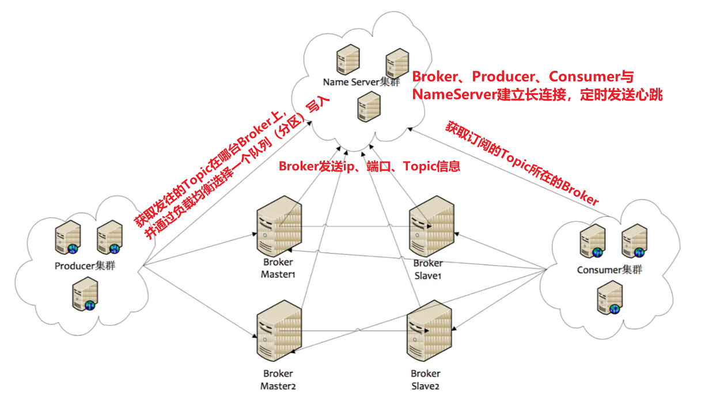

[toc]

## 一、RocketMQ概述

### 应用场景

#### 1. 异步

将同步操作异步话，提升系统性能。

#### 2. 解耦

系统耦合性越低，容错性就越高。例如电商系统的下单、支付、库存扣减、优惠券扣减、短信发送等操作，一旦哪个系统暂时不可用都会影响整个流程。

#### 3. 削峰

当业务系统遇上流量洪峰，超出了系统的处理能力，可以将请求以消息的形式保存到MQ服务器中，由消费者服务器慢慢的根据自身处理能力来消费。当然消费者可以设置每个批次接受的Message，也可是设置处理的线程数。

#### 4. 分发

通过消息队列可以让数据在多个系统之间进行流通。数据的产生方不需要关心谁来使用数据，只需要将数据发送到消息队列，数据使用方直接在消息队列中直接获取数据即可

#### 5. 分布式事务

[分布式事务](../../架构/分布式架构设计/分布式理论、事务、一致性算法)

 

### 角色及部署架构

#### 1. 角色

- **Producer**：消息的发送者，比喻为发信者
- **Consumer**：消息的接收者，比喻为收信者
- **Broker**：存储及传输者，比喻为邮局
- **NameServer**：Broker、Producer、Consumer的注册及管理中心，记录每个broker状态、有哪些topic、有哪些messagequeue、ip、port。比喻为各邮局的管理机构
- **Topic**：消息主题，区分消息的类型。一个发送者可以发消息给一个或多个Topic；一个接收者可以订阅一个或多个Topic。
- **Message Queue**：Topic分区，用于并行发送、接收消息。**等同于Kafka的 Partition分区**。

#### 2. 部署架构



##### 各节点职责

- NameServer是一个几乎无状态节点，可集群部署，节点之间无任何信息同步。

- Broker部署相对复杂，Broker分为Master与Slave。Master与Slave 的对应**关系通过指定相同的BrokerName，不同的BrokerId来定义**，BrokerId为**0表示Master**，非0表示Slave，**一组BrokerName的Master和Slaver构成一个Broker组**，每个Broker组只有一个Master，一个或多个Slaver。**每个Broker与NameServer集群中的所有节点建立长连接**，定时**注册Topic信息到所有NameServer**。 注意：当前RocketMQ版本在部署架构上支持一Master多Slave，但**只有BrokerId=1的从服务器才会参与消息的读负载**。

- Producer**与NameServer**集群中的其中一个节点（随机选择）**建立长连接**，**定期从NameServer获取Topic路由信息**，并向提供Topic 服务的**Master Broker建立长连接**，且**定时向Master Broker发送心跳**。Producer完全无状态，可集群部署。

- Consumer**与NameServer**集群中的其中一个节点（随机选择）**建立长连接**，**定期从NameServer获取Topic路由信息**，并向提供Topic服务的**Master、Slave建立长连接**，且定时向Master、Slave发送心跳。**Consumer既可以从Master订阅消息，也可以从Slave订阅消息**，消费者在向Master拉取消息时，Master服务器会根据拉取偏移量与最大偏移量的距离（判断是否读老消息，产生读I/O），以及从服务器是否可读等因素建议下一次是从Master还 是Slave拉取。


### 了解特性

#### 1. 发布与订阅

- 发布：某个生产者向某个Topic发送消息，可打上Tag；
- 订阅：某个消费者订阅了某个Topic中带有某些Tag的消息；**RocketMQ使用长轮询Pull机制来模拟Push效果**。

#### 2. 消息顺序

- 全局顺序：只用一个队列（分区），并开发重试有序的设置；
- 局部顺序：通过某个具有全局唯一的业务标识，将消息发到同个队列，保证这部分业务顺序，并开启重试有序设置。如某个订单创建、付款、库存，保证发往同一个队列即可。

#### 3. 消息过滤

- 消费者可以根据Tag来进行消息过滤消费。支持自定义属性过滤。消息过滤在Broker端实现，减少了对Consumer无用消息的网络传输，但增加了Broker的负担。

#### 4. 消息可靠性


#### 5. 至少一次

At least Once，每个消息必须投递一次。Consumer先Pull到本地，消费完成后再返回服务器ACK，如果没有消费则不会ACK。

#### 6. 回溯消息

Broker在向Consumer投递成功消息后，消息仍然需要保留。并且重新消费一般是按照时间维度，例如由于Consumer系统故障，恢复后需要重新消费1小时前的数据，那么Broker要提供一种机制，可以按照时间维度来回退消费进度。RocketMQ支持按照时间回溯消费，时间维度精确到毫秒

#### 7. 事务消息

Transactional Message事务消息**将本地数据库事务**和**发送消息的操作**绑定到**一个全局事务中**。

#### 8. 定时消息（延时队列）

Broker有配置项 **`messageDelayLevel`**，默认值为“1s 5s 10s 30s 1m 2m 3m 4m 5m 6m 7m 8m 9m 10m 20m 30m 1h 2h”，**18个level**。

定时消息被暂存再名为  **`SCHEDULE_TOPIC_XXXX`**  的topic中，**每个Level都对应一个Message Queue，队列中存放相同延迟消息，保证顺序消费**

使用：**`msg.setDelayLevel(level)`**，level有以下三种情况：

- level = 0，立即发送消息
- 1<= level <= maxLevel，指定延时时间
- level > maxLevel，则level = maxLevel，例如level = 20，则还是2h

#### 9. 消息重投

可能重发消息的场景：

- 同步消息到从Slaver失败
- 异步消息有重试
- Oneway没有任何保证

重投可设置的策略：

- **`retryTimesWhenSendFailed`**：**同步发送消息失败重投**，默认次数为**2次**，超过则抛异常**。注意：为了保证消息不丢失，由业务端创建消息表，并在后续补偿重投**。
- **`retryTimesWhenSendAsyncFailed`**：异步发送消息失败重投，默认为2次。
- **`retryAnotherBrokerWhenNotStoreOK`**：消息刷盘并同步到Slaver

#### 10. 消息重试

#### 11. 流量控制

- 生产者流控：
  - commitLog文件被锁时间超过osPageCacheBusyTimeOutMills时，参数默认为1000ms，发生流控
  - 如果开启transientStorePoolEnable = true，且broker为异步刷盘的主机，且transientStorePool中资源不足，拒绝当前send请求，发生流控。
  - broker每隔10ms检查send请求队列头部请求的等待时间，如果超过waitTimeMillsInSendQueue，默认200ms，拒绝当前send请求，发生流控。
  - broker通过拒绝send 请求方式实现流量控制。
- 消费者流控：
  - 消费者本地缓存消息数超过pullThresholdForQueue时，默认1000。
  - 消费者本地缓存消息大小超过pullThresholdSizeForQueue时，默认100MB。
  - 消费者本地缓存消息跨度超过consumeConcurrentlyMaxSpan时，默认2000。
  - 消费者流控的结果是降低拉取频率。

#### 12. 死信队列

当消费者消息重试达到最大次数后，消息队列会将该消息发到一个特殊队列中-死信队列。


## 二、环境搭建

### 1. 下载RocketMQ:4.5.1

[官网下载地址](https://www.apache.org/dyn/closer.cgi?path=rocketmq/4.5.1/rocketmq-all-4.5.1-bin-release.zip)

```sh
#下载
wget https://archive.apache.org/dist/rocketmq/4.5.1/rocketmq-all-4.5.1-bin-release.zip
```


### 2. 安装及环境配置

- 修改脚本(**JDK8可忽略**，若JDK为11则需要修改一些JVM配置)

  ```
  bin/runserver.sh
  bin/runbroker.sh
  bin/tools.sh
  ```

- 启动NameServer

  ```sh
  # 1.启动NameServer 
  mqnamesrv 
  # 2.查看启动日志 
  tail -f ~/logs/rocketmqlogs/namesrv.log
  ```

- 启动Broker

  ```sh
  # 1.启动Broker 
  mqbroker -n localhost:9876 
  # 2.查看启动日志
  tail -f ~/logs/rocketmqlogs/broker.log
  ```

### 3. 环境测试

- 发送消息

  ```sh
  # 1.设置环境变量 
  export NAMESRV_ADDR=localhost:9876 
  # 2.使用安装包的Demo发送消息 
  sh bin/tools.sh org.apache.rocketmq.example.quickstart.Producer
  ```

- 接收消息

  ```sh
  # 1.设置环境变量 
  export NAMESRV_ADDR=localhost:9876 
  # 2.接收消息 
  sh bin/tools.sh org.apache.rocketmq.example.quickstart.Consumer
  ```

- 关闭RocketMQ

  ```sh
  # 1.关闭NameServer 
  mqshutdown namesrv 
  # 2.关闭Broker 
  mqshutdown broker
  ```

  


## 三、快速入手

### 1. Rocket API

##### 1.1 配置maven pom

```xml
<?xml version="1.0" encoding="UTF-8"?>
<project xmlns="http://maven.apache.org/POM/4.0.0"
         xmlns:xsi="http://www.w3.org/2001/XMLSchema-instance"
         xsi:schemaLocation="http://maven.apache.org/POM/4.0.0 http://maven.apache.org/xsd/maven-4.0.0.xsd">
    <modelVersion>4.0.0</modelVersion>

    <groupId>com.tangdi</groupId>
    <artifactId>rocket-demo</artifactId>
    <version>1.0-SNAPSHOT</version>

    <dependencies>
        <dependency>
            <groupId>org.apache.rocketmq</groupId>
            <artifactId>rocketmq-client</artifactId>
            <version>4.5.1</version>
        </dependency>
    </dependencies>

</project>
```

##### 1.2 同步发送-生产者

```java
public class MyProducer {

    public static void main(String[] args) throws UnsupportedEncodingException, InterruptedException, RemotingException, MQClientException, MQBrokerException {
        // 在实例化生产者的同时，指定了生产组名称
        DefaultMQProducer producer = new DefaultMQProducer("myproducer_grp_01");

        // 指定NameServer的地址
        producer.setNamesrvAddr("node1:9876");

        // 对生产者进行初始化，然后就可以使用了
        producer.start();

        // 创建消息，第一个参数是主题名称，第二个参数是消息内容
        Message message = new Message(
                "tp_demo_01",
                "hello rocketmq 01".getBytes(RemotingHelper.DEFAULT_CHARSET)
        );
        // 发送消息
        final SendResult result = producer.send(message);
        System.out.println(result);

        // 关闭生产者
        producer.shutdown();
    }
}
```

##### 1.3 异步发送-生产者

```java
public class MyAsyncProducer {
    public static void main(String[] args) throws MQClientException, UnsupportedEncodingException, RemotingException, InterruptedException {
        // 实例化生产者，并指定生产组名称
        DefaultMQProducer producer = new DefaultMQProducer("producer_grp_01");

        // 指定nameserver的地址
        producer.setNamesrvAddr("node1:9876");

        // 初始化生产者
        producer.start();

        for (int i = 0; i < 100; i++) {

            Message message = new Message(
                    "tp_demo_02",
                    ("hello rocketmq " + i).getBytes("utf-8")
            );

            // 消息的异步发送
            producer.send(message, new SendCallback() {
                @Override
                public void onSuccess(SendResult sendResult) {
                    System.out.println("发送成功:" + sendResult);
                }

                @Override
                public void onException(Throwable throwable) {
                    System.out.println("发送失败：" + throwable.getMessage());
                }
            });
        }

        // 由于是异步发送消息，上面循环结束之后，消息可能还没收到broker的响应
        // 如果不sleep一会儿，就报错
        Thread.sleep(10_000);

        // 关闭生产者
        producer.shutdown();
    }
}
```

##### 拉取-消费者

```java
/**
 * 拉取消息的消费者
 */
public class MyPullConsumer {
    public static void main(String[] args) throws MQClientException, RemotingException, InterruptedException, MQBrokerException, UnsupportedEncodingException {
        // 拉取消息的消费者实例化，同时指定消费组名称
        DefaultMQPullConsumer consumer = new DefaultMQPullConsumer("consumer_grp_01");
        // 设置nameserver的地址
        consumer.setNamesrvAddr("node1:9876");

        // 对消费者进行初始化，然后就可以使用了
        consumer.start();

        // 获取指定主题的消息队列集合
        final Set<MessageQueue> messageQueues = consumer.fetchSubscribeMessageQueues("tp_demo_01");

        // 遍历该主题的各个消息队列，进行消费
        for (MessageQueue messageQueue : messageQueues) {
            // 第一个参数是MessageQueue对象，代表了当前主题的一个消息队列
            // 第二个参数是一个表达式，对接收的消息按照tag进行过滤
            // 支持"tag1 || tag2 || tag3"或者 "*"类型的写法；null或者"*"表示不对消息进行tag过滤
            // 第三个参数是消息的偏移量，从这里开始消费
            // 第四个参数表示每次最多拉取多少条消息
            final PullResult result = consumer.pull(messageQueue, "*", 0, 10);
            // 打印消息队列的信息
            System.out.println("message******queue******" + messageQueue);
            // 获取从指定消息队列中拉取到的消息
            final List<MessageExt> msgFoundList = result.getMsgFoundList();
            if (msgFoundList == null) continue;
            for (MessageExt messageExt : msgFoundList) {
                System.out.println(messageExt);
                System.out.println(new String(messageExt.getBody(), "utf-8"));
            }
        }

        // 关闭消费者
        consumer.shutdown();
    }
}
```

##### 订阅-消费者

```java
/**
 * 推送消息的消费
 */
public class MyPushConsumer {
    public static void main(String[] args) throws MQClientException, InterruptedException {

        // 实例化推送消息消费者的对象，同时指定消费组名称
        DefaultMQPushConsumer consumer = new DefaultMQPushConsumer("consumer_grp_02");

        // 指定nameserver的地址
        consumer.setNamesrvAddr("node1:9876");

        // 订阅主题
        consumer.subscribe("tp_demo_02", "*");

        // 添加消息监听器，一旦有消息推送过来，就进行消费
        consumer.setMessageListener(new MessageListenerConcurrently() {
            @Override
            public ConsumeConcurrentlyStatus consumeMessage(List<MessageExt> msgs, ConsumeConcurrentlyContext context) {

                final MessageQueue messageQueue = context.getMessageQueue();
                System.out.println(messageQueue);

                for (MessageExt msg : msgs) {
                    try {
                        System.out.println(new String(msg.getBody(), "utf-8"));
                    } catch (UnsupportedEncodingException e) {
                        e.printStackTrace();
                    }
                }

                // 消息消费成功
                return ConsumeConcurrentlyStatus.CONSUME_SUCCESS;
                // 消息消费失败
//                return ConsumeConcurrentlyStatus.RECONSUME_LATER;
            }
        });

        // 初始化消费者，之后开始消费消息
        consumer.start();

        // 此处只是示例，生产中除非运维关掉，否则不应停掉，长服务
//        Thread.sleep(30_000);
//        // 关闭消费者
//        consumer.shutdown();
    }
}
```


### 2. 整合SpringBoot

##### 配置maven pom

```xml
<?xml version="1.0" encoding="UTF-8"?>
<project xmlns="http://maven.apache.org/POM/4.0.0"
         xmlns:xsi="http://www.w3.org/2001/XMLSchema-instance"
         xsi:schemaLocation="http://maven.apache.org/POM/4.0.0 http://maven.apache.org/xsd/maven-4.0.0.xsd">
    <modelVersion>4.0.0</modelVersion>

    <groupId>com.tangdi</groupId>
    <artifactId>springboot-rocketmq-demo</artifactId>
    <version>1.0-SNAPSHOT</version>

    <parent>
        <groupId>org.springframework.boot</groupId>
        <artifactId>spring-boot-starter-parent</artifactId>
        <version>2.0.1.RELEASE</version>
    </parent>

    <properties>
        <rocketmq-spring-boot-starter-version>2.0.3</rocketmq-spring-boot-starter-version>
    </properties>

    <dependencies>
        <dependency>
            <groupId>org.apache.rocketmq</groupId>
            <artifactId>rocketmq-spring-boot-starter</artifactId>
            <version>${rocketmq-spring-boot-starter-version}</version>
        </dependency>
        <dependency>
            <groupId>org.projectlombok</groupId>
            <artifactId>lombok</artifactId>
            <version>1.18.6</version>
        </dependency>
        <dependency>
            <groupId>org.springframework.boot</groupId>
            <artifactId>spring-boot-starter-test</artifactId>
            <scope>test</scope>
        </dependency>

    </dependencies>
</project>
```

##### 生产者

```properties
spring.application.name=springboot_rocketmq_producer

# nameserver地址
rocketmq.name-server=node1:9876
# 生产组
rocketmq.producer.group=producer_grp_02
```

```java
@RunWith(SpringRunner.class)
@SpringBootTest(classes = {MyRocketProducerApplication.class})
public class MyRocketProducerApplicationTest {

    @Autowired
    private RocketMQTemplate rocketMQTemplate;

    @Test
    public void testSendMessage() {
        // 用于向broker发送消息
        // 第一个参数是topic名称
        // 第二个参数是消息内容
        this.rocketMQTemplate.convertAndSend(
                "tp_springboot_01",
                "springboot: hello lagou"
        );
    }

    @Test
    public void testSendMessages() {
        for (int i = 0; i < 100; i++) {
            // 用于向broker发送消息
            // 第一个参数是topic名称
            // 第二个参数是消息内容
            this.rocketMQTemplate.convertAndSend(
                    "tp_springboot_01",
                    "springboot: hello lagou" + i
            );
        }
    }
}
```

##### 消费者

springboot整合rocketmq的消费者，消费方式为推送（订阅）

```properties
spring.application.name=springboot_rocketmq_consumer
# nameserver地址
rocketmq.name-server=node1:9876
```

```java
@Slf4j
@Component
@RocketMQMessageListener(topic = "tp_springboot_01",selectorExpression = "*", consumerGroup = "consumer_grp_03")
public class MyRocketListener implements RocketMQListener<String> {
    @Override
    public void onMessage(String message) {
        // 处理broker推送过来的消息
        log.info(message);
    }
}
```


