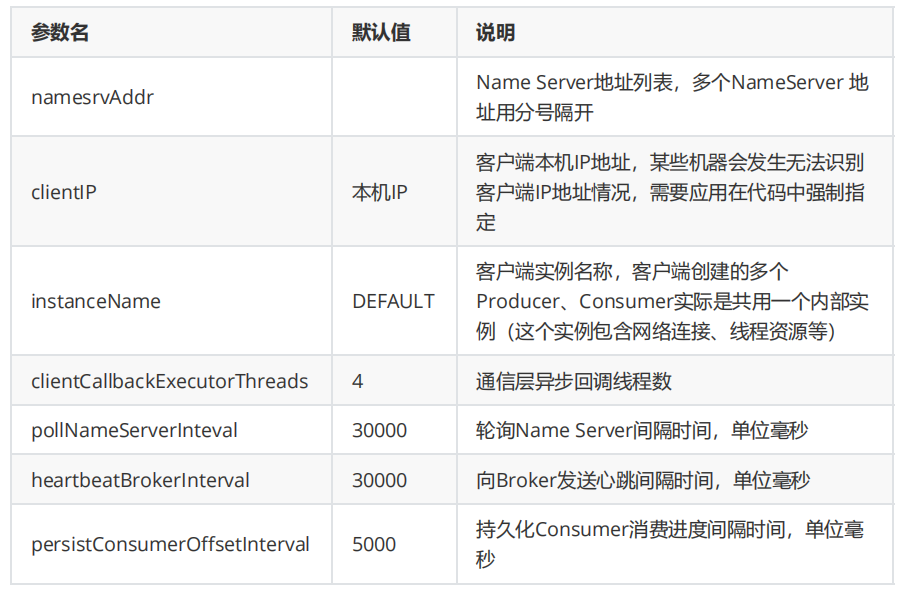
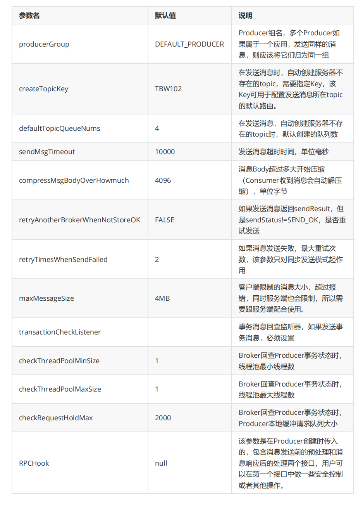
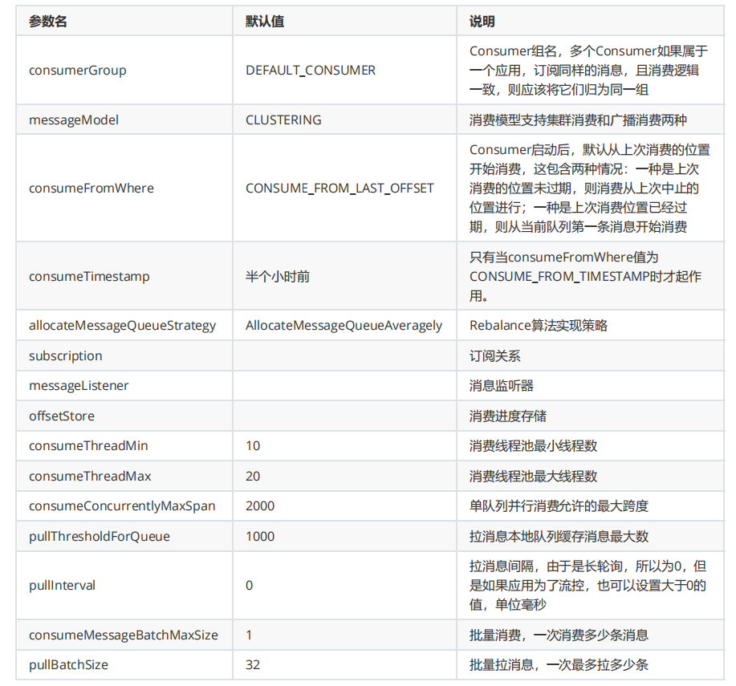
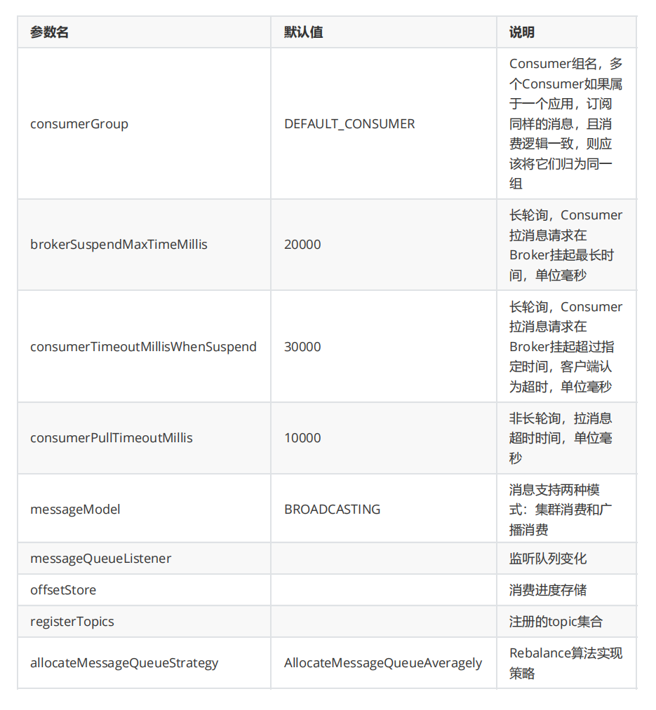

[toc]

## 一、RocketMQ特性与原理

### 生产和消费

公共配置

#### 1. 生产者

##### 1.1 生产者配置

##### 1.2 快速入门

##### 1.3 提升发送效率

#### 2. 消费者

##### 2.1 消费者配置

- PushConsumer

- PullConsumer

##### 2.1 快速入门

- Push模式

  优点实时性高，但是容易造成消费者的消息积压，严重时会压垮客户端。Rocket的Push模式其实就是**封装了不断循环Pull的操作**

- Pull模式

  优点是消费者量力而行，不会出现消息积压。缺点就是如何控制Pull的频率。定时间隔太久担心影响时效性，间隔太短担心做太多“无用功”浪费资源。比较折中的办法就是长轮询。

##### 2.2 防止消息积压/提升消费效率

### 存储机制

消息发送到broker后，**首先将数据存储到commitlog文件**中，然后**异步创建对应的consumequeue**（保存消息索引，例如**消息的offset**、消息大小、**tags值**）。**消费者到对应的consumequeue获取索引信息**（通过**tags**判断是否过滤，根据**offset到对应的commitlog文件**读取具体的消息）

跟kafka很像

- 零拷贝

- 顺序读写：使用文件系统存储数据，**创建文件直接占用固定的磁盘空间**（**保证连续的磁盘空间**），提高了数据写入性能

### **可靠性（防丢失）、一致性**

零拷贝

同步/异步复制（默认异步）

刷盘机制（默认异步）

### 高可用

### ==负载均衡==

### 过滤消息

##### 1. 基于 TAGS标签 过滤

##### 2. 基于 SQL92 过滤

### ==死信队列==

### ==延迟消息==

### ==消息重试（消费消息必须满足幂等性）==

### ==顺序消息==

### ==事务消息==

### ==消息重投==

### ==流量控制（防止堆积）==

## 二、总结

### 1. 生产者

### 2. 消费者
