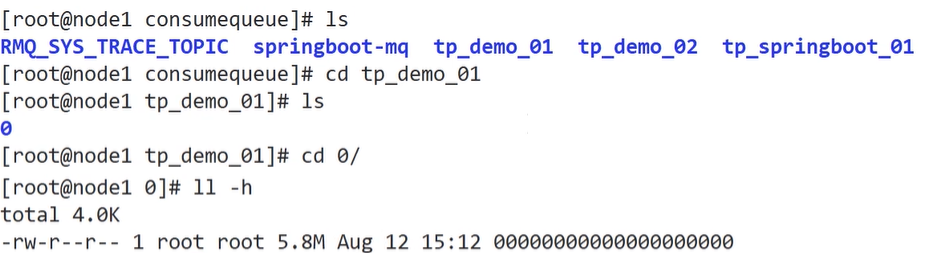

[toc]

## 一、RocketMQ特性与原理

### 生产和消费

公共配置

#### 1. 生产者

##### 1.1 生产者配置

##### 1.2 快速入门

##### 1.3 提升发送效率

#### 2. 消费者

##### 2.1 消费者配置

- PushConsumer

- PullConsumer

##### 2.1 快速入门

- Push模式

  优点实时性高，但是容易造成消费者的消息积压，严重时会压垮客户端。Rocket的Push模式其实就是**封装了不断循环Pull的操作**

- Pull模式

  优点是消费者量力而行，不会出现消息积压。缺点就是如何控制Pull的频率。定时间隔太久担心影响时效性，间隔太短担心做太多“无用功”浪费资源。比较折中的办法就是长轮询。

##### 2.2 防止消息积压/提升消费效率

### 存储机制

消息发送到broker后，**首先将数据存储到commitlog文件**中，然后**异步创建对应的consumequeue**（保存消息索引，例如**消息的offset**、消息大小、**tags值**）。**消费者到对应的consumequeue获取索引信息**（通过**tags**判断是否过滤，根据**offset到对应的commitlog文件**读取具体的消息）

跟kafka很像

- 零拷贝

- 顺序读写：使用文件系统存储数据，**创建文件直接占用固定的磁盘空间**（**保证连续的磁盘空间**），提高了数据写入性能

### **可靠性（防丢失）、一致性**

零拷贝

同步（同步双写）/异步复制（默认异步）

刷盘机制（默认异步）

### 高可用

### ==负载均衡==

### 过滤消息

##### 1. 基于 TAGS标签 过滤

##### 2. 基于 SQL92 过滤

### ==死信队列==

### ==延迟消息==

定时消息会暂存在名为**SCHEDULE_TOPIC_XXXX 的 Topic**中，并根据 delayTimeLevel 存入特定的queue，queueId = delayTimeLevel – 1，即一个queue只存相同延迟的消息，保证具有相同发送延迟的消息能够顺序消费。broker会调度地消费SCHEDULE_TOPIC_XXXX，将消息写入真实的topic。

Broker中配置messageDelayLevel，默认值为“1s 5s 10s 30s 1m 2m 3m 4m 5m 6m 7m 8m9m 10m 20m 30m 1h 2h”，18个level。

发消息时，设置delayLevel等级 msg.setDelayLevel(level)。level有以下三种情况：

- level == 0，消息为非延迟消息

- 1<=level<=maxLevel，消息延迟特定时间，例如level==1，延迟1s

- level > maxLevel，则level== maxLevel，例如level==20，延迟2h

### ==消息重投==

消息重投保证消息尽可能发送成功、不丢失，但可能会造成消息重复，消息重复在RocketMQ中是无法避免的问题。出现消息量大、网络抖动，就很有可能出现消息重复（因为成功发送消息后，网络问题导致没收到ACK而重投）。

如下方法可以设置消息重试策略：

1. **retryTimesWhenSendFailed**：**同步发送失败重投次数**，**默认为2**，因此生产者会最多尝试发送retryTimesWhenSendFailed + 1次。不会选择上次失败的broker，尝试向其他broker发送，最大程度保证消息不丢失。**超过重投次数，抛异常**，然后**由生产者客户端保证消息不丢失（例如写消息表）**。当出现RemotingException、MQClientException和部分MQBrokerException时会重投。
2. **retryTimesWhenSendAsyncFailed**：**异步发送失败重试次数**，异步重试不会选择其他broker，仅在同一个broker上做重试，不保证消息不丢。
3. **retryAnotherBrokerWhenNotStoreOK**：消息刷盘（主或备）超时或slave不可用（返回状态非SEND_OK），是否尝试发送到其他broker，默认false。十分重要消息可以开启。**就是说，需要Master分区消息必须落盘，并且与Slaver完成消息同步，才表示消息发送完成**

### ==消息重试（消费消息必须满足幂等性）==

Consumer消费消息失败后，要提供一种重试机制，令消息再消费一次。Consumer消费消息失败通常可以认为有以下几种情况：

1. 由于消息本身的原因，例如反序列化失败，消息数据本身无法处理（例如话费充值，当前消息的手机号被注销，无法充值）等。这种错误通常需要跳过这条消息，再消费其它消息，而这条失败的消息即使立刻重试消费，99%也不成功，所以**最好 10秒后再重试。**
2. 由于依赖的下游应用服务不可用，例如db连接不可用，外系统网络不可达等。遇到这种错误，即使跳过当前失败的消息，消费其他消息同样也会报错。这种情况建议应用sleep 30s，再消费下一条消息，这样可以减轻Broker重试消息的压力。

### ==顺序消息==

### ==事务消息==

### ==流量控制（防止堆积）==

## 二、总结

### 1. 生产者

### 2. 消费者
