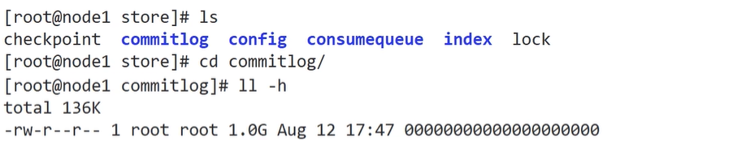
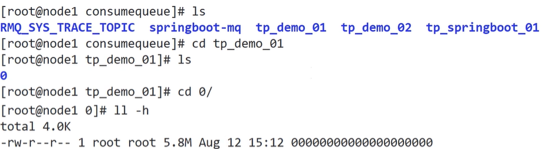
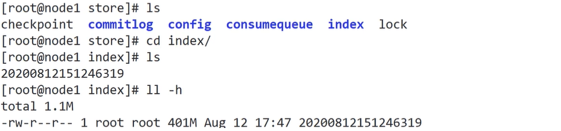

## 一、RocketMQ架构与应用

#### 应用场景


#### 部署架构


#### 核心概念


#### 快速入手

##### 1. Rocket API

- **配置maven pom**

  ```xml
  <?xml version="1.0" encoding="UTF-8"?>
  <project xmlns="http://maven.apache.org/POM/4.0.0"
           xmlns:xsi="http://www.w3.org/2001/XMLSchema-instance"
           xsi:schemaLocation="http://maven.apache.org/POM/4.0.0 http://maven.apache.org/xsd/maven-4.0.0.xsd">
      <modelVersion>4.0.0</modelVersion>
  
      <groupId>com.tangdi</groupId>
      <artifactId>rocket-demo</artifactId>
      <version>1.0-SNAPSHOT</version>
  
      <dependencies>
          <dependency>
              <groupId>org.apache.rocketmq</groupId>
              <artifactId>rocketmq-client</artifactId>
              <version>4.5.1</version>
          </dependency>
      </dependencies>
  
  </project>
  ```

- **同步发送-生产者**

  ```java
  import org.apache.rocketmq.client.exception.MQBrokerException;
  import org.apache.rocketmq.client.exception.MQClientException;
  import org.apache.rocketmq.client.producer.DefaultMQProducer;
  import org.apache.rocketmq.client.producer.SendResult;
  import org.apache.rocketmq.common.message.Message;
  import org.apache.rocketmq.remoting.common.RemotingHelper;
  import org.apache.rocketmq.remoting.exception.RemotingException;
  
  import java.io.UnsupportedEncodingException;
  
  public class MyProducer {
  
      public static void main(String[] args) throws UnsupportedEncodingException, InterruptedException, RemotingException, MQClientException, MQBrokerException {
          // 在实例化生产者的同时，指定了生产组名称
          DefaultMQProducer producer = new DefaultMQProducer("myproducer_grp_01");
  
          // 指定NameServer的地址
          producer.setNamesrvAddr("node1:9876");
  
          // 对生产者进行初始化，然后就可以使用了
          producer.start();
  
          // 创建消息，第一个参数是主题名称，第二个参数是消息内容
          Message message = new Message(
                  "tp_demo_01",
                  "hello lagou 01".getBytes(RemotingHelper.DEFAULT_CHARSET)
          );
          // 发送消息
          final SendResult result = producer.send(message);
          System.out.println(result);
  
          // 关闭生产者
          producer.shutdown();
      }
  }
  ```

- **异步发送-生产者**

  ```java
  import org.apache.rocketmq.client.exception.MQClientException;
  import org.apache.rocketmq.client.producer.DefaultMQProducer;
  import org.apache.rocketmq.client.producer.SendCallback;
  import org.apache.rocketmq.client.producer.SendResult;
  import org.apache.rocketmq.common.message.Message;
  import org.apache.rocketmq.remoting.exception.RemotingException;
  
  import java.io.UnsupportedEncodingException;
  
  public class MyAsyncProducer {
      public static void main(String[] args) throws MQClientException, UnsupportedEncodingException, RemotingException, InterruptedException {
          // 实例化生产者，并指定生产组名称
          DefaultMQProducer producer = new DefaultMQProducer("producer_grp_01");
  
          // 指定nameserver的地址
          producer.setNamesrvAddr("node1:9876");
  
          // 初始化生产者
          producer.start();
  
          for (int i = 0; i < 100; i++) {
  
              Message message = new Message(
                      "tp_demo_02",
                      ("hello lagou " + i).getBytes("utf-8")
              );
  
              // 消息的异步发送
              producer.send(message, new SendCallback() {
                  @Override
                  public void onSuccess(SendResult sendResult) {
                      System.out.println("发送成功:" + sendResult);
                  }
  
                  @Override
                  public void onException(Throwable throwable) {
                      System.out.println("发送失败：" + throwable.getMessage());
                  }
              });
          }
  
          // 由于是异步发送消息，上面循环结束之后，消息可能还没收到broker的响应
          // 如果不sleep一会儿，就报错
          Thread.sleep(10_000);
  
          // 关闭生产者
          producer.shutdown();
      }
  }
  ```

- **拉取-消费者**

  ```java
  import org.apache.rocketmq.client.consumer.DefaultMQPullConsumer;
  import org.apache.rocketmq.client.consumer.PullResult;
  import org.apache.rocketmq.client.exception.MQBrokerException;
  import org.apache.rocketmq.client.exception.MQClientException;
  import org.apache.rocketmq.common.message.MessageExt;
  import org.apache.rocketmq.common.message.MessageQueue;
  import org.apache.rocketmq.remoting.exception.RemotingException;
  
  import java.io.UnsupportedEncodingException;
  import java.util.List;
  import java.util.Set;
  
  /**
   * 拉取消息的消费者
   */
  public class MyPullConsumer {
      public static void main(String[] args) throws MQClientException, RemotingException, InterruptedException, MQBrokerException, UnsupportedEncodingException {
          // 拉取消息的消费者实例化，同时指定消费组名称
          DefaultMQPullConsumer consumer = new DefaultMQPullConsumer("consumer_grp_01");
          // 设置nameserver的地址
          consumer.setNamesrvAddr("node1:9876");
  
          // 对消费者进行初始化，然后就可以使用了
          consumer.start();
  
          // 获取指定主题的消息队列集合
          final Set<MessageQueue> messageQueues = consumer.fetchSubscribeMessageQueues("tp_demo_01");
  
          // 遍历该主题的各个消息队列，进行消费
          for (MessageQueue messageQueue : messageQueues) {
              // 第一个参数是MessageQueue对象，代表了当前主题的一个消息队列
              // 第二个参数是一个表达式，对接收的消息按照tag进行过滤
              // 支持"tag1 || tag2 || tag3"或者 "*"类型的写法；null或者"*"表示不对消息进行tag过滤
              // 第三个参数是消息的偏移量，从这里开始消费
              // 第四个参数表示每次最多拉取多少条消息
              final PullResult result = consumer.pull(messageQueue, "*", 0, 10);
              // 打印消息队列的信息
              System.out.println("message******queue******" + messageQueue);
              // 获取从指定消息队列中拉取到的消息
              final List<MessageExt> msgFoundList = result.getMsgFoundList();
              if (msgFoundList == null) continue;
              for (MessageExt messageExt : msgFoundList) {
                  System.out.println(messageExt);
                  System.out.println(new String(messageExt.getBody(), "utf-8"));
              }
          }
  
          // 关闭消费者
          consumer.shutdown();
      }
  }
  ```

- **订阅-消费者**

  ```java
  import org.apache.rocketmq.client.consumer.DefaultMQPushConsumer;
  import org.apache.rocketmq.client.consumer.listener.ConsumeConcurrentlyContext;
  import org.apache.rocketmq.client.consumer.listener.ConsumeConcurrentlyStatus;
  import org.apache.rocketmq.client.consumer.listener.MessageListenerConcurrently;
  import org.apache.rocketmq.client.exception.MQClientException;
  import org.apache.rocketmq.common.message.MessageExt;
  import org.apache.rocketmq.common.message.MessageQueue;
  
  import java.io.UnsupportedEncodingException;
  import java.util.List;
  
  /**
   * 推送消息的消费
   */
  public class MyPushConsumer {
      public static void main(String[] args) throws MQClientException, InterruptedException {
  
          // 实例化推送消息消费者的对象，同时指定消费组名称
          DefaultMQPushConsumer consumer = new DefaultMQPushConsumer("consumer_grp_02");
  
          // 指定nameserver的地址
          consumer.setNamesrvAddr("node1:9876");
  
          // 订阅主题
          consumer.subscribe("tp_demo_02", "*");
  
          // 添加消息监听器，一旦有消息推送过来，就进行消费
          consumer.setMessageListener(new MessageListenerConcurrently() {
              @Override
              public ConsumeConcurrentlyStatus consumeMessage(List<MessageExt> msgs, ConsumeConcurrentlyContext context) {
  
                  final MessageQueue messageQueue = context.getMessageQueue();
                  System.out.println(messageQueue);
  
                  for (MessageExt msg : msgs) {
                      try {
                          System.out.println(new String(msg.getBody(), "utf-8"));
                      } catch (UnsupportedEncodingException e) {
                          e.printStackTrace();
                      }
                  }
  
                  // 消息消费成功
                  return ConsumeConcurrentlyStatus.CONSUME_SUCCESS;
                  // 消息消费失败
  //                return ConsumeConcurrentlyStatus.RECONSUME_LATER;
              }
          });
  
          // 初始化消费者，之后开始消费消息
          consumer.start();
  
          // 此处只是示例，生产中除非运维关掉，否则不应停掉，长服务
  //        Thread.sleep(30_000);
  //        // 关闭消费者
  //        consumer.shutdown();
      }
  }
  ```


##### 2. 整合SpringBoot

- **配置maven pom**

  ```xml
  <?xml version="1.0" encoding="UTF-8"?>
  <project xmlns="http://maven.apache.org/POM/4.0.0"
           xmlns:xsi="http://www.w3.org/2001/XMLSchema-instance"
           xsi:schemaLocation="http://maven.apache.org/POM/4.0.0 http://maven.apache.org/xsd/maven-4.0.0.xsd">
      <modelVersion>4.0.0</modelVersion>
  
      <groupId>com.tangdi</groupId>
      <artifactId>springboot-rocketmq-demo</artifactId>
      <version>1.0-SNAPSHOT</version>
  
      <parent>
          <groupId>org.springframework.boot</groupId>
          <artifactId>spring-boot-starter-parent</artifactId>
          <version>2.0.1.RELEASE</version>
      </parent>
  
      <properties>
          <rocketmq-spring-boot-starter-version>2.0.3</rocketmq-spring-boot-starter-version>
      </properties>
  
      <dependencies>
          <dependency>
              <groupId>org.apache.rocketmq</groupId>
              <artifactId>rocketmq-spring-boot-starter</artifactId>
              <version>${rocketmq-spring-boot-starter-version}</version>
          </dependency>
          <dependency>
              <groupId>org.projectlombok</groupId>
              <artifactId>lombok</artifactId>
              <version>1.18.6</version>
          </dependency>
          <dependency>
              <groupId>org.springframework.boot</groupId>
              <artifactId>spring-boot-starter-test</artifactId>
              <scope>test</scope>
          </dependency>
  
      </dependencies>
  </project>
  ```

- **生产者**

  ```properties
  spring.application.name=springboot_rocketmq_producer
  
  # nameserver地址
  rocketmq.name-server=node1:9876
  # 生产组
  rocketmq.producer.group=producer_grp_02
  ```

  ```java
  import com.rangdi.producerdemo.MyRocketProducerApplication;
  import org.apache.rocketmq.spring.core.RocketMQTemplate;
  import org.junit.Test;
  import org.junit.runner.RunWith;
  import org.springframework.beans.factory.annotation.Autowired;
  import org.springframework.boot.test.context.SpringBootTest;
  import org.springframework.test.context.junit4.SpringRunner;
  
  @RunWith(SpringRunner.class)
  @SpringBootTest(classes = {MyRocketProducerApplication.class})
  public class MyRocketProducerApplicationTest {
  
      @Autowired
      private RocketMQTemplate rocketMQTemplate;
  
      @Test
      public void testSendMessage() {
          // 用于向broker发送消息
          // 第一个参数是topic名称
          // 第二个参数是消息内容
          this.rocketMQTemplate.convertAndSend(
                  "tp_springboot_01",
                  "springboot: hello lagou"
          );
      }
  
      @Test
      public void testSendMessages() {
          for (int i = 0; i < 100; i++) {
              // 用于向broker发送消息
              // 第一个参数是topic名称
              // 第二个参数是消息内容
              this.rocketMQTemplate.convertAndSend(
                      "tp_springboot_01",
                      "springboot: hello lagou" + i
              );
          }
      }
  }
  ```

- **消费者**

  springboot整合rocketmq的消费者，消费方式为推送（订阅）

  ```properties
  spring.application.name=springboot_rocketmq_consumer
  # nameserver地址
  rocketmq.name-server=node1:9876
  ```

  ```java
  import lombok.extern.slf4j.Slf4j;
  import org.apache.rocketmq.spring.annotation.RocketMQMessageListener;
  import org.apache.rocketmq.spring.core.RocketMQListener;
  import org.springframework.stereotype.Component;
  
  @Slf4j
  @Component
  @RocketMQMessageListener(topic = "tp_springboot_01", consumerGroup = "consumer_grp_03")
  public class MyRocketListener implements RocketMQListener<String> {
      @Override
      public void onMessage(String message) {
          // 处理broker推送过来的消息
          log.info(message);
      }
  }
  ```

  


## 二、RocketMQ特性与原理

### 消息发送

##### 1. 快速入门


##### 2. 提升发送效率


### 消息消费

##### 1. 快速入门

- Push模式

  优点实时性高，但是容易造成消费者的消息积压，严重时会压垮客户端。Rocket的Push模式其实就是**封装了不断循环Pull的操作**

- Pull模式

  优点是消费者量力而行，不会出现消息积压。缺点就是如何控制Pull的频率。定时间隔太久担心影响时效性，间隔太短担心做太多“无用功”浪费资源。比较折中的办法就是长轮询。


##### 2. 防止消息积压/提升消费效率


### 存储机制

消息发送到broker后，**首先将数据存储到commitlog文件**中，然后**异步创建对应的consumequeue**（保存消息索引，例如**消息的offset**、消息大小、**tags值**）。**消费者到对应的consumequeue获取索引信息**（通过**tags**判断是否过滤，根据**offset到对应的commitlog文件**读取具体的消息）

跟kafka很像

- 零拷贝

- 顺序读写：使用文件系统存储数据，**创建文件直接占用固定的磁盘空间**（**保证连续的磁盘空间**），提高了数据写入性能










### 可靠性（持久化、防止丢失）

- 零拷贝

- 同步复制和异步复制

- 刷盘机制


### 高可用

### 负载均衡

### 过滤消息

##### 1. 基于 TAGS标签 过滤

##### 2. 基于 SQL92 过滤

### 死信队列

### 延迟消息

### 消息重试

### 顺序消息

### 事务消息

### 消息重投

### 流量控制（防止堆积）

