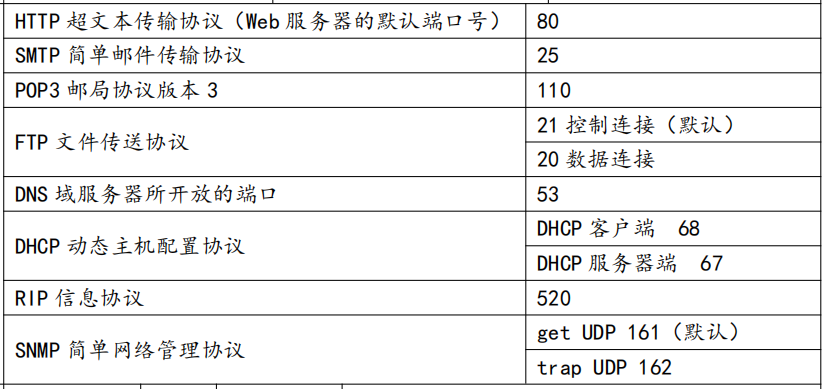

## Socket网络编程

#### 1. 简介

Socket是由ip和port组成的唯一标识一个通信端点，即套接字，是两台主机之间逻辑连接的端点。

TCP/IP协议是传输层协议，主要解决数据如何在网络中传输，HTTP是应用层协议，主要解决如何包装数据。

Socket是通信的基石，是支持TCP/IP协议的网络通信的基本操作单元。它是网络通信过程中端点的抽象表示，Socket包含进行网络通信必须的五种信息：

**连接使用的协议、本地主机的IP地址、本地进程的协议端口、远程主机的IP地址、远程进程的协议端口。**

#### 2. 使用的端口

端口号的**范围是0到65536**，但是**0到1024是为特权服务保留的端口号**，可以选择任意一个当前没有被其他进程使用的端口。

**常用协议的端口如下：**

#### 3.应用

 Socket编程主要涉及到客户端和服务端两个方面，网络通信数据通过流传输

具体代码查看[Java中的网络编程BIO代码案例](../../../Java/基础/网络编程/IO基础概述)

- 服务端创建一个带port入参的服务器套接字（ServerSocket），然后监听（accept）这个端口的连接
- 客户端创建一个带目标ip和port的客户端套接字（Socket），即请求服务器建立TCP连接
- 服务器和客户端之间的通信就像输入输出流一样进行操作。