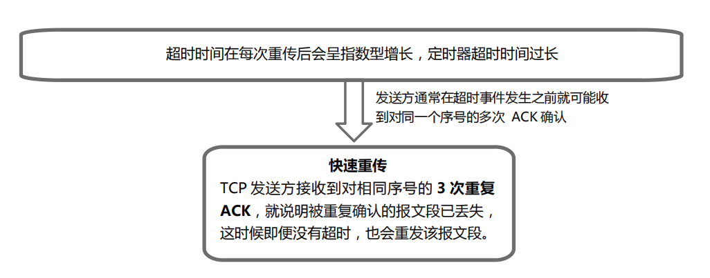

[toc]

## 一、TCP和UDP简介

#### 1. 定义

**传输控制协议 TCP**（Transmission Control Protocol）————提供面向连接，可靠的，有序字节流的传输协议

**用户数据协议 UDP**（User Datagram Protocol）————提供无连接、高速的、不可靠（丢失、重复、乱序）、数据报尽力传输的传输协议

#### 1. 适用场景

- TCP 适用于邮件传输、聊天、文件传输等
- UDP 适用于语音聊天、直播、视频等

#### 3. 区别

无连接服务 UDP 类似于邮政系统的信件通信，直接写好信给邮递员就可以，无需与对端进行任何信息的交换（即“握手”）。面向连接服务类似于电话通信，必须首先拨号，建立电话连接才可以通话，最后还要拆除连接

## 二、UDP

#### 1. 优点

- **应用进程更容易控制发送什么数据以及何时发送。适合实时性且能容忍一些数据丢失的网络应用**

- **无需建立连接**

- **无连接状态**

- **首部开销小**

#### 2. UDP数据包结构

UDP 首部只有 4 个字段，每个字段由 2 个字节（即 16 位）组成

#### 3. UDP校验和计算

**参与 UDP 校验和计算的内容** 

**UDP 校验和的计算** 

**举例**

## 三、TCP

#### 1. 特点

- 应用进程要先建立连接。
- 每一条 TCP 连接只有两个端点
- 可靠交付。无差错，不丢失，不重复且按序到达
- 全双工通信
- 面向字节流

#### 2. TCP 报文段结构

1、**源端口号**、**目的端口号字段**分别占 16 位，标识发送该报文段的源端口和目的端口，用于多路复用/分解来自或送到上层应用的数据。

2、**序号字段**、**确认序号字段**分别占 32 位。

- 序号字段：该段所封装的应用层数据的第一个字节的序号。

- 确认序号字段：是期望从对方接收数据的字节序号，即该序号对应的字节尚未收到。

3、**首部长度字段**占 4 位。指出 TCP 段的首部长度，以 4 字节为计算单位。该字段最大取值为 15，即 TCP 最大首部长度为 60 字节。

4、**保留字段**占 6 位。保留为今后使用，目前值为 0。

5、URG、ACK、PSH、RST、SYN、FIN 各占 1 位。

- 紧急 **URG**=1，紧急指针字段有效，优先传送。

- 确认 **ACK**=1，确认序号字段有效；ACK=0 时，确认序号字段无效。

- 推送 **PSH**=1，尽快将报文段中的数据交付接收应用进程，不要等缓存满了再交付。

- 复位 **RST**=1，TCP 连接出现严重差错，释放连接，再重新建立 TCP 连接。

- 同步 **SYN**=1，该 TCP 报文段是一个建立新连接请求控制段或者同意建立新连接的确认段。

- 终止 **FIN**=1，TCP 报文段的发送端数据已经发送完毕，请求释放连接。

6、**接收窗口字段**占 16 位。向对方通告我方接收窗口的大小（单位为字节），用于实现 TCP 流量控制。

7、**校验和字段**占 16 位。校验和字段范围和计算方法与 UDP 相同。TCP 协议号是 6。

8、**紧急指针字段**占 16 位。该字段只有 URG=1 时才有效。指出在本 TCP 报文段中紧急数据共有多少个字节。

9、**选项字段**长度可变。最长为 40 字节。

10、**填充字段**，取值全为 0，目的是为了整个首部长度是 4 字节的整倍数。

#### 3. TCP 连接管理

##### 3.1 TCP连接管理分别是建立连接（三次握手），拆除连接（四次挥手）

##### 3.2 TCP 连接建立（假设客户端主动发起连接，则 TCP 连接建立过程如下图：）

##### 3.3 TCP 连接拆除（假设客户端首先请求断开 TCP 连接，则采用四次挥手的对称断连机制的过程如下图：） 

#### 4. TCP 可靠数据传输的原理

##### 4.1 TCP 的可靠数据传输是基于滑动窗口协议

TCP 的可靠数据传输实现机制包括差错编码、确认、序号、重传、计时器等。

##### 4.2 TCP 实现可靠数据传输服务的工作机制：

- 应用数据被分割成 TCP 认为最适合发送的数据块（通常是 MSS）
- TCP 发出一个段后，**启动一个计时器，等待目的端确认收到这个报文段**
- TCP 首部中设有校验和字段，用于检测数据在传输过程中是否发生差错
- TCP 报文段的到达也可能会失序。如果必要，TCP 会重新排序
- 存在网络延迟和重传机制，接收端可能会收到多个重复的报文段，这时接收端需要根据序号把重复的报文段丢弃
- TCP 能够提供流量控制

##### 4.3 原理图

#### 5. TCP 流量控制

**流量控制的目的**：**协调**协议发送方与接收方的**数据发送**与**接收速度**。

基于滑动窗口协议实现流量控制时，**发送窗口**的大小反映了接收方接收和处理数据的能力。

TCP 报文段结构中**接收窗口字段**，用于向对方通告接收窗口大小（单位为字节），其值是本端接收

对方数据的缓存剩余空间，防止本端的缓冲区溢出

#### 6. TCP 拥塞控制

##### 6.1 拥塞控制简介

TCP 的拥塞控制，通过**是否发生报文段的超时**来推断网络 是否发生拥塞。

就是通过合理调度、规范、调整向网络中发送数据的主机数量、发送速率或数据量，以避免 拥塞或尽快消除已发生的拥塞

例如：**ATM** 是在**网络层**进行拥塞控制；**Internet** 是在**传输层**进行拥塞控制（通过 TCP 实现）。 

##### 6.2 拥塞控制策略

TCP 的拥塞控制采用的是窗口机制的基本策略：网络未发生拥塞时，逐渐“加性” 增大窗口大小，当网络拥塞时“乘性”快速减小窗口大小，即 AIMD

##### 6.3 拥塞窗口

拥塞窗口的调整主要分为慢启动阶段和拥塞避免阶段。在慢启动阶段，每经过 1 个 RTT，拥塞窗口增长 1 倍；在拥塞避免阶段，每经过 1 个RTT，拥塞窗口才增加 1 个 MSS。加上快速恢复算法时“乘性”减小的 CongWin=减半后的阈值

**1988 年提出的慢启动与拥塞避免算法（网络拥塞时，Threshold=CongWin/2，CongWin=1）**

**1990 年又增加了快速重传和快速恢复两个算法。（收到 3 次重复 ACK 时，Threshold=CongWin/2，CongWin=减半后的阈值，直接进入拥塞避免阶段）。**

